# X 射线视觉的深度学习

> 原文：<https://towardsdatascience.com/deep-learning-for-x-ray-vision-bd11564760fd?source=collection_archive---------20----------------------->

## SCSE·NTU 大学最后一年项目(FYP)

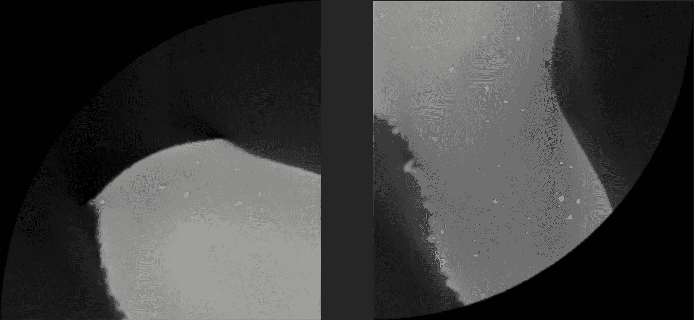

X 射线 CT 图像中的气孔检测(图像来自 [ARTC](https://www.a-star.edu.sg/artc)

# 摘要

最近的讨论表明，添加剂材料中裂纹的位置始于孔隙。孔隙上产生的应力引发裂纹向下一个最近的孔隙扩展，最终导致破坏点。在 TinkerCAD 中创建了一个由逼真的孔状结构组成的 3D 模型，并上传到 aRTist，在那里进行模拟 CT 扫描以生成模拟 CT 图像。然后使用 VGStudio MAX 和 ImageJ 软件对图像进行预处理。使用可训练的 weka 分割插件，每个图像被半自动标记。这些图像然后被手动校正并转换成用于训练的掩模图像。然后研究了不同的分割模型，如 U-net 和 DeepLabV3，以执行分割任务。使用检测得分的概率来比较结果，我们得出结论:孔隙的检测严重依赖于真实数据，而不是模拟数据。

# 项目目标

该研究的目的是评估使用模拟 X 射线 CT 图像作为真实图像的可能补充的可行性，用于语义分割中的训练数据。

# 使用的软件

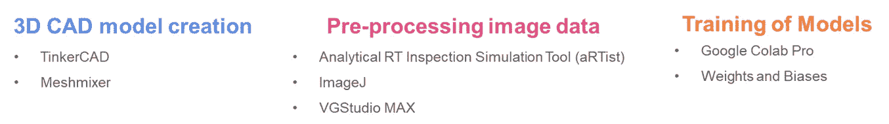

使用的软件

## TinkerCAD

[TinkerCAD](https://www.tinkercad.com/) 是由欧特克公司开发的免费在线 3D 建模软件工具。它的特点是使用简单的形状和空心物体的创建，从而使其适合于创建孔状物体的模拟目的。

## 网格混合器

[Meshmixer](https://www.meshmixer.com/) 是一款免费的 3D 计算机辅助设计(CAD)建模软件工具。它用于将复杂的孔隙 STL 文件组合在一起，作为单个对象导出到 aRTist 软件进行 ct 扫描模拟。

## 分析 RT 检测模拟工具(aRTist)

[aRTist](http://www.artist.bam.de/) 是对射线检测(辐射源、辐射的衰减、x 光胶片和数字探测器、与 CAD 接口的交互式虚拟场景)进行定量描述的计算机模拟程序。

## VGStudio MAX

[Volume Graphics Studio MAX](https://www.volumegraphics.com/en/products/vgstudio-max.html) 是一款软件程序，旨在为用户提供处理和可视化体积数据的强大方法。它用于在使用 aRTist 执行模拟 ct 扫描后重建 3D 图像。

## ImageJ(斐济)

[ImageJ](https://imagej.net/Welcome) 是用 Java 编写的图像处理程序。它具有广泛的功能。这包括缩放、裁剪、降噪和以多种格式保存图像数据，例如。png，。jpeg，。Weka 可训练分割插件也用于这个项目中，以执行图像的半自动标记。

## Google Colab Pro

为了训练模型，使用了[谷歌 Colab Pro](https://colab.research.google.com/signup) 特斯拉 P100-PC1E-16GB。Google Colab Pro Edition 还配备了速度更快的英特尔至强处理器(2.30GHz)，而免费版的英特尔至强处理器(2.20GHz)

## 权重和偏差

[Weights and bias](https://wandb.ai/site)是一款开发者工具，用于跟踪、比较和可视化机器学习实验。本项目中进行的所有实验都记录了重量和偏差。

# 概观

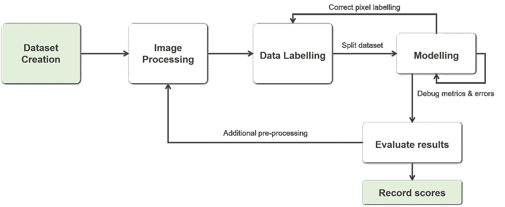

为产生结果而采取的步骤

在这个项目中，第一步是从头开始创建一个模拟数据集，并对数据进行预处理。然后使用来自斐济的可训练 weka 分割插件 ImageJ 对数据进行标记。然后，在建模阶段测试了几个模型，这需要在数据标记过程中改进像素误差，并在实施过程中调试度量和误差。然后记录并评估结果，其中执行额外的预处理步骤和超参数调整以改善最终结果。

# 数据集创建

在这项工作中，重点是创建与金属(特别是铝)3D 打印过程中生成的现有孔隙高度相似的孔隙。在 TinkerCAD 中创建 CAD 模型后，该模型被导出到 aRTist 中，在其中模拟 3D 对象以创建 X 射线 ct 图像。

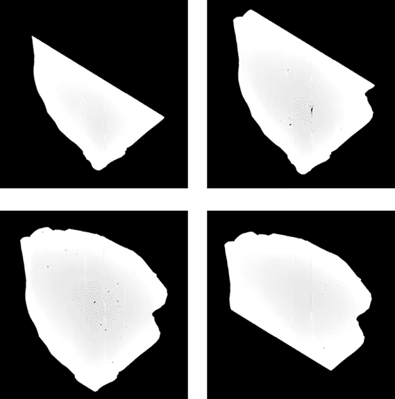

模拟 CT 图像的输出(图像来自 [ARTC](https://www.a-star.edu.sg/artc)

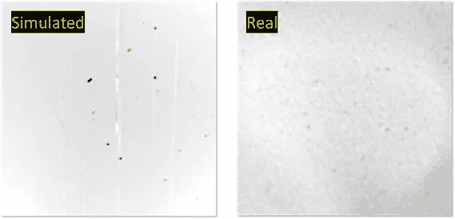

模拟图像和真实图像的放大对比(图像来自 [ARTC](https://www.a-star.edu.sg/artc) )

# 图像处理

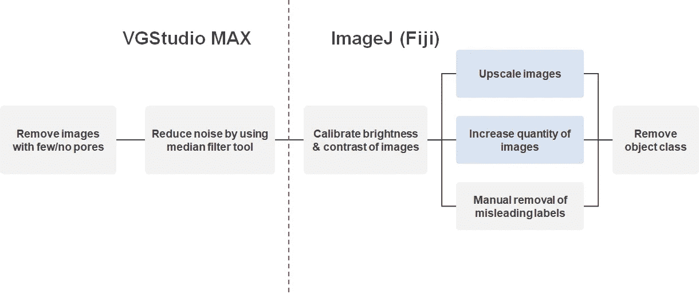

图像处理方法

执行了几种图像处理方法，以确保在训练模型之前图像是准备好的。使用 VGStudio MAX 和 Fiji-Image 软件对这些图像进行预处理。

# 数据标记

图片来自 [Weka 可训练分割插件](https://imagej.net/plugins/tws/)

可训练的 Weka Segmentation 是一个斐济插件，它将一组机器学习算法与一组选定的图像特征相结合，以产生基于像素的分割。上图显示了使用插件创建一个带标签的样本，该样本与其他几个带标签的样本一起用来注释数据集。这三个类是孔隙、对象和背景。

# 系统模型化

U-Net 架构[1]

U-net 是为生物医学图像的分割而设计的，它在 CT 图像的制作中得到了应用。在这个项目中，我们使用 Keras 定义了一个 U-net 模型，Keras 是一个开源软件库，充当 Tensorflow 库的高级 API。除了 U-Net 模型之外，还在模型的末尾添加了批量标准化和漏失层。

## 使用的指标

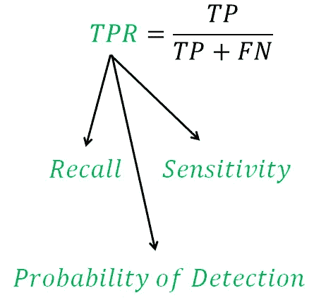

TPR =召回率=灵敏度=检测概率

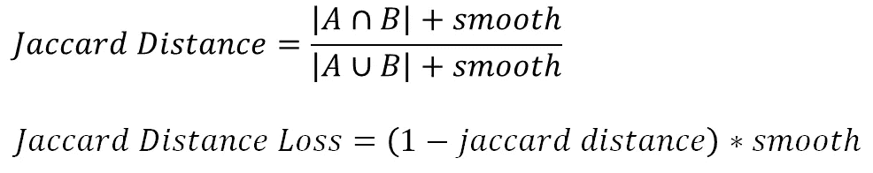

[Jaccard 距离损失指标](https://gist.github.com/wassname/f1452b748efcbeb4cb9b1d059dce6f96)

项目中使用了 2 个指标。第一个指标是**检测概率**，或者通常称为真阳性率、召回率或灵敏度。由于背景像素覆盖了像素总数的大部分，使得难以评估模型的性能，所以没有使用交集/并集和 Dice 分数。

第二个指标是 **Jaccard 距离损耗**，它改编自[was name](https://gist.github.com/wassname/f1452b748efcbeb4cb9b1d059dce6f96)。这是一个用于评估不平衡数据集的有用的度量，并且已经进行了移动，以使其收敛到 0 并进行平滑，从而避免爆发梯度。

## 数据集分割

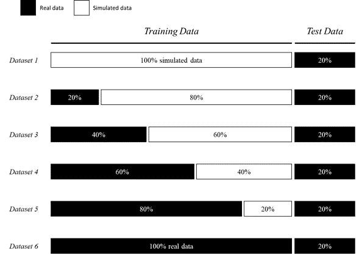

模拟数据和真实数据的比率

数据集分为 6 个不同的比率，混合了模拟数据和真实数据。所有数据集都使用一部分真实数据作为测试数据。

## 超参数调谐

为了提高模型的性能，进行了超参数调整。为了获得最佳参数，总共进行了 4 次扫描。每次扫描由一系列超参数组成，这些超参数将使用权重和偏差按顺序运行。

**在扫描之前定义了几个规则:**

1.  使用合理的参数值
2.  采用“由粗到细”的方法消除非最佳超参数
3.  假设运行中的超参数相互独立
4.  使用数据集 1 和数据集 6 选择超参数

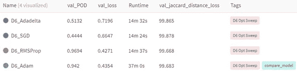

优化器扫描

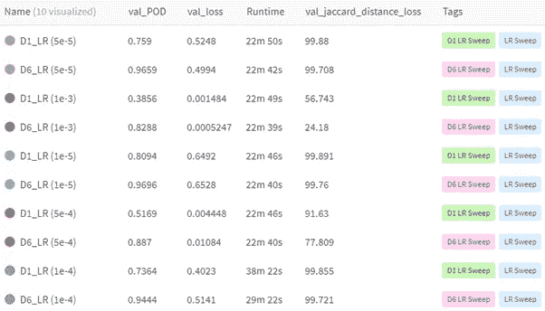

学习率扫描 1

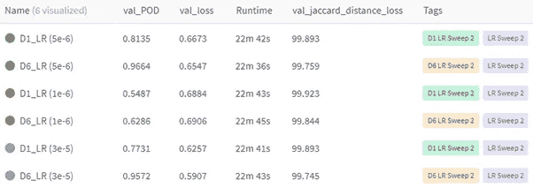

学习率扫描 2

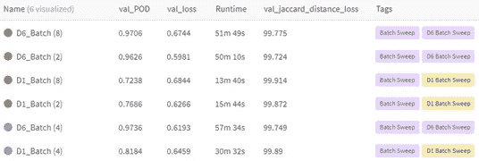

批量扫描

# 结果评估

数据集 1 至 6 的测试集结果

该模型被训练以在总共 20 个时期内收敛。从上图中，我们可以观察到，当只使用模拟数据时(D1 比较)，性能明显更差。当使用更多真实数据时，数据集 2 至 6 的检测概率表现得越来越好。

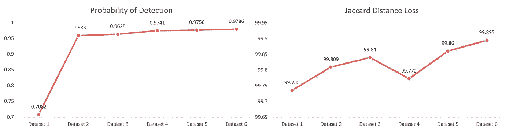

度量结果

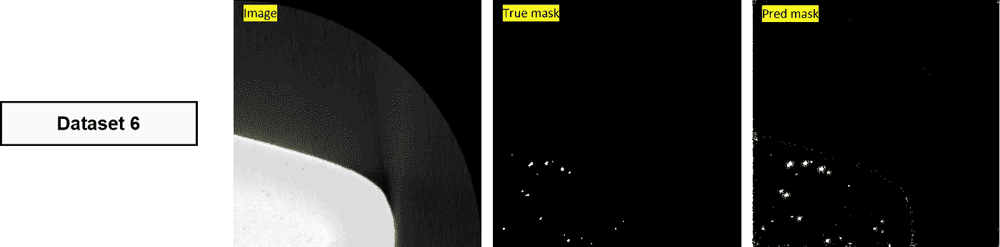

(**左**原始图像来自|(**中**)带注释的遮罩| ( **右**)预测遮罩

基于所获得的结果，我们可以推断孔隙的检测严重依赖于现有数据，而不是模拟数据，因为只需要真实数据的 20% (304 个图像)来将数据集 2 中的检测概率驱动到 0.9583。这也证实了来自训练集的大多数图像与测试集高度相似，这解释了其高检测概率。

# 结论

在这个项目中，我们探索了使用 U-Net 神经网络结构来检测 ct 图像中的孔隙。在 TinkerCAD 中创建了一个由真实毛孔组成的 3D 模型，并上传到 aRTist，在那里进行模拟 CT 扫描以生成 CT 图像。然后，在 VGStudio MAX 和 ImageJ 中对图像进行预处理，随后，使用可训练的 weka 分割插件，对每个图像进行半自动标记。然后手动校正这些图像，并将其转换成用于训练的掩模图像。从真实数据和模拟数据的各种比率获得的结果表明，孔隙的检测严重依赖于真实数据，而不是模拟数据。

[1]O. Ronneberger，P. Fischer 和 T. Brox，“U-Net:卷积网络用于生物医学图像分割”，2015 年。

# 链接

[NTU 博士的完整报告](https://dr.ntu.edu.sg/handle/10356/147951)