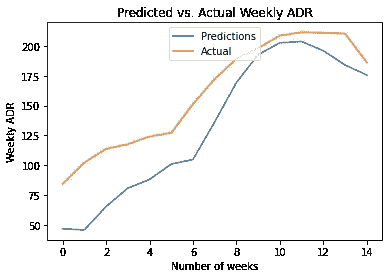
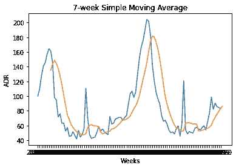
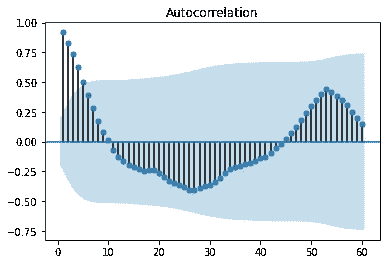

# 深度学习正在被过度使用

> 原文：<https://towardsdatascience.com/deep-learning-is-becoming-overused-1e6b08bc709f?source=collection_archive---------38----------------------->

## 理解数据是第一步


来源:图片来自 [Pixabay](https://pixabay.com/photos/animal-aquarium-aquatic-blue-coral-21668/)

当以黑箱方式使用任何模型来分析数据时，总是存在危险，深度学习家族的模型也不例外。

不要误会我的意思——当然有像神经网络这样的模型可以胜过更简单的模型的情况——但有很多例子表明情况并非如此。

打个比方——假设你需要购买某种交通工具。如果你经常需要长距离运输大件物品，购买卡车是一项值得的投资。然而，如果你只是需要去当地的超市买些牛奶，这显然是浪费金钱。一辆汽车(或者甚至一辆自行车，如果你有气候意识的话)足以完成这个任务。

深度学习也开始以同样的方式使用。我们开始简单地向这些模型提供相关数据，假设性能将超过更简单的模型。此外，这通常是在没有正确理解相关数据的情况下完成的；即，认识到如果一个人对数据有直观的理解，深度学习就不是必要的。

# 时间序列分析

我最常做的是时间序列分析，所以让我们考虑一个这方面的例子。

假设一家酒店希望预测其向客户群收取的平均每日价格(或每日平均价格)。每个客户的平均日费率是按周计算的平均值。

LSTM 模型的配置如下:

```
model = tf.keras.Sequential()
model.add(LSTM(4, input_shape=(1, lookback)))
model.add(Dense(1))
model.compile(loss='mean_squared_error', optimizer='adam')
history=model.fit(X_train, Y_train, validation_split=0.2, epochs=100, batch_size=1, verbose=2)
```

以下是每周平均房价预测值与实际值的对比:



来源:Jupyter 笔记本输出

相对于平均值 160，RMSE 为 31。RMSE(均方根误差)的大小是平均 ADR 大小的 20%。虽然误差并不太高，但考虑到神经网络的目的是在最大化准确性方面胜过其他模型，这确实有点令人失望。

此外，这种特殊的 LSTM 模型是一步预测——这意味着在时间 *t* 之前没有所有数据可用的情况下，该模型无法做出长期预测。

也就是说，我们是否在将 LSTM 模型应用于数据方面走在了前面？

我们先把马牵回车前，先对数据有个整体的看法。

以下是 ADR 波动的 7 周移动平均值:



来源:Jupyter 笔记本输出

当数据在 7 周移动平均线上平滑后，我们可以清楚地看到季节性模式的证据。

让我们仔细看看数据的自相关函数。



来源:Jupyter 笔记本输出

我们可以看到峰值相关性(在一系列负相关性之后)处于滞后 **52** ，表明数据中存在年度季节性。

使用此信息，使用 pmdarima 配置 ARIMA 模型，以预测最近 15 周的 ADR 波动，自动选择 p、d、q 坐标以最小化 Akaike 信息标准。

```
>>> Arima_model=pm.auto_arima(train_df, start_p=0, start_q=0, max_p=10, max_q=10, start_P=0, start_Q=0, max_P=10, max_Q=10, m=52, stepwise=True, seasonal=True, information_criterion='aic', trace=True, d=1, D=1, error_action='warn', suppress_warnings=True, random_state = 20, n_fits=30)Performing stepwise search to minimize aic
 ARIMA(0,1,0)(0,1,0)[52]             : AIC=422.399, Time=0.27 sec
 ARIMA(1,1,0)(1,1,0)[52]             : AIC=inf, Time=16.12 sec
 ARIMA(0,1,1)(0,1,1)[52]             : AIC=inf, Time=19.08 sec
 ARIMA(0,1,0)(1,1,0)[52]             : AIC=inf, Time=14.55 sec
 ARIMA(0,1,0)(0,1,1)[52]             : AIC=inf, Time=11.94 sec
 ARIMA(0,1,0)(1,1,1)[52]             : AIC=inf, Time=16.47 sec
 ARIMA(1,1,0)(0,1,0)[52]             : AIC=414.708, Time=0.56 sec
 ARIMA(1,1,0)(0,1,1)[52]             : AIC=inf, Time=15.98 sec
 ARIMA(1,1,0)(1,1,1)[52]             : AIC=inf, Time=20.41 sec
 ARIMA(2,1,0)(0,1,0)[52]             : AIC=413.878, Time=1.01 sec
 ARIMA(2,1,0)(1,1,0)[52]             : AIC=inf, Time=22.19 sec
 ARIMA(2,1,0)(0,1,1)[52]             : AIC=inf, Time=25.80 sec
 ARIMA(2,1,0)(1,1,1)[52]             : AIC=inf, Time=28.23 sec
 ARIMA(3,1,0)(0,1,0)[52]             : AIC=414.514, Time=1.13 sec
 ARIMA(2,1,1)(0,1,0)[52]             : AIC=415.165, Time=2.18 sec
 ARIMA(1,1,1)(0,1,0)[52]             : AIC=413.365, Time=1.11 sec
 ARIMA(1,1,1)(1,1,0)[52]             : AIC=415.351, Time=24.93 sec
 ARIMA(1,1,1)(0,1,1)[52]             : AIC=inf, Time=21.92 sec
 ARIMA(1,1,1)(1,1,1)[52]             : AIC=inf, Time=30.36 sec
 ARIMA(0,1,1)(0,1,0)[52]             : AIC=411.433, Time=0.59 sec
 ARIMA(0,1,1)(1,1,0)[52]             : AIC=413.422, Time=11.57 sec
 ARIMA(0,1,1)(1,1,1)[52]             : AIC=inf, Time=23.39 sec
 ARIMA(0,1,2)(0,1,0)[52]             : AIC=413.343, Time=0.82 sec
 ARIMA(1,1,2)(0,1,0)[52]             : AIC=415.196, Time=1.63 sec
 ARIMA(0,1,1)(0,1,0)[52] intercept   : AIC=413.377, Time=1.04 sec

Best model:  ARIMA(0,1,1)(0,1,0)[52]          
Total fit time: 313.326 seconds
```

根据上面的输出，**【ARIMA(0，1，1)(0，1，0)【52】**是根据 AIC 最适合的模型的配置。

使用该模型，相对于 **160** 的平均 ADR，获得了 **10** 的 RMSE。

这比 LSTM 达到的 RMSE 低很多(这是一件好事),只占平均值的 6%多一点。

通过对数据的适当分析，人们会认识到数据中存在年度季节性成分使得时间序列更具可预测性——使用深度学习模型来试图预测这样的成分在很大程度上是多余的。

# 回归分析:预测客户 ADR 值

让我们对上述问题换个角度来看。

现在，让我们尝试预测每个客户的平均每周 ADR 值，而不是尝试预测平均每周 ADR。

为此，使用了两种基于回归的模型:

*   线性 SVM(支持向量机)
*   基于回归的神经网络

两个模型都使用了以下特征来预测每个客户的 ADR 值:

*   **已取消:**客户是否取消预订
*   **国家:**客户的原产国
*   **市场细分:**客户的市场细分
*   **押金类型:**客户是否已支付押金
*   **客户类型:**客户的类型
*   **垃圾收集站:**所需的停车位
*   抵达日期星期号:抵达的星期

使用平均绝对误差作为性能度量，让我们比较获得的 MAE 相对于两个模型的平均值。

## 线性 SVM

ε为 0.5 的线性向量回归被定义并在训练数据中被训练:

```
svm_reg_05 = LinearSVR(epsilon=0.5)
svm_reg_05.fit(X_train, y_train)
```

现在使用测试集中的特征值进行预测:

```
>>> svm_reg_05.predict(atest)array([ 81.7431138 , 107.46098525, 107.46098525, ...,  94.50144931,
        94.202052  ,  94.50144931])
```

这是相对于平均值的平均绝对误差:

```
>>> mean_absolute_error(btest, bpred)
30.332614341027753>>> np.mean(btest)
105.30446539770578
```

MAE 是平均值的 28%。

让我们看看基于回归的神经网络是否能做得更好。

## 基于回归的神经网络

神经网络定义如下:

```
model = Sequential()
model.add(Dense(8, input_dim=8, kernel_initializer='normal', activation='elu'))
model.add(Dense(2670, activation='elu'))
model.add(Dense(1, activation='linear'))
model.summary()
```

然后，使用 150:

```
model.compile(loss='mse', optimizer='adam', metrics=['mse','mae'])
history=model.fit(xtrain_scale, ytrain_scale, epochs=30, batch_size=150, verbose=1, validation_split=0.2)
predictions = model.predict(xval_scale)
```

将测试集中的特征输入到模型中后，MAE 和平均值如下:

```
>>> mean_absolute_error(btest, bpred)
28.908454264679218>>> np.mean(btest)
105.30446539770578
```

我们看到平均大气透过率仅比使用 SVM 获得的略低。在这方面，当线性 SVM 模型表现出几乎相同的准确性时，很难证明使用神经网络来预测客户 ADR 是合理的。

无论如何，用来“解释”ADR 的特征选择等因素比模型本身更重要。俗话说“垃圾进，垃圾出”。如果特征选择很差，那么模型的输出也会很差。

在这种情况下，虽然两个回归模型都显示了一定程度的预测能力，但很有可能 1)选择数据集中的其他要素可以进一步提高准确性，或者 2)数据集中的要素可能会导致 ADR 出现太多变化。例如，数据集没有告诉我们关于每个客户的收入水平等因素的任何信息，而这些因素预计会显著影响他们每天的平均支出。

# 结论

在上面的两个例子中，我们已经看到，使用“更轻”的模型已经能够匹配(或超过)深度学习模型所达到的准确性。

虽然在有些情况下，数据可能非常复杂，需要算法“从零开始”学习数据中的模式，但这往往是例外而不是规则。

与任何数据科学问题一样，关键首先在于**理解**正在处理的数据。型号的选择是次要的。

非常感谢您的时间，任何问题或反馈都非常感谢！

上述例子的数据集和 Jupyter 笔记本可以在[这里](https://github.com/MGCodesandStats/hotel-modelling)找到。

*免责声明:本文是在“原样”的基础上编写的，没有担保。本文旨在提供数据科学概念的概述，不应以任何方式解释为专业建议。*

# 参考

*   [安东尼奥、阿尔梅迪亚和努内斯(2019)。酒店预订需求数据集](https://www.sciencedirect.com/science/article/pii/S2352340918315191)
*   [GitHub:碱性-ml/pmdarima](https://github.com/alkaline-ml/pmdarima)
*   [走向基于数据科学回归的神经网络:预测酒店的平均日房价](/regression-based-neural-networks-with-tensorflow-v2-0-predicting-average-daily-rates-e20fffa7ac9a)