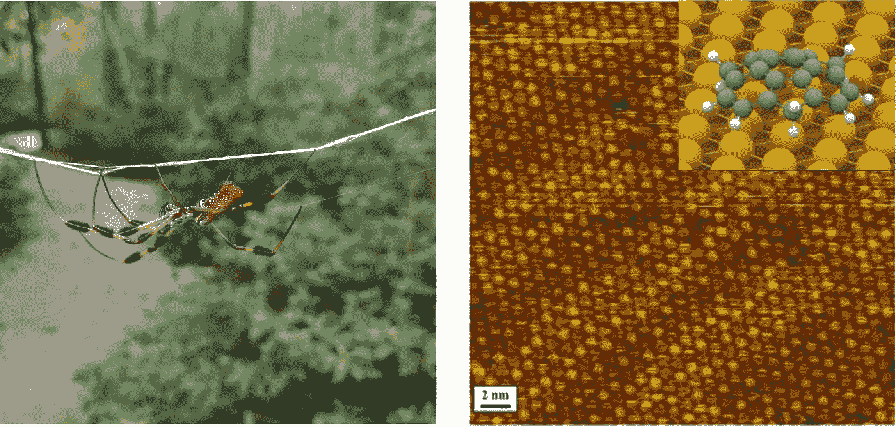
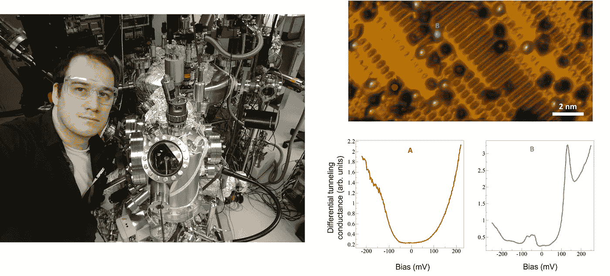
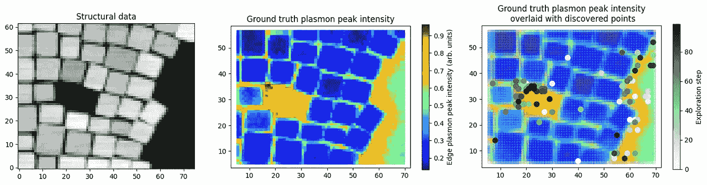
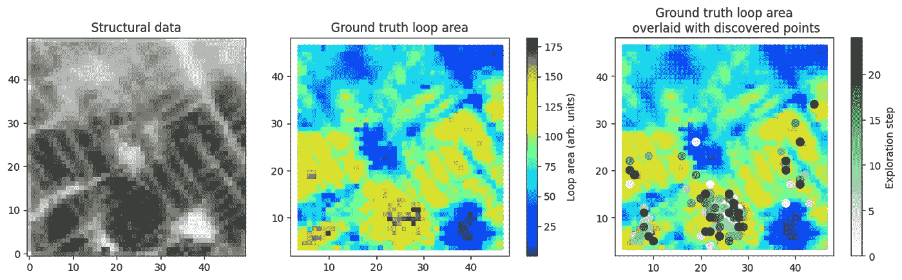

# 深度学习遇到高斯过程:深度核学习如何实现自主显微镜

> 原文：<https://towardsdatascience.com/deep-learning-meets-gaussian-process-how-deep-kernel-learning-enables-autonomous-microscopy-58106574cfeb?source=collection_archive---------21----------------------->

马克西姆·齐亚丁诺夫&谢尔盖·加里宁

*美国田纳西州橡树岭橡树岭国家实验室纳米材料科学和计算科学与工程中心*

对于许多科学家和工程师来说，他们的职业之路是从显微镜开始的。在简单的光学显微镜或放大镜下，附近海滩的沙子开始看起来像一个山地国家，里面有硅藻和蜗牛的骨架以及彩色的矿物质。水坑中的水滴揭示了好奇的(有时令人不安的)微小生物。借助现代手机，谷歌眼镜可以帮助识别它们的类别和种类。干燥的盐溶液将显示彩虹色的晶体。在一个更专业的环境中，定制(也更昂贵)的电子和扫描探针显微镜揭示了材料的微米和纳米尺度结构，一直到可视化形成材料和分子表面的原子图案。下图显示了第二位作者拍摄的金色圆形蜘蛛和第一位作者拍摄的表面上的“布基球”分子。

图一。(左)金球蜘蛛。(右)金表面的苏曼烯(“巴基球”)分子。作者提供的数据。

然而，现代显微镜不仅可以对材料及其表面进行成像，还可以对它们的性质进行更详细的研究。在扫描隧道显微镜(STM)中，操作者可以选择潜在感兴趣的区域并进行隧道光谱，即测量电流-电压曲线。在量子隧道的控制下，这条曲线将包含关于局域态密度、超导性、电荷密度波和表面上其他激发现象的信息[1–2]。在电子显微镜中，选择的技术是电子能量损失光谱[3]。在这里，测量穿过固体的电子的能量损失揭示了单个原子的化学结构，随着单色仪器的最新进展，允许探测固体中的准粒子，如电子和等离子体[4-5]。扫描探针显微镜中出现了特别广泛的可能光谱模式，允许研究人员探测局部机械性质、导电性和铁电极化转换[6–7]。

不幸的是，与成像相比，局部功能测量要花费很多时间。例如，获得一个简单的 STM 图像通常需要大约 5-10 分钟。在密集的空间网格点上获得密集的光谱曲线阵列需要几天时间，这就需要建造超稳定的显微镜，在这些时间内不会发生明显的漂移。同样的考虑也适用于电子显微镜，对于电子显微镜，还需要考虑电子束对样品的损伤。最后，许多测量是破坏性的，不能在密集网格上进行，例如纳米压痕。这些考虑严重限制了这些测量的能力以及它们对材料的结构和功能提供的洞察力。很像谚语中的琼恩·雪诺，如果我们不知道在哪里测量，我们就在任何地方测量，希望在*非现场*数据分析期间捕获感兴趣的行为，希望识别感兴趣的区域。机器学习能让我们做得更好吗？(提示:我们可以，否则这篇博文就写不出来了)。

图 2:现代显微镜，如左图所示的超高真空扫描隧道显微镜，可以在纳米尺度和原子尺度上探索材料的结构和功能。右边显示的是 2D 地形图，我们可以对 m x *n* 网格(未显示)进行光谱测量，并在两个网格点记录差分隧道电导光谱。作者图。

为了理解这一工作需要什么，我们首先考虑在基于高斯过程(GP)的实验中用于主动学习的聚合方法。在最一般的形式中，GP 指的是试图从一组稀疏测量值在特定(低维)参数空间上重建函数的一类算法。换句话说，给定一组观测数据点( *x* ᵢ， *y* ᵢ)，并假设正态分布的观测噪声 *ϵ，*，GP 旨在重构函数 *f* ( *x* )，例如*y*ᵢ=*f*(*x*ᵢ)+*ϵ*ᵢ，其中*f*~ *K* ( *x* ᵢ， *x* ⱼ)).在实验之前选择核函数形式 *K* ,并且使用马尔可夫链蒙特卡罗方法或随机变分推断从观察值推断其超参数。你可以在这里阅读 GP [更严格的定义](http://www.gaussianprocess.org/gpml/chapters/)。另请参见[我们之前在 GPs](https://ziatdinovmax.medium.com/gaussian-process-first-step-towards-active-learning-in-physics-239a8b260579) 上发布的中型帖子。我们小组已经将 GP 应用于多个成像问题，包括[稀疏高光谱数据的重建](https://doi.org/10.1038/s41524-020-0289-6)、[铁电体中的磁滞回线工程](https://aip.scitation.org/doi/10.1063/5.0011917)和[晶格哈密顿量参数空间的高效探索](https://aip.scitation.org/doi/10.1063/5.0021762)，完整代码可通过 [GPim 包](https://github.com/ziatdinovmax/GPim)获得。

GP 的独特之处在于，该函数连同相关的不确定性σ(*x*)一起被重构。这一方面允许将 GP 扩展到主动学习方法。假设我们想要通过顺序选择点来执行测量，以最有效的方式学习参数空间上的函数值。在这种情况下，具有最大不确定性的区域代表查询的最佳点。以这种方式，GP 驱动的自动化实验寻求以最迅速的方式减少关于功能的不确定性。

应该注意的是，GP 可以进一步扩展以针对特定行为。在这种情况下，如果我们预先知道我们正在寻找的函数值，我们可以在一个单一的采集函数中结合期望和不确定性。然后，采集函数的最大值(或最小值)用于参数空间的导航。这种结合了参数空间的探索和利用的方法通常被称为贝叶斯优化(BO)。

那么问题就变成了 GP/BO 是否可以用来实现显微镜的自动化实验。事实证明，在简单成像或光谱学的情况下，总增益相对较小。事实上，图像通常包含许多不同长度尺度的多个特征——从大到小。我们事先不知道这些特征是什么。相应地，试图基于单点测量导航图像空间并发现相关核函数的基于 GP 的算法会遇到困难。事实上，对于已知图像，核函数大致相当于相关函数，这不是表示图像的非常有效的方式。原则上，可以通过将标准多元分解(PCA，NMF)或自动编码器技术应用于图像补片来实现图像的简化表示。然而，不能保证这些简化的表示在物理上是有意义的，并且它们可能经常受到仪器因素的支配，例如漂移(在许多情况下，领域专家必须将物理变量与非物理变量分开，这违背了自动化实验的全部意义)。此外，分解需要补丁提前可用，这违背了发现的概念。

GP 产生的增益进一步降低，因为如果被迫沿着非常复杂的路径移动探针，显微镜的电子和机械装置会开始失效。最重要的是，GP 通常不能很好地预测复杂的模式。总之，它看起来像 GP 它不足以在显微镜下进行自动化实验。

进入深度内核学习。为了理解它是如何工作的，让我们回顾一下如果操作员看到图像他们会做什么。人眼会立即记录感兴趣的物体。例如，在图 2 中超导体的 STM 图像中，我们可以立即注意到有亮点的区域。一个合格的操作员会立即识别出这些区域可能是局域电子态的宿主，尽管它的性质可能依赖于周围的环境。类似地，人们可以注意到具有条纹对比度的多个区域，这可能是表面重建的指示。它们有很多，很明显它们应该有相似的行为。因此，对其中几个进行光谱测量，并假设观察到的行为具有代表性，也许就足够了。然而，也存在一些区域，其中小的凹陷和/或突起嵌入到条纹域中，并且这些区域可能包含关于该系统的物理的一些额外的有趣见解。接下来的问题是，我们是否可以利用结构图像中包含的信息，以自主的方式指导光谱测量。

深度内核学习(DKL)，最初由 Andrew Gordon Wilson 引入[，可以理解为经典深度神经网络(DNN)和 GP 的混合体，如图 3 所示。这里，DNN 部分充当特征提取器，允许将复杂的高维特征减少到标准 GP 内核操作的低维描述符。通过在边缘对数似然上执行梯度上升来联合优化 DNN 和 GP 核的参数。新输入的 DKL 输出是感兴趣的属性(或属性，如果我们对向量值函数感兴趣)的期望值和相关的不确定性。让我们看看如何利用 DKL 在电子或扫描探针显微镜上进行实验。](https://arxiv.org/abs/1511.02222)

图 3。深度核学习:训练和预测步骤。训练输入是(结构)图像补片，目标是感兴趣的物理功能的标量值(通常从那些补片中测量的光谱曲线中导出)。在预测步骤，训练的 DKL 模型用于获得感兴趣的功能的期望值和新的一组结构图像补片的相应的不确定性(对于该新的一组结构图像补片，功能还没有被实验测量)。作者图。

我们将展示两个基本的例子，其中 DKL 被用于映射材料结构的部分，以最大化特定的物理功能。为此，DKL 必须了解系统中相关的结构-性质关系。在实现方面，DKL 训练输入是结构图像的小块，训练目标是与从块中心测量的光谱中导出的一些物理功能相关联的标量值(DKL 也可以与向量值目标一起工作，甚至可以预测整个光谱，但这些将在单独的帖子中讨论)。目标是使用易于获取的结构数据来指导通常更加繁琐的光谱测量。因此，基于 DKL 的自动化实验从收集结构图像开始，该结构图像被分割成一组小碎片(每个图像像素一个碎片)，随后在图像的随机位置获取几个光谱曲线。这些稀疏观察用于训练 DKL 模型。然后，使用训练的 DKL 模型来预测没有测量光谱的结构图像的每个坐标中的感兴趣的特性(或者，更具体地，对于以该坐标为中心的每个图像片)。预测的平均特性值和相关的不确定性用于导出采集函数，以对下一个(多个)测量点进行采样。一旦执行了新的测量，就更新训练数据，并重复整个过程。

首先，让我们使用在等离子体纳米立方体上获得的公开可用的[数据集](https://zenodo.org/record/4433093#.YYDHPZ7MKuU)。这里我们的结构数据来自扫描透射电子显微镜图像。感兴趣的功能源自在相同区域上测量的电子能量损失谱，并且在该特定示例中，仅仅是边缘等离子体峰的强度。我们运行 DKL 100 次迭代，这大约是总网格点的 3%。在每次迭代中，我们使用简单的 Thompson 采样器选择下一个测量点。因为我们已经知道了地面实况，我们可以用地面实况地图覆盖采样点。可以看到，我们能够通过测量网格的一小部分来识别结构图像中感兴趣的功能最大化的区域。

图 4。基于 DKL 的纳米等离子体阵列区域的搜索。作者图。

现在，让我们来看看这种方法是如何在压电响应力显微镜中识别最大化迟滞回线面积的样品区域的。我们的 DKL 设置与之前的实验几乎相同，只是现在，在每一步，我们采样一批 4 个点，而不仅仅是一个点。同样，从下面的图 5 中可以看出，我们能够用非常少的测量值(整个网格的大约 5%)快速定位感兴趣的行为。

图 5。基于 DKL 搜索最大化磁滞回线面积的区域。作者图。

总的来说，这种方法通过主动学习系统中的结构-性质关系，使用结构信息来指导光谱(功能)测量。重要的是，我们可以使用几乎任何物理搜索标准，从这篇博文中使用的简单标准到复杂得多的标准。以这种方式，我们结合相关机器学习的能力来建立多维数据集中的关系，并导出相应的不确定性，以及在搜索标准的选择中编码的领域专业知识。

请查看我们的 [AtomAI](https://github.com/pycroscopy/atomai) 软件包，将该工具和其他深度/机器学习工具应用于科学成像。如果你想了解更多关于扫描探针显微镜的知识，欢迎来到 M*N 频道:显微镜，机器学习，材料。最后，在科学界，我们感谢资助这项研究的赞助商。这项工作在橡树岭国家实验室纳米材料科学中心(CNMS)进行并得到支持，该中心是美国能源部科学用户设施办公室。您可以使用[此链接](https://my.matterport.com/show/?m=MT819FqAwbT)进行虚拟漫游，如果您想了解更多，请告诉我们。

其中一个例子的可执行 Google Colab notebook 可以在[这里](https://colab.research.google.com/github/ziatdinovmax/notebooks_for_medium/blob/main/DKL_for_medium.ipynb)找到。

## **参考文献:**

1.鲁山，p；徐，j；帕克；Hor，Y. S 谢博士；钱博士；理查德拉，a。哈桑；R. J .卡瓦；手征自旋织构保护拓扑表面态免受反向散射。*性质* **2009、** *460* (7259)、1106-U64。

2.潘；赫德森；郎；卫崎；内田，s；成像单个锌杂质原子对 bi 2 Sr 2 cacu 2 o 8+δ超导性的影响。*性质* **2000、** *403* (6771)、746–750。

3.彭尼库克，S. J。瓦雷拉，男；卢皮尼；奥克斯利议员；齐索姆，M. F,《原子分辨率光谱成像:过去、现在和未来》。j .电子显微公司。 **2009，** *58* (3)，87–97。

4.Kapetanakis，医学博士；周；奥克斯利议员；李，j；议员普朗格；彭尼库克，S. J。Idrobo，J. CPantelides，S. T,《低损失电子能量损失光谱学:光学光谱学的原子分辨率补充及其在石墨烯中的应用》。*物理修订 B* **2015、** *92* (12)。

5.哈格，F. S。尼科尔斯；耶茨；麦卡洛克特区；洛夫乔伊；新泽西州德尔比；克里瓦内克；里夫森，k。纳米尺度动量分辨振动光谱学。 *Sci。Adv.* **2018，** *4* (6)，6。

6.加里宁公司；斯特尔科夫，e；别利亚尼诺夫。索姆纳特；瓦苏德万；林格费尔特；阿奇博尔德；陈；普罗克什河；新泽西州拉纳伊特；扫描探针显微镜中的大、深、智能数据。 *ACS Nano* **2016，** *10* (10)，9068–9086。

7.瓦苏德万；杰西；金，y；库马尔，a。压电响应力显微镜中的光谱成像:研究铁电体和多铁性中极化动力学的新机会。科曼夫人。 **2012，** *2* (3)，61–73。

8.加里宁公司；瓦莱蒂，m；瓦苏德万；Ziatdinov，m,《通过基于高斯过程的探索-利用进行功能和结构发现的晶格哈密顿量探索》。 *J. Appl. Phys.* **2020，** *128* (16)，11。

9.加里宁公司；齐亚特迪诺夫，m；Vasudevan，R. K,《通过生成模型的贝叶斯优化引导搜索期望的功能响应:铁电体中的磁滞回线形状工程》。 *J. Appl. Phys.* **2020，** *128* (2)，8。