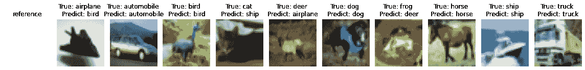
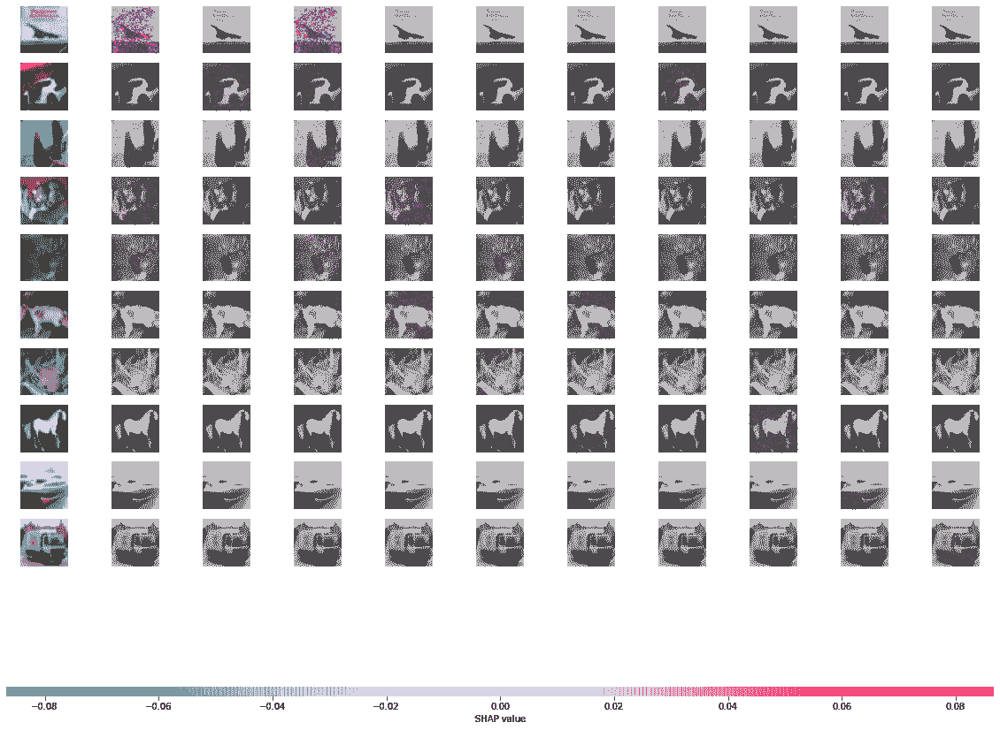
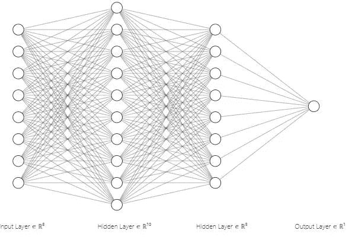
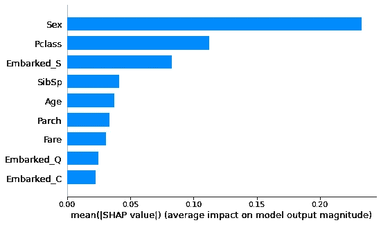
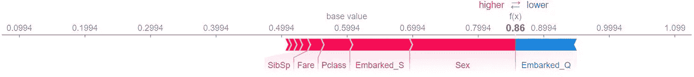
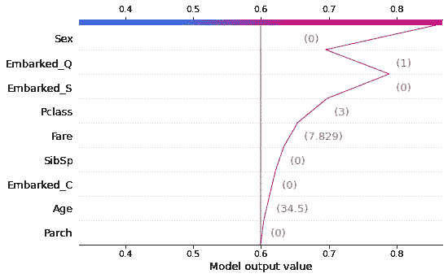
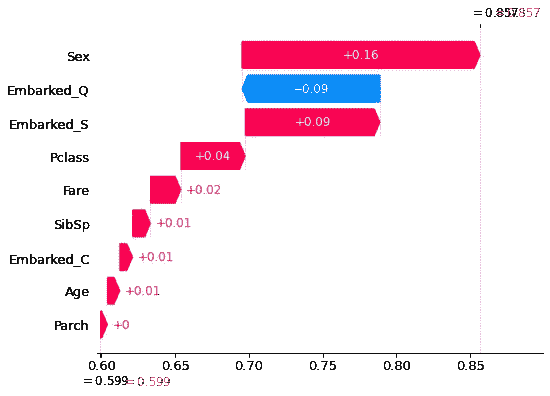

# 使用 SHAP 的深度学习模型解释

> 原文：<https://towardsdatascience.com/deep-learning-model-interpretation-using-shap-a21786e91d16?source=collection_archive---------1----------------------->

## 图像和表格数据的 Python 实现

传统上，机器学习和深度学习的批评者说，即使他们获得了准确的预测，我们也在创建“黑盒”模型。但这是一种误解。机器学习和深度学习模型是可以解释的。模型解释在学术界和工业界的研究者中是一个非常活跃的领域。Christoph Molnar 在他的书[“可解释的机器学习”](https://christophm.github.io/interpretable-ml-book/)中，将可解释性定义为人类能够理解决策原因的程度，或者人类能够持续预测 ML 模型结果的程度。

由于可解释性，今天越来越多的公司在决策过程中有效地使用机器学习和深度学习，或者计划将它们纳入未来的战略，即使是在医药和金融等高度监管的领域。

根据数据集的性质，一些数据科学家更喜欢经典的机器学习方法。有时深度学习在非表格领域表现出色，如计算机视觉、语言和语音识别。

当我们谈论模型可解释性时，理解全局方法和局部方法之间的区别是很重要的:

*   **全局方法**是理解模型如何做出决策的整体结构。
*   **本地方法**是理解模型如何为单个实例做出决策。

有许多方法旨在提高模型的可解释性。 [SHAP 值](https://arxiv.org/abs/1705.07874)是解释模型和理解数据特征与输出之间关系的最常用方法之一。这是一种源自联盟博弈理论的方法，它提供了一种在特性之间公平分配“支出”的方式。

SHAP 价值观的最大优势之一是它们提供了全局和局部的可解释性。本文重点介绍使用 SHAP 对表格数据和非结构化数据(本文图片)进行深度学习模型解释。

## 由 SHAP 深度讲解器讲解图像分类

图像分类任务可以通过预测图像上每个像素的分数来解释，该分数指示它对将该图像分类到特定类别的贡献程度。在本文中，我将:

*   在 [CIFAR10 数据集](https://www.cs.toronto.edu/~kriz/cifar.html)上训练 CNN 模型
*   计算 SHAP 值
*   可视化预测结果和 SHAP 值

首先，让我们加载并转换 keras 内置数据集。

```
# load package
import shap
import numpy as np
import tensorflow as tf
from tensorflow import keras
import matplotlib.pyplot as plt
from keras.models import Sequential
import ssl# load build-in dataset
ssl._create_default_https_context = ssl._create_unverified_context
(x_train, y_train), (x_test, y_test) = keras.datasets.cifar10.load_data()# reshape and normalize data
x_train = x_train.reshape(50000, 32, 32, 3).astype("float32") / 255
x_test = x_test.reshape(10000, 32, 32, 3).astype("float32") / 255
y_train = y_train.reshape(50000,)
y_test = y_test.reshape(10000,)
```

现在让我们建立一个简单的神经网络，编译并拟合模型。

```
# define the model architecture
inputs = keras.Input(shape=(32, 32, 3))
x = keras.layers.Conv2D(32, (3, 3), activation='relu')(inputs)
x = keras.layers.MaxPooling2D((2, 2))(x)
x = keras.layers.Conv2D(128, (3, 3), activation='relu')(inputs)
x = keras.layers.MaxPooling2D((2, 2))(x)
x = keras.layers.Conv2D(64, (3, 3), activation='relu')(inputs)
x = keras.layers.MaxPooling2D((2, 2))(x)
x = keras.layers.Conv2D(32, (3, 3), activation='relu')(inputs)
x = keras.layers.MaxPooling2D((2, 2))(x)
x = keras.layers.Flatten()(x)
x = keras.layers.Dense(256, activation='relu')(x)
x = keras.layers.Dense(64, activation='relu')(x)
outputs = keras.layers.Dense(10, activation='softmax')(x)# inputs and outputs
model = keras.Model(inputs=inputs, outputs=outputs, name="test_for_shap")# compile the model
model.compile(
      loss=tf.keras.losses.SparseCategoricalCrossentropy(),
      optimizer=keras.optimizers.Adam(),
      metrics=[tf.keras.metrics.SparseCategoricalAccuracy()]
  )model.fit(x_train, y_train, validation_data=(x_test, y_test), epochs = 10)
```

接下来，让我们在测试集上进行预测(每个类一个图像)。

```
# class label list
class_names = ['airplane', 'automobile', 'bird', 'cat', 'deer',
               'dog', 'frog', 'horse', 'ship', 'truck']# example image for each class
images_dict = dict()
for i, l in enumerate(y_train):
  if len(images_dict)==10:
    break
  if l not in images_dict.keys():
    images_dict[l] = x_train[i].reshape((32, 32,3))
images_dict = dict(sorted(images_dict.items()))

# example image for each class for test set
x_test_dict = dict()
for i, l in enumerate(y_test):
  if len(x_test_dict)==10:
    break
  if l not in x_test_dict.keys():
    x_test_dict[l] = x_test[i]# order by class
x_test_each_class = [x_test_dict[i] for i in sorted(x_test_dict)]
x_test_each_class = np.asarray(x_test_each_class)# Compute predictions
predictions = model.predict(x_test_each_class)
predicted_class = np.argmax(predictions, axis=1)
```

然后，我们为实际类和预测类定义绘图函数。

```
# plot actual and predicted class
def plot_actual_predicted(images, pred_classes):
  fig, axes = plt.subplots(1, 11, figsize=(16, 15))
  axes = axes.flatten()

  # plot
  ax = axes[0]
  dummy_array = np.array([[[0, 0, 0, 0]]], dtype='uint8')
  ax.set_title("Base reference")
  ax.set_axis_off()
  ax.imshow(dummy_array, interpolation='nearest') # plot image
  for k,v in images.items():
    ax = axes[k+1]
    ax.imshow(v, cmap=plt.cm.binary)
    ax.set_title(f"True: %s \nPredict: %s" % (class_names[k], class_names[pred_classes[k]]))
    ax.set_axis_off() plt.tight_layout()
  plt.show()
```

现在，我们可以使用 SHAP 库来生成 SHAP 值:

```
# select backgroud for shap
background = x_train[np.random.choice(x_train.shape[0], 1000, replace=False)]# DeepExplainer to explain predictions of the model
explainer = shap.DeepExplainer(model, background)# compute shap values
shap_values = explainer.shap_values(x_test_each_class)
```

最后，我们可以看到 SHAP 的价值观。

```
# plot SHAP values
plot_actual_predicted(images_dict, predicted_class)
print()
shap.image_plot(shap_values, x_test_each_class * 255)
```



按作者

在这个可视化中:

*   红色像素代表有助于将该图像分类为特定类别的正 SHAP 值。
*   蓝色像素表示负 SHAP 值，这导致没有将该图像分类为该特定类别。

## 用 SHAP 深层解释器解释表格数据分类

大量的数据可以用表格的形式表示。下图是一个完全连接的神经网络，通过 SHAP 深度解释器，我们可以知道哪个输入特征实际上对模型输出和大小有贡献。



按作者

在本文中，我将使用开源的 [Titanic 数据集](https://www.kaggle.com/c/titanic/data)进行演示:

*   训练多层感知模型
*   计算 SHAP 值
*   视觉全局和局部图

首先，我加载包和泰坦尼克号数据。

```
# import package
import shap
import numpy as np 
import pandas as pd 
import matplotlib.pyplot as plt
from sklearn.preprocessing import StandardScaler
from tensorflow.keras.models import Sequential
from tensorflow.keras.layers import Dense, Dropout
from tensorflow.keras import optimizers
import warnings 
warnings.filterwarnings('ignore')
%matplotlib inline
import os# load data
os.chdir('/titanic/')
train_data = pd.read_csv('./train.csv', index_col=0)
test_data = pd.read_csv('./test.csv', index_col=0)
train_data.head()
```

然后，我们通过删除不必要的列、处理丢失的数据、将分类特征转换为数字特征以及进行一次性编码来处理原始数据。

```
def data_preprocessing(df):
    df = df.drop(columns=['Name', 'Ticket', 'Cabin'])

    # fill na
    df[['Age']] = df[['Age']].fillna(value=df[['Age']].mean())
    df[['Embarked']] = df[['Embarked']].fillna(value=df['Embarked'].value_counts().idxmax())
    df[['Fare']] = df[['Fare']].fillna(value=df[['Fare']].mean())

    # categorical features into numeric
    df['Sex'] = df['Sex'].map( {'female': 1, 'male': 0} ).astype(int)

    # one-hot encoding
    embarked_one_hot = pd.get_dummies(df['Embarked'], prefix='Embarked')
    df = df.drop('Embarked', axis=1)
    df = df.join(embarked_one_hot)

    return df# train data processing
train_data = data_preprocessing(train_data)
train_data.isnull().sum()# create data for training
x_train = train_data.drop(['Survived'], axis=1).values# Check test data
test_data.isnull().sum()# scale
scale = StandardScaler()
x_train = scale.fit_transform(x_train)# prepare y_train
y_train = train_data['Survived'].valuestest_data = data_preprocessing(test_data)
x_test = test_data.values.astype(float)# scaling
x_test = scale.transform(x_test)# Check test data
test_data.isnull().sum()
```

接下来是定义、编译和拟合 keras 模型。

```
# build mlp
model = Sequential()
model.add(Dense(32, input_dim=x_train.shape[1], activation='relu'))
model.add(Dropout(0.25))
model.add(Dense(128, activation='relu'))
model.add(Dropout(0.25))
model.add(Dense(32, activation='relu'))
model.add(Dropout(0.25))
model.add(Dense(8, activation='relu'))
model.add(Dropout(0.25))
model.add(Dense(2, activation='softmax'))# compile model
model.compile(loss='sparse_categorical_crossentropy', optimizer = 'adam', metrics = ['accuracy'])# fit model
model.fit(x_train, y_train, epochs=10, batch_size=64)
```

然后我计算 SHAP 值。

```
# compute SHAP values
explainer = shap.DeepExplainer(model, x_train)
shap_values = explainer.shap_values(x_test)
```

**SHAP 全球解读**

**汇总图**显示了最重要的特征及其对模型的影响程度。这是全球的解释。

```
shap.summary_plot(shap_values[0], plot_type = 'bar', feature_names = test_data.columns)
```



按作者

**SHAP 当地解读**

在本文中，我将展示一个示例的三种可视化解释:

*   力图
*   决策图
*   瀑布图

力图有助于了解“输出值”相对于“基础值”的位置。我们还可以看到哪些要素对预测有正面(红色)或负面(蓝色)影响，以及影响的大小。

```
shap.initjs()
shap.force_plot(explainer.expected_value[0].numpy(), shap_values[0][0], features = test_data.columns)
```



决策图可以观察每个变化的幅度，由样本对显示的特征值进行处理。

```
shap.decision_plot(explainer.expected_value[0].numpy(), shap_values[0][0], features = test_data.iloc[0,:], feature_names = test_data.columns.tolist())
```



按作者

瀑布图还允许我们看到某个特性影响的幅度和性质。它还允许查看特征的重要性顺序以及样本的每个特征所取的值。

```
shap.plots._waterfall.waterfall_legacy(explainer.expected_value[0].numpy(), shap_values[0][0], feature_names = test_data.columns)
```



按作者

## 结论和下一步措施

AI 算法在我们生活中占据的空间越来越大，被广泛应用于各个行业。对于数据科学家、决策者和监管者来说，模型可解释性是一个非常重要的话题。在这篇文章中，我主要讲述了使用 python 代码一步步对图像和表格数据进行深度学习模型解释。我将在未来的帖子中分享更多关于文本数据的深度学习模型解释，而不是指导实现。

## 参考

1.  [https://christophm.github.io/interpretable-ml-book/](https://christophm.github.io/interpretable-ml-book/)
2.  [https://cloud . Google . com/blog/products/ai-machine-learning/why-you-need-to-explain-machine-learning-models](https://cloud.google.com/blog/products/ai-machine-learning/why-you-need-to-explain-machine-learning-models)
3.  https://github.com/slundberg/shap
4.  【https://www.kaggle.com/c/titanic/data 
5.  [https://www.openml.org/d/40945](https://www.openml.org/d/40945)
6.  [https://en . Wikipedia . org/wiki/explable _ artificial _ intelligence](https://en.wikipedia.org/wiki/Explainable_artificial_intelligence)
7.  neuralnetworksanddeeplearning.com
8.  [https://www . cs . Toronto . edu/~ kriz/learning-features-2009-tr . pdf](https://www.cs.toronto.edu/~kriz/learning-features-2009-TR.pdf)
9.  [https://www.cs.toronto.edu/~kriz/cifar.html](https://www.cs.toronto.edu/~kriz/cifar.html)