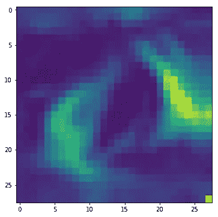
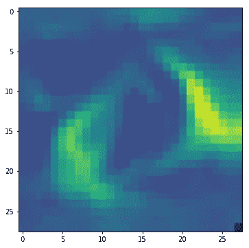
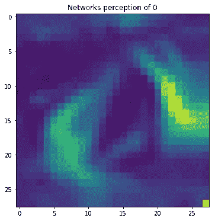
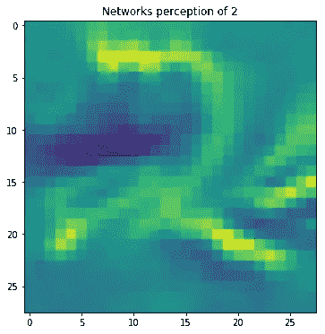
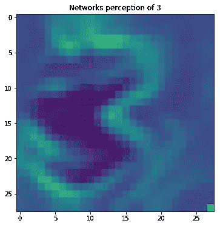
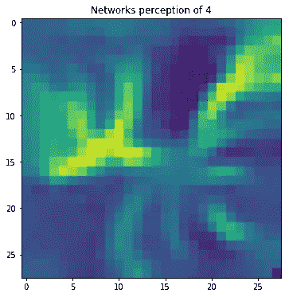

# 深度学习模型可视化

> 原文：<https://towardsdatascience.com/deep-learning-model-visualization-6cf6290dc981?source=collection_archive---------30----------------------->

## 可视化神经网络如何在感知器级别学习


艾莉娜·格鲁布尼亚克在 [Unsplash](https://unsplash.com?utm_source=medium&utm_medium=referral) 上的照片

你有没有想过一个深度学习模型是如何在后端学习的？每一层如何帮助传递信息到下一层，每一层学到了什么信息？如果你真的可以分析和想象模型是如何在每次迭代后找到图像中的模式，那不是很好吗？如果这一切让你兴奋，那么你来对地方了。

在本文中，我将向您展示如何可视化深度学习模型如何在每次迭代中学习，以及它们如何试图找到模式。

我们将探索一个名为“keras-vis”的库，它将解决上面给出的目的。它是一个开源的 python 库，有助于可视化深度学习神经网络模型。它是一个高级工具包，用于可视化和调试经过训练的 Keras 神经网络。让我们开始吧…

# 安装 keras-vis

为了安装 keras-vis，我们将使用下面给出的命令。对于本文，我们将使用 google collab。

```
!pip install git+https://github.com/raghakot/keras-vis.git
```

目前，该库支持 TensorFlow 版本 1.8 和 Keras 版本 2.2.0，下面给出的命令将安装所需的版本。

```
!pip uninstall tensorflow
!pip install tensorflow==1.8
!pip uninstall keras
!pip install keras==2.2.0
```

# 导入所需的库

为了创建模型和可视化，我们需要导入某些库，复制下面给出的代码来导入这些库。

```
**import** **numpy** **as** **np**
**import** **keras**
**from** **keras.datasets** **import** mnist
**from** **keras.models** **import** Sequential, Model
**from** **keras.layers** **import** Dense, Dropout, Flatten, Activation, Input
**from** **keras.layers** **import** Conv2D, MaxPooling2D
**from** **keras** **import** backend **as** 
**from** **vis.visualization** **import** visualize_activation
**from** **vis.utils** **import** utils
**from** **keras** **import** activations

**from** **matplotlib** **import** pyplot **as** plt
%matplotlib inline
```

为了创建模型，我们需要定义架构在本文中，我们不讨论如何创建模型架构您可以复制下面的命令来创建 MNIST 数据集的模型架构以及如何训练它。

```
batch_size = 32
num_classes = 10
epochs = 50

*# input image dimensions*
img_rows, img_cols = 28, 28

*# the data, shuffled and split between train and test sets*
(x_train, y_train), (x_test, y_test) = mnist.load_data()

**if** K.image_data_format() == 'channels_first':
    x_train = x_train.reshape(x_train.shape[0], 1, img_rows, img_cols)
    x_test = x_test.reshape(x_test.shape[0], 1, img_rows, img_cols)
    input_shape = (1, img_rows, img_cols)
**else**:
    x_train = x_train.reshape(x_train.shape[0], img_rows, img_cols, 1)
    x_test = x_test.reshape(x_test.shape[0], img_rows, img_cols, 1)
    input_shape = (img_rows, img_cols, 1)

x_train = x_train.astype('float32')
x_test = x_test.astype('float32')
x_train /= 255
x_test /= 255

*# convert class vectors to binary class matrices*
y_train = keras.utils.to_categorical(y_train, num_classes)
y_test = keras.utils.to_categorical(y_test, num_classes)

model = Sequential()
model.add(Conv2D(32, kernel_size=(3, 3),
                 activation='relu',
                 input_shape=input_shape))
model.add(Conv2D(64, (3, 3), activation='relu'))
model.add(MaxPooling2D(pool_size=(2, 2)))
model.add(Dropout(0.25))
model.add(Flatten())
model.add(Dense(128, activation='relu'))
model.add(Dropout(0.5))
model.add(Dense(num_classes, activation='softmax', name='preds'))

model.compile(loss=keras.losses.categorical_crossentropy,
              optimizer=keras.optimizers.Adam(),
              metrics=['accuracy'])

model.fit(x_train, y_train,
          batch_size=batch_size,
          epochs=epochs,
          verbose=1,
          validation_data=(x_test, y_test))

score = model.evaluate(x_test, y_test, verbose=0)
```

训练完这个模型后，现在让我们看看密集层可视化。

# 密集层可视化

```
*# Swap softmax with linear* layer_idx = utils.find_layer_idx(model, 'preds')
model.layers[layer_idx].activation = activations.linear
model = utils.apply_modifications(model)

*# This is the output node we want to maximize.*
fil_idx = 10
img = visualize_activation(model, layer_idx, filter_indices=fil_idx)
plt.imshow(img[..., 10])
```



密集层可视化(来源:作者)

# 激活最大化

```
img = visualize_activation(model, layer_idx, filter_indices=filter_idx, input_range=(0., 1.))
plt.imshow(img[..., 0])
```



激活最大化(来源:作者)

所以，在这幅图中，你可以清楚地看到，模型是如何知道这幅图是零的，但还是不清楚。接下来，我们将看到如何正则化权重，并使用激活最大化使其更加清晰。

```
img = visualize_activation(model, layer_idx, filter_indices=output_idx, input_range=(0., 1.))
plt.imshow(img[..., 0])
```



权重调整(来源:作者)

现在让我们想象所有类的激活最大化。

```
**for** output_idx **in** np.arange(2,5):
    img = visualize_activation(model, layer_idx, filter_indices=output_idx, input_range=(0., 1.))
    plt.figure()
    plt.imshow(img[..., 0])
```



(来源作者)



(来源作者)



(来源作者)

这就是你如何使用 Keras Vis 可视化你的深度学习模型。试试这个，让我知道你在回复部分的经历。

**本文与** [**皮尤什**](https://medium.com/u/40808d551f5a?source=post_page-----6cf6290dc981--------------------------------) **合作。**

# 在你走之前

***感谢*** *的阅读！如果你想与我取得联系，请随时通过 hmix13@gmail.com 联系我或我的* [***LinkedIn 个人资料***](http://www.linkedin.com/in/himanshusharmads) *。可以查看我的*[***Github***](https://github.com/hmix13)**简介针对不同的数据科学项目和包教程。还有，随意探索* [***我的简介***](https://medium.com/@hmix13) *，阅读我写过的与数据科学相关的不同文章。**