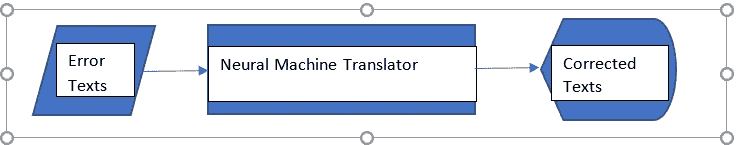

# 低资源语言语法错误处理的深度学习模型

> 原文：<https://towardsdatascience.com/deep-learning-models-for-grammatical-error-handling-in-low-resource-languages-2ac2c5d154f5?source=collection_archive---------32----------------------->

## 卡纳达语语法错误纠正个案研究

在 [Unsplash](https://unsplash.com?utm_source=medium&utm_medium=referral) 上由 [Nikhita S](https://unsplash.com/@kryptonitenicky?utm_source=medium&utm_medium=referral) 拍摄的照片

1.  介绍
2.  商业问题
3.  映射到 ML/DL 问题
4.  理解数据
5.  数据处理
6.  先决条件
7.  结构
8.  韵律学
9.  部署
10.  结论和未来工作
11.  轮廓
12.  参考

**1。简介**

*语法(语言学)*

*中的* [*语言学中的*](https://en.wikipedia.org/wiki/Linguistics) *，语法(来源于* [*古希腊语*](https://en.wikipedia.org/wiki/Ancient_Greek)*γραμματικήgrammatikḗ)中的一种* [*自然语言*](https://en.wikipedia.org/wiki/Natural_language) *是其套* [*结构上的*](https://en.wikipedia.org/wiki/Structure) *约束说话者或写作者的* [*从句*](https://en.wikipedia.org/wiki/Clause_(linguistics)) *这个术语也可以指对这样的约束条件的研究，一个领域包括诸如***[*词法*](https://en.wikipedia.org/wiki/Morphology_(linguistics)) *和* [*句法*](https://en.wikipedia.org/wiki/Syntax) *之类的领域，通常由* [*语音学*](https://en.wikipedia.org/wiki/Phonetics)*补充【维基百科】***

***缺乏大型单语或平行语料库和手工制作的语言资源的语言被称为低资源语言。在 NLP 中，与流行语言相比，这些语言很多，比如英语，它们有相对成熟的人工智能框架和工具。在这个案例研究中，我们认为卡纳达语是一种低资源语言。***

## ***卡纳达语(卡纳达语语法)***

***卡纳达语是印度西南部卡纳塔克邦人主要使用的一种语言。***

***语法是正确使用和推广语言的指南。卡纳达语语法是基于 Keshiraja 的“ **S** habdamanidarpana”(公元 1260 年)。除此之外，在“ **K** avirajamarga”和 Nagavarma II 的“ **K** avyalocana”和“ **K** arnataka Bhasha Bhushan”中提到了卡纳达语语法。***

***卡纳达语字母表中有 49 个字母。主要部分是***

1.  ***Swaras + Yogavahagalu(元音)***
2.  ***Vyanjana(辅音)***
3.  ***Nama pada(名词)***
4.  ***克里亚帕达(动词)***
5.  ***Sarvanama(代词)***
6.  ***林加语(性别)***
7.  ***Vibhakti 和 Pratyaya(客体，主体)***
8.  ***Tatsama 和 Tadbhava(梵语和本地语)***
9.  ***变调(复调)***
10.  ***Samasa(复利)***

******

***卡纳达字母(作者图片)***

*****2。商业问题*****

***业务问题是，检测文本中至少 30%的语法错误，并在合理的周转时间和最佳的 CPU 利用率内纠正它们。在低资源设置中的 GEC 系统可以用作文字处理器、帖子编辑器以及作为语言学习者的学习辅助。***

*****3。映射到机器学习问题*****

***上述业务问题可以使用统计模型、基于规则的模型和神经机器翻译模型来解决。在这个案例研究中，我们实验了一种神经机器翻译方法。***

******

***框图(图片由作者提供)***

***我们这里使用的损失函数是稀疏分类交叉熵，这是使用标签和预测的损失计算。***

*****4。理解数据*****

***我们从 IndicCorp 收集的数据集是最大的公开可用的印度语言语料库之一。***

***我们通过运行 curl wget 小部件来提取数据集。***

***我们检查了使用 head 命令提取的文本文件的前几行。***

***作者图片***

*****5。数据预处理*****

***在数据预处理中，我们需要为数据集中的每条记录构建真实的和屈折的句子对。为简单起见，我们将把来自数据集的输入文本视为原始的正确(真实)句子。由此，我们需要构建错误的句子。为了构造错误的句子，我们需要对整个数据集进行标记，并通过一个词性标注器单独解析每个句子，以获得每个标记的实体。***

***我们使用 IndicNLP[ [indicnlp](https://pypi.org/project/indic-nlp-library/) ]库来标记我们的文本。我们将结果文件传递到 POS Tagger[ [postagger](https://aclanthology.org/W11-3603.pdf) ]中。我们得到了生成的令牌以及它们的 pos 标签。***

******

***作者图片***

***使用 python 中的 regex 和 dictionary，我们根据词性生成了每个句子的词形变化，并将它们存储在单独的 pickle 文件中。***

*****产生拐点的另一种方法*****

***我们安装了 inltk[ [inltk](https://pypi.org/project/inltk/) ]库，然后使用 joblib 库和并行处理生成了原始句子的 3 个变形。这就像图像处理中的数据扩充。使用这种方法生成的句子，其中一些有屈折变化，但其他的保持不变。这种方法没有涵盖语法错误变化的所有功能点。因此，这种方法不能产生拐点。在以后的章节中，我们将讨论我们如何使用这种方法训练模型，而模型却失败了。***

*****6。先决条件*****

***本文的读者应该熟悉 Python 编程、机器学习和深度学习、TensorFlow 和构建数据驱动的应用程序的基础知识。***

*****7。架构*****

***有许多架构，在 Google Colaboratory 上对 30k 数据集进行了实验，CPU 作为硬件加速器用于数据集收集和预处理步骤，GPU 作为硬件加速器用于模型训练和预测。对于那些体系结构，语法错误处理一点也不令人满意。***

***最后，我们选择了 [Bahdanau 的附加注意力](https://arxiv.org/pdf/1409.0473.pdf)，在 TensorFlow 博客中详细介绍了机器翻译。***

***我们在编码器层使用 BPEmb 来获得子词嵌入。我们分别训练了 3 个模型***

*   ***模式 1:句子的字数<= 6\. The default parameters left as it is for the Adam optimizer. Without any regularization, the model seemed to overfit.***
*   ***Model2: The number of words in sentence <= 6\. The learning rate of the Adam optimizer was chosen to be 5e-5\. We used an l2 regularizer for the Encoder Dense layer. The predictions were average on the validation dataset***
*   ***Model3: The number of words in sentence > 6。Adam 优化器的学习速率被选择为 5e-5。我们对编码器密集层使用 l2 正则化。验证数据集上的预测也很好。***

## ***模型 1***

***我们已经训练了该模型，并且在 50 个时期内，快速获取的单批输入减少到零。因此，这是一个过拟合模型。***

******

***我们还对训练数据集中的少数记录进行了随机预测。错误被处理，但是那些从输入句子到输出没有变化的单词被随机预测。***

******

***训练预测(图片由作者提供)***

******

***验证预测(作者图片)***

## ***模型 2***

***我们已经训练了 500 个模型，并且很快地取得了不减少到零的单批输入。因此，该模型不是过拟合模型。然而，预测并不令人满意。这可能主要是由于输入数据集中的拐点数量较少，这是因为输入数据集中的拐点长度减少了。***

******

***模型 2 单批次损失(图片由作者提供)***

******

***验证数据集预测(图片由作者提供)***

*****模型 3*****

***我们已经训练了模型，整个批次的损失在 500 个时期内减少到零。因此，这是我们当前环境设置中的最佳模式。在翻译时，我们根据大部分句子长度将每个句子的最大长度限制为 10。但是该模型似乎忠实地纠正了它在给定时间点呈现的所有令牌，在较短的周转时间内实现了最佳的 CPU 利用率。***

***作者图片***

******

***验证数据集的预测(图片由作者提供)***

*****8。指标*****

***我们选择使用 BLEU 评分和 ROUGE-L 评分作为所有模型的性能指标。以下是所有模型的得分对比。***

******

***BLEU 分数比较(图片由作者提供)***

***以下是训练和验证数据集的所有三个模型的 rouge-l 分数。原始数据集的总大小为 30k。我们考虑在训练和验证集中随机抽取 100 个句子来计算 rouge-l 分数。下表总结了训练和验证数据集的 F1 分数。根据 f1 分数，我们可以得出结论，模型 3 在给定模型中表现最佳。***

******

***分数比较***

*****9。部署*****

***使用 TensorFlow API 将 translate 函数公开为 TensorFlow 中的服务。并且可以部署在 TensorFlow 服务器上。***

***以下链接加载了谷歌联合实验室**中的预测演示。*****

*** [## finetune_less_length.mp4

### 编辑描述

drive.google.com](https://drive.google.com/file/d/1YN-KYZkc-I9wM1-h8i7DABWX7ek9QczB/view?usp=sharing)  [## m3.mp4

### 编辑描述

drive.google.com](https://drive.google.com/file/d/1VOV9YmoZlH4JE8Sgm8LEG2jnXjK2dSTA/view?usp=sharing) 

**10。结论和未来工作**

我们可以得出结论，对于给定的设置，模型 3 在其余模型中表现最好。

我正在研究以下想法

*   为错误变化生成更多的平行语料库和数据集
*   超参数调谐更高级的语法概念，如短语和从句

**11。轮廓**

完整源代码可从 [Githublink2](https://github.com/jayaBalaR/casestudy2) 获得

如果您对以上任何方面有任何问题或建议，请通过 [LinkedIn](http://www.linkedin.com/in/mypage1) 与我联系

**12。参考文献**

*   [应用课程(appliedaicourse.com)](https://www.appliedaicourse.com/)
*   T21
*   [印度语言的跨语言 POS 标签(和其他工具):使用泰卢固语资源的卡纳达语实验(aclanthology.org)](https://aclanthology.org/W11-3603.pdf)，[下载| Siva Reddy](http://sivareddy.in/downloads/index.html#kannada_tools)
*   【h-its.org 
*   [注意力神经机器翻译| Text | TensorFlow](https://www.tensorflow.org/text/tutorials/nmt_with_attention#define_the_loss_function)***