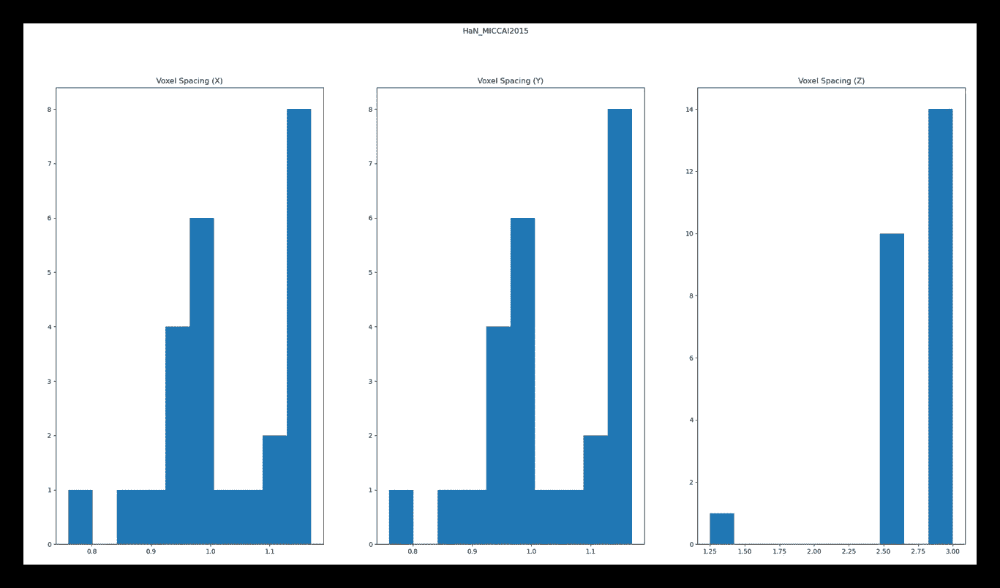
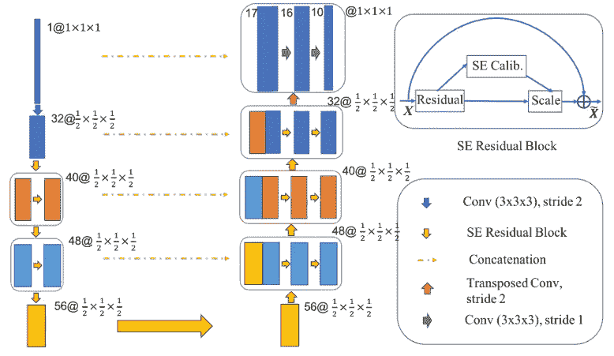
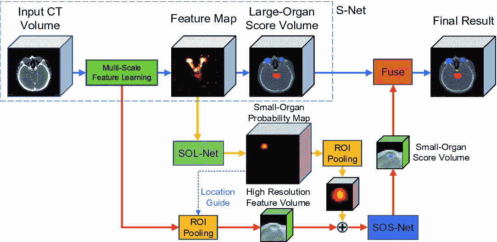
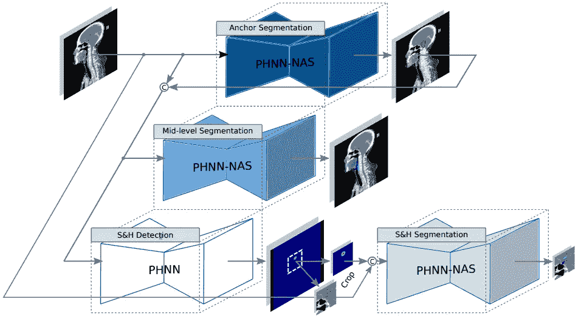
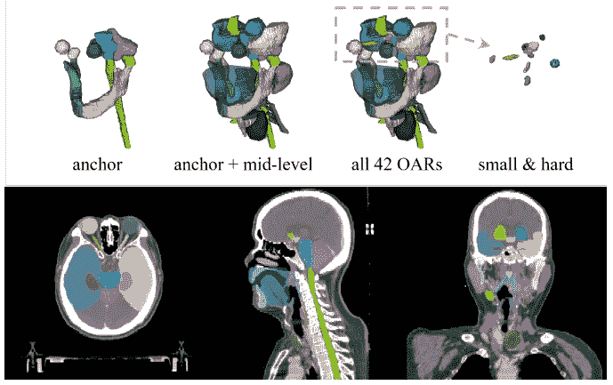
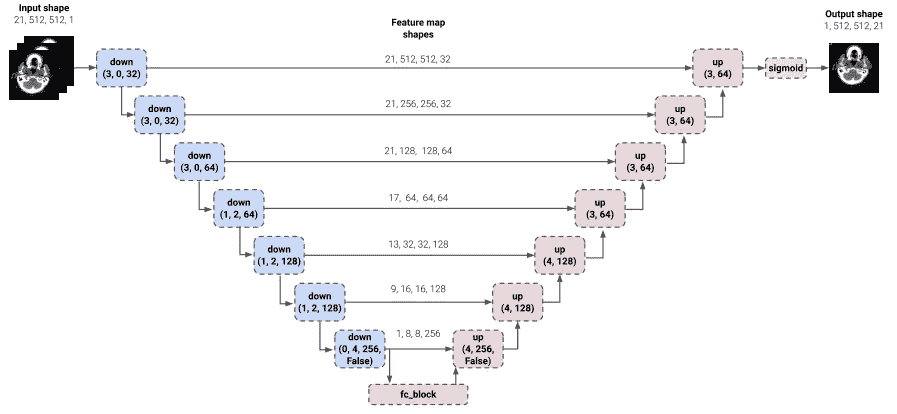

# 用于头颈部器官分割的深度学习模型

> 原文：<https://towardsdatascience.com/deep-learning-models-for-organ-segmentation-in-the-head-and-neck-region-35c0cac0657b?source=collection_archive---------52----------------------->

## 使用 MICCAI 2015 —头颈自动分割挑战赛的 CT 图像

克雷格·卡梅隆在 [Unsplash](https://unsplash.com?utm_source=medium&utm_medium=referral) 上的照片

放射治疗现在是治疗头颈部癌症的常用方法。为了确保健康的器官受到最小量的杀死肿瘤的辐射，需要将它们分段。由于在这个耗时的过程中存在注释者之间(即放射肿瘤学家之间的*)的变化，所以需要对这种器官进行自动分割。这种变化导致辐射剂量的差异，并且计划时间要求导致治疗的延迟。*

这篇文章将*比较和评论*不同的深度学习方法来自动分割这种处于危险中的器官(OAR)。我们将重点关注的模型开发领域如下

*   数据预处理
*   神经网络体系结构
*   培训方法

# 资料组

> *Ref: Raudaschl 等人*，“头颈部 ct 上分割方法的评估:2015 年自动分割挑战”。*医学物理*44.5(2017):2020–2036。

本次 [MICCAI2015 —头颈部自动分割挑战赛](http://www.imagenglab.com/wiki/mediawiki/index.php?title=2015_MICCAI_Challenge)由分为 4 类的 CT 扫描组成— *训练* (25 名患者)、*训练 _ 附加* (8 名患者)、*测试 _ 场外* (10 名患者)、*测试 _ 现场* (5 名患者)。大多数方法将训练文件夹(25+8 = 33 名患者)与 *test_offsite* 文件夹上的测试相结合。这个数据集中有 9 个桨——1 个脑器官(*脑干*，3 个视觉器官(*视交叉*，*左&右视神经*，1 个骨骼(*下颌骨*，4 个唾液腺(*左&右腮腺，左&右颌下腺*)。显示这些器官的形状和相对空间位置的视频可以在[这里](https://www.youtube.com/watch?v=W8RYqC3YZwM&feature=youtu.be)找到。该数据集的一些独特特征是

*   下颌骨(*下颌骨*)非常容易分割(*或用放射疗法术语*)，因为骨骼结构在 CT 图像中呈现出良好的对比度。
*   视觉器官非常薄，仅出现在少数 CT 切片上。因此，由于它们的小 3D 结构，它们是最难自动注释的
*   诸如脑干和唾液腺的其他器官也难以分割，因为 CT 图像具有较差的软组织对比度。人类甚至很难描绘它们，只有训练有素的专家(*在其他形式的帮助下，如*先生)才能这样做。
*   图像似乎来自不同的扫描仪，因为它们在 x、y 和 z 轴上具有不同的体素分辨率。

图:MICCAI2015 数据集在 X、Y 和 Z 方向上的体素间距直方图

# [AnatomyNet](https://aapm.onlinelibrary.wiley.com/doi/full/10.1002/mp.13300)

> 【参引:朱等，“AnatomyNet:深度学习实现头颈部解剖的快速全自动全体积分割”。2019 年*医学物理学*

图:解剖网络的神经架构(来自[医学物理学](https://aapm.onlinelibrary.wiley.com/doi/full/10.1002/mp.13300)

## 数据

与之前将大量医学体积(例如 CT 或 MR)作为 3D 补片或 2D 切片子集进行处理的方法不同，这项工作将裁剪后的 CT 体积( *~178 x 302 x 225* )输入到神经网络中。正常化 Hounsfield 单位也是惯例，但是没有提供这种预处理的指示。

## 神经架构

像大多数医学图像分割方法一样，本文也扩展了 3D UNet 神经结构。标准 3D UNet 的显著例外是编码器路径中的下采样块数。这是由于较小的视觉器官的存在，其在较低分辨率下会丢失空间信息。另一个修改是使用“*剩余压缩和激励*块，而不是标准卷积块。除了一般的“*到*到*学习有效特性*之外，不提供这些块的使用的具体说明。

## 损失函数

这项工作采用了 Dice 和病灶损失相结合的方法，其中单个器官的损失如果在特定患者数据中存在或不存在，则被掩盖。单个器官损失也基于它们在特定 3D 体积中的体素计数而被反向加权。

## 培训详情

训练使用批量大小 1，并且在训练之间从 RMSProp 优化器切换到随机梯度优化器。这些选择看起来很奇怪，因为通常情况下设置的最小批量至少为 2。由于该神经网络接受裁剪的 3D 体积，GPU 内存限制可能会阻止更高的批量大小。没有提供优化器变化的解释。对于数据扩充，作者使用仿射变换和弹性变形，尽管他们没有提供这一步的细节。这项工作使用了一个提供 24GB GPU 内存的 Nvidia Tesla P40。

## 评论

在我看来，这项工作很好地从经验上证明了额外的缩减像素采样图层对 MICCAI2015 数据集没有用。他们的消融研究将普通 3D UNet 及其变体与最终提出的网络进行了比较，为修改的贡献提供了见解。

然而，还有其他细节没有讨论，例如体素尺寸调整。在下载数据集时，我注意到体素间距在 x、y 和 z 维度上有很大的范围。标准做法是让它们达到一个共同的分辨率(以毫米为单位)，然后对它们进行学习。在培训环境中，优化器在培训期间的变化是一个不寻常的设计选择，其好处尚未讨论。此外，由于 GPU 内存限制，使用的批处理大小为 1。我的观点是，作者应该在反向传播之前探索多个样本的梯度平均。

虽然论文没有提到官方代码库，但作者的 github 包含了一个用于 [AnatomyNet](https://github.com/wentaozhu/AnatomyNet-for-anatomical-segmentation) 的库。

# 焦点网

> *参考:Kaul 等*，“Focusnet:一种基于注意力的全卷积网络用于医学图像分割”。 *2019 IEEE 第 16 届国际生物医学影像研讨会(ISBI 2019)* 。IEEE 2019

图:FocusNet 的神经架构(来自 [Springer](https://link.springer.com/chapter/10.1007/978-3-030-32248-9_92) )

## 数据

模型的输入是 3D CT 体积(如文本和相关图所理解的)，但是没有提供关于体积尺寸或体积大小调整的信息。没有给出 Hounsfield 单位标准化的指示。作者还在私有数据集上独立训练他们的模型。

## 神经架构

这项工作采用了一种独特的方法，通过为较小的视觉器官引入一个专用分支来改进分割度量。具体来说，这个架构有三个主要组件——SNet(*主分割网络*)、SOLNet ( *小物体定位网络*)和 SOSNet ( *小器官分割分支*)。SNet 分割大器官，SOLNet 为较小器官的中点提供关键点(*类似于基于深度学习的人类姿势估计*)，最后 SOSNet 使用 SNet 的 ROI 汇集特征(*由 SOLNet 的输出*引导)来分割较小器官。

与 AnatomyNet 类似，SNet 仅采用单个下采样操作，之后是挤压和激励模块(*用于通道式注意力*)。该架构的核心是复杂的卷积运算(*denseapp【1】*)，有助于获得足够的感受野大小。SOLNet 是一个简单的网络，带有两个挤压和激励模块*【2】*，用于输出以较小光学器官中点为中心的 3D 高斯图。SOSNet 使用类似的架构来输出分割图。请注意，SOSNet 通过简单地裁剪掉大量背景来帮助管理前景和背景体素计数之间的不平衡。这里一个重要的设计选择是 SOSNet 的输出大小是三个小视觉器官的平均直径的因子(=3)。

## 损失函数

类似于 AnatomyNet，该工作也使用骰子和焦点损失的组合，不同之处在于仅焦点损失被加权，并且两种损失的贡献相等。在这里，重量与每个器官的平均大小成反比。骰子损失既不加权也不掩盖。

## 培训详情

没有提供关于训练批次大小、优化器、学习率计划和训练时期的信息。读者也不知道所使用的 GPU。

## 评论

这项工作通过为较小的视觉器官引入级联结构来改进 AnatomyNet。DenseASPP 模块总体上并没有改进 FocusNet 的架构(论文中的表 3)，所以它的优势并不明显。错过的改善指标的机会可能是没有使用加权和屏蔽的骰子损失。该白皮书还遗漏了重要的实施细节，如卷大小调整、卷大小和培训细节。

没有提供官方代码库。

# 分层网络

> *参考:郭等*，“利用分层学习和神经结构搜索进行头颈癌高危器官分割”。*IEEE/CVF 计算机视觉和模式识别会议论文集*。2020.

图:分层网络的神经架构(来自 [CVF](https://openaccess.thecvf.com/content_CVPR_2020/papers/Guo_Organ_at_Risk_Segmentation_for_Head_and_Neck_Cancer_Using_CVPR_2020_paper.pdf)

## 数据

为了训练，作者使用(128，128，64)的子体积，并应用[-500，1000] Hounsfield 单位的窗口。为了从整个 ct 体积中提取子体积，要么使用以器官为中心的子体积，要么使用来自 CT 其余部分的随机样本。他们通过在 0.8 到 1.2 的比率之间随机缩放来执行缩放增强。为了测试，以(96，96，32)的步幅提取类似大小的子体积，并在相交区域对概率图进行平均。没有提供有关卷大小调整的信息。

所提出的方法也用于私有数据集中 42 个桨的自动分割。

## 神经架构

由于 CT 图像具有较差的软组织对比度，临床医生在解剖标志的基础上定义轮廓指引[4]。这项工作从临床实践中获得灵感，在预定义分类的基础上一步一步预测器官轮廓。这是从整体分割(*解剖网*或检测分割(*聚焦网*)的彻底转变。因此，首先预测下颌骨、脑干和眼睛等器官，这样它们可以作为预测中级或小而硬(S & H)类别中其他器官的锚。这些锚定器官在所有器官中具有最好的对比度，因此容易预测。对于 S & H 器官，他们使用与 FocusNet 检测中心位置相似的策略。执行这种分类的主要原因是为了在由 42 个桨组成的私有数据集上实现简单的神经网络优化(*或学习*)。3D P-HNN [3]网络被用作所有三个类别的基础。

在这种分类之上，这种神经架构还利用神经架构搜索(NAS)来为每个类别寻找 3D P-HNN 中卷积块的最佳组合。

**这个神经架构的名字是本帖作者给的。*

图:便于预测的桨的分类(来自 CVF

## 损失函数

仅使用骰子损失来训练前述分割模型，并且使用 L2 损失来训练检测分支。

## 培训详情

整流 Adam 优化器的动量为 0.9 ( *默认值*)。在 NAS 输出固定架构后，使用 12(*NVIDIA Quadro RTX 8000 = 48GB GPU 内存*)的批量和 0.01(锚和中级分支)和 0.0005 (S & H 分支)的初始学习速率。最初，只训练锚分支。然后它被冻结，中级和 S & H 分支被训练相同数量的时期。最后对整个模型进行微调。这篇文章不会深入探讨 NAS 的细节。

## 评论

就方法而言，本文作者似乎采用了一种合理的方法，解释了分层方法和 NAS 方法的贡献。在算法中复制临床实践肯定有益于最终结果，因此是一个值得称赞的想法。

这种方法的一个缺点是，他们没有报告甚至没有讨论不同随机种子的结果，这可能导致他们附录中不同的初始化。此外，批量大小为 12 以及神经架构的多个模块意味着他们利用了大量内存的 GPU 进行训练。推理也可能对 GPU 提出很高的要求，尽管在放射治疗等高级医疗选择中，这可能不是临床实践中实现的瓶颈。

没有提供官方代码库。

# DeepMindNet

> *参考:斯坦尼斯拉夫斯基等人*。"深度学习以实现用于放射治疗的头颈部解剖结构的临床可应用的分割." *arXiv 预印本 arXiv:1809.04430* (2018)。

图:DeepMindNet 的神经架构(来自 [Arxiv](https://arxiv.org/abs/1809.04430) )

## 数据

这项工作将具有全平面尺寸(H，W)的体积和相邻轴向切片的子集(相同尺寸输出的 d

## Neural Architecture

Unlike the works studied above, this method choses to downsample the inputs, though they do not include the optic chiasm in their private dataset. Each downsampling block is a combination of a series of 2D convolutions (*)以及 3D 深度方向可分离卷积作为输入。这些卷积的输出以残差块的方式与输入相加。上采样块仅包含一系列 2D 卷积。在下采样分支(*即编码器*和上采样分支(*即解码器*)之间，存在具有残差类型子块的全连接层。*

**这个神经架构的名字是由本帖作者而非原作者给出的。*

## 损失函数

打破常规，这种方法使用交叉熵损失，它只惩罚每个 OAR 遮罩的前 k%的损失值，并惩罚那些像素。作者声称，这导致了更快的训练，并有助于减轻班级不平衡的问题——例如视觉器官。

## 培训详情

Adam 优化器在初始学习率为 0.0001 的范围内使用，然后不断缩小。一批 32 个(好！)跨 32 个 GPU 使用(OMG！！)并用同步 SGD 对模型进行训练。

## 评论

这项工作更侧重于强调医学图像分割基准中使用的标准 DICE 度量如何不准确，而是提出了一种表面 DICE 度量。作者没有关注他们的神经架构背后的理由，读者只能假设他们为什么做出某些架构选择。

与其他工作相比，使用这项工作的结果较低，因为它是在使用不同 OAR 轮廓绘制方法的私有数据集上训练的。

**这项工作也没有考虑视交叉，因为它需要与 MR 图像进行图像配准以获得可接受的轮廓。*

## 韵律学

除了报告其他人所做的标准骰子分数之外，这项工作建议使用表面骰子。该度量考虑两个 2D 表面的重叠，而不是 3D 体积。这具有临床应用，因为调整轮廓的表面(*由有经验的放射治疗师/肿瘤学家*)是应用人类专业知识的地方。引用文件:—

> 例如，两个不准确的分割可能具有相似的体积 DSC 分数，如果一个在许多地方偏离正确的表面边界很小的量，而另一个在单个点具有大的偏离。纠正前者可能需要相当长的时间，因为它需要重新绘制几乎所有的边界，而后者可以更快地纠正，可能只需一次编辑操作。

# 概观

## MICCAI 2015 —测试结果

MICCAI2015 数据集的 10 幅测试图像的骰子得分

## 方法比较

建模选择的比较

# 文学中的空白

上面讨论的研究通常以下列之一作为输入:-

*   具有全平面和轴向背景的裁剪 CT 体积，即存在所有器官(例如 AnatomyNet、FocusNet)
*   具有预定义轴向背景但全平面背景的裁剪 CT 体积(例如 DeepMindNet)
*   或者具有减少的轴向和面内背景，但是附加的锚定器官背景(例如，分层网)的裁剪的 CT 子体积

这两部作品都没有讨论获得临床上可接受的指标所需的环境的影响。因此，需要深入研究如何在内存受限的 GPU 上更容易地进行神经网络训练。这将转化为在数据集(如 MICCAI2015)上使用不同子体积大小的实验，甚至是使用额外 oar 的私有数据集。

一个重要的贡献也将是引入额外的基准数据集，如在 [StructSeg，2019](https://structseg2019.grand-challenge.org/Dataset/) 中引入的数据集。

# 结论

这篇文章分析了在人体头颈部放射治疗环境中对有风险的器官进行自动分割的不同方法。miccai 2015-头颈分割挑战用作基准数据集，以了解上述方法的性能差异。带回家的信息是:-

1.  尽管 UNets 建议在编码器分支中进行下采样，但这种方法可能会对骰子分数产生负面影响。
2.  检测分割已经广泛用于分割较小的器官。
3.  理解放射治疗的临床工作流程对于创建新的神经架构和有用的度量是有用的。

最后，本文讨论了文献中的一些不足之处，希望能引发这一领域未来的思考。

# 参考

[1]杨等.【Denseaspp】用于街道场景中的语义分割。《IEEE 计算机视觉和模式识别会议论文集》。2018.

[2]胡等.【挤激网络】。IEEE CVPR，2018。

[3] Adam 等.“*用于从 CT 图像中进行病理性肺部分割的渐进和多路径整体嵌套神经网络*”医学图像计算和计算机辅助介入国际会议。施普林格，查姆，2017。

[4]Brouwer et al .“*对放疗中有风险的头颈部器官进行深度学习轮廓绘制后，在临床实践中执行的手动调整的评估*”放射肿瘤学中的物理学和成像 16(2020):54–60。