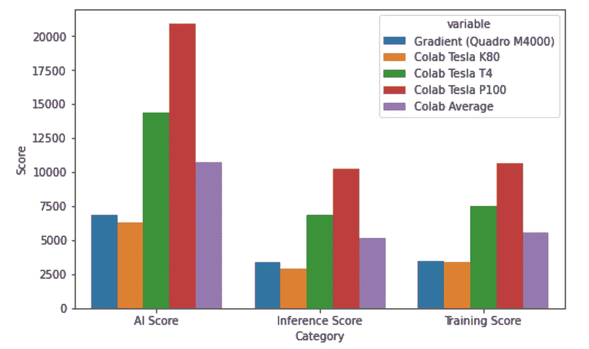

# 预算上的深度学习:这家初创公司的表现优于谷歌 Colab 吗？

> 原文：<https://towardsdatascience.com/deep-learning-on-a-budget-does-this-startup-outperform-google-colab-22b102827b55?source=collection_archive---------6----------------------->

## Google Colab 在提供免费协作笔记本电脑方面占据了统治地位，但也有竞争对手准备弥合这一差距

卡斯帕·卡米尔·鲁宾在 [Unsplash](https://unsplash.com?utm_source=medium&utm_medium=referral) 上的照片

Paperspace 是一家成立于 2014 年的创业公司，于 2018 年推出了 ML 笔记本平台 Gradient，自那以来，它已经成为一个定期更新的大型平台。它拥有面向所有人的免费 GPU，其免费实例拥有 8 个 CPU 的 30 GB CPU RAM 和 8 GB RAM 的 NVIDIA Quadro M4000。为了使其与消费级 GPU 保持一致，它的性能大约相当于 GTX 1050Ti，RAM 是大型 ML 应用的两倍。他们还有一个 8 美元/月的个人计划，免费提供一台[英伟达夸德罗 RTX 4000](https://www.techpowerup.com/gpu-specs/quadro-rtx-4000.c3336) (大约是英伟达 RTX 2060)。理论上，与 Google Colab 提供的相比，这一点非常好！

我之前写过[这篇文章](/deep-learning-on-a-budget-450-egpu-vs-google-colab-494f9a2ff0db)，深入探讨了 Google Colab 与标准消费级 GPU 的比较，概括来说，Colab 将分配一个 NVIDIA Tesla P100、T4 或 K80，与 NVIDIA RTX 2080、GTX 1070 或 GTX 960 进行比较，所有这些都具有超过 12 GB 的 RAM。乍一看，平均来说，这似乎是更强的计算能力。然而，你使用的资源越多，你越有可能只被分配到一个 K80。在我广泛使用计算资源的 15 次试验中，我只有 33%的时间被分配到比 K80 更好的 GPU。

为了测试这些平台，我使用了 [AI 基准](http://ai-benchmark.com/ranking_deeplearning.html)，这是一个 python 库，它利用 Tensorflow 在 19 个域中运行 [42 个独特的 ML 任务，为 GPU 的性能提供了一个很好的广义 AI 分数。分数越高，意味着 GPU 执行任务的速度越快。结果分为训练分数、推理(测试)分数以及被认为是人工智能分数的组合。](http://ai-benchmark.com/alpha)

因为 Gradient 每次都给出相同的 GPU，所以我运行了 5 次 AI Benchmark，在每次运行之间重新启动实例。使用 Google Colab，我运行了 15 次 AI 基准测试，以正确捕捉所提供的 GPU 中的差异。结果如下:

最终得分

这对于梯度来说看起来不太好，但是结果并没有看起来那么糟糕。是的，Google Colab 在平均分数上比 Gradient 高(10773 比 6861)，但 Gradient 有显著的优势，包括性能的标准偏差低得多(只有 333 比 1637)，这表明您可以期待相同的程序以一致的运行时和规格运行。然而，如果您使用它进行开发，并且只关心 Jupyter 笔记本的速度，那么在大多数情况下，Colab 显然会胜出。

## 其他平台差异

当然，速度不是一切，在选择平台时，您的开发环境也很重要。Gradient 比 Colab 更有优势，例如能够选择超时时间，并且拥有一个围绕部署 Jupyter 笔记本电脑即服务的生态系统(更高级的选项)。这些都不在 Colab 的范围内，谷歌将把你送到他们的 GCP 高级解决方案， [Vertex AI Workbench](https://cloud.google.com/vertex-ai/docs/workbench/user-managed/introduction) 以获得类似的可定制性和现成的渐变。

但是，还有很多缺点是我用 Colab 没有体验过的。第一个限制是一次只能运行 1 台笔记本电脑(免费版)，平台上总共只能运行 5 台。这对于从事各种项目的人来说并不理想。这是我个人的看法，但我没有发现他们的 Jupyter 编辑器直观。当一个单元格被点击进入时，Gradient 会自动将该单元格移动到页面的顶部，这在几乎所有情况下都会导致我失去对我试图查看的内容的跟踪，没有办法禁用该功能。幸运的是，它们包括一个在标准托管 Jupyter 实例中打开笔记本的选项，这个特性我非常欣赏！最后，有许多随机错误，从身份验证错误到实例不能按需提供。在大多数情况下，刷新我的登录可以解决这个问题，而且这些问题将不可避免地得到解决，但是我不能说它们没有降低用户体验。

## 结论

就目前而言，Colab 在大多数领域都独占鳌头。只要工作是实验性的(比如家庭项目)，还没有准备好部署，Colab 几乎在每个领域都胜过 Gradient。然而，Gradient 是一个正在崛起的竞争对手，它为谷歌的对手提供了一个很好的环境。这也让人感觉 Gradient 试图与 [Vertex AI Workbench](https://cloud.google.com/vertex-ai/docs/workbench/user-managed/introduction) 和 [AWS Sagemaker](https://docs.aws.amazon.com/sagemaker/latest/dg/nbi.html) 竞争，同时仍然试图通过易于设置的笔记本实例吸引 Colab 观众。出于这个原因，我将坚持使用 Colab 来完成我的大部分工作，但会关注 Gradient 的进展！

如果你喜欢这篇文章，请随时[订阅](https://jerdibattista.medium.com/subscribe)，查看[我的推荐页面](https://jerdibattista.medium.com/membership)，查看[这篇文章](/deep-learning-on-a-budget-450-egpu-vs-google-colab-494f9a2ff0db)，在那里我升级了我的旧笔记本电脑以处理现代的 ML 工作负载，或者[捐赠](https://ko-fi.com/jeremydibattista)以便我可以测试一些新的 ML 设备！