# 人类微生物组的深度学习

> 原文：<https://towardsdatascience.com/deep-learning-on-human-microbiome-7854fba815fc?source=collection_archive---------20----------------------->

## [生命科学的深度学习](https://towardsdatascience.com/tagged/dl-for-life-sciences)

## 从 DNA 序列推断样品的微生物组成

[图片来源:人类微生物组项目门户](https://hmpdacc.org/)

这是我的专栏 [**生命科学的深度学习**](https://towardsdatascience.com/tagged/dl-for-life-sciences) 的第九篇文章，我试图展示将人工神经网络应用于计算生物学和生命科学的真实世界项目的具体例子。之前，我们介绍了深度学习在[古代 DNA](/deep-learning-on-ancient-dna-df042dc3c73d) 、[单细胞生物学](/deep-learning-for-single-cell-biology-935d45064438)、[数据整合](/deep-learning-for-data-integration-46d51601f781)、[临床诊断](/deep-learning-for-clinical-diagnostics-ca7bc254e5ac)、[显微成像](/deep-learning-on-microscopy-imaging-865b521ec47c)中的一些应用，以及一些从自然语言处理(NLP)中推断现代人类基因组中[尼安德特人渗入](https://en.wikipedia.org/wiki/Interbreeding_between_archaic_and_modern_humans)区域的技术(此处为和[此处为](/lstm-to-detect-neanderthal-dna-843df7e85743))。在本文中，我们将了解为什么**人类微生物组**代表生物学中的**大数据****，以及如何训练一个**卷积神经网络(CNN)** **分类器** **用于** **预测一个** [**宏基因组学**](https://en.wikipedia.org/wiki/Metagenomics) **样本** **起始于** **中的微生物组成****

# **宏基因组学作为大数据**

**不幸的是**并不直接**开始为**生物**和**生物医学**应用开发机器学习模型，在我看来是因为**缺乏数据**。我在之前的帖子[中讨论了一些挑战，我们在生命科学中有大数据吗？](/do-we-have-big-data-in-life-sciences-c6c4e9f8645c)。在那里，我提到了生命科学中的三个方向，它们似乎对人工智能和机器学习很有前景，因为它们似乎有足够的数据量，它们是:**

1.  **单细胞组学**
2.  **显微成像**
3.  **将序列视为统计观察的基因组数据**

**后来在评论中 [Mikael Huss](https://medium.com/u/bf4c4151f086?source=post_page-----7854fba815fc--------------------------------) 建议将[宏基因组学](https://en.wikipedia.org/wiki/Metagenomics)和[微生物组](https://en.wikipedia.org/wiki/Microbiome)数据作为**第四**大数据资源。事实上，人们可以找到大量公开可用的宏基因组学数据，例如，使用伟大的 [EMBL-EBI 资源管理公司](https://www.ebi.ac.uk/metagenomics/)。**

**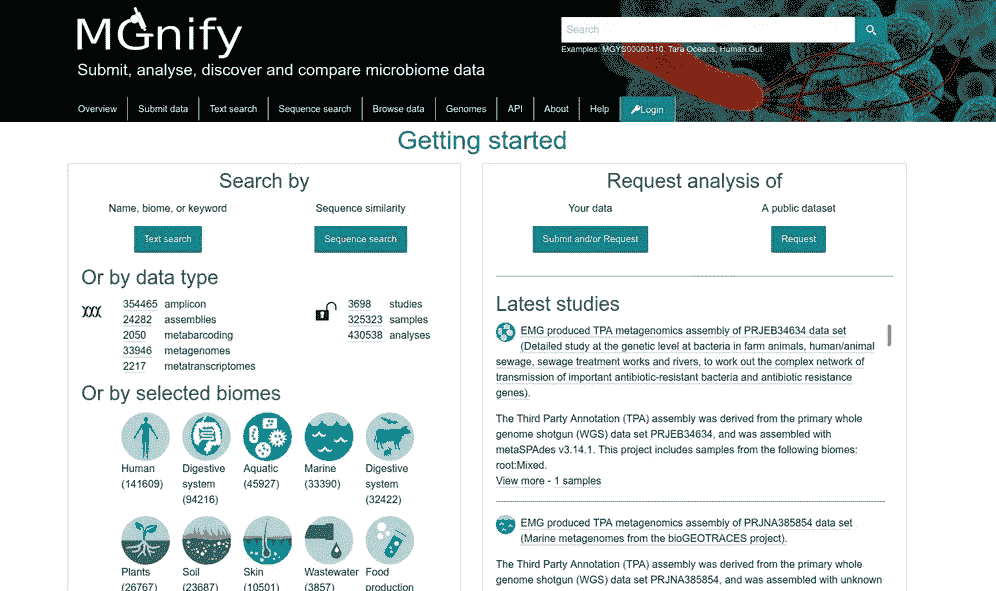**

**[图片来源:EMBL-EBI 微生物组数据资源管理中心](https://www.ebi.ac.uk/metagenomics/)**

**宏基因组学之所以能被称为大数据，是因为相对便宜的 [**鸟枪测序**](https://en.wikipedia.org/wiki/Shotgun_sequencing) ，因此成千上万的样本被测序，以及宏基因组学数据相对**低维的性质**。事实上，将测序的 DNA 片段映射到已知的**微生物生物体**通常会导致 500–1000 个**可靠地**检测到微生物，例如，与具有数百万维的[遗传变异](https://en.wikipedia.org/wiki/Genetic_variation)或[甲基化](https://en.wikipedia.org/wiki/DNA_methylation)数据相比，这并不是真正的高维数据。**

# **使用 SourceTracker 的微生物组成**

**记住**宏基因组学**为**开发机器和深度学习算法提供了大量数据**，在这篇文章中，我将尝试训练一个卷积神经网络(CNN)，它可以估计给定样本中微生物群落的**来源**。例如，从我办公室的桌子上取一份[拭子](https://en.wikipedia.org/wiki/Cotton_swab)样本，我期望在那里找到哪种微生物？它们会不会像我的**皮肤** [微生物群](https://en.wikipedia.org/wiki/Microbiota)，或者可能是我嘴里的**口腔**微生物？这个可以用一个叫[**source tracker**](https://www.nature.com/articles/nmeth.1650)的奇妙软件来估算。**

**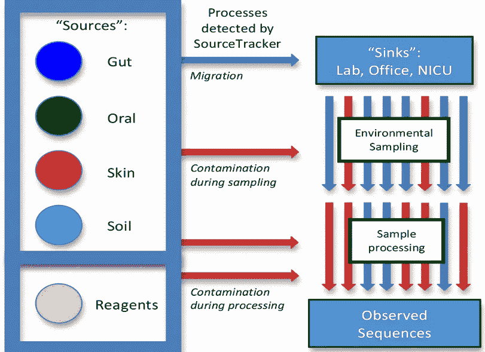**

**[骑士*等*T21【Nat 方法】8、761–763(2011)](https://www.nature.com/articles/nmeth.1650#citeas)**

**简而言之， [SourceTracker](https://www.nature.com/articles/nmeth.1650#citeas) 是一种贝叶斯版本的 [**高斯混合模型(GMM)**](https://en.wikipedia.org/wiki/Mixture_model) 聚类算法(看起来类似于 [**狄氏多项混合**](https://journals.plos.org/plosone/article?id=10.1371/journal.pone.0030126) )，它是在称为**源**的参考数据集上训练的，即不同类别，例如土壤或人类口腔或人类肠道微生物群落等，并且可以估计每个源在称为**汇**的测试样本中的比例/贡献因此，SourceTracker 算法明确地将接收器样本建模为源的**混合**。算法的**贝叶斯味道**来自于在拟合模型时使用 **Direchlet 先验**。**

**最初，SourceTracker 是针对 [16S 数据](https://en.wikipedia.org/wiki/16S_ribosomal_RNA)开发的，即仅使用 [**16S 核糖体 RNA 基因**](https://en.wikipedia.org/wiki/16S_ribosomal_RNA) 。相比之下，这里我们将尝试使用<https://en.wikipedia.org/wiki/Shotgun_sequencing>****[**宏基因组学**](https://en.wikipedia.org/wiki/Metagenomics) **数据**来训练一个分类器。此外，SourceTracker 并非设计用于**原始宏基因组序列**，而是需要以某种方式量化的微生物丰度( [OTU 丰度](https://en.wikipedia.org/wiki/Operational_taxonomic_unit))，例如通过[qime](http://qiime.org/)管道、[meta plan 2](https://huttenhower.sph.harvard.edu/metaphlan2/)或 [Kraken2](https://ccb.jhu.edu/software/kraken2/) 。相比之下，我们将在这里训练的 CNN 分类器的目标是**从** [**fastq 文件**](https://en.wikipedia.org/wiki/FASTQ_format) **预测宏基因组样本的微生物组成，而不量化微生物丰度。********

# ****人类微生物组项目(HMP)数据****

****为了训练 CNN 分类器，我们将利用巨大的 [**人类微生物组项目(HMP)**](https://www.hmpdacc.org/) 数据资源。HMP 提供了用[meta plan 2](https://huttenhower.sph.harvard.edu/metaphlan2/)量化的宏基因组分类丰度，可以从[这里](https://www.hmpdacc.org/hmsmcp2/)下载。****

****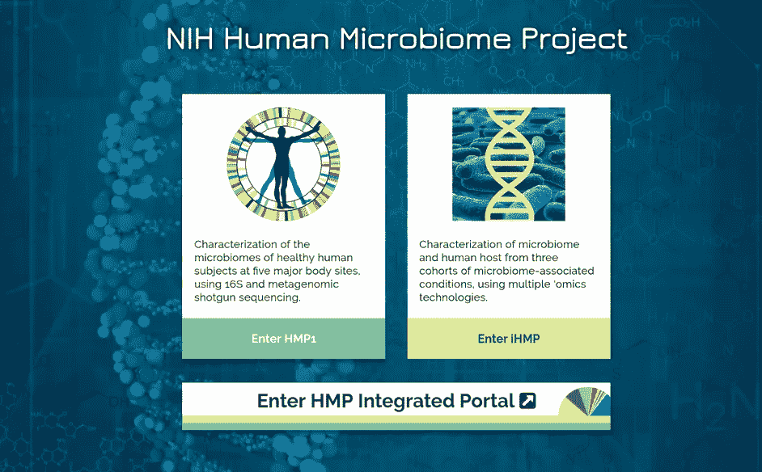****

****[人类微生物组项目(HMP)门户](https://www.hmpdacc.org/)****

****为 **4** **人类** **组织** **(微生物群落):** **口腔、肠道、皮肤和阴道**计算宏基因组学概况。下面，我们将使用微生物丰度矩阵来选择**组织特异性细菌** [**属**](https://en.wikipedia.org/wiki/Genus) ，即仅在四种组织中的**一种**中丰富的菌群，因此可以作为人体组织的**微生物制造者**。稍后，我们将使用组织特异性细菌属的**参考基因组**来训练 CNN 分类器**从** [**fastq 文件**](https://en.wikipedia.org/wiki/FASTQ_format) 中的**原始序列中识别**微生物群落(口腔、肠道、皮肤、阴道)。我们将从读取微生物丰度矩阵开始，并通过降维图( [PCA](https://en.wikipedia.org/wiki/Principal_component_analysis) 和 [tSNE](https://en.wikipedia.org/wiki/T-distributed_stochastic_neighbor_embedding) )可视化来自 4 个人体组织的样本。****

****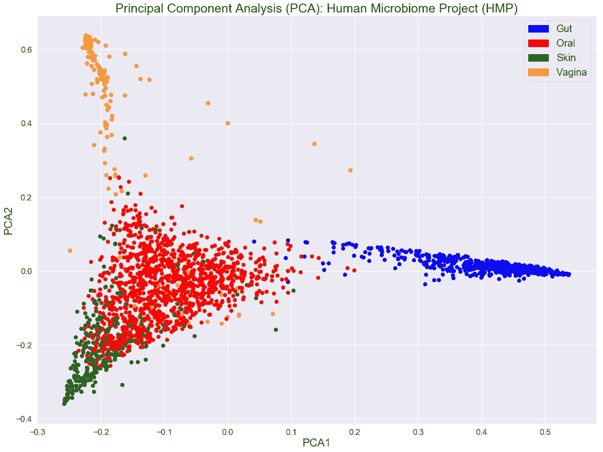****

****作者图片****

****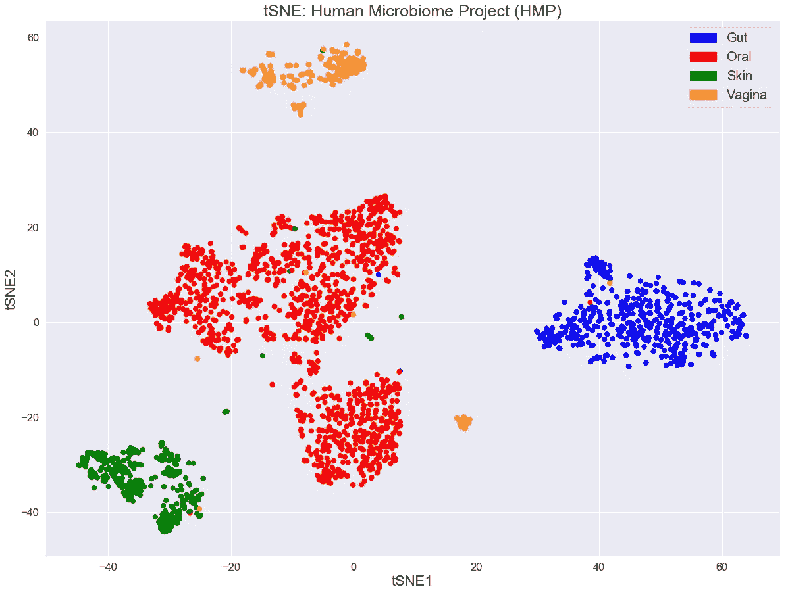****

****作者图片****

****在 PCA 和 tSNE 图中，我们可以看到，就微生物丰度而言，样品可以通过原始组织清楚地分开。这意味着训练 CNN 分类器应该是非常简单的，它可以通过检查样品中的微生物 DNA 序列来预测给定样品的来源组织。然而，为了制作 PCA 和 tSNE 图，我们使用了**微生物丰度**而不是测序数据本身，因此我们必须首先提取能够最好地分离肠道、口腔、皮肤和阴道样品的微生物。**来自最具鉴别能力的微生物的参考基因组**将在稍后用于为 CNN 分类器创建序列的**训练数据集。******

# ****选择组织特异性微生物****

****为了选择能够最好地分离****肠道、口腔、皮肤**和**阴道**样本的微生物，我们可以训练例如**随机森林**分类器，并查看**特征重要性**及其作用方向。然而，这里看起来有大量的**组织特异性**微生物，即在一个组织中丰度很高但在所有其他组织中几乎为零的微生物。例如，如果我们观察**副溶血性嗜血杆菌**在微生物丰度数据框架中的指数为 1950，那么**看起来非常具有口腔特异性**:******

****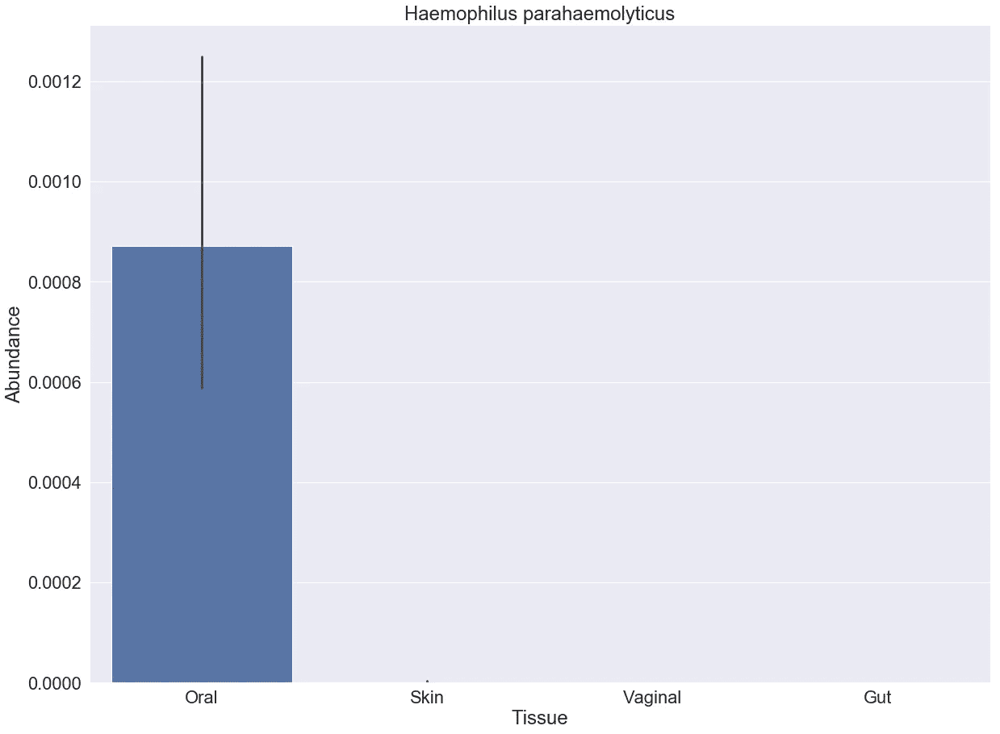****

****作者图片****

****下面，为了简单起见，我们将只集中在 [**细菌微生物**](https://en.wikipedia.org/wiki/Bacteria) 上，即[古菌](https://en.wikipedia.org/wiki/Archaea)和[病毒](https://en.wikipedia.org/wiki/Virus)将被忽略，只有在 HMP 数据集**中分类在 [**属级**](https://en.wikipedia.org/wiki/Genus) 上的细菌生物将被保留**用于进一步分析。我们将建立**组织特异性细菌属**的列表，并将它们的名称用于**、来自**[**ref seq NCBI**](https://www.ncbi.nlm.nih.gov/refseq/)**数据库**的“grepping”细菌参考基因组。因此，这里我们将微生物丰度的总矩阵细分为细菌属丰度，我们可以看到在 HMP 项目中有 **227 个细菌属**。接下来，我们将检查所有 HMP 细菌属，并按照**简单标准**建立**口腔-、** **皮肤-、** **阴道-** 和**肠道特异性**属的列表:如果一个细菌属在一个组织中的**比所有其他组织多 10 倍，则该属被认为是组织特异性的。******

**组织特异性的简单标准**为我们提供了 **61 种口腔特异性、53 种肠道特异性、49 种皮肤特异性和 16 种阴道特异性细菌属**。让我们从 4 种组织中选择一些组织特异性属，并观察其丰度:****

**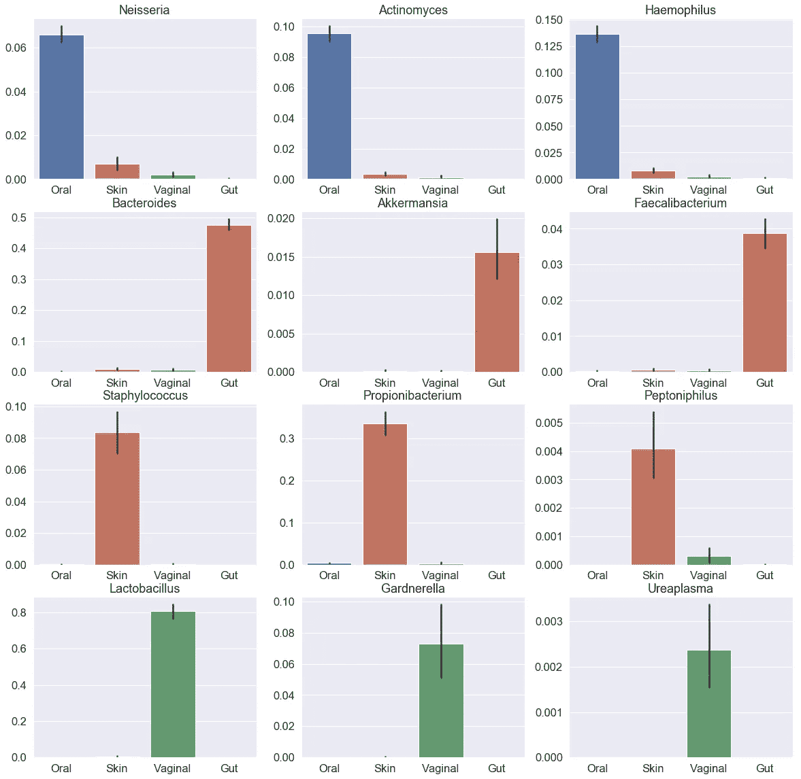**

**作者图片**

**上面，我们可以清楚地看到，我们设法挑选了非常强的组织特异性细菌属标记。**阴道的**最少，为 16 个组织特异性属。然而，**仔细观察**，可以发现其中包括**伯克霍尔德菌属、罗尔斯顿菌属、博德特氏菌属**等可疑且极有可能是 [**PCR 试剂污染物**](https://bmcbiol.biomedcentral.com/articles/10.1186/s12915-014-0087-z) 。因此，我们仔细检查了 16 个阴道特异性细菌属的列表，由于不同的原因，我们可以确信其中只有 12 个**具有阴道特异性。因此，为了在用于分类分析的组织之间保持平衡，**我们将为 4 种组织中的每一种选择 12 种最具组织特异性的标记**，这里是我们挑选的细菌属:****

**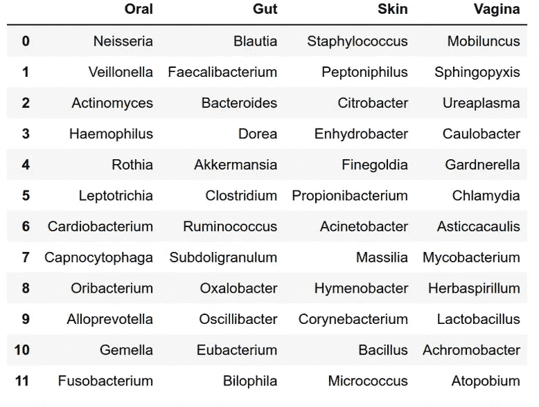**

**作者图片**

**经过一番思考，我决定**将** [**链球菌**](https://en.wikipedia.org/wiki/Streptococcus) **排除在**口腔特有属列表之外。尽管链球菌属似乎是口腔特有的，但它也包括在其他组织如肠道中大量存在的种类。这可能会混淆 CNN 分类器，因为如果我们 grep 链球菌的参考基因组，我们将会得到太多来自**肠道特异性链球菌物种**的“污染”序列，然而如果假设链球菌是口腔特异性属，则会得到错误的口腔标签。请在本文的[完整笔记本](https://github.com/NikolayOskolkov/DeepLearningMicrobiome)中查看更多详细信息。**

**我们可以检查选择的微生物属可以相当好地分离口腔、肠道、皮肤和阴道样品。为此，让我们基于样品之间的[**【Spearman】**](https://en.wikipedia.org/wiki/Spearman%27s_rank_correlation_coefficient)**相关性距离并使用 48 个选定的微生物属(4 个组织中的每一个 12 个)来运行快速**聚类**。****

****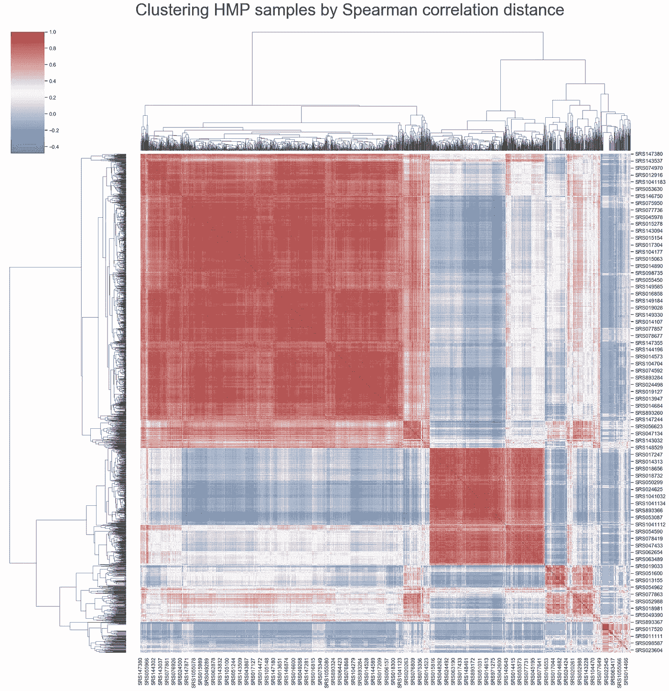****

****作者图片****

****我们清楚地观察到对应于来自 HMP 项目的口腔、肠道、皮肤和阴道样品的 4 个集群。最大的聚类是口腔样本，而第二大聚类对应于肠道 HMP 样本。****

# ****准备数据和训练 CNN 分类器****

****现在我们将使用所选的 48 个组织特异性细菌属的名称，从 [**RefSeq NCBI**](https://www.ncbi.nlm.nih.gov/refseq/) 数据库中提取所有相应的物种和菌株参考基因组 id。下面的片段演示了如何下载和提取与 48 个挑选的组织特异性属相对应的组织特异性物种和菌株的参考基因组 id。为此，我们将使用一个名称-引用-id 匹配文件 **MapBactName2ID.txt** ，可以从 my [**github**](https://github.com/NikolayOskolkov/DeepLearningMicrobiome) 下载。该文件是通过提取参考基因组的标题并将它们的文件名(GCF-id)与标题匹配而构建的。****

****现在，当我们有了对应于组织特异性属的**参考基因组(fasta-files)id**时，我们可以**切片**参考基因组并创建 4 组序列(例如 **80 nt 长的**)，每组对应于口腔、肠道、皮肤和阴道微生物属的**标签为 0、1、2 和 3。在下面的循环中，我们首先为 4 个组织**中的每一个读取带有**fasta id****的文件，然后为每个 fasta id 读取 fasta 文件并选择长度为 80 nt 的随机 **3000** 序列。在运行过程中，我们还将**删除包含 N、H、M 和其他非规范核苷酸的序列**，并将我们自己限制为仅包含 A、C、T 和 G 的序列。******

**一旦我们创建了一个标记序列的数据集，其中每个序列都有一个对应于口腔、肠道、皮肤和阴道的标签 0、1、2 或 3，我们就必须将这些序列转换为 **one-hot-encoded tensor (3 维 numpy array)** ，它可以被深度学习算法(如 1D CNN)读取。接下来，我们还将把一个热编码的序列分成**训练**和 测试 子集。**

**最后，让我们写下一个简单的 1D CNN 架构，并开始训练分类器识别对应于口腔、肠道、皮肤和阴道微生物群落的 4 个类别的序列模式。**

**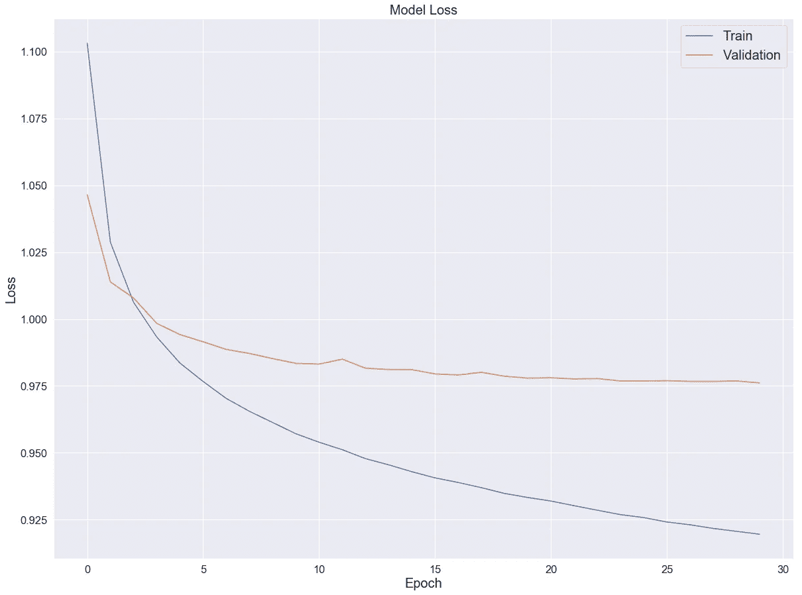**

**作者图片**

**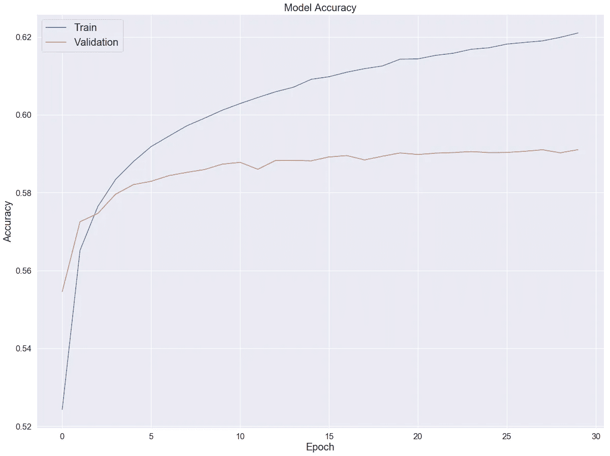**

**作者图片**

**检查网络是否已经学会对序列进行分类的最佳方式是在新的**测试集**上评估其性能，该测试集由它在训练期间根本没有观察到的数据组成。这里，我们**评估测试集上的模型，并将结果绘制为混淆矩阵**。**

**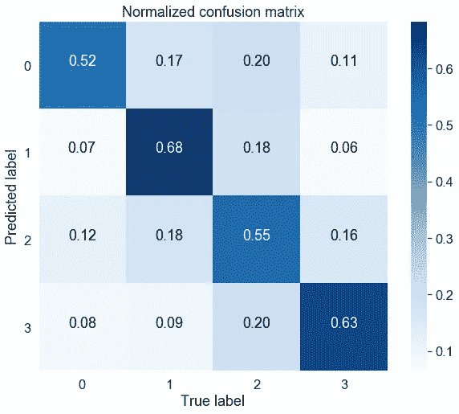**

**作者图片**

**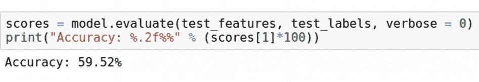**

**作者图片**

****混淆矩阵**的图形表示是蓝色的热图，展示了一种**块状** **结构**，暗示我们的 1D CNN 分类器能够相当好地区分 4 种微生物类别。60% 的总体平均评估**准确度乍一看似乎很低，因为我们的思维集中在一个二进制分类问题上，其中一个随机分类器可以给出 50%的基本准确度。因此，我们 60%的结果可能比随机分类器好一点点。但是，请记住**我们在这里处理的是****的** **，因此**一个随机分类器应该给我们 25%** (可以通过模拟来确认，此处未显示)的平均准确度，根据样本大小的不同，**的标准偏差约为 5-10%**。因此， **60%的准确度明显高于随机分类器**预期的基础 25%** **。此外，下面我们将使用经过训练的分类器，通过从数以千计的 DNA 序列**中对预测 **进行**平均，获得微生物群落对宏基因组样本贡献的粗略估计。假设分类器的 60%的准确性允许对大多数序列进行正确的预测，即使不是所有的序列都会被正确分类，这仍然会给我们一个很好的**直觉**关于样品来自什么微生物群落(口腔、肠道、皮肤或阴道)。********

# 预测微生物的组成

在这里，我们将检查经过训练的 CNN 分类器是否可以用于**推断随机宏基因组样本的微生物组成**。为此，我们将挑选随机宏基因组 fastq 文件(来自 HMP、 [MGnify](https://www.ebi.ac.uk/metagenomics/) 或 [DIABIMMUNE](https://diabimmune.broadinstitute.org/diabimmune/three-country-cohort) 数据库)，对每个宏基因组序列进行预测，并呈现分配给四个类别(口腔、肠道、皮肤和阴道)的序列的**部分，这将大致对应于每个样品中存在的微生物群落的部分(**微生物组成**)。让我们从 HMP 项目的几个样本开始。我知道我们使用 HMP 丰度来选择组织特异性微生物标记(**我们没有使用原始测序数据，尽管**)，使用 HMP fastq 文件来推断它们的微生物组成可能会有偏差。然而，这是一个好的开始，至少如果 CNN 分类器在 HMP 样本上失败，很难期望它在独立样本上表现良好。稍后，我们将使用来自 HMP 项目以外的真正独立的宏基因组样本来重复这一推论。在下面的循环中，我读取了 **HMP fastq-files** (我从口腔、肠道(粪便)、皮肤和阴道[拭子](https://en.wikipedia.org/wiki/Cotton_swab)中随机选取了 2 个样本， **one-hot-encode** 它们的序列，并使用训练过的 CNN 分类器**运行**预测。接下来，我选择最可靠的预测，其中一个微生物群落有至少 80%的概率。最后，我绘制了分类器分配给每个微生物群落的序列片段。**

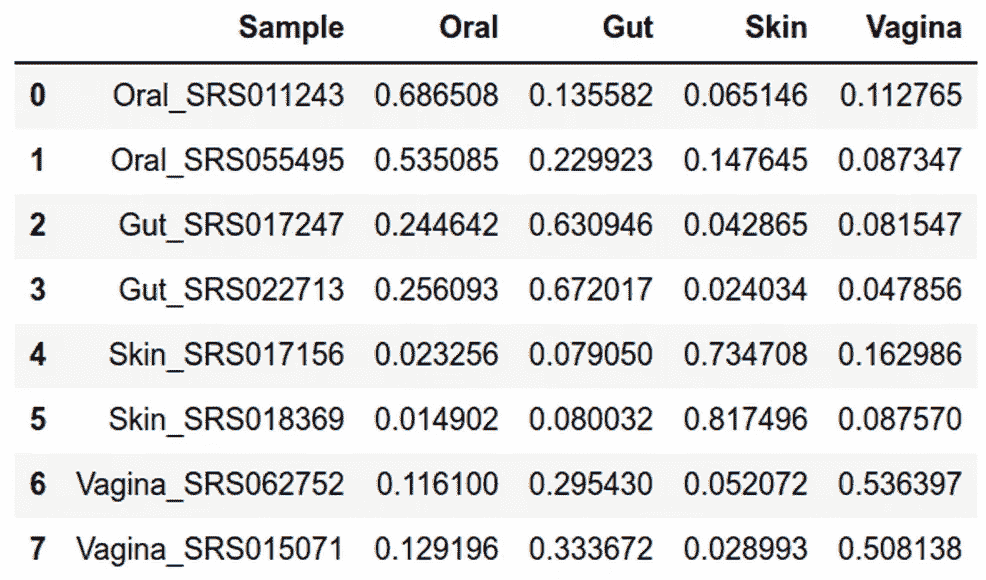

作者图片

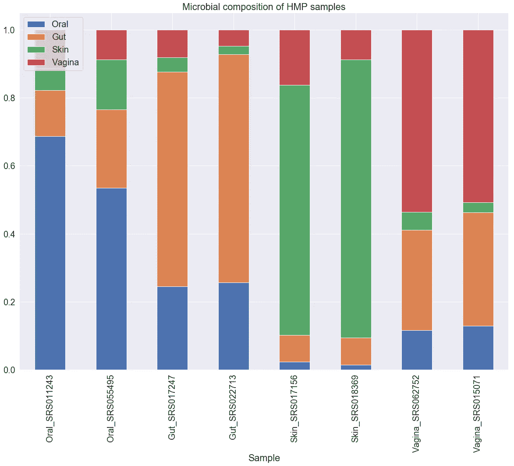

作者图片

我们可以看到，对于每个随机 HMP 样本，我们都得到了相当好的预测**，即**前两个看起来很像口腔**样本，因为口腔微生物(蓝条)构成了大多数微生物群落，而后两个看起来像肠道样本等。标签“口服 _”、“肠道 _”等。对于上图底部的每个样本，指出在 HMP 项目中收集样本的**真实组织**。**

总之，我们使用 HMP 项目中不同组织中丰富的微生物参考基因组序列训练了一个 CNN 分类器。之后，我们继续在几个随机的 HMP 样本上评估模型。你大概可以在这里看到**一个可能的问题**。一方面，当训练 CNN 分类器时，我们没有使用来自 HMP 样本的**原始序列，而是使用 HMP 数据中最丰富的属的参考基因组。另一方面，仍然有一个**信息泄露**，因为我们仍然使用**相同的项目**(尽管不同类型的数据)进行训练和测试。因此，评估可能仍然有偏见，看起来好得不真实。为了进行更好的评估，我们将从宏基因组学项目中随机挑选 8 个与 HMP 无关的口腔、肠道、皮肤和阴道样本。**

现在，我们将对一些与 HMP 样品不同的宏基因组样品进行微生物组成推断。**粪便/肠道**样本可以从 [**糖尿病**](https://diabimmune.broadinstitute.org/diabimmune/three-country-cohort) **e** 项目中获取，这里是[文件](https://diabimmune.broadinstitute.org/diabimmune/three-country-cohort/resources/metagenomic-sequence-data)。**口腔**宏基因组样本从 [**WGS 口腔微生物组**](https://www.ebi.ac.uk/metagenomics/studies/MGYS00005592) 项目下载，这里有[文件](https://www.ebi.ac.uk/ena/browser/view/PRJEB36291?show=reads)和[出版物](https://bmcmicrobiol.biomedcentral.com/articles/10.1186/s12866-020-01801-y)。**皮肤**样本从 [MGnify](https://www.ebi.ac.uk/metagenomics/studies/MGYS00005533) 资源下载，该资源由 **EBI** 提供，来自项目“[农村和城市环境](https://www.ebi.ac.uk/metagenomics/studies/MGYS00005533)中儿童和青少年的皮肤微生物群模式不同”，文件可从[此处](https://www.ebi.ac.uk/ena/browser/view/PRJEB14627?show=reads)获得。**阴道**拭子样本在 [**MOMS-PI**](https://www.ebi.ac.uk/metagenomics/studies/MGYS00005266) 项目中排序，可以从[这里](https://www.ebi.ac.uk/ena/browser/view/PRJNA326441?show=reads)检索。

我们将对非 HMP 样本应用与上述 HMP 样本相同的循环，只有**一处不同**。我们需要始终控制在应用概率截止值(这里是 90%)后，我们仍然得到足够的序列来计算微生物群落的比例。这里我要求，如果我们没有至少 500 个序列(这对于一些随机的非 HMP 样本是真实的，因为它们的测序深度低)，概率阈值将从 0.9 降低到 0.6。

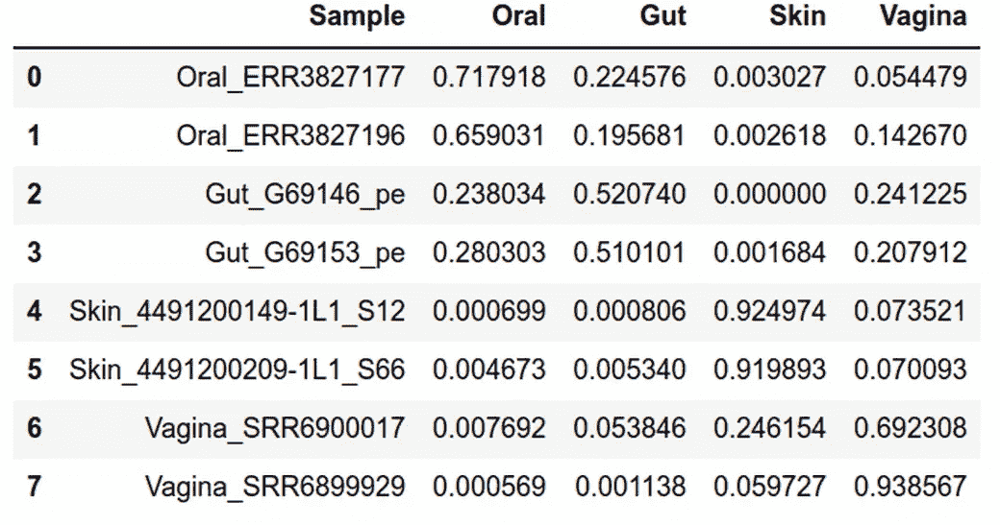

作者图片

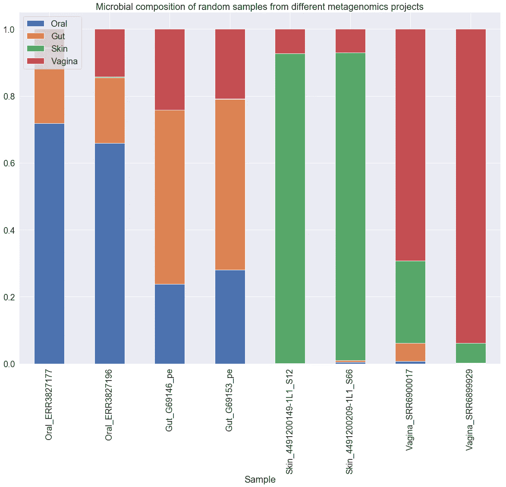

作者图片

在这里，我们再次看到对 8 个非 HMP 样本中的微生物组成的预测**与样本所来自的真实口腔、肠道、皮肤和阴道微生物群落相当一致**。干得好！我们训练过的 CNN 分类器可能可以对任何给定样品的微生物组成提供有意义的估计。

# 摘要

在本文中，我们了解到**宏基因组学**代表了一种适用于**机器和深度学习**分析的大数据。我们利用了来自**人类微生物组项目(HMP)** 的宏基因组学数据，并开发了一个 1D CNN 分类器，该分类器可以从标准 **fastq** 数据格式的**原始序列**开始，成功预测不同微生物群落(**口腔、肠道、皮肤或阴道**)对给定样本的贡献，而无需对微生物丰度进行量化。与使用 **SourceTracker** 的标准微生物组成推断相比，该方法可能具有优势。

像往常一样，让我在评论中知道你最喜欢的**生命科学**领域，你希望在深度学习框架内解决这个问题。在 Medium [关注我，在 Twitter @NikolayOskolkov 关注我，在 Linkedin](https://medium.com/u/4bcf4e21313e?source=post_page-----7854fba815fc--------------------------------) 关注我。完整的 Jupyter 笔记本可以在我的 [github](https://github.com/NikolayOskolkov/DeepLearningMicrobiome) 上找到。我计划写下一篇关于**如何用深度学习**及时预测人口规模的帖子，敬请关注。