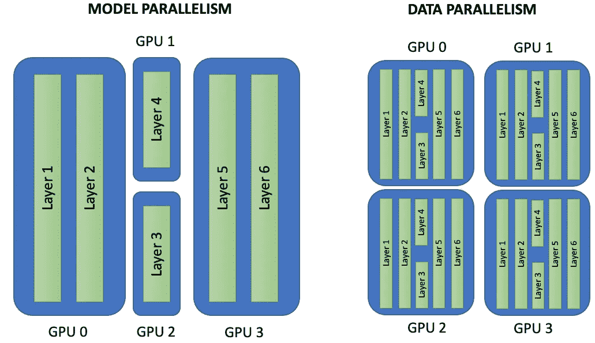
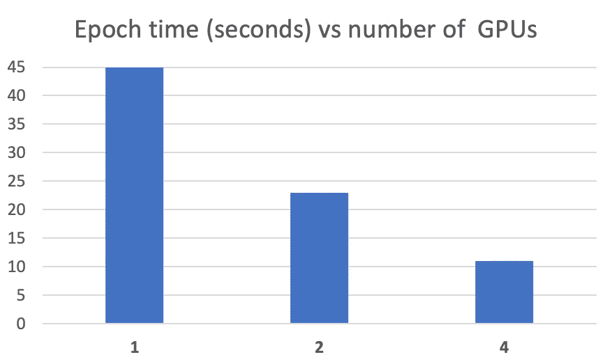
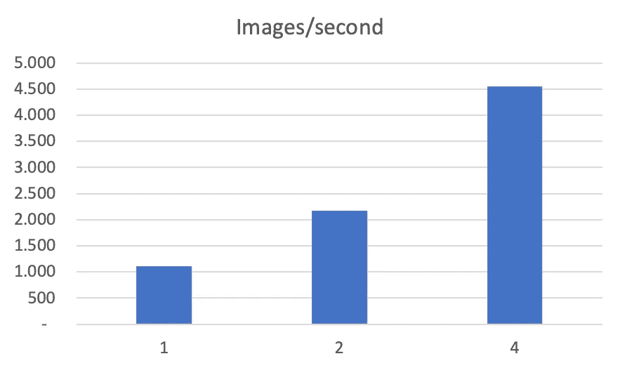
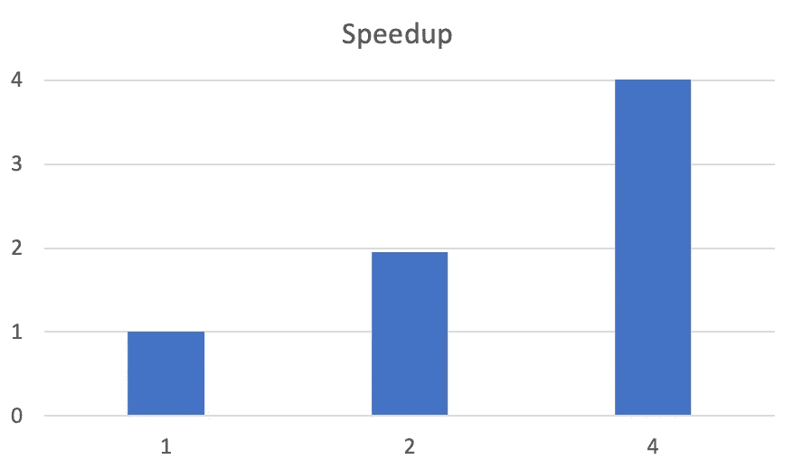

# 超级计算机上的深度学习

> 原文：<https://towardsdatascience.com/deep-learning-on-supercomputers-96319056c61f?source=collection_archive---------17----------------------->

## [理解大数据](https://towardsdatascience.com/tagged/making-sense-of-big-data)

## 关于如何在 BSC 的 CTE-Power 集群中扩展深度学习应用的实践


([图片来自 bsc.es](https://www.bsc.es/news/bsc-news/marenostrum-4-power9-racks-begin-operation-high-expectation-ai-based-research) )

> **这篇文章将作为 PATC 课程** [大数据分析简介](https://www.bsc.es/education/training/patc-courses/online-patc-introduction-big-data-analytics)**[**BSC**](https://bsc.es/)的文档**

**在[之前的帖子](/artificial-intelligence-is-a-supercomputing-problem-4b0edbc2888d)中，我们展示了超级计算机是人工智能进步的关键组成部分，过去几年推动有效计算变化的是算法的并行化和分布的增加。**

**这篇文章将展示如何使用这些超级计算机；特别是 BSC 的 CTE-POWER 集群，因为每台服务器都有两个 CPUs IBM Power9 和四个 NVIDIA V100 GPUs。**

> **在这一系列的帖子中，我们将使用 TensorFlow 框架；不过[py torch 代码中的代码并没有太大区别](/tensorflow-or-pytorch-146f5397278a)。我们将使用 Keras API，因为自从 Tensorflow 2.0 发布以来，`tf.keras.Model` API 已经成为构建神经网络的主要方式，尤其是那些不需要定制训练循环的神经网络。**

# **1 — BSC 的 CTE 电力集群**

## **1.1 系统概述**

**[CTE-POWER 是一个基于 IBM Power9 处理器的集群](https://www.bsc.es/user-support/power.php)，拥有 Linux 操作系统和 Infiniband 互联网络。CTE 电力公司有 54 台计算服务器，每台都:**

*   **2 个 IBM Power9 8335-GTG @ 3.00GHz (20 个内核和 4 个线程/内核，每个节点总共 160 个线程)**
*   **512GB 主内存分布在 16 个 dimms x 32GB @ 2666MHz 中**
*   **2 块固态硬盘 1.9TB 作为本地存储**
*   **2 个 3.2TB NVME**
*   **4 个 GPU NVIDIA V100 (Volta)，带 16GB HBM2。**
*   **单端口梅兰诺克斯 EDR**
*   **通过一条 10 千兆位光纤链路连接 GPFS**
*   **操作系统为红帽企业版 Linux Server 7.4。**

****

**超级计算机 Marenostrum——巴塞罗纳超级计算中心的 POWER-CTE 集群(图片由作者提供)**

**有关其特性的更多详细信息，可在 [CTE-POWER 用户指南](http://More details of its characteristics can be found in the user's guide and also in the information of the manufacturer of the ACXXX servers)以及 [AC922 服务器](https://www.redbooks.ibm.com/redpapers/pdfs/redp5472.pdf)制造商的信息中找到。**

**为执行我们的代码从集群中分配资源将从使用您的帐户的一个登录节点在集群中进行`ssh`登录开始:**

```
$ssh user@loginnode.bsc.es
```

## **1.2 热身示例:MNIST 分类**

**为了方便起见，我们将考虑[与之前在 Jupyter 笔记本](https://github.com/jorditorresBCN/PATC-2021/blob/main/PATC_2021_Hands_on_1_GettingStarted_DL.ipynb)中编程的前一类中用于分类 MNIST 数字的神经网络相同的神经网络:**

```
import tensorflow as tf 
from tensorflow import kerasimport numpy as np
import matplotlib.pyplot as plt
print(tf.__version__)from tensorflow.keras import Sequential
from tensorflow.keras.layers import Conv2D
from tensorflow.keras.layers import MaxPooling2D
from tensorflow.keras.layers import Dense
from tensorflow.keras.layers import Flattenmodel = Sequential()
model.add(Conv2D(32, (5, 5), activation=’relu’, 
          input_shape=(28, 28, 1)))
model.add(MaxPooling2D((2, 2)))
model.add(Conv2D(64, (5, 5), activation=’relu’))
model.add(MaxPooling2D((2, 2)))
model.add(Flatten())
model.add(Dense(10, activation=’softmax’))
model.summary()from keras.utils import to_categorical
mnist = tf.keras.datasets.mnist(train_images, train_labels), (test_images, test_labels) = mnist.load_data(path=’/gpfs/projects/nct00/nct00002/basics-utils/mnist.npz’)train_images = train_images.reshape((60000, 28, 28, 1))
train_images = train_images.astype(‘float32’) / 255test_images = test_images.reshape((10000, 28, 28, 1))
test_images = test_images.astype(‘float32’) / 255train_labels = to_categorical(train_labels)
test_labels = to_categorical(test_labels)model.compile(loss=’categorical_crossentropy’,
              optimizer=’sgd’,
              metrics=[‘accuracy’])model.fit(train_images, train_labels, batch_size=100, 
          epochs=5, verbose=1)test_loss, test_acc = model.evaluate(test_images, test_labels)print(‘Test accuracy:’, test_acc)
```

**这将是代码`MNIST.py`(可在 GitHub 获得[)，我们将使用它作为第一个案例研究来展示如何在 CTE 超级计算中启动程序。](https://github.com/jorditorresBCN/PATC-2021/blob/main/MNIST.py)**

## **1.3 软件堆栈**

**重要的是要记住，我们需要加载构建应用软件栈环境的所有模块。在运行相应的`.py`代码之前，可以用命令`module load`来完成。**

**在我们的案例研究中，我们需要包含所需库的以下模块:**

```
**module load** gcc/8.3.0 cuda/10.2 cudnn/7.6.4 nccl/2.4.8 tensorrt/6.0.1 openmpi/4.0.1 atlas/3.10.3 scalapack/2.0.2 fftw/3.3.8 szip/2.1.1 ffmpeg/4.2.1 opencv/4.1.1 python/3.7.4_MLpython MNIST.py
```

**如果我们想要分离*标准输出*和*标准错误*消息，我们可以添加这个参数`2>err.txt`:**

```
python MNIST.py 2>err.txt
```

**重定向*标准错误*允许我们看到训练的结果，该结果通过*标准输出*给出 Keras，而没有与执行环境相关的信息；**

```
Epoch 1/5
600/600 [======] - 2s 3ms/step - loss: 0.9553 - accuracy: 0.7612
Epoch 2/5
600/600 [======] - 1s 2ms/step - loss: 0.2631 - accuracy: 0.9235
Epoch 3/5
600/600 [======] - 2s 3ms/step - loss: 0.1904 - accuracy: 0.9446
Epoch 4/5
600/600 [======] - 2s 3ms/step - loss: 0.1528 - accuracy: 0.9555
Epoch 5/5
600/600 [======] - 2s 3ms/step - loss: 0.1288 - accuracy: 0.9629
313/313 [======] - 1s 2ms/step - loss: 0.1096 - accuracy: 0.9671Test accuracy: 0.9671000242233276
```

**嗯，我们的代码是在 login 节点中执行的，该节点与来自试图向 SLURM 系统提交作业的用户的其他作业共享，但是我们真正需要的是为我们的代码分配资源。怎么才能做到呢？**

## **1.4 如何使用 SLURM 分配计算资源**

**为了在 CTE-POWER 中运行代码，我们使用了一个 [SLURM 工作负载管理器](https://slurm.schedmd.com)。这里有一本非常好的[快速入门用户指南](https://slurm.schedmd.com/quickstart.html)。我们有两种方法来使用它:`sbatch`和`salloc`命令。**

**提交工作的方法我们将直接使用 SLURM `sbatch`命令。`sbatch`向 Slurm 提交一个批处理脚本。批处理脚本可以通过命令行上的文件名(`.sh`文件)交给`sbatch`。批处理脚本可能包含在脚本中任何可执行命令前带有`#SBATCH`的选项。一旦到达脚本中的第一个非注释非空白行，`sbatch`将停止进一步处理`#SBATCH`指令。**

**`sbatch`脚本成功传输到 Slurm 控制器并分配了一个 SLURM 任务 ID 后，立即退出。批处理脚本不一定会立即被授予资源，在它所需的资源变得可用之前，它可能会在待定作业队列中等待一段时间。**

**默认情况下，*标准输出*和*标准误差*都指向以下文件:**

```
#SBATCH --output=MNIST_%j.out
#SBATCH --error=MNIST_%j.err
```

**其中“%j”被替换为工作分配号。该文件将在作业分配的第一个节点上生成。当批处理脚本的任务分配最终被批准时，Slurm 在已分配节点集中的第一个节点上运行批处理脚本的单个副本。**在以下章节中，我们将介绍其他参数。****

**在我们案例研究中，分配 1 个 GPU 节点的作业脚本示例如下所示(`[MNIST.sh](https://github.com/jorditorresBCN/PATC-2021/blob/main/MNIST.sh)` [](https://github.com/jorditorresBCN/PATC-2021/blob/main/MNIST.sh)):**

```
#!/bin/bash
#SBATCH --job-name="MNIST"
#SBATCH -D .
#SBATCH --output=MNIST_%j.out
#SBATCH --error=MNIST_%j.err
#SBATCH --nodes=1
#SBATCH --ntasks=1
#SBATCH --cpus-per-task=40
#SBATCH --gres=gpu:1
#SBATCH --time=00:10:00module load gcc/8.3.0 cuda/10.2 cudnn/7.6.4 nccl/2.4.8 tensorrt/6.0.1 openmpi/4.0.1 atlas/3.10.3 scalapack/2.0.2 fftw/3.3.8 szip/2.1.1 ffmpeg/4.2.1 opencv/4.1.1 python/3.7.4_MLpython MNIST.py
```

**你可以参考[这个官方页面文档来了解我们可以在前面有`#SBATCH`的批处理脚本中使用的所有选项](https://slurm.schedmd.com/sbatch.html)。**

**这些是使用 SLURM 提交和监控作业的基本指令，我们将在我们的案例研究中使用:**

*   **`sbatch <job_script>`向队列系统提交作业脚本。**
*   **`squeue`显示所有已提交的作业及其`<job_id>`。**
*   **`scancel <job_id>`从队列系统中删除作业，取消进程的执行(如果它们仍在运行)。**

> **在 SLURM 中运行任务的另一种方法是使用`[salloc](https://slurm.schedmd.com/salloc.html)` [命令](https://slurm.schedmd.com/salloc.html)。它用于为作业实时分配资源。通常，这用于分配资源和生成 shell。然后使用 shell 执行`srun`命令来启动并行任务。更多使用细节可以在[这里](/using-supercomputers-for-deep-learning-training-3f9cc3f51d3)找到。**

**总之，这可以是命令行序列及其执行的预期输出的示例:**

```
[CTE-login-node ~]$ sbatch MNIST.sh
Submitted batch job 4910352[CTE-login-node ~]$ squeue
JOBID    PARTITION  NAME    USER    ST TIME  NODES  NODELIST
4910352  main       MNIST   userid  R  0:01  1      p9r1n16[CTE-login-node ~]$ ls
MNIST.py
MNIST.sh
MNIST_4910352.err
MNIST_4910352.out
```

***标准输出*和*标准误差*分别指向文件`MNIST_4910355.out`和`MNIST_4910355.err`。我建议读者在继续之前检查这些文件。这里，数字`4910352`表示由 SLURM 分配给作业的作业 id。**

# **2 —分布式和并行训练深度学习的基本概念**

> ***“具有计算规模的方法是人工智能的未来”* *—强化学习之父里奇·萨顿(* [*视频 4:49*](https://www.youtube.com/watch?v=EeMCEQa85tw) *)***

**深度神经网络(DNN)的成功基于建立高学习能力模型，这些模型具有以数据驱动方式调整的数百万个参数。这些模型是通过处理数百万个例子来训练的，因此更精确的算法的开发通常受到训练它们的计算设备的吞吐量的限制。**

## **2.1 性能指标:加速、吞吐量和可伸缩性**

**为了使培训过程更快，我们需要一些性能指标来衡量它。这些系统中的术语*性能*有双重解释。一方面是指模型 **的 [**预测精度。**另一方面，以](/convolutional-neural-networks-for-beginners-using-keras-and-tensorflow-2-c578f7b3bf25) [**计算速度的过程**](/supercomputing-the-heart-of-deep-learning-and-artificial-intelligence-49218c6bdee5) 。****

**精度与平台无关，是比较多个模型的性能指标。相比之下，计算速度取决于部署模型的平台。我们将通过**加速**等指标来衡量它，即顺序(或 1 个 GPU)算法与其并行(有许多 GPU)算法的求解时间之比。这是超级计算社区中我们日常行话中的一个流行概念；-) .**

**另一个重要的指标是**吞吐量**；例如，单位时间内可以处理的图像数量。这可以为我们提供一个很好的性能基准(尽管这取决于网络类型)。**

**最后，我们通常使用的一个概念是**可伸缩性**。它是一个更通用的概念，指的是系统高效处理不断增长的工作量的能力。这些指标将高度依赖于集群配置、使用的网络类型，或者框架使用库和管理资源的效率。**

## **2.2 并行计算机平台**

**为此，使用了并行和分布式培训的方法。这种计算范式背后的主要思想是并行运行任务，而不是串行运行任务，因为它会发生在单台机器上。**

**DNN 通常是计算密集型的，这使得它们类似于传统的超级计算(高性能计算，HPC)应用。因此，大型学习工作负载在加速系统上表现非常好，例如在超级计算领域中使用的通用图形处理单元(GPU)。**

**多个 GPU 增加了可用于训练 DNN 的内存和计算。简而言之，给定我们想要分类的小批训练数据，我们有几种选择。在下一小节中，我们将对此进行更详细的讨论。**

## **2.3 并行的类型**

**为了实现训练步骤的分布，有两个主要的实现，这将取决于应用程序的需求，以了解哪一个将执行得更好，或者甚至两种方法的混合是否可以提高性能。**

**例如，深度学习模型中的不同层可以在不同的 GPU 上并行训练。这种训练程序通常被称为**模型并行**。另一种方法是**数据并行**，其中我们为每个执行单元使用相同的模型，但使用不同的训练样本在每个计算设备中训练模型。**

****

**(图片由作者提供)**

## **数据并行性**

**在这种模式下，训练数据被分成多个子集，每个子集都在不同 GPU(工作节点)中的相同复制模型上运行。这些将需要在批量计算结束时同步模型参数(或其“梯度”)，以确保它们训练一致的模型(就像算法在单个处理器上运行一样)，因为每个设备将独立计算其训练样本的预测和标记输出(这些训练样本的正确值)之间的误差。因此，每个设备必须将其所有的更改发送到所有其他设备上的所有模型。**

**这个设置的一个有趣的属性是，它将随着可用数据量的增加而扩展，并加快整个数据集对优化的贡献。此外，[它需要节点之间更少的通信，因为它受益于每个权重的大量计算](https://arxiv.org/abs/1404.5997)。另一方面，[模型必须完全适合每个节点](https://dl.acm.org/citation.cfm?doid=2901318.2901323)，它主要用于加速具有大型数据集的卷积神经网络的计算。**

## **模型并行性**

**我们可以将网络层划分到多个 GPU 上(甚至我们可以将各个层所需的工作分开)。也就是说，每个 GPU 将流入特定层的数据作为输入，处理神经网络中几个后续层的数据，然后将数据发送到下一个 GPU。**

**在这种情况下(也称为网络并行)，模型将被分割成可以并发运行的不同部分，每个部分将在不同节点的相同数据上运行。这种方法的可扩展性依赖于算法的任务并行化程度，实现起来也比前一种更复杂。它可以减少通信需求，因为工作人员只需要同步共享参数(通常每个前向或后向传播步骤一次)[，并且对于共享高速总线的单个服务器中的 GPU 工作良好](http://jmlr.org/proceedings/papers/v28/coates13.pdf)。它可以用于更大的模型，因为每个节点的硬件约束不再是一个限制。**

**一般来说，算法的并行化比在具有数据子集的不同节点中运行相同的模型更复杂。**

**在本次实践中，我们将重点关注数据并行方法。**

# **3 —案例研究:图像分类问题**

**在本节中，我们将解释如何缩放具有 25，613，800 个参数的“真实”神经网络 ResNet50V2。作为数据集，我们将使用流行的 CIFAR10 数据集。首先，我们将描述顺序执行，稍后我们将在许多 GPU 上并行执行。**

## **3.1 数据集:CIFAR10**

**CIFAR-10 是一个已建立的用于物体识别的计算机视觉数据集。它是[8000 万微小图像数据集](http://groups.csail.mit.edu/vision/TinyImages/)的子集，由 60，000 张 32x32 彩色图像组成，包含 10 个对象类，每类 6000 张图像。它由亚历克斯·克里热夫斯基、维诺德·奈尔和杰弗里·辛顿收藏。有 50，000 个训练图像和 10，000 个测试图像。**

****

**[从微小图像中学习多层特征](http://www.cs.toronto.edu/~kriz/learning-features-2009-TR.pdf)，Alex Krizhevsky，2009。**

**我们已经将 [CIFAR-10](http://www.cs.toronto.edu/~kriz/cifar.html) 数据集预装在从[http://www.cs.toronto.edu/~kriz/cifar.html](http://www.cs.toronto.edu/~kriz/cifar.html)下载的目录`/gpfs/projects/nct00/nct00002/cifar-utils/cifar-10-batches-py`中的 CTE 超级计算机上。**

**出于学术目的，为了使训练更加困难，并且能够看到更长的训练时间以便更好地比较，我们应用了调整大小操作来使图像的大小为 128x128。我们创建了一个定制的 load_data 函数(`/gpfs/projects/nct00/nct00002/cifar-utils/load_cifar.py`)来应用这个调整操作，并将数据分成训练集和测试集。我们可以将它用作:**

```
sys.path.append(‘/gpfs/projects/nct00/nct00002/cifar-utils’)from cifar import load_cifar
```

**`load_cifar.py`可以从 [this repository GitHub](https://github.com/jorditorresBCN/SA-MIRI-2020) 中获得，供想要复习的读者使用(对于本课程的学生，没有必要下载)。**

## **3.2 神经网络架构:ResNet**

****AlexNet，**由 Alex Krizhevsky 设计，是赢得 ImageNet 2012 竞赛的神经网络架构。 **GoogleLeNet** ，其 inception 模块大幅减少了网络的参数(比 AlexNet 少 15 倍)。其他人，如 **VGGnet** ，帮助证明了网络的深度是取得好结果的关键因素。关于这些网络的有趣之处在于，我们可以发现它们已经预装在大多数深度学习框架中。**

**[Keras 应用](https://keras.io/api/applications/)是预先构建的深度学习模型，现已上市。这些模型在架构和参数数量上有所不同；您可以尝试其中一些模型，看看较大的模型如何比较小的模型训练得更慢，并实现不同的准确性。**

**所有可用模型的列表可在此处[找到](https://keras.io/api/applications/)(前 1 名和前 5 名精度指的是模型在 ImageNet 验证数据集上的性能。).在这篇文章中，我们将考虑 ResNet 家族的两个架构作为案例研究: [ResNet50v2](https://keras.io/api/applications/resnet/#resnet50v2-function) 和 [ResNet152v2](https://keras.io/api/applications/resnet/#resnet152v2-function) 。**

**ResNet 是由何等人在 2015 年发表的论文 *D* [*eep 残差学习用于图像识别*](https://arxiv.org/pdf/1512.03385.pdf) *中介绍的一类具有极高精度和良好收敛行为的深度神经网络架构。***

**几个月后，相同的作者发表了一篇新论文， [*深度残差网络*](https://arxiv.org/pdf/1603.05027.pdf) 中的身份映射，对基本组件残差单元提出了新的建议，这使得训练更容易，并提高了泛化能力。这让`V2`版本:**

```
tf.keras.applications.**ResNet101V2**(
    include_top=True,
    weights="imagenet",
    input_tensor=None,
    input_shape=None,
    pooling=None,
    classes=1000,
    classifier_activation="softmax",
)tf.keras.applications.**ResNet152V2**(
    include_top=True,
    weights="imagenet",
    input_tensor=None,
    input_shape=None,
    pooling=None,
    classes=1000,
    classifier_activation="softmax",
)
```

**“50”和“152”代表网络中的重量层数。这两种网络的论点是:**

*   ****include_top** :是否包含网络顶部的全连通层。**
*   ****权重**:其中一个`None`(随机初始化)、‘ImageNet’(ImageNet 上的预训练)，或者要加载的权重文件的路径。**
*   ****input_tensor** :可选的 Keras 张量(即`layers.Input()`的输出)，用作模型的图像输入。**
*   ****input_shape** :可选形状元组，仅在`include_top`为 False 时指定(否则输入形状必须为`(224, 224, 3)`(数据格式为`'channels_last'`)或`(3, 224, 224)`(数据格式为`'channels_first'`)。它应该正好有 3 个输入通道，宽度和高度应该不小于 32。例如`(200, 200, 3)`将是一个有效值。**
*   ****汇集**:当`include_top`为`False`时，特征提取的可选汇集模式。`None`(a)意味着模型的输出将是最后一个卷积块的 4D 张量输出。(b) `avg`意味着全局平均池将被应用于最后一个卷积块的输出，并且因此模型的输出将是 2D 张量。(c) `max`表示将应用全局最大池。**
*   ****类**:图像分类的可选类数，仅在`include_top`为真且未指定`weights`参数时指定。**
*   ****分类器 _ 激活**:一个`str`或可调用。在“顶层”使用的激活函数。忽略，除非`include_top=True`。设置`classifier_activation=None`返回“顶部”层的逻辑。**

> **请注意，如果 `*weights="imagenet"*`，Tensorflow 中间件需要连接到互联网以下载 imagenet 权重(ImageNet 上的预培训)。由于我们的兴趣不集中在准确性上，我们没有下载带有 imagenet 权重的文件，因此，必须使用它`*weights=None*`。**

## **3.3 并行和分布式培训框架:TensorFlow 和 Horovod**

**我们可以使用框架作为 Pytorch 的 [TensorFlow，在一台服务器上进行多 GPU 训练编程。要并行化模型的训练，只需要在 PyTorch 中用](/tensorflow-vs-pytorch-the-battle-continues-9dcd34bb47d4)`[torch.nn.parallel.DistributedDataParallel](https://pytorch.org/docs/stable/generated/torch.nn.parallel.DistributedDataParallel.html)`包装模型，在 TensorFlow 中用`[tf.distribute.MirroredStrategy](https://www.tensorflow.org/api_docs/python/tf/distribute/MirroredStrategy)`包装模型。**

**然而，我们可以在服务器中放置的 GPU 数量非常有限，解决方案是将许多这些服务器放在一起，就像我们在 BSC 中使用 CTE 超级计算机[所做的那样，其中 54 台服务器通过光纤上的 InfiniBand 网络](https://www.bsc.es/user-support/power.php)链接在一起。**

**在这个新的场景中，我们需要软件堆栈的扩展来处理神经网络训练过程中的多个分布式 GPU。还有其他选择，但是在我们 BSC 的研究小组中，我们决定使用来自优步的 [Horovod](https://horovod.ai/) 。Horovod 插入 [TensorFlow](https://www.tensorflow.org/) 、 [PyTorch](https://pytorch.org/) 。但是这个选项不包括在这个动手操作中。如果读者对使用 Horovod 感兴趣，可以遵循[这篇关于 Horovod 的动手操作](/distributed-deep-learning-with-horovod-2d1eea004cb2)。**

**作为总结，在本次实践的以下部分，我们将介绍如何使用 TensorFlow `tf.distributed.MirroredStrategy()` API 在一台服务器的多个 GPU 上扩展 DL 神经网络的训练。**

## **3.4 如何训练 ResNet 的顺序版本**

**在并行化神经网络训练之前，让我们从训练的顺序版本开始。使用 ResNet50 神经网络训练先前描述的 CIFAR10 数据集分类问题的顺序代码可以是`ResNet50_seq.py`:**

```
import tensorflow as tf
from tensorflow.keras import layers
from tensorflow.keras import modelsimport numpy as np
import argparse
import time
import syssys.path.append(‘/gpfs/projects/nct00/nct00002/cifar-utils’)
from cifar import load_cifarparser = argparse.ArgumentParser()
parser.add_argument(‘ — epochs’, type=int, default=5)
parser.add_argument(‘ — batch_size’, type=int, default=2048)args = parser.parse_args()
batch_size = args.batch_size
epochs = args.epochstrain_ds, test_ds = load_cifar(batch_size)model = tf.keras.applications.**resnet_v2.ResNet50V2**(    
        include_top=True, 
        weights=None, 
        input_shape=(128, 128, 3), 
        classes=10)opt = tf.keras.optimizers.SGD(0.01)model.compile(loss=’sparse_categorical_crossentropy’,
              optimizer=opt,
              metrics=[‘accuracy’])model.fit(train_ds, epochs=epochs, verbose=2) 
```

**`ResNet50_seq.py`文件可以从[课程资源库 GitHub](https://github.com/jorditorresBCN/PATC-2021/blob/main/ResNet50_seq.py) 下载。**

**要运行它，可以使用下面的 SLURM 脚本(`ResNet50_seq.sh`):**

```
#!/bin/bash
#SBATCH — job-name=”ResNet50_seq”
#SBATCH -D .
#SBATCH — output=RESNET50_seq_%j.out
#SBATCH — error=RESNET50_seq_%j.err
#SBATCH — nodes=1
#SBATCH — ntasks=1
#SBATCH — cpus-per-task=160
#SBATCH — time=00:15:00 module load gcc/8.3.0 cuda/10.2 cudnn/7.6.4 nccl/2.4.8 tensorrt/6.0.1 openmpi/4.0.1 atlas/3.10.3 scalapack/2.0.2 fftw/3.3.8 szip/2.1.1 ffmpeg/4.2.1 opencv/4.1.1 python/3.7.4_ML python ResNet50_seq.py --epochs 20 --batch_size 256
```

**`ResNet50_seq.sh`可以从[课程资源库 GitHub](https://github.com/jorditorresBCN/PATC-2021/blob/main/ResNet50_seq.sh) 下载。**

**如果我们检查`.out`文件，我们可以看到给出 Keras 的输出结果:**

```
Epoch 1/20
196/196 - 41s - loss: 2.0176 - accuracy: 0.2584Epoch 2/20
196/196 - 41s - loss: 1.7346 - accuracy: 0.3648Epoch 3/20
196/196 - 41s - loss: 1.5624 - accuracy: 0.4271Epoch 4/20
196/196 - 41s - loss: 1.4427 - accuracy: 0.4715Epoch 5/20
196/196 - 41s - loss: 1.3523 - accuracy: 0.5090Epoch 6/20
196/196 - 41s - loss: 1.2699 - accuracy: 0.5417Epoch 7/20
196/196 - 41s - loss: 1.1894 - accuracy: 0.5719Epoch 8/20
196/196 - 41s - loss: 1.1048 - accuracy: 0.6076Epoch 9/20
196/196 - 41s - loss: 1.0136 - accuracy: 0.6439Epoch 10/20
196/196 - 41s - loss: 0.9174 - accuracy: 0.6848Epoch 11/20
196/196 - 41s - loss: 0.8117 - accuracy: 0.7256Epoch 12/20
196/196 - 41s - loss: 0.6989 - accuracy: 0.7705Epoch 13/20
196/196 - 41s - loss: 0.5858 - accuracy: 0.8117Epoch 14/20
196/196 - 41s - loss: 0.4870 - accuracy: 0.8482Epoch 15/20
196/196 - 41s - loss: 0.4003 - accuracy: 0.8749Epoch 16/20
196/196 - 41s - loss: 0.3194 - accuracy: 0.9040Epoch 17/20
196/196 - 41s - loss: 0.2620 - accuracy: 0.9227Epoch 18/20
196/196 - 41s - loss: 0.2008 - accuracy: 0.9421 Epoch 19/20
196/196 - 41s - loss: 0.1441 - accuracy: 0.9615Epoch 20/20
196/196 - 41s - loss: 0.0742 - accuracy: 0.9859
```

**出于本文的目的，为了计算时间(这将是我们用来比较的度量)，我们将使用 Keras 自己告诉我们需要一个纪元的时间(有时我们会丢弃第一个纪元，因为它不同于其余的纪元，因为它必须在内存中创建结构并初始化它们)。请记住，我们是在一个学术例子中，有了这个近似的时间度量，我们有足够的时间来完成课程目标。**

**对于 Keras 中可用的任何其他[网络，只需在代码中更改相应网络的粗体代码段`resnet_v2.ResNet50V2`。](https://keras.io/api/applications/)**

# **4-使用 TensorFlow 进行平行训练**

**`[tf.distribute.Strategy](https://www.tensorflow.org/api_docs/python/tf/distribute/Strategy)`是一个 TensorFlow API，以最小的代码更改在多个 GPU 或 TPU 之间分配训练(来自上一篇文章中介绍的顺序版本)。这个 API 可以和像 [Keras](https://www.tensorflow.org/guide/keras) 这样的高级 API 一起使用，也可以用来分发定制的训练循环。**

**`tf.distribute.Strategy`打算涵盖不同轴上的许多分销策略用例。此功能的[官方网页](https://www.tensorflow.org/guide/distributed_training)展示了所有当前支持的组合，然而，在本文中，我们将关注`[tf.distribute.MirroredStrategy](https://www.tensorflow.org/api_docs/python/tf/distribute/MirroredStrategy)`。**

## **`4.1 MirroredStrategy strategy`**

**我们将在本次实践中使用`[tf.distribute.MirroredStrategy](https://www.tensorflow.org/api_docs/python/tf/distribute/MirroredStrategy)`，它支持在一台服务器上的多个 GPU 上进行同步分布式培训。它为每个 GPU 设备创建一个副本。模型中的每个变量都被镜像到所有副本中。这些变量通过应用相同的更新来保持彼此同步。**

> **通过这种策略，高效的 all-reduce 算法用于在 GPU 之间传递变量更新。默认情况下，它使用英伟达 NCCL 作为全还原实施。更多细节可以在[这篇文章](/scalable-deep-learning-on-parallel-and-distributed-infrastructures-e5fb4a956bef)中找到。**

**下面是创建`MirroredStrategy`的最简单方法:**

```
mirrored_strategy = tf.distribute.MirroredStrategy()
```

**这将创建一个`MirroredStrategy`实例，它将使用 TensorFlow 可见的所有 GPU。可以看到执行以下操作的可用 GPU 设备列表:**

```
devices = tf.config.experimental.list_physical_devices(“GPU”)
```

**还可以通过执行以下操作来使用系统中可用 GPU 的子集:**

```
mirrored_strategy = tf.distribute.MirroredStrategy(devices=["/gpu:0", "/gpu:1"])
```

**要构建模型并在`MirroredStrategy`范围内编译它，你可以用下面的方法:**

```
with mirrored_strategy.scope():
     model = tf.keras.applications.resnet_v2.ResNet50V2(
             include_top=True, weights=None, 
             input_shape=(128, 128, 3), classes=10)

     opt = tf.keras.optimizers.SGD(learning_rate)

     model.compile(loss=’sparse_categorical_crossentropy’, 
                   optimizer=opt, metrics=[‘accuracy’])
```

**这允许我们创建分布式变量，而不是常规变量:每个变量都跨所有副本进行镜像，并通过应用相同的更新来保持彼此同步。**

**培训可以在战略范围之外照常进行，包括:**

```
dataset = load_data(batch_size)
model.fit(dataset, epochs=5, verbose=2)
```

## **4.2 分销绩效衡量**

**在本帖中，我们将考虑使用纪元时间作为训练 DNN 的计算时间的度量。Keras 在`.fit`期间提供的以秒为单位的近似度量对于这篇学术文章来说已经足够了。在我们的例子中，有时我们会丢弃第一时间点，因为它包括创建和初始化结构。显然，对于某些类型的研究，有必要进行更详细的研究，[区分加载数据、前馈时间、损失函数时间、反向预测时间](https://arxiv.org/pdf/1909.02061.pdf)等。，但这超出了我们在本次实践中提出的案例研究的范围。**

## **4.3 选择批量大小和学习率**

**训练时需要分配内存来存储训练模型的样本和模型本身。我们必须记住这一点，以避免出现内存不足的错误。**

**请记住，`batch_size`是模型在每个训练步骤中看到的样本数量，通常，我们希望这个数量尽可能大(2 的幂)。我们可以通过试错法测试不同的值来计算，直到出现与内存相关的错误:**

```
python ResNet50.py -- epoch 1 -- batch_size 16
python ResNet50.py -- epoch 1 -- batch_size 32
python ResNet50.py -- epoch 1 -- batch_size 64
```

**当使用带有多个 GPU 的`MirroredStrategy`时，显示的批量大小除以副本的数量。因此，我们应该为 TensorFlow 指定的`batch_size`等于一个 GPU 的最大值乘以我们正在使用的 GPU 数量。在我们的示例中，这是在 python 程序中使用这些标志:**

```
python ResNet50.py -- epochs 5 -- batch_size 256  -- n_gpus 1
python ResNet50.py -- epochs 5 -- batch_size 512  -- n_gpus 2
python ResNet50.py -- epochs 5 -- batch_size 1024 -- n_gpus 4
```

**相应地，对于`batch_size`，如果我们在多个 GPU 上使用`MirroredStrategy`，我们希望`learning_rate`是:**

```
learning_rate = learning_rate_base*number_of_gpus
opt = tf.keras.optimizers.SGD(learning_rate)
```

**由于更大的 batch_size，我们还想在最小值的方向上采取更大的步骤，以保持要收敛的历元数。**

## **4.4 案例研究**

**我们将采用上一篇文章中给出的例子，ResNet50 with CIFAR10，并在 CTE-POWER 机器上对其进行训练。**

## **ResNet50 神经网络并行代码**

**按照上一节中介绍的关于如何应用`MirroredStrategy`的步骤，下面我们将展示产生的并行代码:**

```
import tensorflow as tf 
from tensorflow.keras import layers 
from tensorflow.keras import modelsimport numpy as np
import argparse
import time
import syssys.path.append(‘/gpfs/projects/nct00/nct00002/cifar-utils’)
from cifar import load_cifarparser = argparse.ArgumentParser()
parser.add_argument(‘ -- epochs’, type=int, default=5)
parser.add_argument(‘ --batch_size’, type=int, default=2048)
parser.add_argument(‘ -- n_gpus’, type=int, default=1)args = parser.parse_args()
batch_size = args.batch_size
epochs = args.epochs
n_gpus = args.n_gpustrain_ds, test_ds = load_cifar(batch_size)device_type = ‘GPU’
devices = tf.config.experimental.list_physical_devices(
          device_type)
devices_names = [d.name.split(“e:”)[1] for d in devices]strategy = tf.distribute.MirroredStrategy(
           devices=devices_names[:n_gpus])with strategy.scope():
     model = tf.keras.applications.resnet_v2.ResNet50V2(
             include_top=True, weights=None,
             input_shape=(128, 128, 3), classes=10)
     opt = tf.keras.optimizers.SGD(0.01*n_gpus)
     model.compile(loss=’sparse_categorical_crossentropy’, 
                   optimizer=opt, metrics=[‘accuracy’])model.fit(train_ds, epochs=epochs, verbose=2)
```

## **SLURM 脚本**

**发送作业执行的 SLURM 脚本是:**

```
#!/bin/bash
#SBATCH --job-name=”ResNet50"
#SBATCH --D .
#SBATCH --output=ResNet50_%j.output
#SBATCH --error=ResNet50_%j.err
#SBATCH --nodes=1
#SBATCH --ntasks=1
#SBATCH --cpus-per-task=160
#SBATCH **--gres=gpu:4**
#SBATCH --time=00:30:00module purge; module load gcc/8.3.0 cuda/10.2 cudnn/7.6.4 nccl/2.4.8 tensorrt/6.0.1 openmpi/4.0.1 atlas/3.10.3 scalapack/2.0.2 fftw/3.3.8 szip/2.1.1 ffmpeg/4.2.1 opencv/4.1.1 python/3.7.4_MLpython ResNet50.py -- epochs 5 -- batch_size 256 -- n_gpus 1
python ResNet50.py -- epochs 5 -- batch_size 512 -- n_gpus 2
python ResNet50.py -- epochs 5 -- batch_size 1024 -- n_gpus 4
```

**我们对所有的处决都使用相同的诽谤。注意用`--gres=gpu:4`标明需要的 GPU 数量。**

## **结果**

**一旦我运行了前面的脚本，在存储了*标准输出*的文件中，我们会发现下面的执行时间:**

```
**python ResNet50.py --epochs 5 --batch_size 256 --n_gpus 1** Epoch 1/5 
196/196 - 49s - loss: 2.0408 - accuracy: 0.2506
Epoch 2/5
196/196 - 45s - loss: 1.7626 - accuracy: 0.3536
Epoch 3/5
196/196 - 45s - loss: 1.5863 - accuracy: 0.4164
Epoch 4/5
196/196 - 45s - loss: 1.4550 - accuracy: 0.4668
Epoch 5/5
196/196 - 45s - loss: 1.3539 - accuracy: 0.5070**python ResNet50.py --epochs 5 --batch_size 512 --n_gpus 2** Epoch 1/5
98/98 - 26s - loss: 2.0314 - accuracy: 0.2498
Epoch 2/5
98/98 - 24s - loss: 1.7187 - accuracy: 0.3641
Epoch 3/5
98/98 - 24s - loss: 1.5731 - accuracy: 0.4207
Epoch 4/5
98/98 - 23s - loss: 1.4543 - accuracy: 0.4686
Epoch 5/5
98/98 - 23s - loss: 1.3609 - accuracy: 0.5049**python ResNet50.py --epochs 5 --batch_size 1024 --n_gpus 4** Epoch 1/5
49/49 - 14s - loss: 2.0557 - accuracy: 0.2409
Epoch 2/5
49/49 - 12s - loss: 1.7348 - accuracy: 0.3577
Epoch 3/5
49/49 - 12s - loss: 1.5696 - accuracy: 0.4180
Epoch 4/5
49/49 - 12s - loss: 1.4609 - accuracy: 0.4625
Epoch 5/5
49/49 - 11s - loss: 1.3689 - accuracy: 0.5010
```

****值得注意的是，我们关注的是流程的计算速度，而不是模型的准确性。为此，我们将在训练期间仅执行少数几个时期，因为我们将看到每个时期的训练时间是恒定的，并且用 5 个时期，我们在所有情况下都实现了相同的精度。这意味着只有 5 个时期可供我们比较 3 个选项，这也是这些测试的目的。****

**很明显，如果我们想做好研究，我们应该进行几次试验，然后取每次试验的平均时间。但是考虑到这篇文章的学术目的(以及我们必须节约的资源成本！)，只执行一次就够了。**

## **4.5 结果分析**

**总之，完成一个历元所需的**时间**如下图所示:**

****

**我们可以将其转化为每秒图像数(因为我们知道有 50，000 张图像)，这就给出了**吞吐量**:**

****

**最后，如我所说，**加速**是最相关的指标:**

****

**这几乎是线性加速。当工作负载在多个 GPU 之间平均分配时，我们称之为线性加速线性。**

# **5 —是时候用`ResNet152V2`边做边学了**

**如果你想学得更多，巩固所学的知识，现在轮到你动手为`ResNET152V2`重现上面的结果，然后与上一节呈现的结果进行比较。你准备好了吗？加油！**

**请记住，第一步是找到最佳的`batch_size.` 。如果您绘制结果，您应该会找到与下面所示结果相当的结果:**

****

**观察到一些相关的事情。首先是运行 ResNet152 epoch 的时间要长得多，因此每秒图像的吞吐量比 ResNet50 网络上的低得多。为什么会这样？ResNet152 网络更深，意味着它有更多的层，因此训练时间会更长。**

**可以看出，ResNet152 的加速不再是线性的；你能试着给出一个可能的答案来解释为什么会这样吗？显然，这取决于许多因素，需要进行详细的分析，然而，由于网络的最大规模，这将增加同步的额外延迟。**

# **6 —摘要**

**在这次实践中，我们展示了如何使用`tf.distributed.MirroredStrategy()` TensorFlow API 在一台服务器中的许多 GPU 上瘫痪单个深度神经网络训练。**

**正如我们在结果中看到的，我们的模型实现的精度或多或少是恒定的，与 GPU 的数量无关。总之，使用分布式策略，我们的模型可以学习相同但更快，这要归功于并行化！**

> **由于并行化，深度学习可以学习相同但更快的内容！**

****本课程 GitHub:**[【https://github.com/jorditorresBCN/PATC-2021】](https://github.com/jorditorresBCN/PATC-2021)**

****鸣谢:**非常感谢来自 BSC-CNS 的 [Juan Luis Domínguez](https://www.bsc.es/dominguez-bermudez-juan-luis) 和 [Oriol Aranda](https://www.bsc.es/aranda-llorens-oriol) ，他们编写了本实践中出现的第一版代码，并感谢 Carlos Tripiana 和 [Félix Ramos](https://www.bsc.es/ramos-velazquez-felix-fernando) 使用 POWER-CTE 集群提供的重要支持。此外，非常感谢阿尔瓦罗·约弗·阿尔瓦雷斯、米克尔·埃斯科瓦尔·卡斯特尔斯和劳尔·加西亚·富恩特斯对本文件校对工作的贡献。**