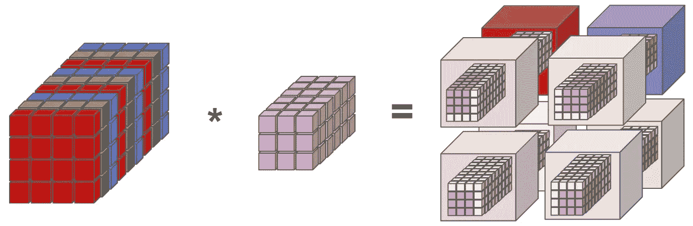
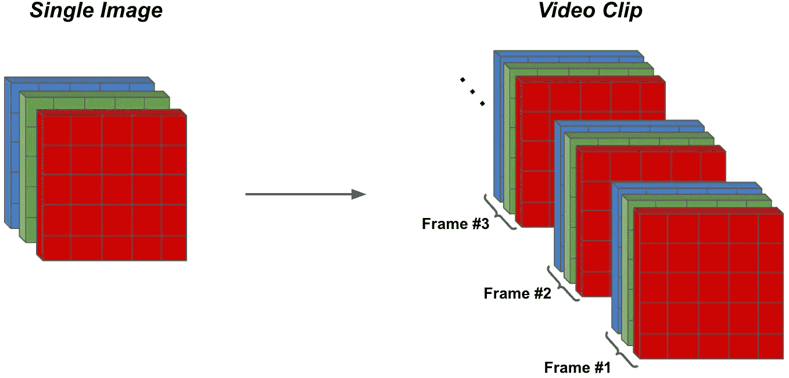
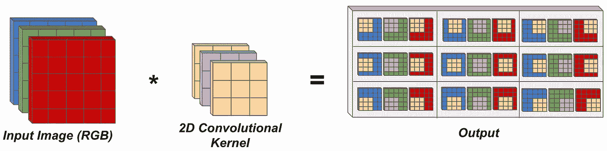
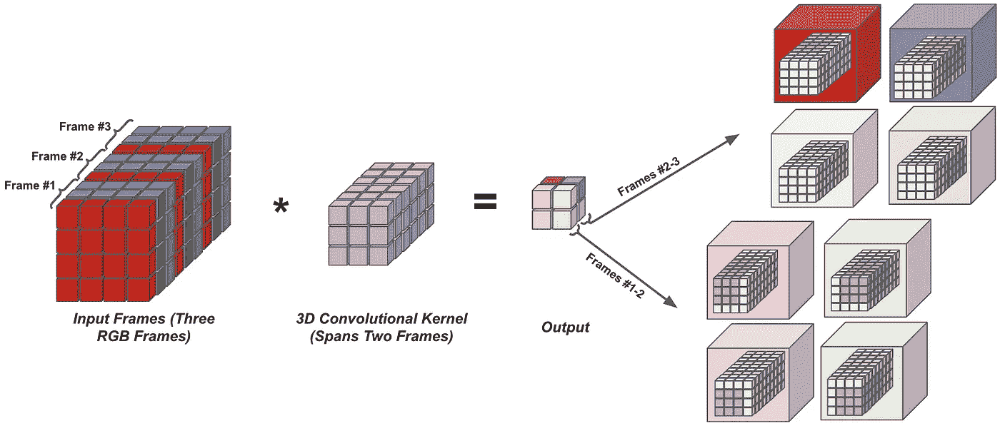

# 视频深度学习(第一部分):早期…

> 原文：<https://towardsdatascience.com/deep-learning-on-video-part-one-the-early-days-8a3632ed47d4?source=collection_archive---------6----------------------->

(作者创作)

在这一系列博客文章中，我将探讨视频数据深度学习的主题。从一些关于该主题的最早出版物开始，我旨在概述这个问题最初是如何解决的——在深度学习方法大规模普及之前——并跟踪视频深度学习随时间的演变。在这样做的时候，我的目标不仅是概述视频深度学习的历史，而且还为希望涉足该领域的研究人员或从业者提供相关的背景和理解。

我会把这个话题分成几篇博文。这一部分将概述视频深度学习的“早期”。这一时期的出版物首次利用 3D 卷积以可学习的方式从视频数据中提取特征，不再使用手工制作的图像和视频特征表示。这些方法的例子包括将手工制作的视频特征传递到 3D 卷积层的两部分架构、基于 3D 卷积的无监督学习技术、或者甚至直接对视频数据进行操作的 3D 卷积网络。

这篇文章将分为三个部分。我将首先提供相关的背景信息(例如，3D 卷积如何工作，3D 卷积之前的方法，视频数据是如何构造的)。然后，我将概述相关文献，提供对视频深度学习早期方法的高级(但全面)理解。最后，我将结束这篇文章，并概述这种方法的局限性，展望后来开发的性能更好的方法。

# 预赛

在深入研究相关文献之前，有几个概念必须概述一下。在描述这些概念时，我假设读者对卷积运算和计算机视觉应用中图像数据的典型结构有基本的了解。然而，我仍然会尝试提供所有相关的信息，这样重要的概念可以用最少的先验知识来理解。

## **视频数据是如何结构化的？**

图像和视频数据结构的比较(由作者创建)

在开发视频的深度学习应用程序时，人们可能会问自己的第一个问题是视频数据通常是如何构造的(例如，与图像相比)。对于图像，这个问题有一个简单的答案。在大多数情况下，输入图像是 RGB 格式的(即每个图像都有三个相关联的颜色通道)，并且具有一定的高度和宽度。例如，在上图中，输入图像有三个颜色通道，每个通道的高度和宽度都是五。因此，对基于图像的深度学习模型的输入通常将是大小为`3 x Height x Width`的[张量](https://discuss.pytorch.org/t/what-exactly-is-a-tensor/8861)。几幅图像可以堆叠成一个小批量，形成一个大小为`Batch x 3 x Height x Width`的张量。

对于视频来说，数据结构差别不大。也就是说，视频只是一组按时间顺序排列的图像，称为帧。当以正确的时间顺序观看时，这些帧揭示了场景随时间的移动，形成了视频。类似于图像，这些帧中的每一个通常以 RGB 格式表示，并且具有相同的空间分辨率(即，所有帧具有相同的高度和宽度)。在上图中，视频由三个帧组成，每个帧有三个颜色通道，高度和宽度为五。

视频中的所有帧可以组合成单个“体积”，通过将所有帧“堆叠”在彼此顶部来形成大小为`3*Frames X Height X Width`的张量(即，根据应用，帧也可以聚合成大小为`Frames X 3 X Height X Width`的张量)。将几个视频组合成一个小批量必须小心进行，因为每个视频中的帧数可能不同，从而形成不同大小的视频张量。尽管如此，不同的视频可以被“分块”成相同数量的连续帧(或者可以采用填充方法)以形成相同大小的视频，这些视频可以组合在一起形成一个小批量大小的`Batch x 3*Frames x Height x Width`。

## 有哪些数据集？

在本文将涉及的文献中，用于评估的主要数据集包括: [TRECVID](https://trecvid.nist.gov/) 、 [KTH](https://www.csc.kth.se/cvap/actions/) 、[好莱坞 2](https://www.di.ens.fr/~laptev/actions/hollywood2/) 、 [UCF101](https://www.crcv.ucf.edu/data/UCF101.php) 和 [YouTube Action](http://www.cs.ucf.edu/~liujg/YouTube_Action_dataset.html) 。所有这些数据集都集中在人类动作识别(HAR)的问题上，其中必须根据人类在视频剪辑中执行的动作为视频剪辑分配类别标签。HAR 在自动驾驶和监控等问题领域有许多应用，是视频深度学习早期研究最广泛的应用。尽管后来的研究考虑了其他更复杂的应用，HAR 仍然是一个值得注意的问题。然而，有趣的是，可以证明基于图像的模型在视频中的帧上独立操作，在 HAR [1，2]上表现良好，表明只需要最少的时间推理就可以提供合理的解决方案。

## 从 2D 到 3D…

在描述针对视频的深度学习的建议方法之前，考虑如何将基于图像的深度学习的构造推广到视频领域是有用的。特别是，我们必须考虑如何将 2D 卷积(卷积神经网络(CNN)背后的主力)应用于视频。CNN 是由非线性分离的并行卷积运算的简单序列，长期以来被应用于流行的基于图像的任务，如图像分类、对象检测和关键点估计，取得了巨大的成功。因此，视频深度学习的早期工作试图将这种成功的方法扩展到视频数据上是有意义的。2D 卷积运算描述如下。

RGB 图像上的 2D 卷积运算(由作者创建)

可以看出，在 2D 卷积中，跨越输入的所有通道(即上面图像中的三个彩色通道)的单个卷积核在输入的每个空间位置上移动，以单独计算相应的输出元素。这里，每个输出元素都是通过将输入中正确空间位置的像素值与它们在内核中的相应权重相乘，并对所有此类乘法求和得到的。请注意，此描述仅考虑了 2D 卷积的最简单情况(即 RGB 输入、无跨步等)。).我推荐[这篇博文](/intuitively-understanding-convolutions-for-deep-learning-1f6f42faee1)来了解更多关于 2D 回旋的细节。

当我们开始考虑视频数据时，卷积运算的输入会发生变化，因为我们现在有多帧视频，而不是一幅图像。因此，输入不再是单个 RGB 图像，而是堆叠在彼此之上的大量 RGB 图像(即，这可以被视为具有大量通道的类似输入)。为了解决输入中的多个帧，卷积运算必须不仅跨越空间维度(例如，上面图像中的 2D 卷积跨越高度和宽度三个像素)，而且跨越时间维度。也就是说，单个内核在计算其相应的输出表示时必须考虑输入的多个帧。下面描述了这个公式，我们称之为 3D 卷积运算。

三个 RGB 帧的三维卷积运算(作者创建)

可以看出，上面的 3D 卷积有一个内核，它跨越输入中的两个帧。最初考虑前两个帧，在每个空间维度上移动该内核以计算相应的输出元素(即，通过类似于 2D 卷积的逐元素乘法和求和)。在移动可能的空间维度之后，3D 卷积在时间上迈出了一步，移动到它必须考虑的下一个帧跨度，并重复遍历空间维度的过程。在上面的图像中，3D 卷积最初考虑视频中的前两帧，然后继续计算对应于第二帧和第三帧的表示。如果视频中存在更多帧，3D 卷积将继续以这种方式穿越时间。

3D 卷积是一种时空运算，它同时考虑了每个单独输入帧内的空间特征和连续帧内的时间特征。尽管三维卷积不是从视频数据中学习特征的唯一方法，但它们是早期深入学习视频的方法所利用的主要可学习变换。因此，三维卷积是本文的主要重点。

## 在深入学习之前使用了什么？

尽管 CNN 在图像领域取得了广泛的成功，但将其应用扩展到视频需要时间，特别是由于缺乏用于训练目的的大型、多样化的视频数据库(相对于基于图像的数据集的大小和多样性而言)[1]。因此，人们可能会开始想知道在基于深度学习的动作识别系统普及之前，HAR 通常是如何解决的。

用于 HAR 的初始系统从视频数据中提取固定的、手工制作的特征(例如，使用运动历史图像、SIFT 描述符、HoG 特征、模板匹配、滤波器组等)。)来帮助分类。通常，视频将首先被分割成兴趣点(即，从背景中裁剪出人的较短剪辑)。然后，从这些兴趣点中提取固定特征(即，由几个裁剪的帧组成)并用某种机器学习模型(例如，支持向量机)进行分类。这种方法后来被扩展为更复杂的系统，通过手工特征提取和子采样的交替应用来分层学习特征[3，4]。

尽管手工制作的方法效果相对较好，但这种特征难以在数据集之间推广，并且难以适应不同的传感器领域(如视频或雷达)[5]。此外，手工制作的特征倾向于对底层数据分布进行简化假设(例如，固定视点、人在帧的中心等)。)会降低实际应用程序的性能[6]。因此，该领域的研究人员开始寻找可以直接从数据中学习的替代特征提取方法。由于 CNN 能够从图像中提取有用的特征，使用 2D/3D 卷积从视频数据中学习特征迅速成为关注的主要领域。这篇文章概述了由此产生的方法。

# 视频深度学习的早期方法

现在，我将概述相关的早期方法，这些方法率先使用 3D 卷积以可学习的方式从视频数据中提取特征。本文将涉及的出版物可以大致分为以下几类:将可学习特征提取与固定特征提取相结合的方法，将可学习特征提取直接应用于视频数据的方法，以及用于学习视频中时空特征的无监督方法。

## 混合方法:结合手工制作和学习的功能

虽然已知当在大型图像数据集上训练时，CNN 能够学习有用的、有区别的特征，但是 CNN 到视频域的早期扩展通常将 3D 卷积的使用与固定特征提取相结合，而不是将 3D 卷积直接应用于原始视频数据。具体而言，视频数据将首先由固定特征提取器进行预处理，例如通过计算原始视频帧上的光流或垂直和水平梯度。然后，在预处理之后，产生的表示将通过 3D 卷积层来提取用于分类的可学习特征。

这种方法被最初的 HAR 系统采用，应用于 TRECVID 监测数据集[7，8]。这种方法不是直接对原始视频数据进行操作，而是计算输入视频内的[光流](https://nanonets.com/blog/optical-flow/)和[方向梯度](https://en.wikipedia.org/wiki/Image_gradient)。这些手工制作的特征然后与原始视频帧连接，并通过几层 3D 卷积，这些卷积由子采样操作和非线性激活函数分开。在这些 3D CNN 架构中，每个数据模态(即，光流、方向梯度和正常帧)由单独的 3D 卷积核独立处理。然后，利用支持向量机[7]或全连接线性模块[8]，将 3D CNN 的输出用于分类。在这些工作中，为 HAR 探索了几种不同的 CNN 架构，得出的结论是将几种独特的 3D CNN 架构的输出相结合通常会产生最佳性能[8]。

这种方法在当时非常成功，甚至超过了 HAR 的单帧 CNN(即，强基线方法)和几乎所有利用手工制作的特征提取的基线。尽管如此，这种方法仍然固有地依赖于在初始预处理阶段内计算的光流和梯度特征的质量。这种特征是不可学习的，因此可能无法在数据集或应用程序中很好地推广。这种观察导致了完全消除固定特征提取的方法的提议，以试图提取完全可学习的特征，而不依赖于任何手工制作的试探法。

## 用 3D CNNs 提取可学习的视频特征

为了避免与基于手工制作特征的方法相关的限制，后来的视频深度学习方法将原始输入量(即几个帧的组)直接传递到由池化和激活层分隔的 3D 卷积层中[9]。这种 3D CNNs 在结构上类似于基于图像的 CNN，但被修改为包含 3D 卷积[9]。通常，这些方法从完整视频中提取一小部分帧，裁剪这些帧以聚焦每个帧中的人，然后将子采样和裁剪后的体积传递到 3D CNN [9，10]，其中的输出随后用于执行分类。有趣的是，这种方法很容易超越混合 3D CNNs(即结合手工制作和学习特征的 CNN)的性能，即使使用小得多的网络[10]。

值得注意的是，因为这种方法将基础视频分割成传递到 3D CNN 的较短剪辑(例如，包含 10-15 个帧)，所以最终分类不考虑完整视频内较大或时间上较远的帧组之间的关系。为了解决这一缺点，上述方法与递归神经网络(特别是长短期记忆(LSTM)网络[11])相结合，以合成用 3D CNNs 从视频的每个片段中提取的信息。特别是，视频首先被分割成更小的帧组，这些帧组再次被传递到 3D CNN 以提取特征。然而，不是独立地对这些特征中的每一个进行分类，而是将与每个视频片段相关联的特征以时间顺序作为输入传递给 LSTM，然后其执行最终的分类[10]。这种方法考虑了完整视频的上下文，因此在 HAR 上实现了显著提高的性能。

使用 3D CNNs 直接从视频数据中提取特征是革命性的，因为它为深度学习成为视频学习任务的主要方法铺平了道路。这些作品脱离了传统的视频学习方法，并遵循了图像识别的相关深度学习文献的方法，选择让所有特征以可学习的方式获得。因此，视频学习任务的系统(如 HAR)变得更少依赖于领域，视频相关的研究可以以更快的速度发展，因为不需要不断确定每个可能的数据集的最佳手工制作的特征[12]。然而，这种方法仍然存在一个主要的限制——它们的性能完全依赖于底层任务的标记数据的质量和数量。

## 视频的无监督表示学习

尽管 3D CNN 模型提供了令人难以置信的价值，但它们的性能受到可用于训练的数据量的限制。尤其是在深度学习的早期，带标签的视频数据的可用性微乎其微[1]。因此，由于缺乏足够的数据，3D CNN 模型学习高质量特征的能力总是有些有限。这种限制导致了无监督深度学习方法的同时发展，用于提取有意义的视频特征[12，13]。

第一个这种用于视频的无监督学习方法利用门控、受限玻尔兹曼机器(GRBM)架构来从视频中的相邻帧学习特征。最初，GRBM 架构无法处理高分辨率图像(即，计算量太大)，因为在作为输入传递到模型之前，图像被展平为矢量。为了缓解这个问题，GRBM 在[13]中被修改为使用卷积运算，允许以较低的计算成本处理更高分辨率的图像。然后，可以以无监督的方式在相邻的视频帧上训练这个卷积 GRBM 模型，以学习有用的空间和时间信息，从而允许从视频中提取高质量的特征，而不需要标记的数据。从这里可以看出，从卷积 GRBM 提取的特征可以传递到 3D CNN 中，以解决像 HAR 这样的任务，其中 GRBM 的无监督预训练大大提高了性能[13]。

虽然卷积 GRBM 表现出令人印象深刻的性能，但无监督的预训练过程在计算上相当低效，这导致了一种替代的无监督视频学习方法的建议，该方法受独立子空间分析(ISA)的启发[12]。ISA 是一种生物启发的稀疏学习方法，基于[独立成分分析](https://en.wikipedia.org/wiki/Independent_component_analysis)，以前用于从静态图像中提取有意义的特征，可以以无监督的方式进行训练。与 GRBMs 类似，ISA 的计算效率太低，无法应用于高分辨率图像。为了解决这个问题，[12]提出首先在来自视频帧的较小图像块上训练(即，以无监督的方式)ISA。然后，可以使用主成分分析(PCA)减少这些初始帧补片上的 ISA 输出的维度，使其足以通过另一个 ISA 模块。然后，这些模块的输出可以被馈送到 3D CNN，以提取用于分类的特征[12]。这种方法极大地提高了视频无监督表示学习的效率，并在 HAR 的几乎所有数据集上实现了最先进的性能。

# 结论和展望

在这篇文章中，我们概述了利用 3D 卷积运算从视频中提取可学习特征的早期方法。最初，这种工作采用了一种混合方法，其中手工制作的特征被提取出来，并与来自 3D CNNs 的可学习特征混合。后来，所有手工制作的组件都被淘汰，通过将 3D CNNs 直接应用于原始视频数据，以完全可学习的方式提取视频特征。然后，并行地，提出了几种用于学习有意义的视频特征的无监督方法，从而减轻了在解决常见学习任务(例如，HAR)时对标记的视频数据的依赖。

尽管早期的视频深度学习方法工作得相对较好，但它们的效率相当低，并且无法与深度学习在基于图像的任务上实现的令人印象深刻的性能相匹配。这项工作中概述的方法仅略微优于单帧基线模型，甚至偶尔优于某些数据集上手工制作的基线方法。因此，需要一种更具性能的方法来维持或提高本文中概述的 3D CNN 方法的计算效率。最终，这种需求导致了双流 3D CNN 架构的提出，这将在本系列的下一篇文章中概述。

非常感谢你阅读这篇文章！希望对你有帮助。如果您有任何反馈或担忧，请随时评论该帖子或通过 [twitter](https://twitter.com/cwolferesearch) 联系我。如果你想关注我未来的工作，你可以在媒体上关注我，或者在我的[个人网站](https://wolfecameron.github.io/)上查看内容。这一系列的文章是我在 [Alegion](https://www.alegion.com/) 做研究科学家时背景研究的一部分。如果你喜欢这篇文章，请随时查看该公司和任何相关的空缺职位——我们总是希望与对深度学习相关主题感兴趣的积极个人进行讨论或雇用他们！

*参考书目*

[1][https://static . Google user content . com/media/research . Google . com/en//pubs/archive/42455 . pdf](https://static.googleusercontent.com/media/research.google.com/en//pubs/archive/42455.pdf)

[https://ieeexplore.ieee.org/document/1495508](https://ieeexplore.ieee.org/document/1495508)

[3][https://McGovern . MIT . edu/WP-content/uploads/2019/01/04069258 . pdf](https://mcgovern.mit.edu/wp-content/uploads/2019/01/04069258.pdf)

[4][https://www.cs.tau.ac.il/~wolf/papers/action151.pdf](https://www.cs.tau.ac.il/~wolf/papers/action151.pdf)

https://ieeexplore.ieee.org/stamp/stamp.jsp?tp=的 T2

https://ieeexplore.ieee.org/stamp/stamp.jsp?tp=[号&号=6165309](https://ieeexplore.ieee.org/stamp/stamp.jsp?tp=&arnumber=6165309)

[7][https://www . research gate . net/publication/229045898 _ Detecting _ Human _ Actions _ in _ Surveillance _ Videos](https://www.researchgate.net/publication/229045898_Detecting_Human_Actions_in_Surveillance_Videos)

[https://ieeexplore.ieee.org/document/6165309](https://ieeexplore.ieee.org/document/6165309)

[9][https://link . springer . com/content/pdf/10.1007/978-3-540-72393-6 _ 85 . pdf](https://link.springer.com/content/pdf/10.1007/978-3-540-72393-6_85.pdf)

[10][https://link . springer . com/content/pdf/10.1007% 2f 978-3-642-25446-8 _ 4 . pdf](https://link.springer.com/content/pdf/10.1007%2F978-3-642-25446-8_4.pdf)

[11][https://colah.github.io/posts/2015-08-Understanding-LSTMs/](https://colah.github.io/posts/2015-08-Understanding-LSTMs/)

[https://ieeexplore.ieee.org/document/5995496](https://ieeexplore.ieee.org/document/5995496)

[http://yann.lecun.com/exdb/publis/pdf/taylor-eccv-10.pdf](http://yann.lecun.com/exdb/publis/pdf/taylor-eccv-10.pdf)