# 文本分类的深度学习技术

> 原文：<https://towardsdatascience.com/deep-learning-techniques-for-text-classification-78d9dc40bf7c?source=collection_archive---------2----------------------->

## 使用 Word2Vec 对您常用的深度学习架构评估基于 TCN 和集成的模型的性能

安妮·斯普拉特在 [Unsplash](https://unsplash.com/s/photos/documents?utm_source=unsplash&utm_medium=referral&utm_content=creditCopyText) 上的照片

# A.介绍

## A.1 .背景和动机

T ext classification 是 NLP 中最流行的任务之一，它允许程序根据预定义的类对自由文本文档进行分类。这些课程可以基于主题、流派或情感。今天，大量数字文档的出现使得文本分类任务变得更加重要，尤其是对于公司来说，以最大化其工作流程甚至利润。

近年来，自然语言处理在文本分类方面的研究已经达到了最先进的水平(SOTA)。它已经取得了惊人的成果，表明深度学习方法是执行此类任务的尖端技术。

因此，需要评估 SOTA 深度学习模型在文本分类方面的性能，这不仅是学术目的，也是人工智能从业者或专业人士在类似项目中需要指导和基准的必要条件。

## A.2 目标

实验将在**五个**文本分类数据集上评估一些流行的深度学习模型的性能，如**前馈**、**递归**、**卷积**和**集成** - **基于**神经网络。我们将在两个独立的特征提取之上构建每个模型，以捕捉文本中的信息。

结果显示:

*   **单词嵌入的鲁棒性**作为所有模型的特征提取器，以做出更好的最终预测。
*   **基于集合的**和**时间卷积神经网络**在实现良好性能甚至与最先进的基准模型竞争方面的有效性。

# B.实验

## B.1 .数据集

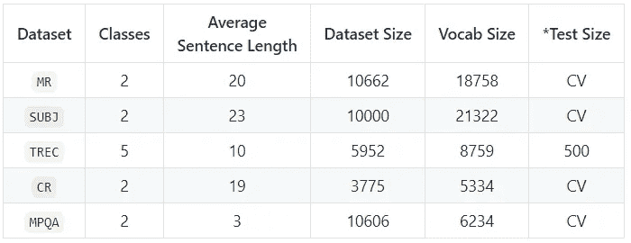

**表 1。**标记化后的数据集统计。 ***CV** 代表交叉验证。这意味着原始数据集没有标准的训练/测试分割。因此，我们使用 10 倍 CV。

*   **先生**。电影评论——将评论分为正面或负面[1]。[*链接*](https://www.cs.cornell.edu/people/pabo/movie-review-data/)
*   **subject**。主观性——将句子分为主观和客观两类[2]。 [*链接*](https://www.cs.cornell.edu/people/pabo/movie-review-data/)
*   **TREC** 。文本检索会议——将问题分为六类(人、位置、数字信息等)。) [3]. [*链接*](https://cogcomp.seas.upenn.edu/Data/QA/QC/)
*   **CR** 。客户评论—对产品评论进行分类(相机、MP3 等。)作为肯定或否定[4]。 [*链接*](https://www.cs.uic.edu/~liub/FBS/sentiment-analysis.html)
*   **MPQA** 。多视角问答——观点极性检测[5]。 [*链接*](http://mpqa.cs.pitt.edu/)
*   为了方便起见，我们在这里准备了 pickle 格式的数据集。

## B.2 .提议的模型

## **B.2.1 .时间卷积网络(TCN)**

白等人[6]提出了一个通用的时间卷积网络(TCN)作为扩张因果版本的 CNN。它是递归架构的强大替代，可以处理长输入序列，而不会遭受消失或爆炸梯度问题。如果您想了解更多关于模型块的信息，您可以参考[6]和[7]中的实现。

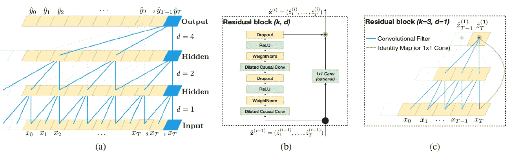

**图一。TCN 的元素建筑。(来源:[6])**

提议中的 TCN 模型是受 Kaggle 上的大师之一 Christof Henkel [8]的启发。该模型包括:

*   内核大小为 3、膨胀因子为 1、2 和 4 的两个 TCN 块堆叠在一起。
*   第一 TCN 块包含 128 个滤波器，第二块使用 64 个滤波器。输入特征将基于单词嵌入。
*   每个块的结果将采取序列的形式。
*   最终的序列然后被传递到两个不同的全局池层。
*   接下来，两个结果被连接并传递到 16 个神经元的密集层，并传递到输出。

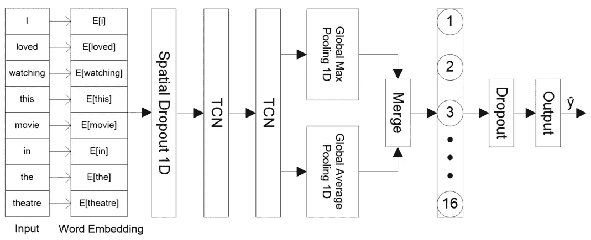

**图二。**提议的 TCN 模式。

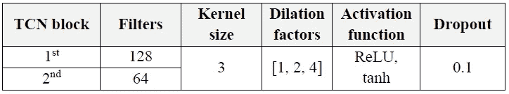

**表二。**TCN 模型的超参数。

Python 和 TensorFlow 2 中 TCN 模型的实现。

## **b . 2.2 . CNN-GRU 合奏**

K.Kowsari 等人[9]介绍了一种新的分类深度学习技术，称为随机多模型深度学习(RMDL)。该模型可用于任何分类任务。下图说明了使用深度 RNN、深度 CNN 和深度前馈神经网络(DNN)的架构。

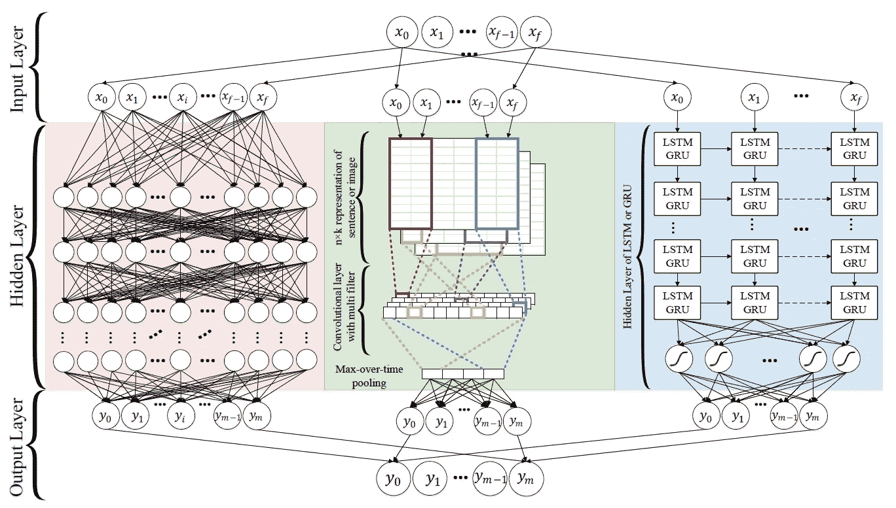

**图 3。**对 RMDL 架构进行分类。(来源:[9])

在这个项目中，我们通过将 **1D CNN** 与单个**双向 GRU (BiGRU)** 相结合，实现了一个基于集成学习的模型。

*   1D CNN 已经被证明在文本分类上工作得很好，尽管只有很少的参数调整[10]。
*   另一方面，BiGRU 通过获取序列中较早和较晚的信息，可以很好地处理时态数据。

我们将在实验中看到这种组合如何影响模型精度。

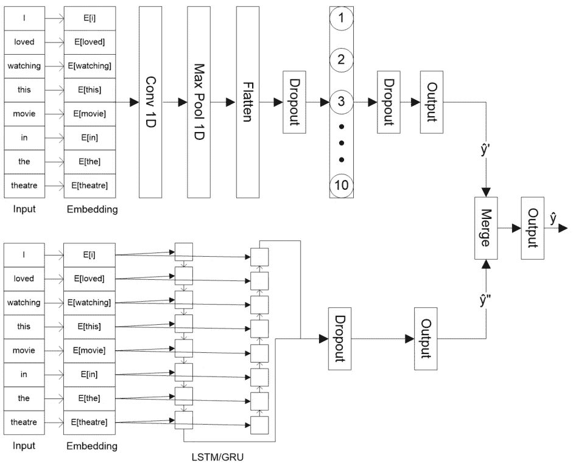

**图 4。**提出了 CNN 和 BiGRU 相结合的集成学习模型。

集合 CNN-GRU 模型在 Python 和 TensorFlow 2 中的实现

## B.2.3 .其他模型

为了比较性能，我们还将评估其他受欢迎的型号，例如:

*   **SNN。**一个浅层神经网络。

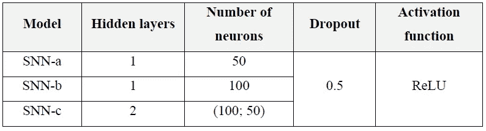

**表 3。**SNN 模型的超参数。

*   **edRVFL。**集成深度随机向量函数链接神经网络。

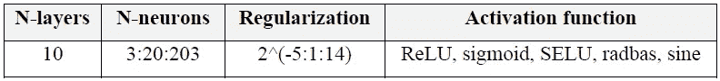

**表 4。**edr vfl 模型的超参数。

*   **1D 有线电视新闻网。**我们的**基线模型**代表具有一维卷积和池层的神经网络。

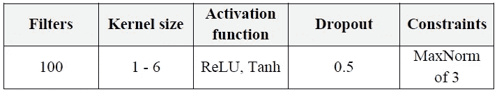

表 5。1D CNN 模型的超参数

*   **(堆叠)BiGRU/BiLSTM。**双向门控循环单位/长短期记忆。它的堆叠版本意味着我们向网络添加了另一个双向块。

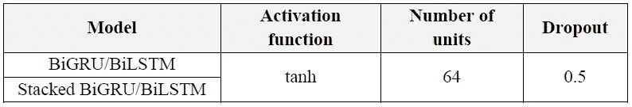

**表 6。**big ru/bil STM 模型的超参数

## B.2.4 .模型摘要及其特征提取

总而言之，我们将在五个文本分类数据集上使用两种不同的特征提取来构建深度学习模型，如下所示:

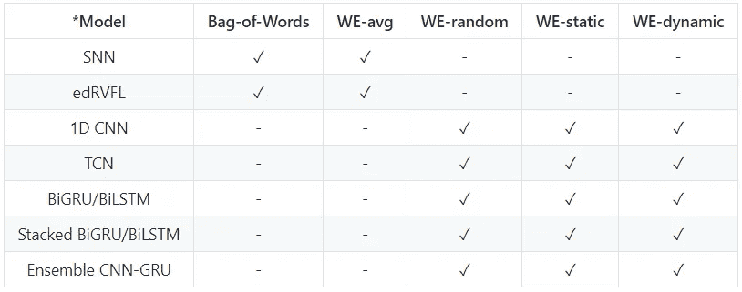

**表 7**项目中使用的模型和特征提取的变体。 ***** *对所有模型来说，训练过程都是通过提前停止来完成的，模型会在超出训练数据之前停止训练*。

*   **我们——兰德。**该模型使用嵌入层，在该层中，单词向量在训练期间被随机初始化和校正
*   **我们——静。**该模型使用名为 **Word2Vec** 的预训练单词嵌入，具有 300 维向量。向量在训练期间保持静态。使用一般正态分布随机初始化未知单词的向量。
*   **我们——动态。**同上，但向量在训练期间被修改，而不是静态的。
*   **WE-avg。**该模型使用来自预训练单词嵌入的向量的平均值来获得输入上下文。因此，输入特征的大小将与 word 2 vec 300 中使用的向量维数的大小相同。
*   **字袋(蝴蝶结)。**在将文本输入模型之前，它将文本表示为文档中出现的单词数。我们将使用四个单词评分选项:*二进制*、*计数*、*频率*和 *TF-IDF* 。

这项工作中使用的基准是:

*   **CNN-多频道** (Yoon Kim，2014)【10】
*   **SuBiLSTM** (悉达多梵天，2018) [11]
*   **SuBiLSTM-并列**(悉达多梵天，2018) [11]
*   **USE_T+CNN** (Cer et al .，2018) [12]

# C.估价

## 结果

我们将使用准确性和排名作为比较指标。将根据每个数据集的准确性来计算等级。在有平局的情况下，我们平均他们的排名。

**表 8** 显示了各型号性能的最终对比。我们还包括 SOTA 基准模型(在底部)以供进一步观察。注意，我们只包括使用单词袋和平均单词嵌入的模型的最佳结果(SNN 和 edRVFL)，

**表八**针对基准提出的深度学习模型。

从**表 8** 中，我们可以计算出 5 个数据集上模型相对于**基线** ( **1D CNN-rand** )的平均精度差如下:

**图 5。**在 5 个数据集上，模型相对于基线的平均精度差

在**图 5** 中，绿色条代表基准模型。紫色条描绘了超过基线的前六个建议模型。最后，红色柱是具有最低精确度的建议模型。减号(-)表示在以基线为参考的所有数据集中，该模型的精度远低于较高的模型。

从那里，我们可以计算平均等级值，并将结果可视化，如下所示:

**图六。**每个模型相对于基准的平均等级值

## C.2 讨论

## C.2.1\. BoW 与单词嵌入

尽管有如此多的超参数调整，这个实验中带有 BoW 的模型不能做太多。大量的文本数据会使 BoW 的词汇变得广泛。因此，输入要素将是稀疏形式，通过许多零来表示一位信息。这种文本表示使模型更难训练以获得更好的结果。除非我们指定的词汇量不够大或者使用的语料库很小，否则 BoW 不是一个可靠的选择。

另一方面，当使用单词嵌入时，模型表现得更好。通过仅取 Word2Vec 的平均值来获得 N 维特征输入，该模型可以在精确度上有高达 10%的非常陡峭的增加。例如，在 TREC 数据集中，edRVFL 和 SNN 都从 75.2 和 76.2 突然跳到 83.6 和 85.8。这些结果证明了单词嵌入作为默认特征提取器的重要性。

## C.2.2 随机、静态和动态

**图 7。**不同单词嵌入方式之间的平均准确率。

**图 7** 说明了不同的单词嵌入模式对模型性能的影响。正如所料，使用预先训练的 Word2Vec 的静态单词嵌入总是表现得更好。与随机模式相比，静态模式可以帮助任何模型更准确地预测类别，平均准确率提高 3%。

动态向量表示模型将微调由 Word2Vec 向量初始化的参数，以学习每个任务的有意义的上下文。理想情况下，它会比静态方法产生更好的性能。然而，情况并非总是如此。虽然模型还可以改进，但变化不大。在某些情况下，一个模型甚至可以有较低的准确性。

在**图 7** 中，动态模式略微降低了 TREC 和 MPQA 数据集上的整体模型性能。在**表 8** 中，尽管 BiGRU-dynamic 在 SUBJ 数据集上比其静态版本提供了更好的性能，但它在其他数据集上的性能有所下降。这是因为向量调整到一个特定的数据集，该数据集可能会过度拟合并改变从 Word2Vec 派生的原始上下文。

## c . 2.3 TCN 与 RNN 模式

如果我们使用单词嵌入，TCN 比 RNN 的模型如 LSTM 或 GRU 更有效。在五个数据集的四个中，TCN 以优异的精确度超过了所有 RNN 架构。在另一个数据集上，TCN 精度仍然很高，接近最高。TCN-静态和-动态作为顶级模型，其次是 BiLSTM-静态、big ru-静态和堆叠 big ru-静态。

简而言之，TCN 是最好的模型，不仅与 RNN 家族相比，而且在捕捉信息以做出稳定预测方面也与其他模型相比。在这个实验中，唯一能挑战 TCN 的模型是基于系综的模型。

## C.2.4 整体与单一模型

正如所料，集成模型通常在几乎所有的分类任务中都优于单个模型。集合模型的静态版本在 5 个数据集的 3 个中提供了更好的性能。集成学习的关键是候选模型需要被证明在给定的任务中工作良好。在这种情况下，1D CNN 和 BiRNN 是结合用于文本分类的很好的模型。这一结果鼓励我们在未来尝试将一个有效的模型(如 TCN)与其他现有的良好深度学习模型相结合。

## C.2.5 .表现最佳的模型

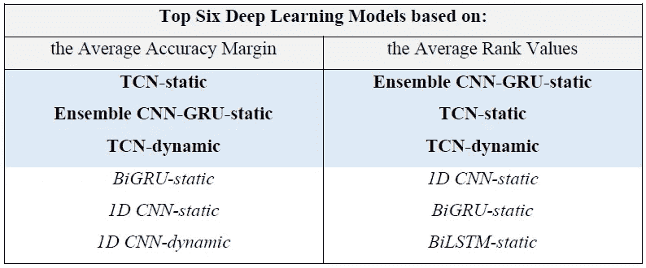

**表 9。**本论文排名前六的深度学习模型。

最后，**表 9** 总结了这一系列实验中的最佳模型。我们使用**图 5** 中的平均准确度裕度和**图 6** 中的平均等级值来比较**前六个用于文本分类的执行模型**。我们可以看到，静态版本的 TCN 和集合模型脱颖而出，成为最好的。

接下来，TCN 动力紧随其后，成为最佳车型，跻身前三名。最终，TCN 和基于集成的模型在执行文本分类任务时优于其他配置，使它们成为未来应用和研究的最佳推荐架构。

# D.结论和未来工作

## D.1 .结论

该项目展示了一个全面的实验，重点是在五个文本分类数据集上使用两种不同的特征提取来构建深度学习模型。总之，以下是基本的见解:

*   任何建立在单词嵌入之上的模型都会使模型表现得非常好。
*   使用预先训练的单词嵌入，例如 Word2Vec，可以在很大程度上提高模型精度。
*   TCN 是递归架构的一个很好的替代方案，已经被证明在文本数据分类中是有效的。
*   与单独训练的单一模型相比，基于集成学习的模型可以帮助做出更好的预测。
*   TCN 和集合 CNN-GRU 模型是我们在这一系列文本分类任务中获得的性能最好的算法。

## D.2 .对未来工作的建议

我们对未来的实验提出如下建议:

*   **基于集合的 TCN 模型。**在基于集成的学习中，使用 TCN 结合其他良好的模型(如 1D CNN 和 BiGRU)来执行文本分类任务，以查看它是否能够挑战基准
*   **内核大小和过滤器。**通过在 CNN 或 TCN 中使用更多或更少的过滤器将内核大小扩展到 1 到 10 之间来探索这两个超参数，以查看它如何影响模型性能。
*   **更深的人脉。任何具有更多隐藏层的神经网络通常会在任何任务中做得更好。探索 CNN、RNN 和 TCN 的更深版本，看看它如何影响现有的性能。**
*   使用手套和快速文本。探索其他预训练的单词嵌入选项，如具有静态和动态模式的 GloVe 和 FastText，并将结果与 Word2Vec 进行比较。

谢谢你，

diardano Raihan
[LinkedIn 简介](https://www.linkedin.com/in/diardanoraihan/)

> ***注*** : *你看到的一切都记载在* [***我的 GitHub 资源库***](https://github.com/diardanoraihan/Text_Classification_Capstone/) *。对于那些对完整代码感兴趣的人，请访问👍。*

# 参考

*   [1] B. Pang，L. Lee，“看见星星:利用阶级关系进行情绪分类的等级量表”，美国癌症学会 2005 年会议录*。*
*   [2] B. Pang，L. Lee，“情感教育:使用基于最小割的主观性摘要进行情感分析”，*计算语言学协会第 42 届会议论文集(ACL'04)* ，2004 年。
*   [3] X .李，d .罗思，“学习疑问量词”，载于《中国林业学报》2002 年第 02 期第 19 期。
*   [4] M .胡，b .刘，“客户评论的挖掘与汇总”，*《学报》2004 年 04 期*。
*   [5] J. Wiebe，T. Wilson，C. Cardie，“用语言注释观点和情感的表达”，*语言资源和评估*，39(2):165–210，2005。
*   [6] S. bai，J. Kolter，V. Koltun，“序列建模通用卷积和递归网络的实证评估”， *arXiv* ，2018 年 4 月。
*   [7] P. Rémy，《凯拉斯·TCN》，*GitHub*[https://github.com/philipperemy/keras-tcn](https://github.com/philipperemy/keras-tcn)，1 月。2021.
*   [8] C. Henkel，《时态卷积网络》， *Kaggle* ，[https://www . ka ggle . com/christofhenkel/时态卷积网络，](https://www.kaggle.com/christofhenkel/temporal-convolutional-network,)2021 年 2 月。
*   [9] K. Kowsari，M. Heidarysafa，D. E. Brown，K. J. Meimandi，L. E. Barnes，“用于分类的随机多模型深度学习”， *arXiv* ，2018 年 4 月。
*   [10] Y. Kim，“用于句子分类的卷积神经网络”，*计算语言学协会*，2014 年 10 月。
*   [11] S. Brahma，《使用后缀双向 LSTM 的改进句子建模》， *arXiv* ，2018 年 9 月。
*   [12] D. Cer，Y. Yang，S. Kong，N. Hua，N. Limtiaco，R. S. John，N. Constant，M. Guajardo-Cespedes，S. Yuan，C. Tar，Y. Sung，B. Strope，R. Kurzweil，《通用句子编码器》， *arXiv* ，2018 年 4 月。