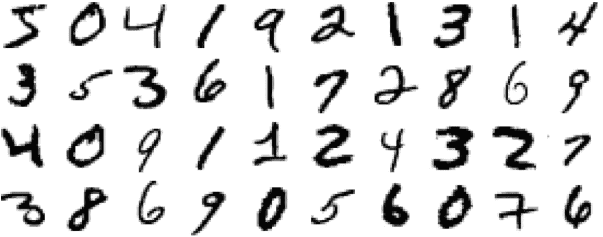
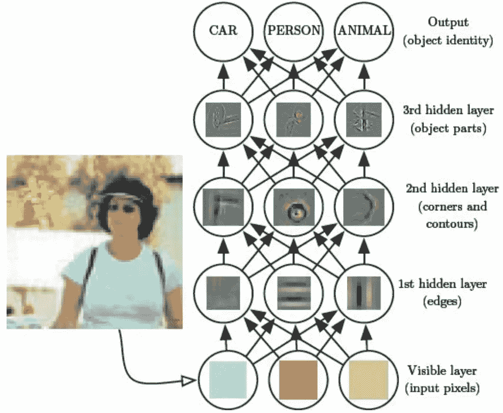

# 深度学习:理解原理

> 原文：<https://towardsdatascience.com/deep-learning-understand-the-principle-ad146d9f54dd?source=collection_archive---------62----------------------->

## 温和的介绍。它解决了什么问题，为什么是分层结构

安迪·凯利在 [Unsplash](https://unsplash.com?utm_source=medium&utm_medium=referral) 上的照片

深度学习(DL)是机器学习(ML)的一种，它使用更高级的策略来解决任务。对计算机程序来说很复杂，但对我们来说却很简单的问题。如语音和图像识别[1]。

当我们看到一辆车时，我们在一瞬间就知道它是什么。无论是造型，从哪个角度还是灯光都不重要。我们很容易识别图案，并与其他物体区分开来。为什么传统的机器学习系统做不到这一点？例如，它们很适合推荐系统。

困难在于一幅图像或一句话可能有大量不可预测的变化。而在推荐系统中，一般来说，它是关于了解这个人和其他人的偏好[2]，对于图像或语音，它更复杂。

例如，想象一辆汽车有四个轮子、窗户和一个方向盘。你训练程序输入这些信息。简单对吗？但是在一天中的特定时间，有阴影模糊了两个轮子，或者一个人靠在上面。想想语音识别！某个单词有多少种发音方式？想象一下所有不同的口音。这使得机器很难。当它认为它学会了，另一个特征就出现了。

另一个例子是识别手写数字。一个人可以用多少种方法来写一个东西？！参见图 1。你会看到，例如，九有不同的表示方式。同样的道理也适用于其他数字。这些差异弥补了完全不同的像素值。

图一。来自 MNIST 数据集[1]的部分数字

深度学习通过将对象分解成更小更简单的组件来解决问题。虽然图像看起来不同，但它们之间有一些看起来相同或相似的部分。有一种模式。

它将对象/概念作为分层结构来处理，每一层都是下一层的抽象。根据成分的粒度，它可以深入**(因此得名)**[1]。例如，一个中型的故事可以分为段落，然后它可以分为短语，然后是单词，最后是字符。****

********

****图二。故事作文。由作者创作。****

****有三种类型的层。输入，隐藏的和输出。它们由节点或神经元组成(与大脑类似)。节点被分配了代表图像一部分的像素。****

*   ******输入:**可见图像。它包含所有像素。如果图像是 10x10 的网格，则该层将包含 100 个节点。****
*   ******隐藏:**组成图像的部分。它们被称为“隐藏的”，因为它们不是给定数据的一部分[1]。第一隐藏层可以包含边缘；第二，角和轮廓，以及更具体的部分。隐藏层的数量可以变化。每一个节点的数量。这取决于确定哪些部分/概念有助于解释观察到的对象[1]。****
*   ******输出:**被识别的对象。每个可能的对象都有一个节点。****

****下面的图 3 展示了分层结构。(它没有考虑所有的节点和实际值。这更像是一种高层次的表现)****

********

****图 3。分层结构[1]。****

# ****最后的想法****

****感谢阅读。希望你觉得有用。虽然它没有解释算法的数学和细节，但它为您提供了一个良好的基础。至少这是我的意图。****

****最后一件事。常见的是读到 DL 试图模仿我们人类的思维方式。那在某种程度上是正确的。然而，我们并不确定我们是如何识别物体的(根据我的研究，在写这篇文章的时候)。关于我们大脑所使用的算法，我们知之甚少。尽管如此，我相信这并不重要，只要机器能做好。就像一架可以不完全按照鸟类力学飞行的飞机。****

# ****参考****

****[1]伊恩·古德费勒，约舒阿·本吉奥和亚伦·库维尔，深度学习，2016 年****

****[2]用于视频游戏 https://scholar.google.com/scholar?的机器学习项目推荐系统 q =推荐+系统+机器+学习&HL = en&as _ SDT = 0&as _ vis = 1&oi = schol art # d = GS _ qabs&u = % 23p % 3d 8 hjshbe 4 fwkj****

****【3】大脑如何解决视觉物体识别？https://www.ncbi.nlm.nih.gov/pmc/articles/PMC3306444/****