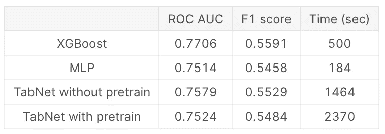

# 表格数据上的深度学习与 GBDT 模型—带代码片段

> 原文：<https://towardsdatascience.com/deep-learning-vs-gbdt-model-on-tabular-data-with-code-snippet-e4b3dd525552?source=collection_archive---------7----------------------->

## TabNet、MLP 和 XGBoost 在家庭保险数据集上的性能比较实验

[法托斯 Bytyqi](https://unsplash.com/@fatosi?utm_source=medium&utm_medium=referral) 在 [Unsplash](https://unsplash.com?utm_source=medium&utm_medium=referral) 上的照片

在数据科学领域，深度学习方法无疑是最先进的研究。每天都有许多新的变体被发明和实现，特别是在 NLP(自然语言处理)和 CV(计算机视觉)领域，深度学习近年来取得了很大进展。这种趋势也可以在 Kaggle 比赛中观察到。在那些 NLP 和 CV 任务竞赛中，最近获胜的解决方案正在利用深度学习模型。

然而，深度学习模型真的比 GBDT(梯度推进决策树)这样的“传统”机器学习模型更好吗？我们知道，如上所述，深度学习模型在 NLP 和 CV 中要好得多，但在现实生活中，我们仍然有如此多的表格数据，我们是否可以确认深度学习模型甚至在结构化数据集上比 GBDT 模型表现得更好？为了回答这个问题，这篇文章使用了来自 Kaggle 的[家庭保险](https://www.kaggle.com/ycanario/home-insurance)数据集来比较每个模型的性能。我知道我们不能仅凭一个数据集就断定哪个模型更好，但这将是一个很好的比较起点。还有，我会使用 TabNet，这是一个相对较新的深度学习模型，用于表格数据进行比较。

本次实验的笔记本可以在我的 kaggle 笔记本中找到:[主笔记本](https://www.kaggle.com/kyosukemorita/deep-learning-vs-gbdt-model-on-tabular-data)和带[预训](https://www.kaggle.com/kyosukemorita/home-insurance-pretrained-tabnet)的 TabNet。这篇文章将省略每个算法的解释，因为已经有很多算法了:)

# 目录

> **1:本次实验的总结和代码片段**
> 
> **2:模型性能**
> 
> **3:可解释性**
> 
> **4:现实业务中部署的模型选择**
> 
> **5:结论**

埃利安·贾沙里在 [Unsplash](https://unsplash.com?utm_source=medium&utm_medium=referral) 上拍摄的照片

**1:本次实验的总结和代码片段**

如上所述，这个实验使用了[家庭保险数据集](https://www.kaggle.com/ycanario/home-insurance)。该数据集包括 2007 年至 2012 年间的房屋保险单数据，有超过 100 个关于房屋特征、业主人口统计数据等的可用特征，该数据中有超过 250，000 行。使用这个数据集，这个实验试图预测一个家庭保险政策是否会失效。不幸的是，并没有给出这个数据集中所有变量的细节，但是做这个实验已经足够好了。

现在我将检查这个实验的代码。这是最低限度，应该很明显会发生什么。

首先，导入库。

然后，创建一个定时器函数，

这样我们可以跟踪函数运行需要多长时间。

这是数据集的预处理。这一过程包括

1.排除缺失值
2。清洁目标变量
3。为分类变量
4 创建虚拟变量。创建年龄特征
5。估算缺失值

为了训练和评估模型，我将拆分数据集。

用深度学习模型训练数字特征需要标准化。这个函数完成这项工作。

现在所有的预处理都完成了。下面，我将展示每个模型的训练代码。

**XGBoost**

**MLP (1D 有线电视新闻网)**

**无预训练的 tab net**

**带预训练的 tab net**

预处理部分

TabNet 训练可以通过上面的同一个函数“trainTabNetModel”来完成。

训练完成后，我们将需要对测试集进行预测和评估。

**预测**

**评估**

**剧情**

最后，这是上面运行的主要脚本。

以上是代码片段。现在我们将在接下来的章节中看到这个实验的结果。

**2:模型性能**

如上所述，这里比较了 XGBoost、MLP 和 TabNet 在有和没有预训练的情况下的模型性能。采用 ROC AUC 评分和 F1 评分对模型进行评价。F1 分数计算为 0.27 作为阈值，因为我假设失效保险的分布类似于培训分布。下面是对它的总结。

正如我们所看到的，就模型的准确性而言，XGBoost 模型是最好的一个，然而其他模型也紧随其后。我对 TabNet 模型使用了带和不带预训练(不带预训练 TabNet 的笔记本可以在这里找到)。有预训练的 TabNet 应该有更好的结果，但是在这个数据集中，它得到的结果比没有预训练的稍差。我不确定确切的原因是什么，但我猜这可以通过适当的超参数来改善。

当我们研究每个模型的预测分布时，我们可以观察到 XGBoost 和 TabNet 模型之间存在一定程度的相似性。我猜这可能是因为 TabNet 也使用了一种基于树的算法。MLP 模型与其他模型相比有很大的不同。

就训练时间而言，MLP 模型是最快的。我用过 GPU，所以这是我得到这个结果的主要原因。与其他模型相比，这两个 TabNet 模型花费了相当长的时间。当涉及到超参数调谐时，这就产生了很大的差异。在这个实验中，我没有做任何超参数调优，使用了任意参数。虽然 MLP 的训练时间几乎是 XGBoost 模型的 1/3，但它需要优化的参数数量是 XGBoost 的 10 倍以上，因此，如果我进行超参数调整，它可能需要比 XGBoost 模型的超参数调整训练更长的时间。

**3:可解释性**

可解释性对于一些机器学习模型业务用例来说非常重要。例如，能够解释为什么一个模型在金融/银行业做出一个特定的决定是至关重要的。假设我们正在部署一个可用于贷款审批的模型，一个客户想知道他的申请为什么被拒绝。银行不能告诉他我们不知道，因为该行业有强有力的监管机构。

模型的可解释性是 MLP 模型的缺点之一。虽然我们仍然可以通过使用一些方法来评估哪些功能有助于做出预测，例如使用 [SHAP](https://shap.readthedocs.io/en/latest/example_notebooks/tabular_examples/neural_networks/Census%20income%20classification%20with%20Keras.html) ，但是如果我们能够快速检查功能重要性列表，将会更加有用。在这本笔记本中，我将只比较 XGBoost 和 TabNet 模型的特性重要性。

XGBoost 模型的前 5 个重要特性是:

*   婚姻状况——伴侣
*   付款方式—非直接借记
*   第一次续订后包括“紧急情况”选项
*   建筑物保险-自我损害
*   第一次续订前包含“更换钥匙”选项

无预训练的 TabNet 模型的前 5 个重要特征是:

*   财产类型 21(未给出细节)
*   第一次续订前包含“HP1”
*   付款方式—纯直接借记
*   会员类型 6(未给出详细信息)
*   保险期限(年)

令人惊讶的是，这两个模型的重要特征完全不同。XGBoost 的重要功能对我来说更“可理解和可预期”—例如，如果客户有一个合作伙伴，那个人应该在经济上更负责任，因此，房屋保险不太可能失效。另一方面，我认为 TabNet 的重要特性不够直观。最重要的特性是“属性类型 21”，这里没有给出这个特性的细节，所以我们不知道这个属性类型有什么特别之处。这也是第二重要的功能，在第一次更新之前包括了“HP1”，我们也不知道什么是“HP1”。也许，这可以成为 TabNet 的一个优势。由于它是一个深度学习模型，所以它可以探索特征之间的非显而易见的关系，并使用最佳特征集，特别是像这次一样，其中没有给出所有特征的细节。

**4:现实业务中部署的模型选择**

当我们想要在现实生活的业务中使用机器学习模型时，我们需要选择部署模型的最佳方式，通常会有一些权衡。例如，众所周知，当我们像这次一样建立几个模型时，这些模型的精确度非常相似，将它们集成可能会提高精确度。如果这种组合策略非常有效，比如将 F1 成绩提高了 10%，那么采取这种策略是绝对必要的，但如果这种提高只有 1%，我们还想采取这种策略吗？大概不会吧？—由于多运行一个模型会增加计算成本，因此通常如果多部署一个模型的好处超过了计算成本，我们可以采取这种集成策略，否则，从业务角度来看，这不是最佳策略。

此外，关于模型的可解释性，XGBoost 模型使用了所有 115 个特征，而 TabNet 模型只使用了 16 个特征(预训练模型只使用了 4 个特征)。这是一个巨大的差异，理解这些差异也很重要。正如我上面提到的，在一些真实的业务用例中，了解这些特性做出了多少贡献是非常关键的。因此，有时虽然准确性很高，但如果模型无法解释为什么它会做出这样的决定，就很难说服人们在现实生活中使用它，特别是在非常敏感的业务中。

考虑到以上 2 点，我们会认为 XGBoost 模型在这种情况下优于其他深度学习模型。就准确性而言，XGBoost 模型比其他模型稍好一些(我没有尝试从所有模型中整合这些预测，但让我们假设，它并没有提高多少准确性——我可能是错的)。就可解释性而言，如上所述，XGBoost 模型的特性重要性列表在某种程度上是我们可以理解的(我们可以看到它背后的一些逻辑),也是我们所期望的。

**5:结论**

本笔记本在表格数据上实验性地比较了 XGBoost、MLP 和 TabNet 的模型性能。在这里，我们使用家庭保险数据集来预测它的失效。作为这个实验的结果，我们看到 XGBoost 模型在准确性方面(F1 得分和 ROC AUC 得分)略好于其他深度学习模型，但由于这个实验使用了 GPU，MLP 模型是最快完成其训练的。此外，我们通过查看 XGBoost 模型和 TabNet 模型的特征重要性列表来比较它们的可解释性。XGBoost 模型的特性重要性列表在某种程度上更容易理解和预期，另一方面，TabNet 模型的列表不太直观。我认为这是由于算法的结构造成的——深度学习模型本质上探索特征的非显而易见的关系，通常很难被人类理解。从这个简单的实验中，我们确认，尽管近年来深度学习模型的改进令人印象深刻，而且绝对是最先进的，但在表格数据上，GBDT 模型仍然与那些深度学习模型一样好，有时甚至更好，特别是当我们想要在现实生活的业务中部署机器学习模型时。