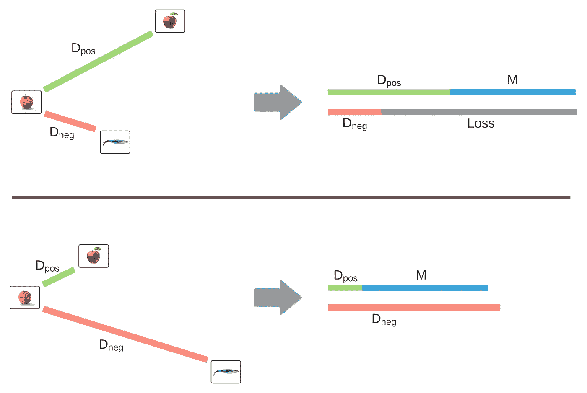

# 用容器进行深度学习。第二部分

> 原文：<https://towardsdatascience.com/deep-learning-with-containers-part-2-6495da296f79?source=collection_archive---------29----------------------->

## 利用部署在容器中的深度学习堆栈，轻松进行实验和跟踪。

[Hanson Lu](https://unsplash.com/@hansonluu?utm_source=unsplash&utm_medium=referral&utm_content=creditCopyText) 在 [Unsplash](https://unsplash.com/s/photos/grids?utm_source=unsplash&utm_medium=referral&utm_content=creditCopyText) 上的照片

在[的上一篇文章](/deep-learning-with-containers-part-1-4779877492a1)中，我们用 Docker Compose 建立了一个多容器应用程序，其中一个容器负责托管 Jupyter 笔记本环境，另一个容器保存 Tensorboard 部署。容器将通过作为卷从主机挂载的目录进行通信。

今天的主要目标是了解这种设置是如何工作的，以及它如何实现简单的实验跟踪。为此，我们将开始致力于创建一个新闻推荐系统，该系统将(显然)由神经网络支持。与任何推荐系统一样，它将提出前 10 名最相似的新闻，神经网络将生成向量，我们将使用这些向量来衡量相似性。我们将要创建的神经网络的主要内容是:

1.  **数据集**。我们将使用微软新闻数据集(MIND) [ [1](https://msnews.github.io/) ]，其中包含大约 160，000 篇英语新闻文章。具体来说，我们将计算新闻标题和摘要之间的相似度。
2.  **神经网络**。我们将使用 DistilBERT Transformer 网络作为主干，并添加几个附加层来生成合理大小的嵌入。
3.  **培训**。我们将采用暹罗学习来训练网络，以区分嵌入空间中相似和不相似的项目。

这篇文章使用的所有代码都可以在[这里](https://github.com/visheratin/dl-containers/blob/master/part-2/news-siamese.ipynb)找到。

让我们浏览一些理论并开始实验。

# 连体学习

这个概念存在了很长时间，并在许多领域获得了很大的普及，尤其是在计算机视觉领域[ [2](/a-friendly-introduction-to-siamese-networks-85ab17522942) 、 [3](https://www.cs.cmu.edu/~rsalakhu/papers/oneshot1.pdf) 、 [4](https://www.coursera.org/lecture/convolutional-neural-networks/siamese-network-bjhmj) 。暹罗学习的主要思想是训练一个神经网络来区分相似和不相似的样本。所谓相似，我们通常是指属于同一类。为此，神经网络从样本中生成 N 维嵌入，并使用它们之间的距离来计算损失。我们可以把 N 维嵌入想象成一个样本在 N 维空间中的坐标。训练的目标是确保相似的物品在这个空间中是靠近的，而不相似的物品彼此远离。我们使用专门的损失函数进行连体学习，其中最广泛使用的是对比损失[ [5](/contrastive-loss-for-supervised-classification-224ae35692e7) 和三重损失[ [6](https://medium.com/@enoshshr/triplet-loss-and-siamese-neural-networks-5d363fdeba9b) ]。在我们的实验中，我们将使用三重态损失函数。三重缺失的连体学习的图式如下图所示。

对于具有三元组丢失的连体训练，每个训练实例应该是一组三个样本——锚、负和正——称为三元组。我们首先通过神经网络传递这些样本，以生成三个嵌入向量。之后，我们计算锚和负向量(D_neg)以及锚和正向量(D_pos)之间的欧几里德距离。之后，我们计算 D_pos 和 D_neg 加上预定义的保证金 m 之间的差值，最终损失是该差值和零之间的最大值。这意味着，只有当锚点与负样本的距离比与正样本的距离更近，且比边缘值更近时，三元组才会影响神经网络的权重(损失大于零)。下图显示了这种效果的直观描述。

我们将在实验中使用的 PyTorch 三重态损耗实现如下:

# 神经网络

我们的神经网络将基于 DistilBERT 模型[ [7](https://medium.com/huggingface/distilbert-8cf3380435b5) ]，这是一个广泛流行的模型，因为它虽然相对较轻，但却能产生非常好的嵌入。感谢伟大的拥抱人脸库，我们只用一行代码就可以得到一个功能齐全的预训练网络。我们将要试验的整个神经网络如下所示:

# 数据准备

为了训练神经网络，我们需要生成三元组。MIND dataset 包含每篇文章的类别和子类别。我们将使用类别作为三元组生成的属性，因为在数据集的 200 多个子类别上训练网络会困难得多。

三胞胎的生成过程如下:

1.  对于每个类别，选择固定数量(班级规模，CS)的项目。如果我们有 N 个类别，作为这一步的结果，我们将有 N*CS 个项目。
2.  对于每个项目(锚点)，从同一类别中随机选择一个项目(正面)，从其他类别中随机选择一个项目(负面)。此时，我们有 N*CS 个三胞胎。
3.  重复步骤 2 CN(连接数)次。最后我们会有 N*CS*CN 三胞胎。
4.  跟踪三元组并防止产生重复。

该算法不包括硬否定挖掘，但我们希望随机性将有助于生成足够好的数据集。你可以在这里找到生成三胞胎的函数。

# 跟踪

我们将跟踪这一系列实验的训练过程的两个主要组成部分——损失值(训练和验证)和参数(M、CS、TI、时期数等)。).Tensorboard writer 提供了一个函数 [add_scalar](https://tensorboardx.readthedocs.io/en/latest/tensorboard.html#tensorboardX.SummaryWriter.add_scalar) 用于写入损耗值，这些值稍后可以可视化为我们稍后将看到的漂亮图形。在 [Jupyter 笔记本](https://github.com/visheratin/dl-containers/blob/master/part-2/news-siamese.ipynb)中，你可以找到向 Tensorboard 报告的三种类型的损失——培训、验证和跑步。第三个不是完全必要的，但有助于更好地看到训练动态，并满足等待的不耐烦。为了存储和写入实验的参数，我们使用一个字典，其中键是参数的名称，值是参数值。训练后，使用 [add_hparams](https://tensorboardx.readthedocs.io/en/latest/tensorboard.html#tensorboardX.SummaryWriter.add_hparams) 函数将该字典写入 Tensorboard。

# 实验

让我们首先检查仅使用预训练的模型是否足以获得好的结果。

蒸馏矢量，无需训练

我们将设置一个相对较低的裕度 M=3，并使用 DistilBERT 输出的[CLS]令牌作为嵌入，仅运行验证步骤。结果，我们得到了 2.47 的验证损失，这远远不能令人满意，因为它只是比 M 稍低，而比零高得多。意味着我们还需要训练网络！

影响训练过程和结果质量的三个主要参数是 M(余量)、CS(类别大小)和 TI(每个项目三个一组)。我们将从 M=3，CS=30，TI=10 开始。这为我们提供了数据集中的 4，371 个项目，我们将这些项目分成 4/1 个训练和验证数据集。下面的结果表明，该网络很快掌握了正在发生的事情，并将训练(左)和验证(右)损失降至几乎为零。

M=3，CS=30，TI=10

现在，我们将检查网络是否会对更大的裕量 M=5 做同样的事情。在三个时期之后，验证数据集结果高于 M=3，所以我增加了一个时期，之后训练和验证的损失都开始增加。似乎没有足够的数据供网络学习。

M=5，CS=30，TI=10

让我们将参数更改为 CS=60 和 TI=20，这样总共得到 17，060 个三胞胎。该数据集允许通过仅进行一次额外的迭代，在验证损失方面获得与 M=3 相同的结果。但值得一提的是，整个培训过程要长 6 倍。

橙色轨迹— M=3，CS=30，TI = 10 洋红色走线— M=5，CS=60，TI=20

这时，你可能会问:“为什么我们不把摘要和标题一起用于训练呢？”。好主意！为此，我们需要对网络的架构做一些小的改变——通过转换器部分传递标题和抽象令牌，然后连接[CLS]令牌，并将结果向量传递给线性层。从结果中，我们可以看到，在四个时期之后，网络过度适应训练集。我们可以通过 CS 和 TI 增加数据集来解决这个问题，但这将导致更长的训练时间来获得与没有摘要的情况相同的质量。因此，为了简单起见，我们将放弃使用抽象进行嵌入的想法。如果您有兴趣尝试抽象，我在笔记本中添加了 PyTorch 数据集和网络类。

洋红色痕迹—仅标题，M=5，CS=60，TI = 20 灰色轨迹—标题+摘要，M=5，CS=60，TI=20

现在，我们将以更大的裕量 M=10 来挑战我们的网络。从结果中，我们可以看到，对于小数据集和 M=5，我们没有足够的数据用于网络来区分具有如此大幅度的类-第三个历元后的验证损失平稳期。

洋红色轨迹— M=5，CS=60，TI = 20 蓝色轨迹——M = 10，CS=60，TI=20

因为我们已经知道解决这个问题的方法，所以我们将 CS 增加到 100，TI 增加到 30。具有 42，257 个三元组的数据集有助于实现验证损失的期望动态，并且在第四次迭代后其下降到 0.1 以下。

洋红色轨迹— M=5，CS=60，TI = 20 蓝色轨迹— M=10，CS=100，TI=30

对于我们实验的最后一步，我们将检查网络是否能够克服非常大的裕度 M=30。为此，我们显然需要增加数据集。当 CS=200，TI=50 时，我们得到一个相当大的数据集，有 140，257 个三元组。培训结果如下所示。我们可以看到，网络努力获得对数据集的良好“理解”，但在第五个时期后，它设法将验证损失降至 0.13。现在，我们将把这当作一个好的结果，到此为止。

蓝色轨迹— M=10，CS=100，TI = 30 绿色轨迹— M=30，CS=200，TI=50

另外，我想提一下 Tensorboard 的参数跟踪部分。下面的表格显示了每次我进行训练时，笔记本自动记录的所有参数。写这篇文章非常方便，因为在运行这些实验后的一个星期内，我将无法记住它们中的任何一个。

# 结论

在关于在容器化环境中运行深度学习的系列文章的第二部分中，我们研究了如何使用 Tensorboard 跟踪模型的性能及其参数。因为 Jupyter 和 Tensorboard 都运行在 Docker 容器中，所以您可以确保库和它们的文件不会分散在您的系统中。在任何时候，您都可以通过一个简单的`docker compose down` 命令完全释放您的硬件资源。

在本系列的最后一部分中，我们将研究如何为最有效的推理准备训练好的模型，并基于该模型用不到 100 行代码创建一个成熟的 web 应用程序。