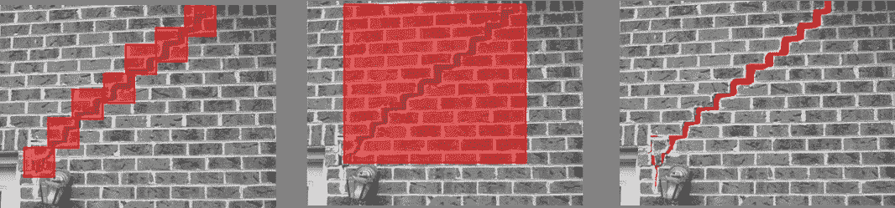
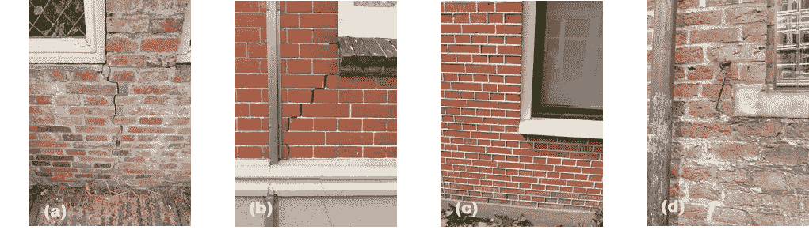
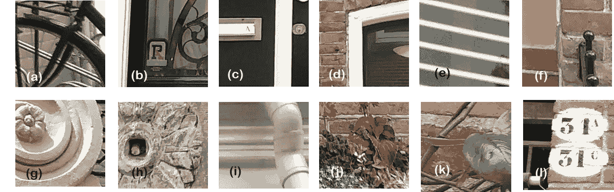
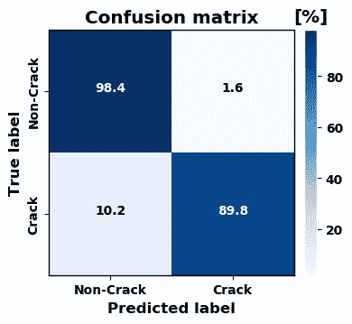
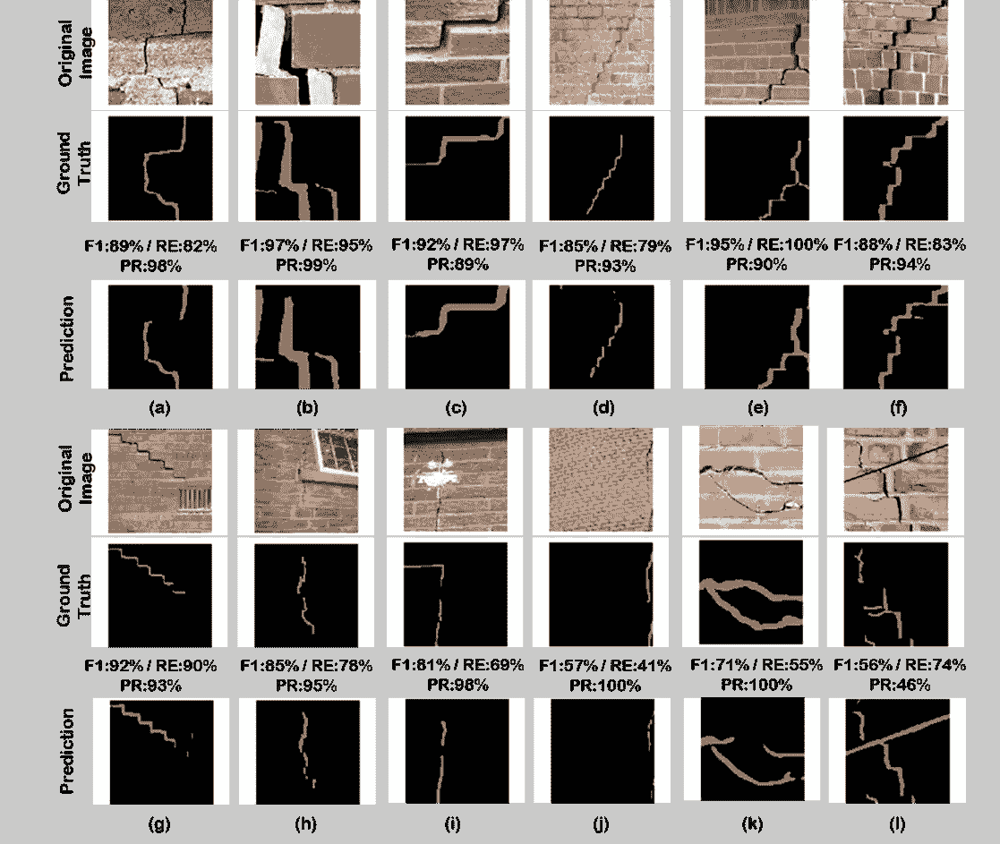
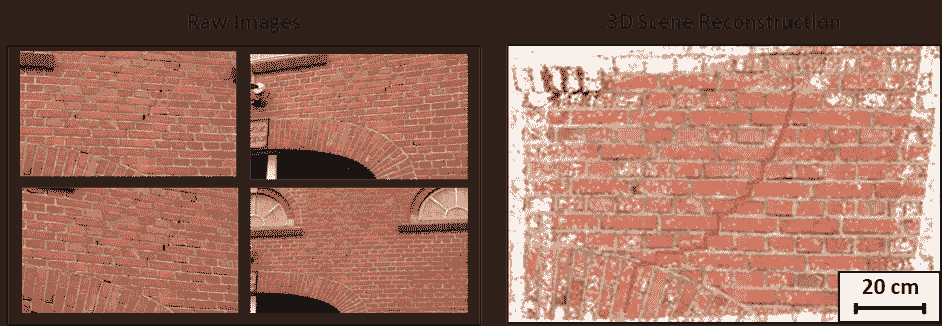

# 利用 Python 深度学习进行裂缝检测

> 原文：<https://towardsdatascience.com/deep-learning-with-python-for-crack-detection-eceeeb3e182e?source=collection_archive---------4----------------------->

## [实践教程](https://towardsdatascience.com/tagged/hands-on-tutorials)

## 利用人工智能将结构检测带入 21 世纪！

# 问题陈述

虽然新技术几乎改变了我们生活的方方面面，但建筑领域似乎正在奋力追赶。目前，建筑物的结构状况仍然主要由人工检查。简而言之，即使在今天，当一个结构需要检查任何损坏时，工程师也会手动检查所有表面，并拍摄大量照片，同时记录任何裂缝的位置。然后需要在办公室再花几个小时来整理所有的照片和笔记，试图做出一份有意义的报告。显然，这是一个费力、昂贵且主观的过程。除此之外，还会出现安全问题，因为建筑物的某些部分存在出入限制，很难到达。举个例子，金门大桥需要定期检查。换句话说，直到最近，还会有受过特殊训练的人爬过这座风景如画的建筑，检查它的每一寸。

金门大桥(照片由[免费提供-照片](https://pixabay.com/users/free-photos-242387/)在 [Pixabay](https://pixabay.com/images/id-1149942/) 上)

幸运的是，如今在存在可访问性问题的情况下，无人机(如无人机)被部署来拍照，但人们仍然需要花费数小时来检查每张照片是否有损坏的迹象。

这就是我们革新检测过程的工作。人工智能占据主导地位，更具体地说，深度学习通过训练我们的机器来代替人类完成检测结构照片裂缝的乏味任务。

从照片中检测裂缝有三个级别:

图像被分成小块，每个小块被分配一个裂纹或非裂纹标签

在任何检测到的裂缝周围绘制一个矩形

每个像素被标记为有裂纹或无裂纹

使用图像块分类(左)、边界框回归(中)和像素分割(右)进行裂缝检测( [Dais 等人，2021](https://doi.org/10.1016/j.autcon.2021.103606) )

虽然已经针对混凝土表面或沥青广泛研究了用于裂缝检测的深度学习方法，但是对于基于视觉的评估，特别是应用于砖砌体表面的缺陷检测，很少进行研究。作为我和导师博士研究的一部分，我们试图弥合这一差距。我们工作的重点是在补丁和像素级别上检测砖石表面照片上的裂缝。关于我们研究的更多细节可以在我们的开放存取期刊论文中找到。与实现深度学习模型相关的代码、数据和网络可以在我的 [GitHub 库](https://github.com/dimitrisdais/crack_detection_CNN_masonry)【2】中找到。

# 数据集准备

训练深度学习模型最重要的部分是数据；模型的准确性很大程度上依赖于数据的质量和数量。真实世界的表现越好，模型能够在真实结构上精确工作的机会就越高。毫无疑问，与混凝土或沥青相比，砖石的表面不太均匀，噪音也大得多。此外，没有可用的砖石表面有裂缝的照片数据集。为了解决数据缺乏的问题，我在网上查找相关的照片，同时我用相机拍下了格罗宁根市中心的所有裂缝！

对已开发的深度学习方法的一个常见批评是，当在单调背景上测试时，它们获得了显著的结果，但当部署在复杂背景的图像上时，它们的准确性严重下降。诸如窗户、门、装饰品、标签、灯、电缆、植物等物体。可以被表征为裂纹检测过程的噪声，并且网络需要学习去否定它们以准确地检测裂纹。因此，在拍照时，这些物体也被有意包含在内。

因此，从包含复杂背景的砖石结构的照片中准备了一个广泛的数据集，现在我们准备好了下一步:训练深度学习模型。

有裂缝和无裂缝结构的图像([戴斯等人，2021](https://doi.org/10.1016/j.autcon.2021.103606)

可在建筑物正面发现的物体( [Dais 等人，2021](https://doi.org/10.1016/j.autcon.2021.103606) )

# 培训模式

请准备好主菜！

关于小块水平上的裂缝检测，本文检验了在 ImageNet 上预训练的不同技术状态的 CNN 将来自小块水平上的砌体表面的图像分类为裂缝或非裂缝的有效性。考虑的网络有:VGG16、MobileNet、MobileNetV2、InceptionV3、DenseNet121、DenseNet169、ResNet34 和 ResNet50。预训练的 MobileNet 获得了最好的结果，这是一种轻量级网络，注定要在计算有限的平台上运行。特别是，预训练的 MobileNet 得分准确率为 95.3%，而当不考虑预训练时，准确率下降到 89.0%。

使用 MobileNet 获得的混淆矩阵( [Dais 等人，2021](https://doi.org/10.1016/j.autcon.2021.103606) )

对于裂缝分割 U-net 和特征金字塔网络，考虑了一种通用金字塔表示法，并与作为网络编码器部分主干的不同 CNN 相结合【3】。用作主干的 CNN 是以前用于补丁分类的网络。此外，基于 VGG16 网络的 DeepLabv3+、DeepCrack 和 FCN 在裂缝分割的文献中成功使用，也在广泛的比较研究中进行了检验。

U-net-MobileNet (U-Net 作为基础模型，MobileNet 作为主干)和 FPN-InceptionV3 (FPN 作为基础模型，InceptionV3 作为主干)获得了最高的 F1 分，即 79.6%。未经预训练的 U-net 和 U-net-MobileNet 的原始实现达到了相似的 F1 分数，分别为 75.7%和 75.4%。因此，使用预训练的网络作为主干将 F1 分数提高了约 4%。再一次，迁移学习似乎很有用！

用于裂缝分割的数据集的特征在于严重的类别不平衡，即背景类别占据了照片的最大部分，而裂缝在有限的像素上延伸。由于这种不平衡，如果不采取特殊措施，网络倾向于在预测背景类别时变得过于自信，这可能导致裂缝的错误分类和大量的假阴性。为了克服这一点，研究了不同的损失函数。加权交叉熵损失函数优于其他函数，它允许网络通过增加正错误的成本来关注正类。

原始图像、地面真相和使用 U-net-MobileNet 的预测([戴伊等人，2021](https://doi.org/10.1016/j.autcon.2021.103606)

# 结论

通过我们的研究，我们展示了建筑行业的现代化，特别是检验过程的现代化是可能的。当然，这些新技术有无限的可能性，只有通过进一步的研究才能发现。

目前，我们收集更多的数据，进一步开发裂缝检测过程，并将其与 3D 场景重建相结合，以自动记录裂缝并进行度量测量。

利用 3D 场景重建进行裂缝检测(图片由作者提供)

所以，跟着我保持更新！😊

👉[https://www.linkedin.com/in/dimitris-dais/](https://www.linkedin.com/in/dimitris-dais/)

# 参考

[1]戴斯、i̇.e.·巴尔、斯米罗、萨霍西斯，利用卷积神经网络和迁移学习对砌体表面裂缝进行自动分类和分割，建筑自动化。(2021)第 125 页，第 103-606 页。https://doi.org/10.1016/j.autcon.2021.103606[。](https://doi.org/10.1016/j.autcon.2021.103606)

[2]砌体表面裂缝检测:GitHub 知识库【https://github.com/dimitrisdais/crack_detection_CNN_masonry 

[3][https://github.com/qubvel/segmentation_models](https://github.com/qubvel/segmentation_models)