# Python 深度学习:神经网络(完整教程)

> 原文：<https://towardsdatascience.com/deep-learning-with-python-neural-networks-complete-tutorial-6b53c0b06af0?source=collection_archive---------0----------------------->


作者图片

## 用 TensorFlow 建立、绘制和解释人工神经网络

## 摘要

在这篇文章中，我将展示如何用 Python 构建神经网络，以及如何使用可视化和创建模型预测的解释器向业务解释深度学习。


作者图片

[**深度学习**](https://en.wikipedia.org/wiki/Deep_learning) 是一种模仿人类获取某些类型知识的方式的机器学习，与标准模型相比，它在这些年里变得更受欢迎。虽然传统算法是线性的，但深度学习模型，通常是神经网络，堆叠在复杂性和抽象性不断增加的层次结构中(因此是深度学习中的“深度”)。

[**神经网络**](https://en.wikipedia.org/wiki/Artificial_neural_network) 基于一组相互连接的单元(神经元)，这些单元就像大脑中的突触一样，可以向其他神经元传递信号，这样，它们就像相互连接的脑细胞一样，可以以更像人类的方式学习和做出决定。

今天，深度学习非常受欢迎，许多公司都想使用它，即使他们并不完全理解它。通常，数据科学家首先必须为业务简化这些复杂的算法，然后解释和证明模型的结果，这对于神经网络来说并不总是简单的。我认为最好的方法是通过想象。

我将展示一些有用的 Python 代码，这些代码可以很容易地应用于其他类似的情况(只需复制、粘贴、运行)，并通过注释遍历每一行代码，以便您可以复制这些示例。

特别是，我将经历:

*   环境设置，*tensor flow*vs*py torch。*
*   人工神经网络分解，输入，输出，隐藏层，激活函数。
*   用深度神经网络进行深度学习。
*   使用 *tensorflow/keras* 进行模型设计。
*   用 *python 实现神经网络可视化。*
*   模型培训和测试。
*   用*形状解释。*

## 设置

构建神经网络的库主要有两个:[***tensor flow***](https://www.tensorflow.org/)(Google 开发)和[***py torch***](https://pytorch.org/)(脸书开发)*。他们可以执行类似的任务，但前者更适合生产，而后者则适合快速构建原型，因为它更容易学习。*

这两个库受到社区和企业的青睐，因为它们可以利用 NVIDIA GPUs 的强大功能。这对于处理大型数据集(如文本集或图片集)非常有用，有时也是必要的。

对于本教程，我将使用 *TensorFlow* 和 [*Keras*](https://www.tensorflow.org/api_docs/python/tf/keras) ，这是一个比纯 *TensorFlow* 和 *PyTorch* 更友好的高级模块，尽管速度稍慢。

第一步是通过终端安装 *TensorFlow* ;

```
pip install tensorflow
```

如果你想启用 GPU 支持，你可以阅读[官方文档](https://www.tensorflow.org/install/gpu)或遵循本[指南](/installing-tensorflow-with-cuda-cudnn-and-gpu-support-on-windows-10-60693e46e781)。设置好之后，你的 Python 指令会被你的机器翻译成[*CUDA*](https://en.wikipedia.org/wiki/CUDA)*并由 GPU 处理，这样你的模型运行起来会快得令人难以置信。*

*现在，我们可以在笔记本上导入来自 *TensorFlow Keras* 的主要模块，并开始编码:*

```
*from **tensorflow**.keras import models, layers, utils, backend as K
import **matplotlib**.pyplot as plt
import **shap***
```

## *人工神经网络*

*人工神经网络由具有输入和输出维度的层组成。后者由**神经元**(也称为“节点”)的数量决定，这是一个通过**激活函数**(帮助神经元打开/关闭)连接加权输入的计算单元。像大多数机器学习算法一样，在训练期间随机初始化和优化**权重**，以最小化损失函数。*

*这些层可以分为:*

*   ***输入层**负责将输入向量传递给神经网络。如果我们有一个 3 个特征的矩阵(形状 N×3)，这一层将 3 个数字作为输入，并将相同的 3 个数字传递给下一层。*
*   ***隐层**代表中间节点，它们对数字进行多次变换，以提高最终结果的准确性，输出由神经元的数量来定义。*
*   ***输出层**，返回神经网络的最终输出。如果我们正在做一个简单的二进制分类或回归，输出层将只有 1 个神经元(因此它只返回 1 个数字)。在具有 5 个不同类别的多类别分类的情况下，输出层将具有 5 个神经元。*

*ANN 最简单的形式是 [**感知器**](https://en.wikipedia.org/wiki/Perceptron) ，一个只有一层的模型，非常类似于线性回归模型。问感知器内部发生了什么，相当于问多层神经网络的单个节点内部发生了什么……我们来分解一下。*

*假设我们有一个包含 N 行、3 个特征和 1 个目标变量(即二进制 1/0)的数据集:*

*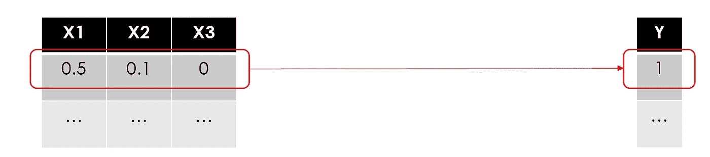*

*图片作者。我在 0 和 1 之间放了一些随机数(数据在被输入神经网络之前应该总是被缩放)。*

*就像在所有其他机器学习用例中一样，我们将训练一个模型，使用逐行的特征来预测目标。让我们从第一排开始:*

*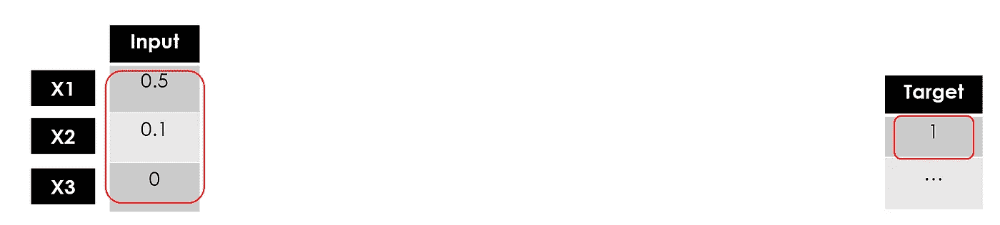*

*作者图片*

*“训练一个模特”是什么意思？在数学公式中寻找最佳参数，使预测误差最小化。在回归模型(即线性回归)中，您必须找到最佳权重，在基于树的模型(即随机森林)中，这是关于找到最佳分割点…*

**

*作者图片*

*通常，权重是随机初始化的，然后随着学习的进行进行调整。在这里，我将把它们都设置为 1:*

*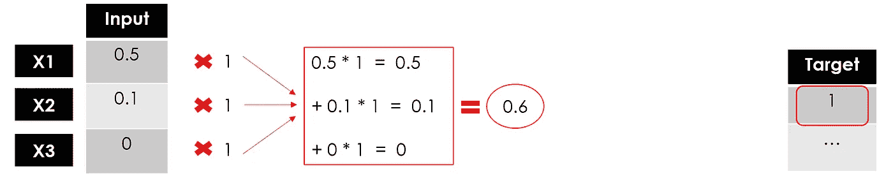*

*作者图片*

*到目前为止，我们还没有做任何不同于线性回归的事情(这对于企业来说很容易理解)。现在，这里是从线性模型***σ(****Xi * wi****)= Y***到非线性模型**【σ(Xi * wi)****)= Y…***进入激活功能。**

****

**作者图片**

**激活函数定义了该节点的输出。有很多，甚至可以创建一些自定义函数，你可以在[官方文档](https://www.tensorflow.org/api_docs/python/tf/keras/activations)中找到详细信息，并看看这个[备忘单](https://en.wikipedia.org/wiki/Activation_function)。如果我们在示例中设置一个简单的线性函数，那么我们与线性回归模型没有区别。**

****

**来源:[维基百科](https://en.wikipedia.org/wiki/Activation_function)**

**我将使用一个只返回 1 或 0 的二进制步骤激活函数:**

****

**来源:[维基百科](https://en.wikipedia.org/wiki/Activation_function)**

**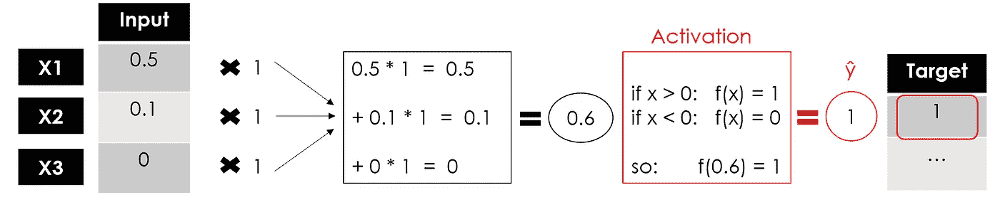**

**作者图片**

**我们有感知器的输出，感知器是一个单层神经网络，它接受一些输入并返回 1 个输出。现在，模型的训练将通过将输出与目标进行比较、计算误差和优化权重来继续，一次又一次地重复整个过程。**

**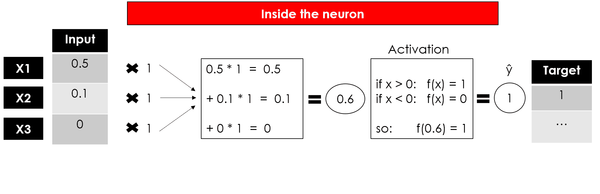**

**作者图片**

**这是一个神经元的常见表现:**

****

**作者图片**

## **深度神经网络**

**可以说所有的深度学习模型都是神经网络，但并不是所有的神经网络都是深度学习模型。一般来说，“深度”学习适用于算法至少有 2 个隐藏层的情况(所以包括输入和输出总共有 4 层)。**

**想象同时复制神经元过程 3 次:由于每个节点(加权和&激活函数)返回一个值，我们将有第**个隐藏层**有 3 个输出。**

****

**作者图片**

**现在让我们再次使用这 3 个输出作为第二个隐藏层**的输入，返回 3 个新数字。最后，我们将添加一个**输出层**(仅 1 个节点)来获得我们模型的最终预测。****

**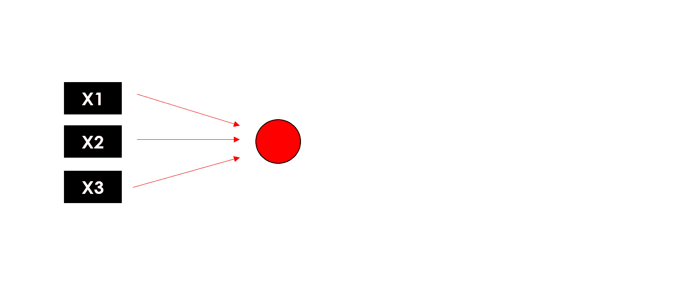**

**作者图片**

**请记住，这些层可以有不同数量的神经元和不同的激活函数，并且在每个节点中，训练权重以优化最终结果。这就是为什么添加的层数越多，可训练参数的数量就越大。**

**现在你可以回顾一下神经网络的全貌:**

**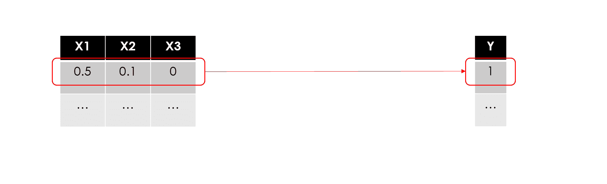**

**作者图片**

**请注意，为了尽可能保持简单，我没有提到业务可能不感兴趣的某些细节，但数据科学家肯定应该知道。特别是:**

*   ****偏差**:在每个神经元内部，输入和权重的线性组合也包括偏差，类似于线性方程中的常数，因此神经元的完整公式为**

> *****【f】(****【Xi * Wi】+偏置* ***)*****

*   ****反向传播**:在训练期间，模型通过将误差传播回节点并更新参数(权重和偏差)来学习，以最小化损失。**

****

**来源: [3Blue1Brown (Youtube)](https://www.youtube.com/watch?v=Ilg3gGewQ5U)**

*   ****梯度下降**:用于训练神经网络的优化算法，该算法通过在最陡下降方向上采取重复步骤来找到损失函数的局部最小值。**

**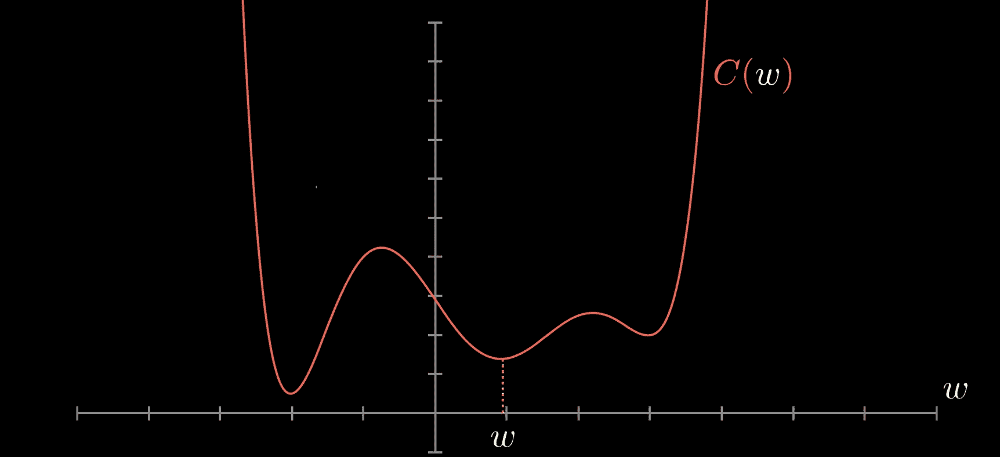**

**来源: [3Blue1Brown (Youtube](https://www.youtube.com/watch?v=IHZwWFHWa-w)**

## **模型设计**

**用 *TensorFlow* 构建神经网络最简单的方法是用 *Keras 的 ***序列*** 类。*让我们用它来制作我们之前例子中的感知器，这样一个只有一个**密集层的模型。**它是最基本的层，因为它向所有神经元提供所有输入，每个神经元提供一个输出。**

```
*model = models.**Sequential**(name="**Perceptron**", layers=[ layers.**Dense**(             **#a fully connected layer**
          name="dense",
          input_dim=3,        **#with 3 features as the input**
          units=1,            **#and 1 node because we want 1 output**
          activation='linear' **#f(x)=x**
    )
])
model.summary()*
```

*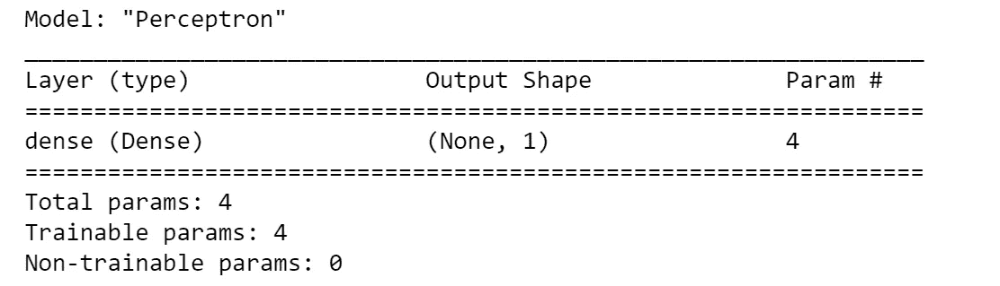*

*作者图片*

*summary 函数提供了结构和大小的快照(根据要训练的参数)。在这种情况下，我们只有 4 个(3 个权重和 1 个偏差)，所以它非常精简。*

*如果你想使用一个还没有包含在 *Keras* 中的激活函数，比如我在可视化示例中展示的*二进制步骤*函数，你必须使用 raw *TensorFlow:**

```
***# define the function**
import **tensorflow** as tfdef **binary_step_activation**(x):
    **##return 1 if x>0 else 0** 
    return **K**.switch(x>0, **tf**.math.divide(x,x), **tf**.math.multiply(x,0)) **# build the model**
model = models.Sequential(name="Perceptron", layers=[
      layers.Dense(             
          name="dense",
          input_dim=3,        
          units=1,            
          activation=**binary_step_activation**
      )
])*
```

*现在让我们尝试从感知器转移到深度神经网络。也许你会问自己一些问题:*

1.  ***多少层？**正确答案是“尝试不同的变体，看看什么有效”。我通常使用两个带有 *Dropout、*的密集隐藏层，这是一种通过将输入随机设置为 0 来减少过度拟合的技术。隐藏层对于克服数据的非线性很有用，所以如果你不需要*非线性*，那么你可以避免隐藏层。隐藏层太多会导致过拟合。*

**

*作者图片*

1.  ***有多少神经元？**隐神经元的数量应该在输入层的大小和输出层的大小之间。我的经验法则是*(输入数+ 1 输出)/2* 。*
2.  ***什么激活功能？有很多，我们不能说有一个是绝对更好的。反正用的最多的是 *ReLU* ，一个分段线性函数，只在输出为正的情况下返回输出，主要用于隐藏层。此外，输出层必须具有与预期输出兼容的激活。例如，*线性*函数适用于回归问题，而 *Sigmoid* 常用于分类。***

**

*来源:[维基百科](https://en.wikipedia.org/wiki/Activation_function)*

*我将假设一个包含 N 个要素和 1 个二元目标变量的输入数据集(最有可能是一个分类用例)。*

```
*n_features = 10model = models.**Sequential**(name="**DeepNN**", layers=[
    **### hidden layer 1**
    layers.**Dense**(name="h1", input_dim=n_features,
                 units=int(round((n_features+1)/2)), 
                 activation='relu'),
    layers.**Dropout**(name="drop1", rate=0.2),

    **### hidden layer 2**
    layers.**Dense**(name="h2", units=int(round((n_features+1)/4)), 
                 activation='relu'),
    layers.**Dropout**(name="drop2", rate=0.2),

    **### layer output**
    layers.**Dense**(name="output", units=1, activation='sigmoid')
])
model.summary()*
```

*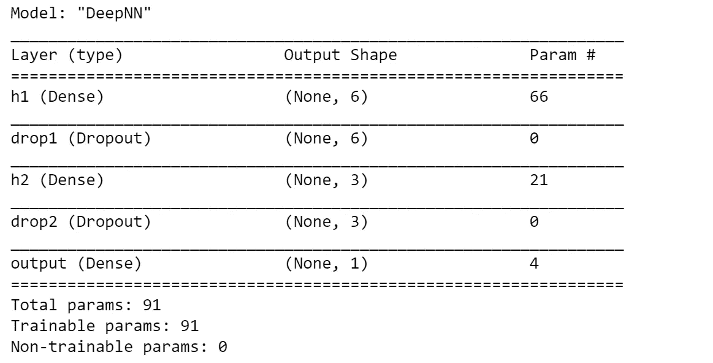*

*作者图片*

*请注意，*顺序*类并不是用 *Keras* 构建神经网络的唯一方法。 ***模型*** 类提供了更多的灵活性和对层的控制，它可以用来构建具有多个输入/输出的更复杂的模型。有两个主要区别:*

*   *需要指定输入层，而在*顺序*类中，它隐含在第一个密集层的输入维度中。*
*   *这些层像对象一样保存，并可应用于其他层的输出，如:*输出=层(…)(输入)**

*这就是你如何使用*模型*类来构建我们的感知器和 DeepNN:*

```
***# Perceptron**
inputs = layers.**Input**(name="input", shape=(3,))
outputs = layers.**Dense**(name="output", units=1, 
                       activation='linear')(inputs)
model = models.**Model**(inputs=inputs, outputs=outputs, 
                     name="**Perceptron**") **# DeepNN**
**### layer input**
inputs = layers.**Input**(name="input", shape=(n_features,))**### hidden layer 1**
h1 = layers.**Dense**(name="h1", units=int(round((n_features+1)/2)), activation='relu')(inputs)
h1 = layers.**Dropout**(name="drop1", rate=0.2)(h1)**### hidden layer 2**
h2 = layers.**Dense**(name="h2", units=int(round((n_features+1)/4)), activation='relu')(h1)
h2 = layers.**Dropout**(name="drop2", rate=0.2)(h2)**### layer output**
outputs = layers.**Dense**(name="output", units=1, activation='sigmoid')(h2)model = models.**Model**(inputs=inputs, outputs=outputs, name="**DeepNN**")*
```

*用户可以随时检查模型摘要中的参数数量是否与*序列*中的参数数量相同。*

## *形象化*

*请记住，我们是在向企业讲述一个故事，而可视化是我们最好的盟友。我准备了一个函数来从它的 *TensorFlow* 模型绘制人工神经网络的结构，下面是完整的代码:*

*让我们在两个模型上试试，首先是感知机:*

```
***visualize_nn**(model, description=True, figsize=(10,8))*
```

*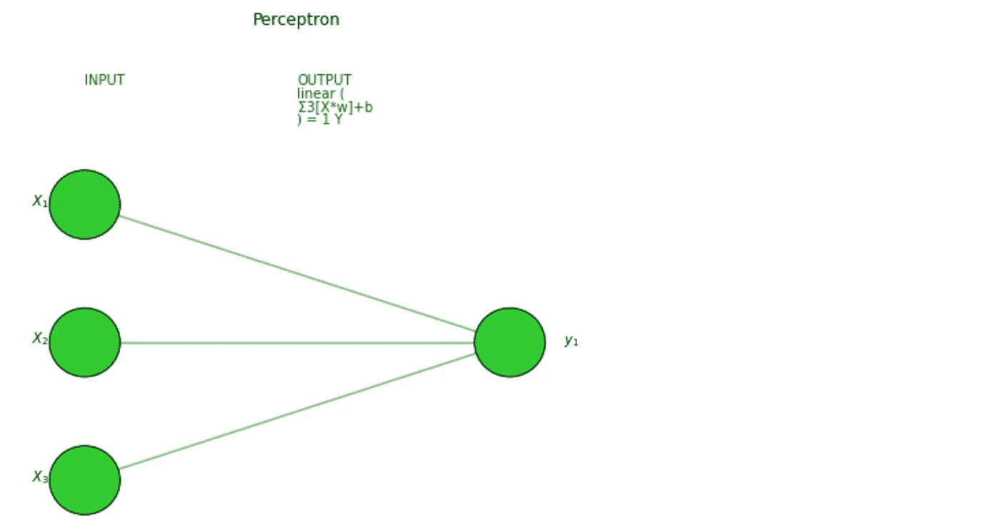*

*作者图片*

*然后是深层神经网络:*

**

*作者图片*

**TensorFlow* 也提供了一个绘制模型结构的工具，你可能想把它用于更复杂的神经网络，包括更复杂的层(CNN，RNN，…)。有时候设置起来有点棘手，如果你有问题[这篇文章](https://stackoverflow.com/questions/47605558/importerror-failed-to-import-pydot-you-must-install-pydot-and-graphviz-for-py)可能会有帮助。*

```
*utils.**plot_model**(model, to_file='model.png', show_shapes=True, show_layer_names=True)*
```

**

*作者图片*

*这会将该图像保存在您的笔记本电脑上，因此，如果您只想在笔记本上绘制它，您可以运行以下命令来删除该文件:*

```
*import **os**
os.remove('model.png')*
```

## *培训和测试*

*最后，是时候训练我们的深度学习模型了。为了让它运行，我们必须“编译”，或者换句话说，我们需要定义**优化器、**损失函数、和**指标**。我通常使用*亚当*优化器，一种梯度下降的替代优化算法(自适应优化器中最好的)。其他参数取决于用例。*

*在(二进制)分类问题中，你应该使用(*二进制)交叉熵*损失来比较每个预测的概率和实际的类输出。至于指标，我喜欢同时监控*精确度*和 *F1 分数*，这是一个结合了*精确度*和*召回*的指标(后者必须实现，因为它还没有包含在 *TensorFlow* 中)。*

```
***# define metrics**
def **Recall**(y_true, y_pred):
    true_positives = **K**.sum(**K**.round(**K**.clip(y_true * y_pred, 0, 1)))
    possible_positives = **K**.sum(**K**.round(**K**.clip(y_true, 0, 1)))
    recall = true_positives / (possible_positives + **K**.epsilon())
    return recall

def **Precision**(y_true, y_pred):
    true_positives = **K**.sum(**K**.round(**K**.clip(y_true * y_pred, 0, 1)))
    predicted_positives = **K**.sum(**K**.round(**K**.clip(y_pred, 0, 1)))
    precision = true_positives / (predicted_positives + **K**.epsilon())
    return precision

def **F1**(y_true, y_pred):
    precision = Precision(y_true, y_pred)
    recall = Recall(y_true, y_pred)
    return 2*((precision*recall)/(precision+recall+**K**.epsilon())) **# compile the neural network** model.compile(optimizer='**adam**', loss='**binary_crossentropy**', 
              metrics=[**'accuracy',F1**])*
```

*另一方面，在回归问题中，我通常将 *MAE* 设为损失，将 *R 平方*设为度量。*

```
***# define metrics**
def **R2**(y, y_hat):
    ss_res =  **K**.sum(K.square(y - y_hat)) 
    ss_tot = **K**.sum(K.square(y - **K**.mean(y))) 
    return ( 1 - ss_res/(ss_tot + **K**.epsilon()) ) **# compile the neural network** model.compile(optimizer='**adam**', loss='**mean_absolute_error**', 
              metrics=[**R2**])*
```

*在开始训练之前，我们还需要决定**时期**和**批次**:由于数据集可能太大而无法一次处理完，所以将其分成批次(批次大小越大，需要的内存空间就越大)。反向传播和随之而来的参数更新在每批中都发生。一个时期是整个训练集的一个阶段。因此，如果您有 100 个观察值，并且批大小为 20，则需要 5 个批来完成 1 个历元。批量大小应该是 2 的倍数(常见的是:32、64、128、256)，因为计算机通常以 2 的幂来组织内存。我倾向于从 100 个 epochs 开始，批量大小为 32。*

*在培训期间，我们希望看到指标不断改进，损失不断减少。此外，最好保留一部分数据(20%-30%)用于**验证。**换句话说，在训练之外，模型将在每个时期结束时将这部分数据分离出来以评估损失和指标。*

*假设您已经将数据准备好放入一些 *X* 和 *y* 数组中(如果没有，您可以简单地生成随机数据，如*

```
*import **numpy** as npX = np.random.rand(1000,10)
y = np.random.choice([1,0], size=1000)*
```

*)，您可以启动并可视化培训，如下所示:*

```
***# train/validation**
training = model.fit(x=X, y=y, batch_size=32, epochs=100, shuffle=True, verbose=0, validation_split=0.3) **# plot** metrics = [k for k in training.history.keys() if ("loss" not in k) and ("val" not in k)]    
fig, ax = plt.subplots(nrows=1, ncols=2, sharey=True, figsize=(15,3))

**## training**    
ax[0].set(title="Training")    
ax11 = ax[0].twinx()    
ax[0].plot(training.history['loss'], color='black')    ax[0].set_xlabel('Epochs')    
ax[0].set_ylabel('Loss', color='black')    
for metric in metrics:        
    ax11.plot(training.history[metric], label=metric)    ax11.set_ylabel("Score", color='steelblue')    
ax11.legend()

**## validation**    
ax[1].set(title="Validation")    
ax22 = ax[1].twinx()    
ax[1].plot(training.history['val_loss'], color='black')    ax[1].set_xlabel('Epochs')    
ax[1].set_ylabel('Loss', color='black')    
for metric in metrics:          
    ax22.plot(training.history['val_'+metric], label=metric)    ax22.set_ylabel("Score", color="steelblue")    
plt.show()*
```

**

*图片作者。分类举例，[笔记本此处](https://github.com/mdipietro09/DataScience_ArtificialIntelligence_Utils/blob/master/machine_learning/example_classification.ipynb)*

**

*图片作者。回归示例，[笔记本此处](https://github.com/mdipietro09/DataScience_ArtificialIntelligence_Utils/blob/master/machine_learning/example_regression.ipynb)*

*这些图取自两个实际的用例，它们将标准的机器学习算法与神经网络进行了比较(每个图像下的链接)。*

## *可解释性*

*我们训练和测试了我们的模型，但是我们仍然没有让企业相信结果…我们能做什么？很简单，我们建立一个解释器来表明我们的深度学习模型不是一个黑盒。*

*我发现[***Shap***](https://shap.readthedocs.io/en/latest/index.html)*与神经网络配合得非常好:对于每一个预测，它能够估计每个特征对模型预测值的贡献。基本上回答了问题“*为什么模型说这是 1 而不是 0？*”。**

**您可以使用以下代码:**

**请注意，您也可以在其他机器学习模型上使用该函数(即线性回归、随机森林)，而不仅仅是神经网络。从代码中可以看出，如果 *X_train* 参数保持为 *None，*我的函数假设它不是深度学习。**

**让我们在分类和回归示例中测试一下:**

```
**i = 1explainer_shap(model, 
               X_names=list_feature_names, 
               X_instance=X[i], 
               X_train=X, 
               task="**classification**", **#task="regression"**
               top=10)**
```

****

**图片作者。分类举例，[笔记本此处](https://github.com/mdipietro09/DataScience_ArtificialIntelligence_Utils/blob/master/machine_learning/example_classification.ipynb)。泰坦尼克号数据集，预测是“幸存”主要是因为哑变量 Sex_male = 0，所以乘客是女的。**

**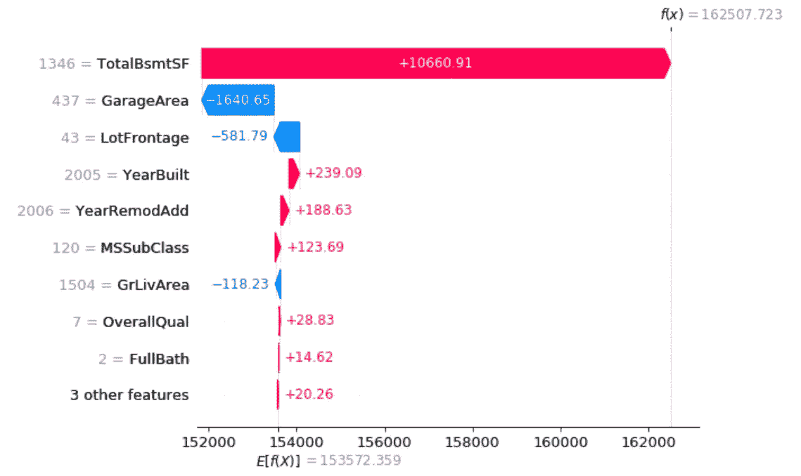**

**图片作者。回归举例，[笔记本此处](https://github.com/mdipietro09/DataScience_ArtificialIntelligence_Utils/blob/master/machine_learning/example_regression.ipynb)。房价数据集，这个房价的主要驱动力是一个大的地下室。**

## **结论**

**这篇文章是一个教程，展示了**如何设计和建立人工神经网络，深度和非深度。**我一步一步地分解了单个神经元内部发生的事情，以及更普遍的各层内部发生的事情。我让故事保持简单，就好像我们正在使用大量的可视化技术向企业解释深度学习一样。**

**在教程的第二部分，我们使用 *TensorFlow* 创建了一些神经网络，从感知器到更复杂的神经网络。然后，我们训练了深度学习模型，并评估了它对分类和回归用例的解释能力。**

**我希望你喜欢它！如有问题和反馈，或者只是分享您感兴趣的项目，请随时联系我。**

> **👉[我们来连线](https://linktr.ee/maurodp)👈**

> **本文是使用 Python 进行机器学习的系列文章**的一部分，参见:****

**[](/machine-learning-with-python-classification-complete-tutorial-d2c99dc524ec) [## 用 Python 进行机器学习:分类(完整教程)

### 数据分析和可视化、特征工程和选择、模型设计和测试、评估和解释

towardsdatascience.com](/machine-learning-with-python-classification-complete-tutorial-d2c99dc524ec) [](/machine-learning-with-python-regression-complete-tutorial-47268e546cea) [## Python 机器学习:回归(完整教程)

### 数据分析和可视化、特征工程和选择、模型设计和测试、评估和解释

towardsdatascience.com](/machine-learning-with-python-regression-complete-tutorial-47268e546cea) [](/clustering-geospatial-data-f0584f0b04ec) [## 聚类地理空间数据

### 使用交互式地图绘制机器学习和深度学习聚类

towardsdatascience.com](/clustering-geospatial-data-f0584f0b04ec) [](/modern-recommendation-systems-with-neural-networks-3cc06a6ded2c) [## 基于神经网络的现代推荐系统

### 使用 Python 和 TensorFlow 构建混合模型

towardsdatascience.com](/modern-recommendation-systems-with-neural-networks-3cc06a6ded2c)**