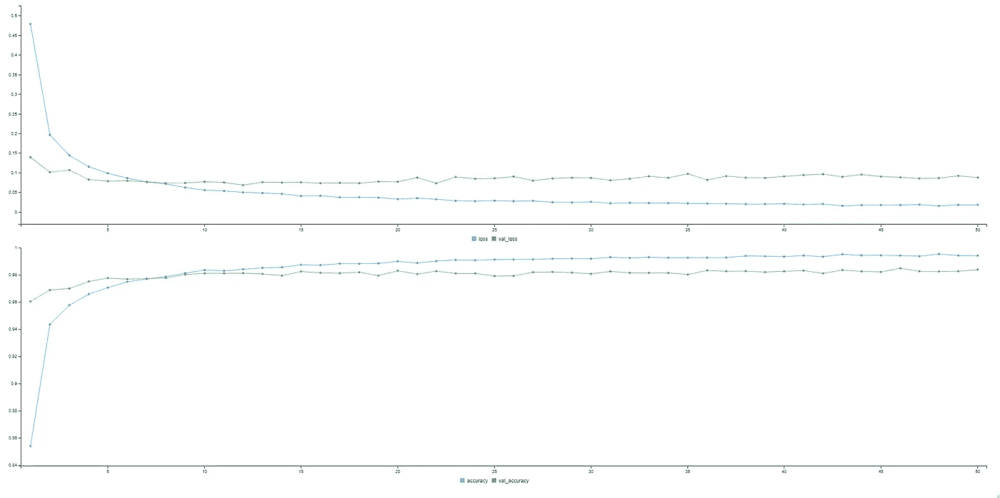

# 使用 R 和 Keras 的深度学习:在 10 分钟内建立一个手写数字分类器

> 原文：<https://towardsdatascience.com/deep-learning-with-r-and-keras-build-a-handwritten-digit-classifier-in-10-minutes-817caeb1c8c6?source=collection_archive---------43----------------------->

## 用 R 和 Keras 在 10 分钟内建立一个手写数字分类器


莎拉·多维勒在 [Unsplash](https://unsplash.com?utm_source=medium&utm_medium=referral) 上拍摄的照片

在一个似乎每个人都知道如何用 Python 解决至少基本的深度学习任务的时代，一个问题出现了:*R 如何融入整个深度学习图景*？

对于 R 迷来说，这里有一些好消息 Tensorflow 和 Keras 库都可供您使用，并且它们很容易配置。今天你将学习如何用 Keras 解决一个著名的 MNIST 问题。

导航到一个部分:

*   用 R 安装 Tensorflow 和 Keras
*   数据集加载和准备
*   模特培训
*   模型评估
*   结论

# 用 R 安装 Tensorflow 和 Keras

要使用 Keras 构建图像分类器模型，您必须首先安装该库。但是在你安装 Keras 之前，你必须安装 Tensorflow。

该过程与安装其他库时略有不同。是的，您仍然会使用`install.packages()`函数，但是有一个额外的步骤。

以下是如何从 R 控制台安装 Tensorflow:

```
install.packages("tensorflow") 
library(tensorflow) 
install_tensorflow()
```

最有可能的是，系统会提示您安装 Miniconda，这是您应该做的事情——假设您还没有安装它。

Keras 的安装过程是相同的，只是要注意必须先安装 Tensorflow:

```
install.packages("keras") 
library(keras) 
install_keras()
```

如果你被要求重启 R 会话——不这样做可能会导致一些 DLL 问题，至少根据 R。

这就是安装库所需的全部内容。接下来让我们加载并准备数据集。

# 数据集加载和准备

幸运的是，MNIST 数据集内置于 Keras 库中。一旦库被导入，就可以通过调用`dataset_mnist()`函数来获得它。

此外，您应该将数据集分成四个类别:

*   `X_train`–包含训练集的数字
*   `X_test`–包含测试集的数字
*   `y_train`–包含训练集的标签
*   `y_test`–包含测试集的标签

您可以使用下面的代码片段来导入 Keras 并解包数据:

这是一个好的开始，但我们还没有完成。本文将只使用线性层(没有卷积)，所以你必须将输入图像从 28×28 调整到 1×784。您可以使用 Keras 的`array_reshape()`功能来实现。此外，您还将图像矩阵的每个值除以 255，因此所有图像都在[0，1]范围内。

这将处理输入图像，但我们还必须转换标签。默认情况下，它们存储为整数，我们将使用`to_categorical()`函数将它们转换为类别。

以下是完整的代码片段:

这就是我们从模特训练开始所需要的。让我们接下来做那件事。

# 模特培训

MNIST 是一个庞大而简单的数据集，因此简单的模型架构应该会产生近乎完美的模型。

我们将有三个分别具有 256、128 和 64 个神经元的隐藏层，以及一个具有 10 个神经元的输出层，因为在 MNIST 数据集中有 10 个不同的类。

为了防止过度拟合，每个线性层后面都有一个剔除。

一旦您声明了模型，您就可以使用`summary()`函数来打印它的架构:

结果如下图所示:


图 1——我们的神经网络架构总结(图片由作者提供)

在我们开始训练之前，还有一个步骤——编译模型。这一步包括选择衡量损失的方式，选择减少损失的功能，以及选择衡量整体性能的指标。

让我们分别讨论分类交叉熵、Adam 和准确性:

你现在可以调用`fit()`函数来训练模型。以下代码片段为 50 个时期训练模型，一次提供 128 幅图像:

一旦执行了这行代码，您将看到以下输出:


图片 2-模型训练(步骤 1)(图片由作者提供)

大约一分钟后，50 个纪元就会过去。这是您应该看到的最终输出:


图 3-模型训练(步骤 2)(图片由作者提供)

同时，您将看到一个图表随着模型的训练而更新。它显示了训练和验证子集的损失和准确性。以下是培训过程完成后的样子:



图 4 —训练集和验证集的损失和准确性(图片由作者提供)

就这样——您已经准备好评估模型了。让我们接下来做那件事。

# 模型评估

您可以使用 Keras 的`evaluate()`函数来评估测试集的性能。下面是这样做的代码片段:

结果如下:


图 5 —对测试集的模型评估(图片由作者提供)

如您所见，该模型对以前看不到的数据产生了 98%以上的准确率。

要对新的数据子集进行预测，可以使用如下所示的`predict_classes()`函数:

结果如下:


图片 6 —测试集上的类预测(图片由作者提供)

这就是如何在 R 中使用 Keras！让我们在下一部分总结一下。

# 结论

大部分深度学习的在线资源都是用 R 写的——我给你那个。这并不意味着 R 在这个领域已经过时了。Tensorflow 和 Keras 都有官方的 R 支持，模型开发就像用 Python 一样简单。

感谢阅读。

喜欢这篇文章吗？成为 [*中等会员*](https://medium.com/@radecicdario/membership) *继续无限制学习。如果你使用下面的链接，我会收到你的一部分会员费，不需要你额外付费。*

<https://medium.com/@radecicdario/membership>  

# 了解更多信息

*   新的 M1 macbook 对数据科学有好处吗？让我们来了解一下
*   [PyTorch + SHAP =可解释的卷积神经网络](/pytorch-shap-explainable-convolutional-neural-networks-ece5f04c374f)
*   [用 Python 调优机器学习模型超参数的 3 种方法](/3-ways-to-tune-hyperparameters-of-machine-learning-models-with-python-cda64b62e0ac)
*   [Python 并行性:几分钟内加速 Python 代码的基本指南](/python-parallelism-essential-guide-to-speeding-up-your-python-code-in-minutes-5ec71cbd88e1)
*   [Python 中的并发性:如何用线程加速你的代码](/concurrency-in-python-how-to-speed-up-your-code-with-threads-bb89d67c1bc9)

# 保持联系

*   关注我的 [Medium](https://medium.com/@radecicdario) 了解更多类似的故事
*   注册我的[简讯](https://mailchi.mp/46a3d2989d9b/bdssubscribe)
*   在 [LinkedIn](https://www.linkedin.com/in/darioradecic/) 上连接
*   查看我的[网站](https://www.betterdatascience.com/)

*原载于 2021 年 2 月 25 日 https://appsilon.com**[*。*](https://appsilon.com/r-keras-mnist/)*