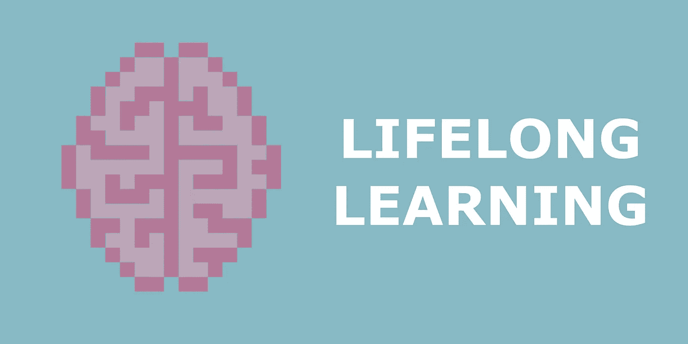

# 深度终身学习——从人脑中汲取灵感

> 原文：<https://towardsdatascience.com/deep-lifelong-learning-drawing-inspiration-from-the-human-brain-c4518a2f4fb9?source=collection_archive---------19----------------------->

## [思想和理论](https://towardsdatascience.com/tagged/thoughts-and-theory)

## 复制人脑的学习机制以防止深度神经网络中的灾难性遗忘

图片作者。

生物不断获得和提高知识和技能，适应新的环境、情况和任务。这种能力可以说是我们作为一个物种仍然活着的原因。正如达尔文的进化论所说——更高的生存机会不属于最强者，而属于最适者。

与具有终生适应能力的动物不同，许多机器学习算法，包括神经网络，在其一生中都是固定的，因此限制了它们的使用案例。模型被训练一次，参数在推断期间被冻结。

然而，在现实世界中，模型将受益于有效处理信息流、学习多种任务和处理输入中的不确定性的能力。

努力扩展经过训练的神经网络的知识通常会导致灾难性的遗忘——从早期训练阶段获得的信息会丢失。在新数据中出现概念漂移的情况下，即训练数据的分布随着时间的推移发生显著变化的情况下，该问题尤其显著。

终身学习(连续/连续/增量)领域涉及开发技术和架构，使模型能够连续学习，而无需从头开始重新训练。

有趣的是，当我们学习新事物时，人类不会发生灾难性的遗忘——参加驾驶课程不会导致忘记如何骑自行车。由于动物大脑的聪明才智，许多成功的终身学习方法，利用大自然的灵感，复制动物大脑中发生的生物过程，这也许并不奇怪，但仍然令人着迷。

这篇文章是一个简短的总结，介绍了与终身学习相关的概念和问题。我将首先讨论用例，接着讨论影响人脑学习过程的生物学因素以及它们与终身学习方法的相似性。

# 可能的使用案例和动机

为了更好地理解终身学习解决的问题的范围和潜在的陷阱，让我们考虑几个终身学习可能派上用场的实际例子。

**聊天机器人:**设想为一家银行构建一个在线助理聊天机器人。这个机器人训练有素，能够就它已经接触过的话题进行交谈。然而，该银行决定通过新的信用卡额度来扩展其服务。当客户询问新服务时，聊天机器人会标记出以前没有见过的话题，并将客户转给接线员。然后操作员将与客户进行对话。

部署时具有学习能力的模型将从客户与运营商的新对话中学习新主题，而不需要在所有对话基础上从头开始重新培训，从而节省时间和金钱。

**生产线:**一家生产红色和蓝色糖果的糖果厂决定用一种新的绿色糖果来扩展其生产线。大多数时候，糖果是混合在一起的，但是需要分类包装。这个环节依赖于计算机视觉分类算法。分类算法现在需要扩展到对新颜色进行分类，而不需要从头开始重新训练。这种情况比聊天机器人更具挑战性，因为我们还需要用新的输出来扩展模型，从而改变网络的结构。

## **我们能不能在模型展开的时候做一次反向传递？**

简而言之，是的，我们可以。但是我们也可能会弄乱网络的权重，丢失在主要训练阶段学到的知识。没有额外的机制，神经网络容易忘记以前获得的知识。但它到底是什么意思，为什么会发生？

神经网络的资源(权重)有限，如果一次又一次地暴露于特定的任务，则可以相当有效地调整到该任务。但由于这些资源是有限的，新知识要么挤压旧知识并使其更加丰富，要么将其挤出。

例如，考虑一个学习预测狗的年龄的网络(对动物收容所非常有用)。该网络将对特征进行编码，可能与狗的面部元素的相对位置和比例有关(我们只对哈士奇和德国牧羊犬进行了训练)。该损失将引导重量梯度朝向用于识别这两个品种年龄的任务的局部最小值的位置。如果我们用更多的品种(例如约克)来扩展这个网络，我们就有可能获得所有狗共有的学习特征。然而，如果我们现在将网络扩展到识别家养鹦鹉的年龄，这种损失将把梯度推向对鹦鹉年龄重要的特征。这些直觉上与狗所需的特征非常不同。如果网络不再接触哈士奇、约克夏和牧羊人的图像，我们就会陷入灾难性的遗忘——失去所有关于狗的年龄的知识。

总之，从非平稳数据分布中不断获取增量可用信息会导致神经网络中灾难性的遗忘或干扰。新信息会覆盖共享表示中以前的知识。在离线学习中，这种损失随着洗牌和重复洗牌而恢复。

# 学习背后的生物学概念

顾名思义*“神经网络”，*这些模型中的一些机制已经受到了动物大脑的启发。也许我们的大脑也包含了在深度模型中防止灾难性遗忘的关键线索？

我们的大脑不断学习和记忆。通过进化过程，这些功能已经被完善以适应我们的日常生活，而不会在学习一个新单词或一项技能后突然崩溃。我们大脑中与神经网络学习方式相关的两个主要机制是稳定性-可塑性困境和互补学习系统理论。这两者都可以给我们一些提示，告诉我们如何防止灾难性遗忘，并为终身学习开发有效的算法。

## **稳定-塑性两难**

稳定性是指大脑保留新知识的能力，可塑性是指获取新知识的能力。

在早期发育的关键时期，大脑尤其具有可塑性。你可能已经注意到，孩子们学得很快，但他们忘得也一样快。在早期保留知识是困难的——当系统在寻找最重要的信号时不断变化。这就是为什么重复新材料对孩子的学习至关重要。有多少次你听到孩子们被问到:“猫说什么？”。

随着生物系统的稳定，可塑性变得不那么突出，我们变得更加依赖学到的知识，并根据经验进行操作。然而，大脑保留了一定程度的可塑性，以适应更小规模的重组。

## 互补学习系统(CLS)理论

该理论概括了记忆形成的神经机制。它基于区分海马体和新皮层在学习和记忆形成过程中的互补作用。

在记忆结构中，海马系统负责新信息的短期适应和快速学习。另一方面，虽然新皮质系统是为长期存储量身定制的，很难重写，但它的学习速度很慢，旨在学习普遍性。

海马系统快速编码情节样事件，然后随着时间的推移重复回放到新皮质系统进行长期保留。据信，在快速动眼期(REM)睡眠期间，近期记忆被整合为长期记忆。

# 神经网络中的终身学习

为处理灾难性遗忘而开发的机制确实从自然界获得了灵感——互补学习理论和稳定性-可塑性困境。并不是下面描述的所有方法都有效，但是，尝试它们对于找到正确的前进方向也很重要。

我在下面的总结部分提供了文献的链接。

## 重放方法

重放方法是基于重复地将模型暴露给新数据和已经训练过的数据——当可以访问这些数据时。新数据与批量中已经看到的示例交错，并被提供给模型的训练步骤。在最简单的情况下，在每个新批次中，旧数据都是随机抽样的。

尽管简单，这种方法有几个注意事项:

*   有效选择范例进行排练的最佳策略是什么？一些已经看到的例子比其他例子更有信息量。这里，最常见的策略是寻找更多信息样本，或者那些代表该方法最初学习的特征的平均值的样本。
*   只看到训练数据的一小部分也提出了一个问题，即如何确保模型不会过拟合？这里提出的方法依赖于正则化。
*   找到批次中新旧样本的比率也不是一件小事。

总的来说，这种重放方法提供了边际性能增益，代价是更长的训练时间和更大的内存需求。

## 基于正则化的方法

与预演方法不同，正则化方法缓解了较高内存需求的问题。这些都集中在开发一个损失项，将巩固所有以前学到的知识。

基于先验的模型估计模型参数的参数分布，并且当暴露于新数据时，不要让模型偏离它太多。

## 资源再分配

我们可以有效地使用可用的网络资源来防止关键区域被覆盖，或者扩展网络以允许更多的计算/存储空间，而不是将模型暴露给已经看到的数据，或者巩固损失项中的知识。

**没有额外的资源:**如果我们不能通过添加新的权重来扩展网络，即资源是固定的，则模型可以使用不同概念的非重叠表示。这种类型的方法也称为参数隔离方法。

对于给定的任务/类，重要的参数被隔离和冻结。类似于稳定性-可塑性困境，[弹性权重整合](https://arxiv.org/pdf/1612.00796.pdf)减缓了对先前学习的任务至关重要的模型部分的学习，而[增量矩匹配(IMM)](https://arxiv.org/pdf/1703.08475.pdf) 匹配在单个架构中对单独任务进行训练的两个网络的参数分布的矩，以捕捉两者学习的知识，防止灾难性的遗忘。

**利用额外资源:**如果我们有能力扩展网络，我们也可以为新知识分配额外的神经资源。在这种配置中，可以直接在新的示例上进行训练，而不需要与原始数据集交错，但是这种方法显然需要更大的内存需求——在最简单的情况下，我们将为新知识的每个部分添加一个新的神经网络。

# 摘要

如果我们要在人工智能方面取得另一次飞跃，探索终身学习算法具有巨大的重要性。特别是随着未来主义 [AutoML](https://en.wikipedia.org/wiki/Automated_machine_learning) 和 [AutoAI](https://en.wikipedia.org/wiki/AutoAI) 的进步。这就是为什么我们看到越来越多的出版物，尤其是像 DeepMind 这样的顶级研究机构的出版物。

终身学习仍然是一个相当新的话题。尽管几份调查报告对迄今取得的成就进行了全面概述:

*   [持续学习调查:对抗分类任务中的遗忘，](https://arxiv.org/pdf/1909.08383.pdf) 2021
*   [神经网络持续终身学习:综述](https://arxiv.org/abs/1802.07569)，2019
*   [持续学习的三种场景](https://arxiv.org/pdf/1904.07734v1.pdf)，2019

不断变化的需求会让它们很快过时。缺乏标准化的协议和数据集也使得评估不同的策略具有挑战性。然而，正如我们从其他领域了解到的那样，这个领域很快就会成熟。

如果你喜欢这篇文章，请与朋友分享！要阅读更多关于机器学习和图像处理的主题，请点击订阅！

我错过了什么吗？不要犹豫，直接给我留言、评论或发消息吧！