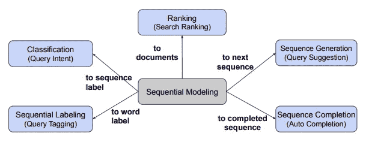
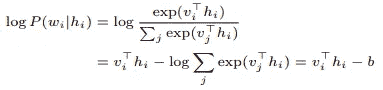
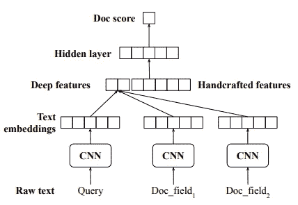
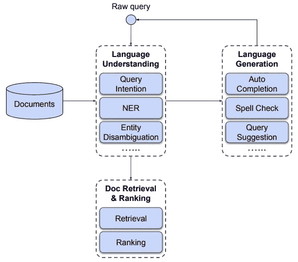

# LinkedIn 搜索系统的深度自然语言处理

> 原文：<https://towardsdatascience.com/deep-natural-language-processing-for-linkedin-search-systems-6d136978bcfe?source=collection_archive---------21----------------------->

## NLP 研究论文摘要

图片来自[来源](https://images.unsplash.com/photo-1509475826633-fed577a2c71b?ixid=MnwxMjA3fDB8MHxwaG90by1wYWdlfHx8fGVufDB8fHx8&ixlib=rb-1.2.1&auto=format&fit=crop&w=1051&q=80)

*在这篇博客中，我尝试根据我的理解总结了 LinkedIn 搜索系统* *的论文* [*。请随时评论你的想法！*](https://arxiv.org/pdf/2108.08252.pdf)

本文介绍了将深度自然语言处理技术应用于五个代表性任务的综合研究，以构建高效且健壮的搜索引擎。除此之外，本文还试图围绕**延迟**、**健壮性、**和**有效性，找到有助于在生产环境中构建和扩展此类系统的三个重要问题的答案。**

*所以事不宜迟，让我们深入研究一下搜索引擎组件。*

# 搜索引擎组件

搜索系统的组成部分|图片来自[来源](https://arxiv.org/pdf/2108.08252.pdf)

如上所示，作者讨论的组件是*查询意图分类、查询标记系统、搜索排名、查询建议和自动完成系统*。让我们稍微了解一下每一个细节——

***查询意图* —** 由于在 LinkedIn，人们可以搜索许多垂直领域*(人员、工作、帮助中心、群组等)*，同样在**联合搜索**的情况下，尝试从所有垂直搜索中检索文档并将它们混合到同一个搜索结果页面中，确定意图变得非常关键。考虑到任务的类型(即文本分类)，作者用 CNN**和 LSTM 模型**进行了游戏实验。经过评估，他们发现这两个系统**表现同样出色**，尽管他们选择了 **CNN 系统，因为它与 LSTMs** 相比延迟稍低。

模型|准确性|延迟—查询意图性能

***查询标记—*** 识别实体，然后**将它们用作特征可以帮助提高其他组件的性能**。例如，作者发现这个特性在文档检索步骤中非常有用。*因为被识别的实体将帮助系统缩小其范围并指向与特定实体类型*相匹配的文档。现有的生产模型使用三类特征:**基于字符、基于单词和基于词典**。关于模型开发，他们试验了通用报告格式、SCRF *(当前系统)*、LSTM-SCRF 模型及其变体。最终，他们发现 SCRF 是所有实验中表现最好的。

***查询建议—*** 查询建议也是整体搜索体验中必不可少的一部分。这就是你在 LinkedIn 的“人们也搜索”协助背后的体验。现有的系统是基于搜索查询的频率及其重构。它从搜索日志中收集查询重构对，并且对于每个输入查询，它基于查询、重构的查询对对建议进行排序。作者遵循某些启发法来识别这些重构，例如查询对必须在同一个会话中，**其中会话由间隔不超过 10 分钟的查询来定义，并且两个查询必须共享至少一个公共词**。

他们还尝试将整个问题公式化为一个**序列来排序任务**，将原始搜索查询作为输入，将重构后的查询作为输出。尽管他们发现该系统比已经部署的系统性能更好。由于这个系统与前一个系统相比有更高的延迟，他们在搜索结果排名的同时为他们的模型服务。

***自动完成—*** 由于查询自动完成类似于语言生成任务，使用语言模型可以帮助我们实现**令人印象深刻的结果**，但代价是**更高的延迟**。作者修改了原始的语言模型概率步骤，让它为每个单词吐出**未标准化的权重**，从而节省了大量的计算时间。这是由于观察到大部分时间花在整个词汇的概率标准化上。*它们近似这种行为，如下所示—*

标准化近似

***文档排名—*** 这里的目标是检索与查询相关的相关文档。作者对人员搜索和帮助中心搜索进行了实验。人民搜索拥有 6 亿会员档案，帮助中心有 2700 个常见问题文档。

因为等待时间是文档排序任务中的主要问题之一。对于帮助中心搜索，由于只有 2，700 个文档，他们预先计算并使用文档嵌入。对于拥有 6 亿成员档案的人民搜索，他们提出了一个两遍排名策略:首先应用一个轻量级模型来选择前数百个文档，然后使用这个精简集通过更深层次的模型来重新排名文档。

下图显示了排序步骤，我们使用 CNN 对查询和其他文档字段进行编码，然后添加手工制作的特征，再添加一个隐藏层来预测文档的相关性分数。

搜索排名模型|图片来自[来源](https://arxiv.org/pdf/2108.08252.pdf)

下图显示了由上述组件构成的搜索引擎的总体系统设计。

搜索系统设计|图片来自[来源](https://arxiv.org/pdf/2108.08252.pdf)

原始搜索查询首先进入 **NLU(自然语言理解)引擎**以处理和识别意图、实体和其他细节。我们还有一个**语言生成引擎**，用于自动完成、建议相关查询等。最后，我们转到**检索和排序系统**，该系统首先检索与搜索查询相关的一堆文档，然后为了提高 CTR(点击率)而对它们进行排序。

## 深度 NLP 什么时候有帮助？

1.  ***自然语言生成/释义任务*** *—* 作者发现深度 NLP 特别有帮助(至少在准确性方面)，尤其是对于语言生成或文本匹配的任务。这是他们在查询建议和文档排序步骤下发现的。

## 如何应对延迟挑战？

1.  ***重新设计算法*** *—* 正如在自动完成步骤中所讨论的，他们应用了**非规范化语言模型**，这有助于他们在保持相同相关性水平的同时显著减少计算时间。
2.  ***并行计算*** *—* 这是他们尝试的查询建议，在这里他们尝试并行运行他们的 seq 模型。
3.  ***预先计算的嵌入*** *—* 对于从开始搜索的**有限集合的任务，预先计算并存储嵌入总是比每次运行时都这样做更好。这就是他们在帮助中心搜索中所做的。**

## **如何保证模型的鲁棒性？**

**对于这一步，作者要做的事情之一是处理训练数据，并通过删除模型中不需要的噪声模式来净化数据，以防止其记忆。*示例参见查询建议部分。***

**其次，他们强调在训练深度网络时，使用手工制作的功能以及其他深度功能。这增加了系统行为的控制和确定性。**

> **如果你愿意，你也可以查看我写的其他研究论文摘要。**

**好了，这篇博客到此为止。这是一个非常有趣的阅读，了解如何设计搜索系统，而不是在书中，而是可以大规模部署。**

**请随意阅读整篇论文，并对作者说“ **Hi** ”，感谢他们的贡献。此外，如果你喜欢看视频而不是文字内容(就像我一样的:D)，一定要看看**

**更多这样的[视频](https://www.youtube.com/channel/UCoz8NrwgL7U9535VNc0mRPA)**

> **⏩论文标题:LinkedIn 搜索系统的深度自然语言处理⏩论文:[https://arxiv.org/abs/2108.08252](https://arxiv.org/abs/2108.08252)⏩作者:、、王思达、迈克尔·卡齐、、傅、高慧姬、、陈伯龙⏩组织:LinkedIn**

**感谢您的宝贵时间！**

**我希望你喜欢读这篇文章。如果你愿意支持我成为一名作家，可以考虑注册[成为](https://prakhar-mishra.medium.com/membership)中的一员。每月只需 5 美元，你就可以无限制地使用 Medium**