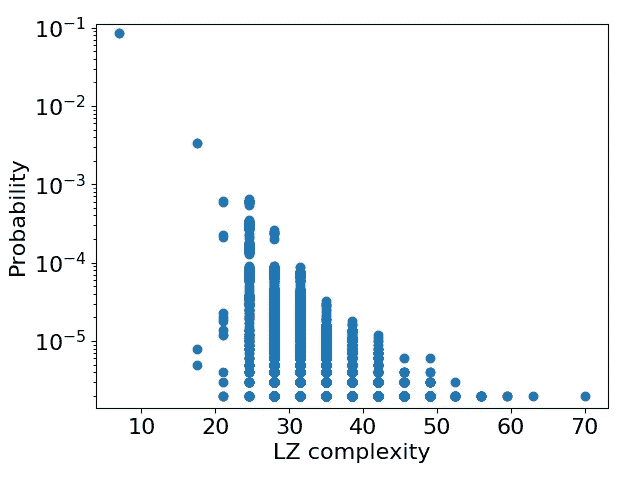

# 深度神经网络在初始化时偏向简单函数

> 原文：<https://towardsdatascience.com/deep-neural-networks-are-biased-at-initialisation-towards-simple-functions-a63487edcb99?source=collection_archive---------30----------------------->

## 为什么这是理解它们为什么起作用的非常重要的一步？

这是[神经网络基本上是贝叶斯](/neural-networks-are-fundamentally-bayesian-bee9a172fad8)的后续文章，它基于【2，3】中的思想，提出了来自【1】的一般化候选理论。阅读顺序并不太重要——这篇文章主要总结了[2.3]中的材料，这些材料研究了为什么神经网络在初始化时偏向简单函数(具有低 Kolmogorov 复杂度)。这项工作激发了[1]中的结果，它解释了初始化时的这种偏差如何转化为现实世界中的良好概括，以及为什么神经网络享受它们所取得的成功！因此，这篇文章最好被认为是一个前传。

我们首先提出以下问题:

> 神经网络在被训练之前表达什么功能？

更具体地说，一个神经网络在被随机初始化后表达一个函数 *f* 的概率是多少？我们将这个量称为 *P(f)* ，并且将随机初始化为同分布高斯(尽管[2]表明 *P(f)* 对初始化的类型不太敏感)。

一般来说，少量更改神经网络中的一个参数会影响网络的原始输出，因此一般来说，神经网络中的参数与其表达的函数之间存在 1–1 的对应关系。然而，对于许多问题，我们对网络的原始输出并不感兴趣。这最好用一个例题来解释。

注意 *P(f)* 表示为*[神经网络中的 Pᵦ ( f )](/neural-networks-are-fundamentally-bayesian-bee9a172fad8)* 基本上是贝叶斯。
如果我们取定义域为定义网络的整个向量空间。

# MNIST 的分类问题

考虑正确分类手写数字 0-9(MNIST 数据集)的图像的问题。我们显然对网络的原始输出不感兴趣——我们只关心它的最终(离散)决策。为了简单起见，让我们假设我们只想将图像分类为偶数或奇数。这可以通过具有单个输出神经元的神经网络来实现，阈值为零——正输出意味着偶数，负输出意味着奇数。

因此，如果我们考虑在 MNIST 的 m 个图像的子集，我们称之为 T18，T19，T20，那么网络 T21 模拟一个函数

*f : S* → {0，1}ᵐ，

其中 1 对应偶数，0 对应奇数。这是因为最终我们(主要)关心的是网络的阈值后输出，而不是原始输出，在这种情况下， *N* 中参数的微小变化可能不会改变所表达的函数(即分类不会改变)。符号{0，1}ᵐ表示 m 个*图像被映射为 0 或 1。*

> 我们可以问，这些函数的 P(f)是什么？

参见下面的**图 1 和图 2** 以获得上述系统的 *P(f)* 的两种可视化。 *P(f)* 使用来自 MNIST 的 100 幅图像，通过从 10⁷对 2 隐层全连接网络的不同随机初始化进行采样来计算。

**图 1:** 直观显示每个函数的不同 P(f)值的一种方法是绘制 P(f)与函数误差的关系图(即有多少图像分类错误)。我们考虑大小为 100 的数据集 *S* 。具有最高 P(f)的两个函数对应于所有图像被分类为相同值(0 或 1)的函数，并且关于 50 误差标记的对称性是因为网络找到函数 *f* 的可能性与找到 f 的逆的可能性相等

**图 2:** 可视化每个函数的不同 P(f)值的另一种方式。函数按概率排序(所以最频繁的函数的秩为 1，依此类推)。我们考虑大小为 m=10、50 和 100 的数据集。红线是假设 P(f) ∝ 1/Rank(f)的理论拟合。显然，P(f)的范围很大。观察到的幂律行为将是未来帖子的主题。

从**图 1 和图 2** 中可以清楚的看到 *P(f)* 中有一个*巨大的*范围。[2]中的结果表明，上述问题的范围超过 30 个数量级。但是这有什么关系呢？

这很重要，因为对于一组 100 个图像，有 2 个⁰⁰ ≈ 10 个⁰不同的可能函数(即，将每个图像分类为偶数或奇数的可能方式)。在没有关于 *N* 的信息的情况下，我们可能会假设每个函数都是同样可能的，这意味着 *P(f)* ≈ 10⁻ ⁰(这将是图像通过无偏抛硬币进行分类的情况)。

考虑到 *P(f)* 可以大到 0.05，神经网络**在初始化**时显然不是无偏的。相反，在进行任何训练之前，在初始化时**存在对某些类型功能的强烈偏好**。

# 有理由期待这一点吗？

有一个定理最初是由莱文提出的，并重新用于输入-输出映射[4],当在神经网络[3]的上下文中使用时，该定理陈述如下:对于从神经网络的参数 *N* 到由 *N* 表示的函数的映射，以下结果成立:

> P(f) ≤ 2⁻ᴷ⁽ ᶠ ⁾⁺ᴼ⁽ ⁾，

其中 *K(f)* 是函数 *f* 的 Kolmogorov 复杂度，O(1)项独立于 *f* 但依赖于 *N* 。**对于神经网络的界限成立，还需要满足一些进一步的条件，但是经验证据[3]加上一些理论结果[2]表明它确实成立，并且不是空的。**

本质上，这意味着复杂函数将具有低的 *P(f)，*而简单函数可以具有大的 *P(f)，* **如果界限是紧的。**然而，Kolmogorov 复杂性是不可计算的——因此，为一般架构和数据集证明这一点，充其量也不是微不足道的。相反,[3]中的一个非常聪明的实验允许我们根据经验测试这个上限。该实验的结果如图 3 所示，其中一个完全连接的网络模拟了以下形式的函数:

> 外宾:{0,1}ⁿ→{0,1}，

因为存在合适的复杂性度量而选择——详情见[3]。

**图 3:** P(f)对 K(f)的近似(详见【3】)。与莱文启发的 P(f)上界相比，它的复杂度也是指数级的！

显然， *P(f)* 对于简单的 *f 来说是指数大的。*存在位于界限之下的函数，但是在[7]中论证了(非常非正式地)可以位于距界限一定距离之外的函数的数量是有限制的。

> 我们称之为**简单偏差**——因为简单函数的 P(f)更高。

来自[1，2，3]的**的大量进一步证据表明，这种简单性偏差是不同架构和数据集的神经网络的普遍属性**。例如，在 MNIST 和 Cifar10 [1，3]上执行了类似的实验，其中 CSR 复杂性度量用于近似 *K(f)* 。在[2]中，还有一个分析结果，即作用于布尔超立方体的感知器偏向于低熵(因此简单)函数。

总而言之:

1.  *P(f)* 是网络随机初始化为某个函数 *f* 的概率。
2.  理论和实验结果强烈表明，简单函数的 *P(f)* 比复杂函数的大

还要注意，具有大的 *P(f)* 的函数在参数空间中具有更大的“体积”(详见[1，2])。这在直觉上是显而易见的——如果您更有可能对某个函数进行随机采样，那么它必定有更多的相关参数，因此参数空间也就更大。

请记住，函数是相对于数据集定义的，因为它指定了其定义域和共定义域。

# 但是这对学习来说是好事吗？

人们认为[5]真实世界的数据有一个潜在的简单描述。例如，当我们阅读手写数字时，我们不太担心精确的细节——如果它是一个单一的椭圆形，它可能是零。我们不需要考虑每个像素的精确像素值。

如果我们感兴趣学习的真实世界数据确实有一个简单的底层描述，那么**简单函数将比复杂函数**概括得更好。

考虑一个监督学习问题——来自 MNIST 的训练集 *S* ，包含 *m* 个例子。然后，理想的学习代理将能够从数字的图像(即，从像素值)到数字的分类计算所有 functions⁴的 Kolmogorov 复杂度。然后，它会丢弃所有没有正确预测所有 *S.* 中所有 *m* 个示例的函数。最后，在这些函数中，它会选择具有最低 Kolmogorov 复杂度的函数。

**换句话说，一个理想的学习代理会选择适合训练数据的最简单的函数。**

相对于某些 UTM 的⁴Defined(详见[3])。

# 那么神经网络是这样工作的吗？

在这一点上，如果你已经读过[神经网络基本上是贝叶斯](/neural-networks-are-fundamentally-bayesian-bee9a172fad8)，你可以停止阅读，因为你已经知道答案了！如果您还没有，那么请检查一下，因为它:

1.  解释我们如何在原则上使用神经网络中的随机抽样来学习，以贝叶斯方式(以及这意味着什么)，这样在训练后，它以与 *P(f)* 成比例的概率表达**函数 *f* 。**
2.  在[1]中总结了大量的经验证据，证明了像 SGD 这样的随机优化者的行为方式与上一点中讨论的假设学习代理非常相似。

因此，神经网络概括得很好，因为对于概括得更好的简单函数来说， *P(f)* 大得多。

# 结论

这是对[2，3]中主要结果的一个非常简短的总结。还有进一步的实验证明 *P(f)* 对初始化的选择不敏感，以及如何在真实世界数据集(例如 cifar10 和 MNIST)中发现观察到的**简单偏差**，使用称为 CSR 的复杂性度量。

最后一点是关于归纳偏差的强度——显然我们只有一个上限——它不能保证概率真的随复杂性呈指数变化。如果偏差太弱，那么我们就不可能以很高的概率得到很好的概括。

PAC-Bayes 界限提供了一般化的概率界限。这个界限在[1，6]中的应用表明，对于真实世界数据集上的尖端架构， *P(f)* 中的简单性偏差足以保证良好的泛化。这将是以后文章的主题！

最后，如果你认为我错过了什么或者说了什么不准确的话，请告诉我。也请注意，这是我对许多合作者所做工作的解释，虽然我相信它准确地接近了他们的观点，但它可能并不总是完美的代表！

# 参考

[1] C .明加德、g .瓦莱-佩雷斯、j .斯卡尔塞、a .路易斯。SGD 是贝叶斯采样器吗？嗯，差不多了。(2020)[https://arxiv.org/abs/2006.15191](https://arxiv.org/abs/2006.15191)

[2] C .明加德、j .斯卡尔塞、g .瓦莱-佩雷斯、d .马丁内斯-卢比奥、v .米库利克、a .路易斯。神经网络先验地偏向于低熵函数。(2019)[https://arxiv.org/abs/1909.11522](https://arxiv.org/abs/1909.11522)

[3] G .瓦莱-佩雷斯，c .卡马戈，a .路易斯。深度学习泛化是因为参数-函数图偏向简单函数。(2018)[https://arxiv.org/abs/1805.08522](https://arxiv.org/abs/1805.08522)

[4]卡马鲁丁·丁格尔、奇科·卡马戈和阿尔达·路易投入产出图强烈偏向简单产出(2018)。自然通讯，9(1):761。

[5]于尔根·施密德胡伯。发现具有低 kolmogorov 复杂性和高概括能力的问题解决方案(1994)。第十二届国际会议文集。

[6]阿尔德·路易斯·吉列尔莫·瓦莱-佩雷斯。深度学习的泛化边界(2020)。[https://arxiv.org/abs/2012.04115](https://arxiv.org/abs/2012.04115)

[7] Dingle，k .，Pérez，G.V .和 Louis，A.A.《基于投入和产出复杂性的产出概率的一般预测》。 *Sci Rep* **10，** 4415 (2020)。【https://doi.org/10.1038/s41598-020-61135-7 