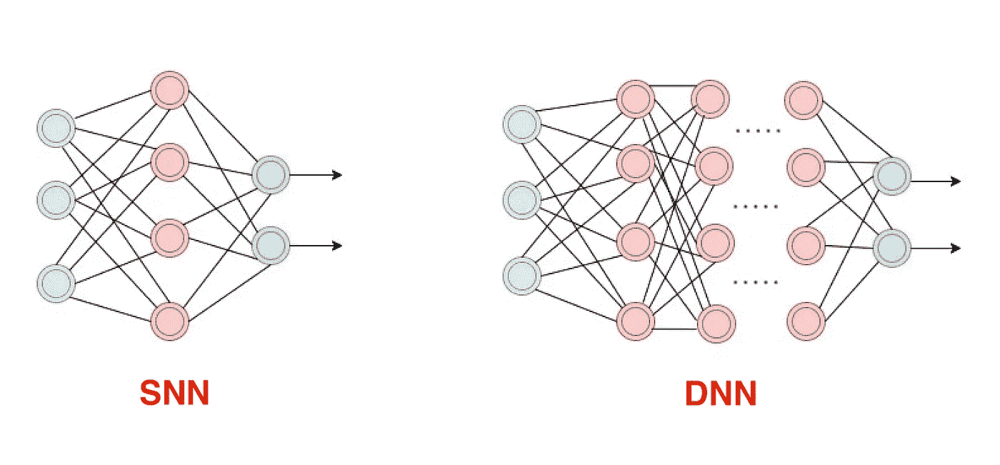
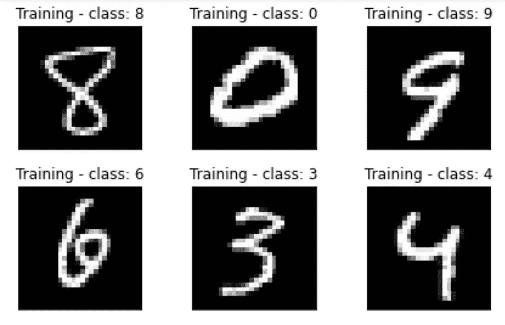
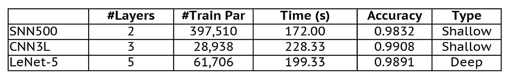
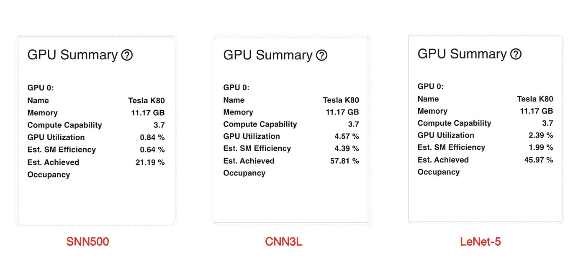
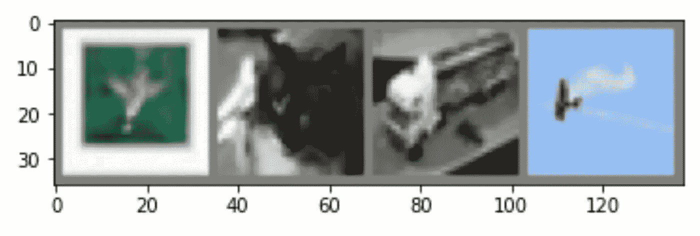
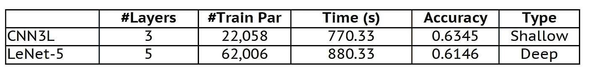
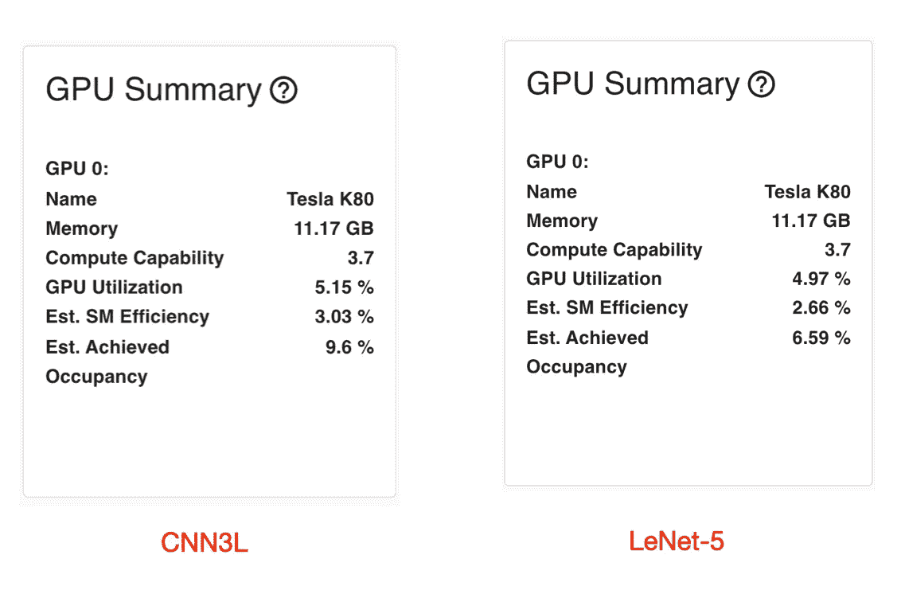

# 深度神经网络:如何定义？

> 原文：<https://towardsdatascience.com/deep-neural-networks-how-to-define-73d87bf36421?source=collection_archive---------31----------------------->

## 正确定义什么使神经网络变得更深很重要。这篇文章提出了深度神经网络的另一种定义。


Jonathan Borba 在 Unsplash 上拍摄的照片。

现在人工智能(AI)的成功，基本上是得益于深度学习(DL)及其相关模型。DL 是机器学习(ML)的一个子领域，其中一组算法试图利用几个处理层对高级数据抽象进行建模，其中每种类型的层都有特定的用途。

然而，深度神经网络(DNNs)，如深度卷积神经网络([CNN](/a-comprehensive-guide-to-convolutional-neural-networks-the-eli5-way-3bd2b1164a53))，是基于多层感知器(MLP)，这是一类已经使用了相当长时间的前馈人工神经网络，甚至在 1989 年[第一个 CNN](https://ieeexplore.ieee.org/document/6795724) 出现之前。因此，问题来了:什么时候一个模型/网络被认为是“深”而不是“浅”？

# 浅层 x 深层神经网络

传统上，浅层神经网络(SNN)是具有一个或两个隐藏层的网络。因此，深度神经网络(DNN)是具有两个以上隐藏层的网络。这是最被接受的定义。下面，我们展示了一个 SNN 和 DNN 的例子(隐藏层是红色的)。



图片作者。

但是，只考虑隐藏层的数量是一个好方法吗？正确定义什么使一个模型变得深刻，对于明确理解这个概念是很重要的，特别是从行业采用 DL 的角度来看。在这篇文章中，我们提出了 DNNs 的另一种定义。我们建议，被视为“深度”的模型不仅应考虑隐藏层的数量，还应考虑:

a.)考虑训练和/或评估它所需的时间；

b.)考虑到计算平台(例如 GPU)方面的需求。

经典基准数据集(如 CIFAR-10、ImageNet)和标准环境/平台(Google Colab、kaggle)可用于获得这些度量。为了支持对另一个定义的需求，我们将使用两个传统数据库:修改后的国家标准与技术研究所( [MNIST](http://yann.lecun.com/exdb/mnist/) )和 [CIFAR-10](https://www.cs.toronto.edu/~kriz/cifar.html) [。](https://www.cs.toronto.edu/~kriz/cifar.html].)

# MNIST 数据库

关于 MNIST 数据库，我们考虑了三个神经网络:Aviv Shamsian 的 SNN500、T2 的 CNN3L、T4 的 Nutan、T5 和 Bolla Karthikeya 的 LeNet-5。SNN500 是一个包含 500 个神经元的单隐层 SNN。CNN3L 也被认为是 SNN，因为它有两个隐藏(卷积)层和输出层。第三个网络是经典的 LeNet-5，有五层，其中四层是隐藏层。让我们看看代码([访问这里](https://github.com/vsantjr/DeepLearningMadeEasy/blob/temp_23-09/PyTorch_MNIST.ipynb))。



图片作者。

```
**import** **torch**
**import** **torch.nn** **as** **nn**
**import** **torchvision.datasets** **as** **dsets**
**import** **torchvision.transforms** **as** **transforms**
**from** **torch.autograd** **import** Variable
**from** **prettytable** **import** PrettyTable
**import** **matplotlib.pyplot** **as** **plt**
**import** **time***# This function obtains the number of trainable parameters of the* 
*# model/network.*
**def** count_parameters(model):
    table = PrettyTable(["Modules", "Parameters"])
    total_params = 0
    **for** name, parameter **in** model.named_parameters():
        **if** **not** parameter.requires_grad: **continue**
        param = parameter.numel()
        table.add_row([name, param])
        total_params+=param
    print(table)
    print(f"Total trainable params: **{**total_params**}**")
    **return** total_params*# Just visualising some images*
**def** visualise_images(img, lab, t):
   fig = plt.figure()
   **for** i **in** range(6):
     plt.subplot(2,3,i+1)
     plt.tight_layout()
     plt.imshow(img[i][0], cmap='gray', interpolation='none')
     plt.title("**{}** - class: **{}**".format(t,lab[i]))
     plt.xticks([])
     plt.yticks([])
```

现在，我们定义类的数量和一些超参数。请注意，批量大小为 100。

```
num_classes = 10 *# Number of output classes, discrete range [0,9]*

*# Hyper-parameters*
num_epochs = 20 *# Number of epochs*
batch_size = 100 *# The size of input data took for one iteration*
lr = 1e-3 *# Learning rate*
```

我们下载并处理 MNIST 数据集。

```
*# Downloading MNIST dataset*
train_data = dsets.MNIST(root = './data', train = **True**,
                        transform = transforms.ToTensor(), download = **True**)

test_data = dsets.MNIST(root = './data', train = **False**,
                       transform = transforms.ToTensor())

print('#'*20)
print('Training dataset: ', train_data)
print('Test dataset: ', test_data)*# Wrap an iterable around the dataset to enable easy access to the samples.*
train_gen = torch.utils.data.DataLoader(dataset = train_data,
                                        batch_size = batch_size,
                                        shuffle = **True**)

test_gen = torch.utils.data.DataLoader(dataset = test_data,
                                       batch_size = batch_size, 
                                       shuffle = **False**)

device = torch.device("cuda:0" **if** torch.cuda.is_available() **else** "cpu")
print('Device is: ', device)
```

只是快速浏览一下训练数据集。

```
batch_train = enumerate(train_gen)
batch_idx, (batch_train_data, batch_train_classes) = next(batch_train)
print('One batch - training dataset:', batch_train_data.shape)

print('**\n**Each image of the batch:')
**for** i **in** range(batch_train_classes.shape[0]):
  print('Image: **{}** - Input shape: **{}** - Class: **{}**'.format(i, batch_train_data[i].shape, batch_train_classes[i]))
  **if** i == (batch_train_classes.shape[0]-1):
    print('The "image" itself: ', batch_train_data[i])

visualise_images(batch_train_data, batch_train_classes, 'Training')
```

注意一批的形状是:[100，1，28，28]。这意味着一批 100 个图像，一个通道(MNIST 的图像是灰度的)，每个图像的尺寸为 28 x 28 像素。现在，我们定义三个神经网络。基于测试数据集的准确性来测量它们的性能。

```
**class** **SNN500**(nn.Module):
  **def** __init__(self, input_sz, hidden_sz, num_clas):
    super(SNN500,self).__init__()
    self.fc1 = nn.Linear(input_sz, hidden_sz)
    self.relu = nn.ReLU()
    self.fc2 = nn.Linear(hidden_sz, num_clas)

  **def** forward(self,x):
    out = self.fc1(x)
    out = self.relu(out)
    out = self.fc2(out)
    **return** out**class** **CNN3L**(nn.Module):
    **def** __init__(self, num_clas):
        super(CNN3L, self).__init__()
        self.conv1 = nn.Sequential(         
            nn.Conv2d(
                in_channels=1,              
                out_channels=16,            
                kernel_size=5,              
                stride=1,                   
                padding=2,                  
            ),                              
            nn.ReLU(),                      
            nn.MaxPool2d(kernel_size=2),    
        )
        self.conv2 = nn.Sequential(         
            nn.Conv2d(16, 32, 5, 1, 2),     
            nn.ReLU(),                      
            nn.MaxPool2d(kernel_size=2),                
        )
        *# Fully-connected layer*
        self.out = nn.Linear(32 * 7 * 7, num_clas)
    **def** forward(self, x):
        x = self.conv1(x)
        x = self.conv2(x)
        *# Flatten the output of conv2 to (batch_size, 32 * 7 * 7)*
        x = x.view(x.size(0), -1)       
        output = self.out(x)
        **return** output**class** **LeNet5**(nn.Module):          
    **def** __init__(self, num_clas):     
        super(LeNet5, self).__init__()
        *# Convolution* 
        self.conv1 = nn.Conv2d(in_channels=1, out_channels=6, kernel_size=5, stride=1, padding=2, bias=**True**)
        *# Max-pooling*
        self.max_pool_1 = nn.MaxPool2d(kernel_size=2)
        *# Convolution*
        self.conv2 = nn.Conv2d(in_channels=6, out_channels=16, kernel_size=5, stride=1, padding=0, bias=**True**)
        *# Max-pooling*
        self.max_pool_2 = nn.MaxPool2d(kernel_size=2) 
        *# Fully-connected layers*
        self.fc1 = nn.Linear(16*5*5, 120)   *# convert matrix with 16*5*5 (= 400) features to a matrix of 120 features (columns)*
        self.fc2 = nn.Linear(120, 84)       *# convert matrix with 120 features to a matrix of 84 features (columns)*
        self.fc3 = nn.Linear(84, num_clas)        *# convert matrix with 84 features to a matrix of 10 features (columns)*

    **def** forward(self, x):
        *# Convolve, then perform ReLU non-linearity*
        x = nn.functional.relu(self.conv1(x))  
        *# Max-pooling with 2x2 grid* 
        x = self.max_pool_1(x) 
        *# Convolve, then perform ReLU non-linearity*
        x = nn.functional.relu(self.conv2(x))
        *# Max-pooling with 2x2 grid*
        x = self.max_pool_2(x)
        *# First flatten 'max_pool_2_out' to contain 16*5*5 columns*
        x = x.view(-1, 16*5*5)
        *# FC-1, then perform ReLU non-linearity*
        x = nn.functional.relu(self.fc1(x))
        *# FC-2, then perform ReLU non-linearity*
        x = nn.functional.relu(self.fc2(x))
        *# FC-3*
        x = self.fc3(x)
        **return** x
```

现在，我们可以选择其中一个模型/网络进行训练和评估。我们还定义了损失函数、优化器，并显示了所选模型的可训练参数的数量。

```
loss_function = nn.CrossEntropyLoss()
optimizer = torch.optim.Adam(net.parameters(), lr=lr)

print('Checking trainable parameters: **{}**'.format(count_parameters(net)))
```

现在，我们可以训练模型了。

```
train_losses = []
train_acc = []
train_time_init = time.time()
**for** epoch **in** range(num_epochs):
  net.train() 
  running_loss = 0.0
  running_corrects = 0
  **for** images,labels **in** train_gen: *# Iterate over data: begin*
    **if** opt == '1':
      images = Variable(images.view(-1,28*28)).to(device) *# Send to GPU*
    **elif** (opt == '2') **or** (opt == '3'):
      images = Variable(images).to(device) *# Send to GPU*

    labels = Variable(labels).to(device) *# Send to GPU*
    optimizer.zero_grad()
    **with** torch.set_grad_enabled(**True**):
        outputs = net(images)
        _, preds = torch.max(outputs, 1)
        loss = loss_function(outputs, labels)
        loss.backward()
        optimizer.step()

    running_loss += loss.item() * images.size(0)
    running_corrects += torch.sum(preds == labels.data)
  *# Iterate over data: end*

  epoch_loss = running_loss / len(train_data)
  epoch_acc = running_corrects.double() / len(train_data)  
  print('Epoch [**%d**/**%d**], Loss: **%.4f**, Accuracy: **%.4f**'
                 %(epoch+1, num_epochs, epoch_loss, epoch_acc))

  train_losses.append(epoch_loss)
  train_acc.append(epoch_acc) 

train_time_end = time.time() - train_time_init
```

在推理阶段，我们测量所选模型的性能。

```
am_training = net.training
print('Am I training? ', am_training)
net.eval()
am_training = net.training
print('Am I training? ', am_training)
inference_loss = 0.0
inference_corrects = 0

infer_time_init = time.time()
**with** torch.no_grad():
  **for** images,labels **in** test_gen: *# Iterate over data: begin*
      **if** opt == '1':
        images = Variable(images.view(-1,28*28)).to(device) *# Send to GPU*
      **elif** opt == '2' **or** opt == '3':
        images = Variable(images).to(device) *# Send to GPU*

      labels = labels.to(device) *# Send to GPU*
      outputs_infer = net(images)
      _, preds_infer = torch.max(outputs_infer,1)
      loss_infer = loss_function(outputs_infer, labels)

      inference_loss += loss_infer.item() * images.size(0)
      inference_corrects += torch.sum(preds_infer == labels.data)
  *# Iterate over data: end*

final_inference_loss = inference_loss / len(test_data)
final_inference_acc = inference_corrects.double() / len(test_data)

infer_time_end = time.time() - infer_time_init
print('**\n**Training and inference in **{:.0f}**m **{:.0f}**s  OR  **{:.0f}**s'.format(
        (train_time_end + infer_time_end) // 60, 
        (train_time_end + infer_time_end) % 60,
         train_time_end + infer_time_end))

print('**\n**Loss of **{}**: **{:.4f}**'.format(opt_name, final_inference_loss))
print()
print('Accuracy of **{}**: **{:.4f}**'.format(opt_name, final_inference_acc))
```

因此，我们将三个模型中的每一个运行 20 个时期，并测量所需的总时间(train_time_end + infer_time_end)。注意总时间只包括这两个阶段)以秒为单位，如下所示。时间和准确度是三次运行的平均值。



MNIST:结果。图片作者。

请注意，即使 CNN3L 具有最少数量的可训练参数(#Train Par)，它也需要更多的时间来运行(训练和评估)。CNN3L 也是所有型号中最好的(即使精度非常接近)。下面，我们展示了通过带有 PyTorch Profiler 的 TensorBoard 插件获得的 GPU 概要(此处[访问](https://github.com/vsantjr/DeepLearningMadeEasy/blob/temp_23-09/PyTorch_MNIST_Profiler.ipynb))。



MNIST: GPU 总结。图片作者。

在所有模型中，GPU 利用率都非常低。不过注意，CNN3L 的 GPU 利用率最高(4.57%)。底线是，根据经典定义，SNN (CNN3L)比 DNN (LeNet-5)需要更多的运行时间，获得更高的准确性，并利用更多的 GPU。

值得一提的是，GPU 利用率越高越好。但是，由于我们在这里比较的模型具有相同的配置(相同的批量大小，相同数量的 DataLoader 构建工人等等)，GPU 利用率较高的模型可能会被解释为比其他模型需要更多的计算资源。我们预计较深的模型比较浅的模型需要更高的 GPU 利用率。

# CIFAR-10 数据库

CIFAR-10 数据库包含 32 x 32 幅彩色图像(三个波段)。这里，我们使用了前面三个模型中的两个:由 [Nutan](https://medium.com/@nutanbhogendrasharma/pytorch-convolutional-neural-network-with-mnist-dataset-4e8a4265e118) 开发的 CNN3L 和在[训练分类器](https://pytorch.org/tutorials/beginner/blitz/cifar10_tutorial.html) PyTorch 教程中介绍的 LeNet-5。为了正确处理 CIFAR-10 图像，我们对这两个模型做了一些小的修改。优化器，学习率是相同的，但现在批量大小是 4，我们运行每个模型三次，10 个时期。[在这里访问代码](https://github.com/vsantjr/DeepLearningMadeEasy/blob/temp_23-09/PyTorch_CIFAR-10.ipynb)。



图片作者。

在下图(表格)中，时间和准确度是三次运行的平均值。



CIFAR-10:结果。图片作者。

现在，我们有了一个更“自然”的情况。换句话说，LeNet-5 有更多的可训练参数，需要更多的时间来运行。但是，同样，CNN3L 取得了更好的性能。通过带有 PyTorch Profiler 的 TensorBoard 插件获得的 GPU 摘要如下所示([访问此处](https://github.com/vsantjr/DeepLearningMadeEasy/blob/temp_23-09/PyTorch_CIFAR-10_Profiler.ipynb))。



图片作者。

同样，CNN3L(浅层)比 LeNet-5(深层)显示了更多的 GPU 利用率。

# 结论

在这篇文章中，我们建议用另一种定义来看待 DNN 模型。我们认为，一个不仅包含隐藏层数量，而且包含训练和/或评估模型所需时间以及计算平台要求的定义可能更合适。