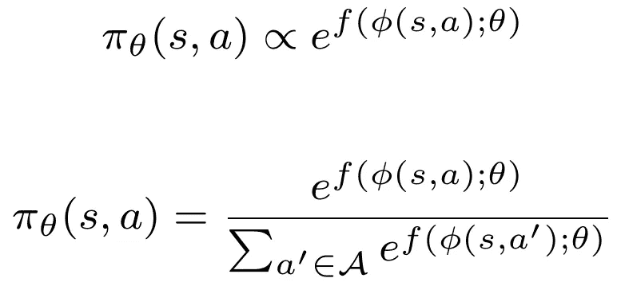
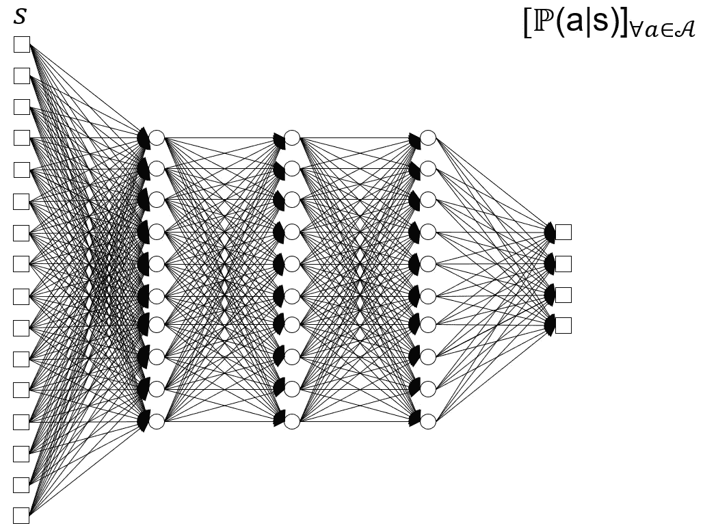
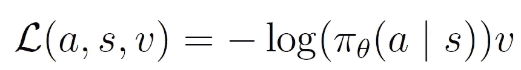
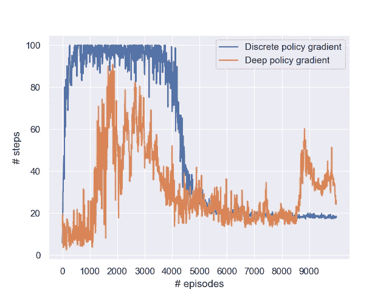
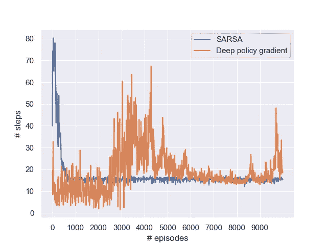
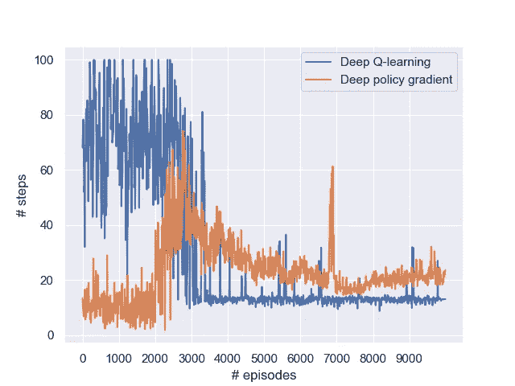
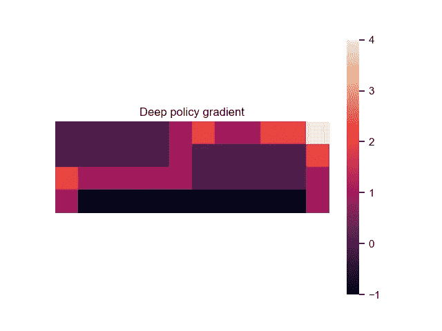

# 悬崖漫步的深度政策梯度

> 原文：<https://towardsdatascience.com/deep-policy-gradient-for-cliff-walking-37d5014fd4bc?source=collection_archive---------29----------------------->

## [提示和技巧](https://towardsdatascience.com/tagged/tips-and-tricks)

## 用 Python 实现 TensorFlow 2.0。在此解决方案中，参与者由神经网络表示，该网络使用深度策略梯度算法进行训练。

[秘密旅行指南](https://unsplash.com/@secrettravelguide?utm_source=medium&utm_medium=referral)在 [Unsplash](https://unsplash.com?utm_source=medium&utm_medium=referral) 上拍摄的照片

在这个关于悬崖行走问题的强化学习系列中，最后一篇文章[关注的是普通策略梯度算法(REINFORCE)。尽管具有很强的相似性，但深度学习变体(使用神经网络表示)中有一些重要的细微差别需要注意。本文展示了使用 Tensorflow 2.0 的完整 Python 实现。](/cliff-walking-problem-with-the-discrete-policy-gradient-algorithm-59d1900d80d8)

# 悬崖行走问题

悬崖行走问题需要一个代理人(从左下角开始)，他需要到达右下角才能获得奖励并赢得游戏[1]。每走一步都会产生一点小成本，以鼓励你走最短的路，然而底部的悬崖应该被避开。

悬崖漫步世界的再现[图片由作者提供]

# 深度离散政策梯度

在这个问题的[策略梯度](/policy-gradients-in-reinforcement-learning-explained-ecec7df94245)解决方案中，随机策略 *π_θ* 为可以在任何瓷砖上采取的四个动作(左、右、上、下)中的每一个分配一个概率。形式上，策略(使用 softmax 函数)可以表示如下:

softmax 函数的 DPG 策略。神经网络 f(⋅)由θ参数化，并对特征向量 *ϕ* (s，a)执行非线性变换

敏锐的观察者可能会注意到与普通实现相比的微小变化——取代教科书中遇到的矢量点积*ϕ(s,a)^⊤⋅θ=∑_ I ϕ(s,a)_i ⋅θ_i*，我们现在采用一个通用参数化函数*f(ϕ(s,a)；θ)* 。

前一篇文章中使用的特征向量 *ϕ(s,a)* 直接基于状态(每个状态四个θ参数，代表每个动作)。因此，我们有效地训练了各个州的模型。用**神经网络表示**，这样的隔离是不可能的。将输入层连接到第一个隐藏层的权重可以单独训练，而所有剩余的权重表示对所有状态都有效的紧凑表示。

实际上，这是演员网络的优势和劣势。对于大的状态空间，我们根本无法观察到每一个状态，我们需要一个一般的表示，这正是网络所能提供的。然而，设计一个能够捕捉所有状态的单一表示是一个重大挑战。

具体来说，我们用一个通用的参数化函数 *f(ϕ(s,a 来代替*ϕ(s,a)^⊤θ*；θ)* ，其中 *f* 为神经网络， *θ* 为网络权重。除此之外，还是以前那个畜生。

网络架构有两种主要的变体。我们可以输入基于状态和动作的特征向量，并输出单个值([后决策](/what-are-post-decision-states-and-what-do-they-want-from-us-9e02105b7f40)方法，需要运行相同的模型四次),或者使用仅基于状态的特征向量，并输出所有四个动作的值。我们在这里实现后者。

离散行动者网络示例。网络将状态作为输入(对于这个问题是一个 48 维的一维热点向量)，并输出每个动作的概率(左、右、上、下)。第一层中的权重对于每个图块是唯一的，但是隐藏层是所有状态的一般表示。[图片由作者提供]

使用 TensorFlow(或任何其他深度学习库，就此而言)的一个便利之处是，训练在很大程度上是自动化的；我们只需要给网络输入一个损失函数，训练几乎是自动进行的。对于离散策略梯度，我们采用对数损失(或交叉熵损失)函数:

# Tensorflow 实现

首先，我们需要一个演员网络。下面的代码片段构建了它。最终层中的 **softmax 激活**确保输出是概率总和为 1 的向量，而**权重初始化**确保*初始*动作概率相等。

接下来，我们需要损失函数。在这种情况下，我们使用**交叉熵损失函数**:

我们不必为手动计算梯度而烦恼；所需要的只是损失函数。`GradientTape`功能跟踪我们的数学运算，并使用该内存为我们计算梯度。更新程序——在每集之后执行——概述如下。注意，针对轨迹中每个奖励的所有损失立即计算**梯度；这是因为中间更新会改变参与者网络，从而改变梯度所需的计算概率(尽管这种方法肯定不是唯一的解决方案)。**

完整的实现可以在我的 GitHub 上找到:

 [## GitHub-woutervanheeswijk/Cliff _ walking _ public:悬崖行走强化学习示例，带…

### 此时您不能执行该操作。您已使用另一个标签页或窗口登录。您已在另一个选项卡中注销，或者…

github.com](https://github.com/woutervanheeswijk/cliff_walking_public) 

还没完全明白吗？没问题:这个最小的工作示例一步一步地引导您完成离散策略梯度算法:

 [## TensorFlow 2.0 中离散策略梯度的最小工作示例

### 一个训练离散演员网络的多兵种土匪例子。在梯度胶带功能的帮助下…

towardsdatascience.com](/a-minimal-working-example-for-discrete-policy-gradients-in-tensorflow-2-0-d6a0d6b1a6d7) 

# 实验

像往常一样，如果不进行测试，实现就不完整。让我们试一试，对比**香草策略梯度**(基本强化实现)**【SARSA】**(基于价值的基于策略比较)**深度 Q 学习**(基于价值的神经网络对应物)。

普通策略梯度很难获得稳定的解决方案，遭受高方差和探索的不利影响。以前，深度 Q 学习也比普通 Q 学习困难得多。深度政策梯度似乎结合了两个世界最糟糕的部分，它的表现如何？下注吧。

Rien ne va plus…照片由 [Adi Coco](https://unsplash.com/@adicoco?utm_source=medium&utm_medium=referral) 在 [Unsplash](https://unsplash.com?utm_source=medium&utm_medium=referral) 上拍摄

它进行得不顺利。事实上，这是我第一次决定调整奖励结构，提高达成目标的相对奖励。最初，每次移动的概率是 0.25；因此，达到目标的几率相当低。行动者网络还对状态进行概括，例如，如果在开始时“向右”移动是不好的，则减少的概率倾向于延续到其他图块。

实际上，如果在前一千次左右的迭代中没有找到目标，找到满意的策略的机会相当小。增加熵奖励也没有起到任何作用。在高学习率的情况下，该算法可能会收敛到一个**局部最优**(例如，直接跳进悬崖或呆在角落里)，而无需观察目标。由于学习率低，偶尔达到目标并不能为重复提供足够强的奖励信号。

所以，我作弊了一点，把奖励提高了 10 倍，大大提高了可靠性。姑且称之为**奖励塑造**。这样一来，是时候比较表现了，强调单次运行显示出大的波动。

普通政策梯度与深度政策梯度的比较。两者都在努力应对巨大的差异，但最终通常会趋同于可比的政策。不过，深度变体似乎不太稳定。[图片由作者提供]

vanilla SARSA 和 Deep policy gradient 的比较。SARSA 收敛得更快，并且达到更稳定的策略。[图片由作者提供]

深度 Q 学习和深度策略梯度的比较。虽然两者都在努力学习，但是深度 Q 学习通常收敛得更早，并且收敛到更好的策略。[图片由作者提供]

尽管 SARSA 并不以其强大的探索机制而闻名——在这种情况下，这是一种简单的*ϵ*-贪婪方法，其中*ϵ*= 0.05——q 值的初始化对该问题有重大影响。当所有 Q 值都设置为 0 时，有一种尝试新状态的强烈倾向；代理可能相当快地发现目标(对于深度 Q 学习，这个逻辑不成立，因为 Q 值是一般化的，而不是从查找表中获得的)。策略梯度算法——尽管有一个非常**的显式探索机制**——实际上找到目标的机会相当小，并且它经常在达到目标之前就收敛到局部最优。

使用深度策略梯度获得的示例路径。由于策略中固有的随机性，代理经常绕道或重新访问图块。[图片由作者提供]

最后，一切都解决了。旅程并不总是像事先希望的那样顺利，但我们又一次安全地避开了悬崖。

# 外卖食品

*   普通政策梯度和深度梯度的关键区别在于，深度变量**概括了跨州的行动概率**。将线性表达式 *ϕ(s,a)^⊤θ* 替换为神经网络*f(ϕ(s,a)；θ).*
*   学习策略具有挑战性，因为(I)概率策略使发现目标变得困难，以及(ii)概率通常在各州之间通用。为此，增加了目标奖励。
*   由于策略梯度算法的高方差，**奖励整形**可能会有所帮助。在这个问题中，好的回报轨迹是罕见的；更新信号需要足够强以产生影响。

*深度策略梯度算法的完整代码可以在我的* [*GitHub 资源库*](https://github.com/woutervanheeswijk/cliff_walking_public) *上找到。*

*表格* ***Q-learning 和 SARSA*** *对于悬崖行走问题的实现如下:*

 [## 用非策略强化学习走下悬崖

### 政策外强化学习和政策内强化学习的深入比较

towardsdatascience.com](/walking-off-the-cliff-with-off-policy-reinforcement-learning-7fdbcdfe31ff) 

****深度 Q 学习算法*** *也已经实现:**

* [## 悬崖行走问题的深度 Q 学习

### 一个完整的 Python 实现，用 TensorFlow 2.0 导航悬崖。

towardsdatascience.com](/deep-q-learning-for-the-cliff-walking-problem-b54835409046) 

*最后，* ***离散政策梯度*** *变体如本文所示:*

 [## 基于离散策略梯度算法的悬崖行走问题

### 用 Python 实现了一个完整的增强算法。手动执行这些步骤来说明内部…

towardsdatascience.com](/cliff-walking-problem-with-the-discrete-policy-gradient-algorithm-59d1900d80d8) 

# 参考

[1]萨顿和巴尔托(2018 年)。*强化学习:简介*。麻省理工出版社。*