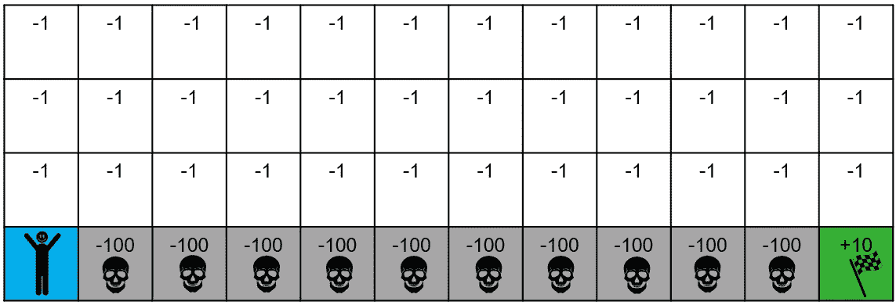
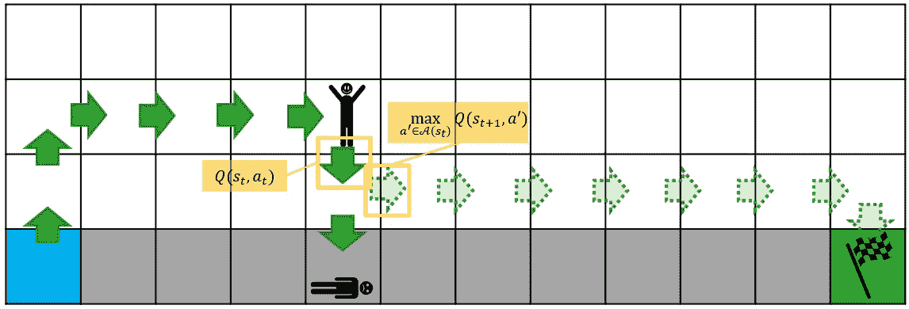
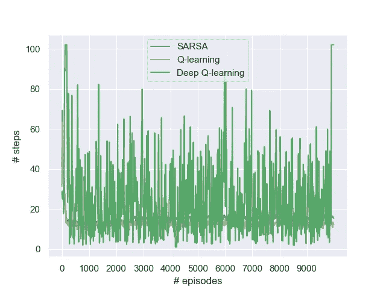
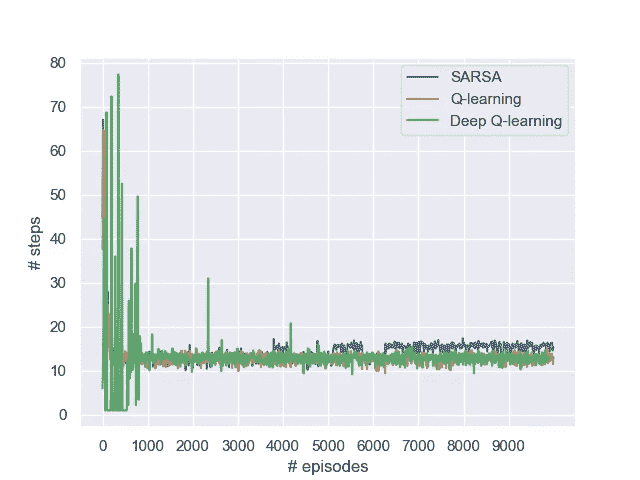
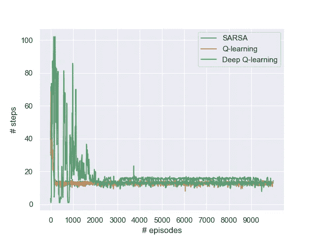

# 悬崖行走问题的深度 Q 学习

> 原文：<https://towardsdatascience.com/deep-q-learning-for-the-cliff-walking-problem-b54835409046?source=collection_archive---------21----------------------->

## [思想和理论](https://towardsdatascience.com/tagged/thoughts-and-theory)

## 一个完整的 Python 实现，用 TensorFlow 2.0 导航悬崖。

由[内森·杜姆劳](https://unsplash.com/@nate_dumlao?utm_source=medium&utm_medium=referral)在 [Unsplash](https://unsplash.com?utm_source=medium&utm_medium=referral) 上拍摄的照片

乍一看，从普通 Q-学习到深度 Q-学习似乎是一小步。只要把查找表换成神经网络就大功告成了。然而，事情远不止如此——即使对于最简单的问题，深度 Q 学习也可能难以取得结果。

为了展示如何避免一些常见的陷阱，本文讨论了深度 Q 学习的 TensorFlow 2.0 实现，以解决众所周知的**悬崖行走问题**。首先，我们展示了标准化和一键编码如何将输入和输出与神经网络对齐。然后，我们部署了三种据说可以显著提高深度 Q 学习常见技术:**经验重放**、**目标网络**和**小批量**。

# 悬崖行走问题

悬崖行走问题(关于普通 Q-learning 和 SARSA 实现的文章[这里](/walking-off-the-cliff-with-off-policy-reinforcement-learning-7fdbcdfe31ff))相当简单[1]。代理从左下角开始，必须到达右下角。走进分隔这些瓦片的悬崖会产生巨大的负面奖励，并结束这一集。否则，每一步都要付出很小的代价，这意味着最短的路径是最优策略。

悬崖行走词示例。目标瓦片产生正奖励，每走一步产生小负奖励，掉下悬崖产生大负奖励[图片作者]

这个问题可以通过 Q-learning 解决。这是一种强化学习方法，它存储代表每个状态-动作对(总 48⋅4)的预期未来回报的 q 值。值得一提的是，Q-learning 是一种**非策略**方法——对于下游动作，我们假设最佳可能动作，而不是实际样本轨迹的动作。因此，Q-learning 鼓励探索，因为失败的影响相对有限。

Q-learning 是一种非策略强化学习方法。基于在 t+1 时采取的最佳动作而不是实际动作来更新时间 t 时的 Q 值。因此，勘探的负面影响是有限的。

# 从普通 Q 学习到深度 Q 学习

在之前的一篇文章中，我提供了一个在 TensorFlow 2.0 中实现[深度 Q 学习](/a-minimal-working-example-for-deep-q-learning-in-tensorflow-2-0-e0ca8a944d5e)的最小工作问题。这里，我假设你熟悉普通 Q 学习，至少熟悉深度 Q 学习的基础。简单回顾一下:在深度 Q 学习中，我们训练一个神经网络，它将状态作为输入，并输出每个动作的 Q 值。虽然查找表对于大的状态空间来说是爆炸式的，但是深度 Q 网络提供了一种对所有状态都适用的紧凑表示。然而，仅仅替换查找表通常是不够的，我们通常需要以下技术(在这里用实现细节[描述)来获得更好的结果[2]:](/how-to-model-experience-replay-batch-learning-and-target-networks-c1350db93172)

*   标准化和一次性编码
*   体验回放
*   目标网络
*   小批量

## 标准化和一次性编码

重要的事情先来。当处理相同大小的输入和输出时，神经网络往往工作得更好。因此，我们将所有奖励除以 100，所以它们(大约)在-1 和 1 之间。累积奖励信号是网络的**目标输出**。

我们还必须注意定义作为神经网络输入的状态。在普通的 Q 学习中，我们可能会将目标瓦片称为“状态 48”，将相邻的悬崖瓦片称为“状态 47”，但自然地，这样的数值对神经网络来说意义不大。它只是简单地乘以某个权重向量，无法区分 47 和 48 具有完全不同的含义。为了解决这个问题，我们应用了 **one-hot** 编码，将输入定义为长度为 48 的数组。对应于当前图块的元素具有值 1，所有其他元素具有值 0。因此，我们可以学习对应于每个瓦片的唯一的一组权重

输入和输出现在都被规范化了，所以我们可以安全地用类似于 **He-或 Glorot 初始化**的东西初始化权重，不再担心标度差异。

## 体验回放

Q-learning 依赖于时间差异，使用“预期”值`Q_t`和“观察”值`r_t+Q_t+1`之间的差异作为误差。不幸的是，`Q_t+1`和`Q_t`一样都是猜测——它们是由同一个神经网络决定的。

更糟糕的是，随后的观察结果往往高度相似，使用几乎相同的状态作为输入。这在相邻的观测值之间产生了很强的相关性。特别是**非线性近似**(如神经网络)往往很难处理这种相关性。

用不那么抽象的术语来说:考虑一个被困在悬崖世界角落里的代理人。这个代理人可能会不断地收到相同的奖励信号，并在网络上对这个特定角落的行动进行过度拟合。你会经常看到这种情况发生:代理人了解到向右走不好(由于悬崖)并且倾向于停留在世界的左边，不断地调整网络以适应那个区域。

为了打破这种关联，我们部署了**体验回放**。不是总是选择最近的观察来更新我们的网络，而是每当我们更新时，我们存储*我们过去的所有*观察和来自这个**重放缓冲器**的样本。每个观察由一个`(s,a,r,s’)`元组表示。为了计算*当前的* Q 值(从我们获得观测值的时间起*而不是*，我们将`s`和`s’`馈送到主要网络，使用`a`获得`Q_t`，使用 *argmax* 动作获得`Q_t+1`。

## 小批量

理论上，我们可以收集许多观察结果，并将神经网络拟合到单个批次，通过单次更新来确定最终策略。在许多监督学习问题中，在大型数据集上一次性训练网络是非常常见的。然而，在强化学习的情况下，我们将总是基于我们的初始策略进行观察(这可能非常糟糕)。我们希望探索足够多的东西，以避免陷入局部极小，同时也主要从好的动作中学习。

因此，大批量不是很有用。我们希望将观察和更新结合起来，逐步改进我们的政策。然而，这并不意味着我们必须更新每一个观察结果——悬崖行走问题中的一个步骤往往教会我们很少东西，因为我们没有观察到任何有意义的东西。显而易见的妥协是**小批量**，这意味着我们经常用大量的观察数据更新我们的网络。特别是与经验重放相结合，这是一种强大的技术，可以基于大量以前的观察获得稳定的更新。

## 目标网络

到目前为止，我们已经从同一个网络中得出期望值`Q_t`和“真实”值`r_t+Q_t+1`。因此，观察和目标相互关联，再次使用一个猜测来更新另一个猜测。

为了缓解这个问题，我们使用了一个目标网络。目标网络只不过是 Q 网络的周期性副本，以较低的频率更新(比如每 100 集一次)。因此，我们将期望值和目标值分离，减少了两者之间的相关性。目标保持相当稳定，而政策本身则在逐步改进。

# 深度 Q-将学习付诸行动

在概述了实现深度 Q 学习所需的理论之后，让我们看看它在实践中的实际表现。在我的 [GitHub 库](https://github.com/woutervanheeswijk/cliff_walking_public)中可以找到关于悬崖行走问题的学习方法的完整实现。

让我们给我们的 Q 网络——3 个隐藏层，每个层有 25 个神经元——一个旋转。与表格变量相同的 0.1 学习率，没有重大调整。

所有算法学习率α=0.1 的强化学习。深度 Q 学习在这里实际上什么也学不到，而 Q 学习和 SARSA 很快收敛。[图片由作者提供]

呀！Q-learning 和 SARSA 迅速收敛到稳定的政策，而深度 Q-learning 似乎没有学到任何值得注意的东西。最重要的是，后者需要更多的计算工作。在我的笔记本电脑上，10，000 次迭代需要大约 20 分钟，而 Q-learning 和 SARSA 只需要几秒钟。

幸运的是，经过一些调整——特别是，将学习率降低到 0.001——事情看起来好多了。收敛仍然需要比表格变量长得多的时间，但是整体深度 Q-学习达到了与常规 Q-学习相同的策略。

用于深度 Q 学习的学习速率α=0.001 的强化学习在这里有效地不学习任何东西，而 Q 学习和 SARSA 快速收敛。[图片由作者提供]

让我们拿出我们剩下的武器库:体验重播，一批 5 个(更新频率也减少了 5 倍，以保留相同数量的数据点)和每 10 集更新一次的目标网络。最终结果:

深度 Q 学习，包括经验回放、小批量和目标网络。部署这些稳定技术并没有导致更快的收敛。[图片由作者提供]

那…实际上很令人失望。尽管我们做了所有的努力，一个简单的 Q 表仍然打败了我们花哨的神经网络。发生了什么事？哪里出了问题？

什么都没发生。没出什么差错。深度学习很有挑战性。我们试图学习一个适用于所有状态的通用函数。通过多层反向传播错误也需要时间。我们的未过滤重放缓冲区保存了许多糟糕的观察结果。为了适应目标网络和批量学习，降低更新频率也会降低收敛速度。神经网络不是神奇的黑匣子。机器学习并不等同于超自然智能。

当然，我们本可以在调优上花更多的时间来提高性能。在一个小批量中应该有多少个观察值？什么是理想的网络架构？我们应该给予体验什么样的优先权？我们必须多久更新一次目标网络？所有重要的问题，也是需要时间来回答的问题。**参数调整成本高。**

有些发人深省的结论是:尽管潜在的难以置信的强大，深度学习也很难成功实施。根据你的问题和你的目标，这可能并不总是最好的方法。

# 外卖食品

*   深度 Q 学习不仅仅是用神经网络代替查找表。它的性能通常不太稳定，需要更多的建模和调优工作。
*   使用适当的**归一化**和**一键编码**使状态和动作适合神经网络。
*   **经验回放**——从过去`(s,a,r,s)`元组的缓冲区中随机取样——打破了后续观察之间的相关性。
*   **目标网络**——Q 网络的周期性副本——可用于计算 Q_t+1。这降低了期望值`Q_t`和目标值`r_t+Q_t+1`之间的相关性。
*   **小批量**稳定更新，一次利用多个观察更新网络。

*深度 Q 学习算法的完整代码可以在我的* [*GitHub 资源库*](https://github.com/woutervanheeswijk/cliff_walking_public) *上找到。*

*我实现的表格* ***Q-learning 和 SARSA*** *对于悬崖行走的问题在这里有详细介绍:*

 [## 用非策略强化学习走下悬崖

### 政策外强化学习和政策内强化学习的深入比较

towardsdatascience.com](/walking-off-the-cliff-with-off-policy-reinforcement-learning-7fdbcdfe31ff) 

****离散策略梯度*** *变体如本文所示:**

* [## 基于离散策略梯度算法的悬崖行走问题

### 用 Python 实现了一个完整的增强算法。手动执行这些步骤来说明内部…

towardsdatascience.com](/cliff-walking-problem-with-the-discrete-policy-gradient-algorithm-59d1900d80d8) 

*为* ***深策渐变*** *，勾选:*

 [## 悬崖漫步的深度政策梯度

### 用 Python 实现 TensorFlow 2.0。在这个解决方案中，参与者由一个神经网络来表示，它是…

towardsdatascience.com](/deep-policy-gradient-for-cliff-walking-37d5014fd4bc) 

*下面的文章给出了* ***深度 Q 学习*** *的一个最小工作示例:*

 [## TensorFlow 2.0 中深度 Q 学习的最小工作示例

### 一个多臂土匪的例子来训练一个 Q 网络。使用 TensorFlow，更新过程只需要几行代码

towardsdatascience.com](/a-minimal-working-example-for-deep-q-learning-in-tensorflow-2-0-e0ca8a944d5e) 

*最后，我在这里讨论经验回放、批量学习和目标学习的实现示例:*

 [## 如何对经验重放、批量学习和目标网络进行建模

### 使用 TensorFlow 2.0，快速学习稳定和成功的深度 Q 学习的三个基本技巧

towardsdatascience.com](/how-to-model-experience-replay-batch-learning-and-target-networks-c1350db93172) 

## 参考

[1]萨顿和巴尔托(2018 年)。*强化学习:简介*。麻省理工出版社。

[2]t .马蒂森(2015 年 12 月 19 日)。[《揭秘深度强化学习》](http://neuro.cs.ut.ee/demystifying-deep-reinforcement-learning/)。*神经外科*。计算神经科学实验室。检索时间 2021 年 9 月。*