# 深度 Q 学习不是火箭科学

> 原文：<https://towardsdatascience.com/deep-q-learning-is-no-rocket-science-e34912f1864?source=collection_archive---------18----------------------->

## 用 pytorch 解释和编码的深度 Q 和双 Q 学习

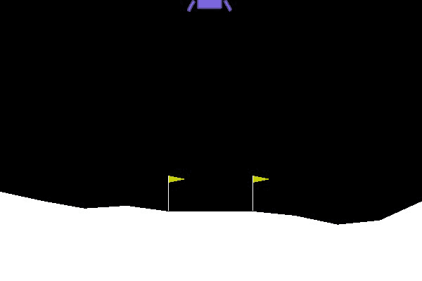

(作者 GIF)

# 情境中的深度 Q 学习

q 学习是强化学习社区中早已存在的一种方法。然而，最近通过使用[神经网络](/backpropagation-in-neural-networks-6561e1268da8)与 Q 学习相结合，在该领域取得了巨大进展。这就是所谓的深度 Q 学习的诞生。这种方法的全部潜力在 2013 年被看到，当时谷歌向世界展示了他们的 DQN 代理商在玩雅达利突破。对我来说，这是我第一次接触这个领域，我立刻对它产生了兴趣。

其他强化学习方法有[策略梯度法](/snake-with-policy-gradients-deep-reinforcement-learning-5e6e921db054)和行动者批评法。行动者批评方法是 Q 学习和政策梯度方法的混合。

# 一般强化学习

在强化学习中，我们有一个环境，在这个环境中，一个代理正在做动作。环境然后返回一个奖励和一个新的状态。代理人得到的报酬也取决于他实际所处的状态。所以他/她应该学会根据实际情况调整行动。

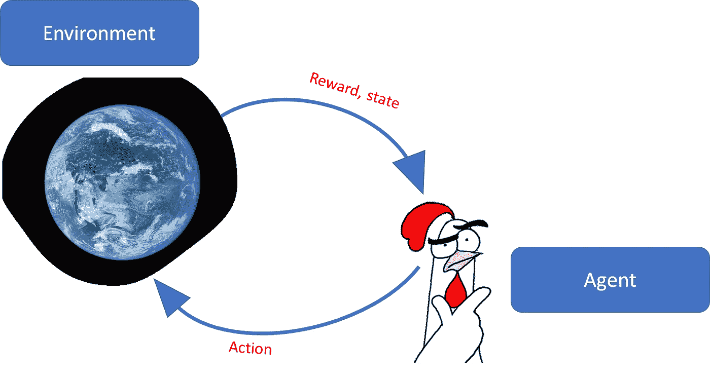

作者图片

我们要用的环境是 CartPole-v0 环境，作者是 OpenAI。我们可以在 python 中轻松使用它。这是一个非常简单的环境，对于大多数深度强化学习算法来说，求解起来也非常简单。因此，每当我写一个新的强化学习脚本时，我都会用它来测试我是否正确地实现了所有的东西。

# 南极环境

我们从导入和测试 openai gym 开始。如果您还没有安装它，您可以通过键入:

```
pip3 install gym
```

然后，我们编写一个脚本来测试我们的健身房环境。我们让代理执行随机的动作，只是为了看看是否一切正常。

(作者代码)

代理的目标是尽可能长时间地平衡操纵杆。如果棍子在两个方向偏离垂直方向 15 度，它就失败了，这一集就结束了。

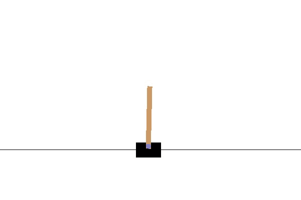

(图片由作者提供)

代理为实现其目标可以采取的**行动**有:

*   向左移动(0)
*   向右移动(1)

**奖励**以如下方式给出:

*   每走一步+1，棍子是直立的

**状态/观察值**是 4 个值的列表:

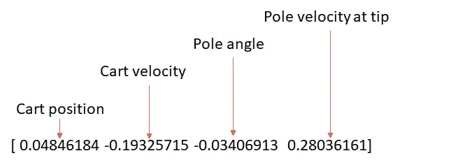

(图片由作者提供)

# 深度 Q 学习

## 蜕变能

考虑下面的场景。我们的鸡饿了。它可以执行两个操作。它可以吃也可以写。因为它饿了，更好的选择是吃东西，这确实会给它更多的奖励。但是奖励是在行动完成后给予的，所以它怎么会知道。在这种情况下，动作值(或 Q 值)可以帮助我们。这个 Q 值取决于状态和可能的动作。给定状态，Q(s，a)然后返回执行动作的值。所以鸡应该执行 q 值最高的动作！

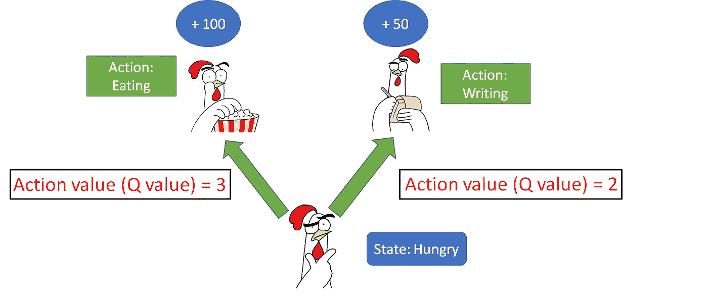

(图片由作者提供)

Q 值由下式定义:

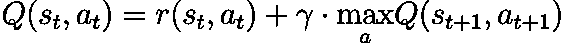

(图片由作者提供)

这个等式简单地意味着，对于一个给定的状态，一个行为的价值是这个行为执行后的直接回报加上下一个状态的(贴现的)最高 Q 值。伽马(𝛾)实际上是贴现因子，它解释了未来回报的不确定性。𝛾通常大于 0.9，小于 1。低 gamma 导致代理更关注眼前的回报，而高 gamma 导致代理更关注未来的高回报。

## 时间差异学习

我们已经看到了 Q 值的精确定义，我也告诉过你，我们将使用神经网络来逼近它。

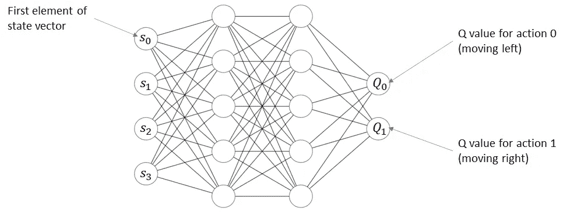

(图片由作者提供)

因此，我们希望使网络的近似 Q 值尽可能接近数学定义。为了实现这个目标，我们使用神经网络的能力来最小化损失函数。

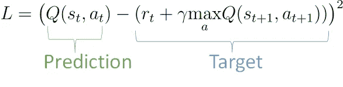

(图片由作者提供)

我们把实际时间步长的 Q 值称为“预测”，把包括下一个状态目标的 Q 值的项称为“预测”。

我们使用的损失函数就是均方误差损失。

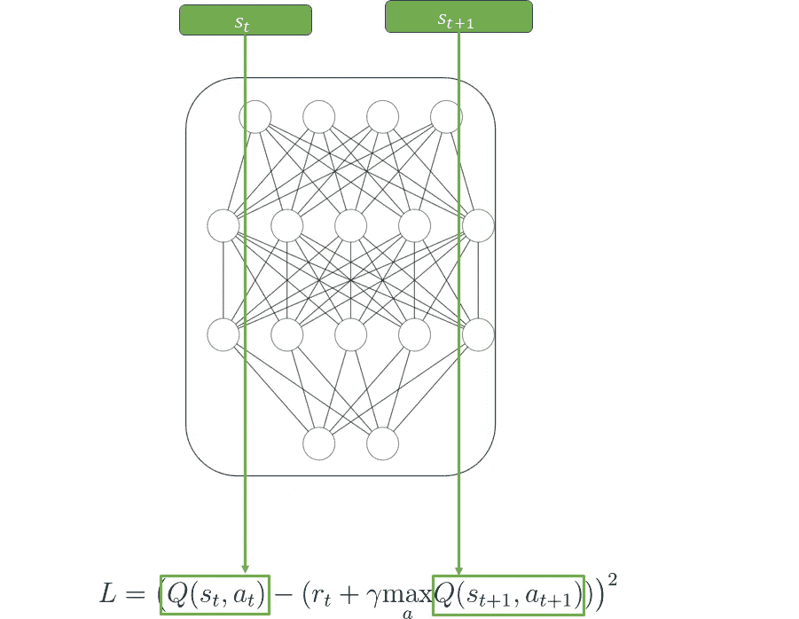

(图片由作者提供)

利用时间差学习，我们可以在每个时间步训练我们的代理。

## 勘探开发的困境

如果我们让我们的代理贪婪地利用它认为具有最高 Q 值的策略，很可能存在更好的策略。代理人将永远无法探索这一策略，因此永远看不到与之相关的高回报。所以在开始的时候，我们让自己做随机的行为，随着时间的推移，减少它采取随机行为的可能性。这个过程被称为𝜖贪婪行动选择。

## 体验回放

深度 Q 学习不是特别好，除非我们通过添加经验回放来增强它。为此，我们建立了一个记忆，把所有的状态、行为和奖励都储存在里面。训练时，我们从记忆中检索随机的一批，并在其上进行训练。这意味着代理很可能没有接受过上一个时间步骤的培训。

下面的代码实现了一个 ReplayBuffer 类，它负责存储和分配随机批次的内存。对于我们存储的每个时间步长:(state，action，reward，next_state，done)。done 是一个结束标志，在一集期间为 0，在一集结束时为 1。

(作者代码)

## 整个算法和代码

我决定向您展示主文件的 python 代码，而不是伪代码，因为如果您了解 python，这更容易理解。

(作者代码)

我们可以调整许多超参数，我们将它们传递给代理的构造函数:

```
agent = DQAgent(learning_rate=0.00025, gamma=0.90, batch_size=32, 
                     state_len=len(env.reset()), 
                     n_actions = env.action_space.n,
                     mem_size = 1000000,
                     min_memory_for_training=1000,
                      epsilon=1,epsilon_dec=0.99,
                     epsilon_min = 0.02)
```

**学习率:**神经网络的学习率。高值会使代理学习得更快，但也会导致在复杂环境中的次优行为。

**伽马:** 𝛾通常在 0.9 以上，小于 1。低 gamma 导致代理更关注眼前的回报，而高 gamma 导致代理更关注未来的高回报。

**批次大小:**给神经网络执行小批次梯度下降的时间步数。高批次数量稳定了学习，但也可能导致停滞。

**训练的最小记忆:**学习过程开始前的步数。一个合适的数字可以防止网络过度适应前几个训练样本。

**ε:**ε的起始值。1 表示代理在开始时只执行随机操作(探索), 0 表示它不会开始执行随机操作(利用)。

**Epsilon dec:**Epsilon 在每个时间步长后乘以的系数，以减少它。应该大于 0.99 小于 1。

**ε最小值:**ε的最小值。如果ε低于该值，它将不会减小。任何时候都要有一点点的探索，让代理不断学习，这一点很重要。

现在我们代理的全部代码是:

(作者代码)

让我们来讨论一下这段代码:

```
target = rewards_batch + torch.mul(self.gamma* self.q(new_states_batch).max(axis = 1).values, (1 - dones_batch))
```

它计算 TD 目标。假设我们的批量是 5。

那么计算可能如下所示:

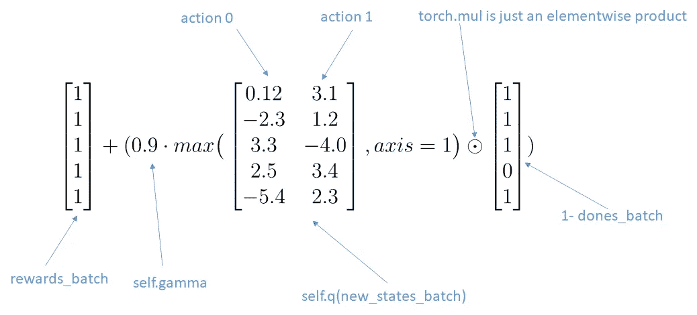

(图片由作者提供)

我们做 max 运算，因为我们想看 Q 值最高的动作。

让我们看看下面的代码行:

```
prediction = self.q.forward(states_batch).gather(1,actions_batch.unsqueeze(1)).squeeze(1)
```

它计算预测。批量大小为 5 时，可能如下所示:

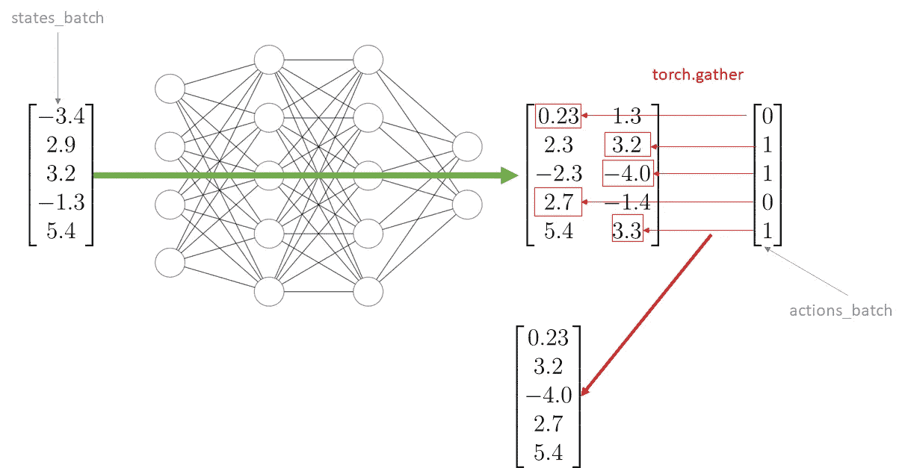

(图片由作者提供)

我们从代理实际采取的行动中选择 q 值。

## 测试

现在是时候实际测试我们的算法了。我们用我们的 CartPole-v0 环境测试它。

在 100 集之后，代理人设法击败了环境，并且几乎总是获得最高分。

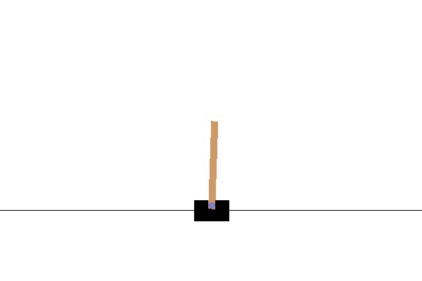

(图片由作者提供)

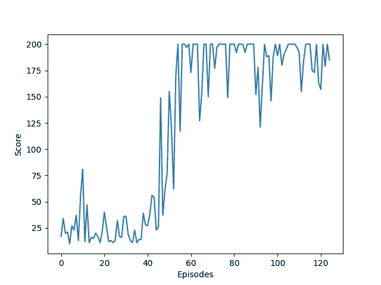

(图片由作者提供)

# 双 Q 学习

为了进一步改进我们的深度 Q 学习算法，我们可以选择具有单独的预测值和目标值。这也叫双 Q 学习。

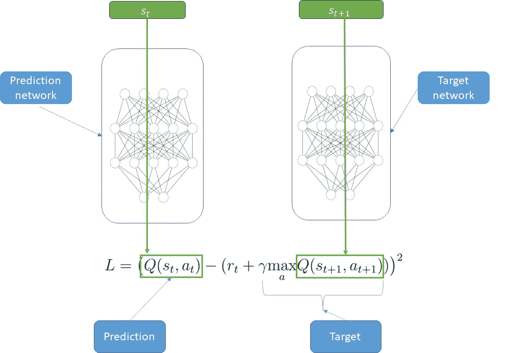

(图片由作者提供)

这些动作将通过预测网络进行预测。反向传播只发生在预测网络中。预测网络的参数每隔几次迭代就被复制到目标网络。目标网络的参数保持“冻结”多久也是一个超参数。

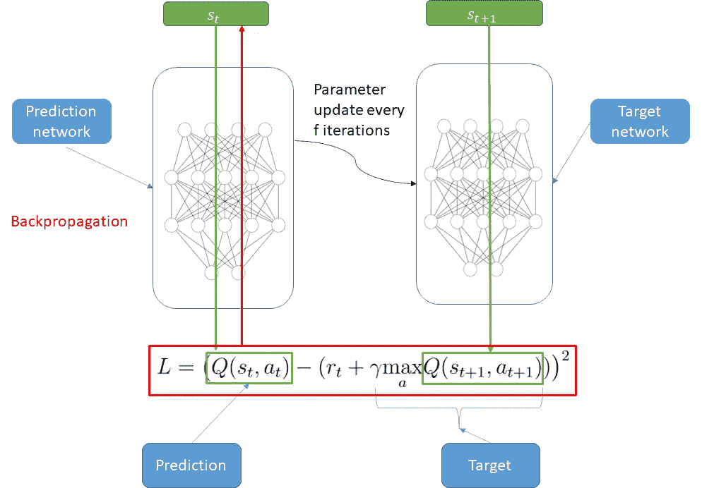

(图片由作者提供)

我们冻结了目标网络，因为这样预测和目标的相关性就降低了。这有助于学习过程

## 测试

现在我们有一点乐趣，用 openai 环境“LunarLander-v2”测试我们的算法。你可以在下面找到我用过的超参数列表。

**学习率:** 0.001

**伽玛:** 0.99

**批量:** 64

**训练最小内存:** 1000000

**ε:**1

**εdec:**0.995

**ε最小值:** 0.02

**冻结 _ 迭代:** 6

以下 GIF 拍摄于 729 集。代理人在着陆方面做得很好。


(作者 GIF)

学习曲线是这样的。

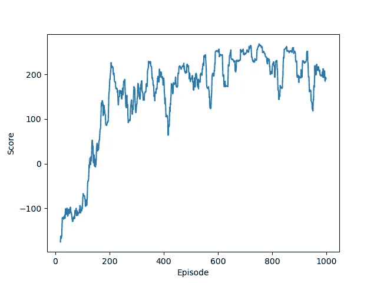

(图片由作者提供)

请注意，它被 20 集移动平均线平滑。

## 密码

主文件:

(作者代码)

代理的代码:

(作者代码)

# 作者相关文章

[](/snake-with-policy-gradients-deep-reinforcement-learning-5e6e921db054) [## 具有策略梯度的 Snake 深度强化学习

### 策略梯度深度强化学习在蛇游戏中的应用

towardsdatascience.com](/snake-with-policy-gradients-deep-reinforcement-learning-5e6e921db054) [](/backpropagation-in-neural-networks-6561e1268da8) [## 神经网络中的反向传播

### 从零开始的神经网络，包括数学和 python 代码

towardsdatascience.com](/backpropagation-in-neural-networks-6561e1268da8) [](/how-you-can-use-gpt-j-9c4299dd8526) [## 如何使用 GPT J

### GPT J 解释了 3 种简单的方法，你可以如何访问它

towardsdatascience.com](/how-you-can-use-gpt-j-9c4299dd8526) 

## 想联系支持我？

领英
[https://www.linkedin.com/in/vincent-m%C3%BCller-6b3542214/](https://www.linkedin.com/in/vincent-m%C3%BCller-6b3542214/)
脸书
[https://www.facebook.com/profile.php?id=100072095823739](https://www.facebook.com/profile.php?id=100072095823739)
推特
[https://twitter.com/Vincent02770108](https://twitter.com/Vincent02770108)
中等
[https://medium.com/@Vincent.Mueller](https://medium.com/@Vincent.Mueller)
成为中等会员并支持我(你的部分会费直接归我)
[https://medium.com/@Vincent.Mueller/membership](https://medium.com/@Vincent.Mueller/membership)