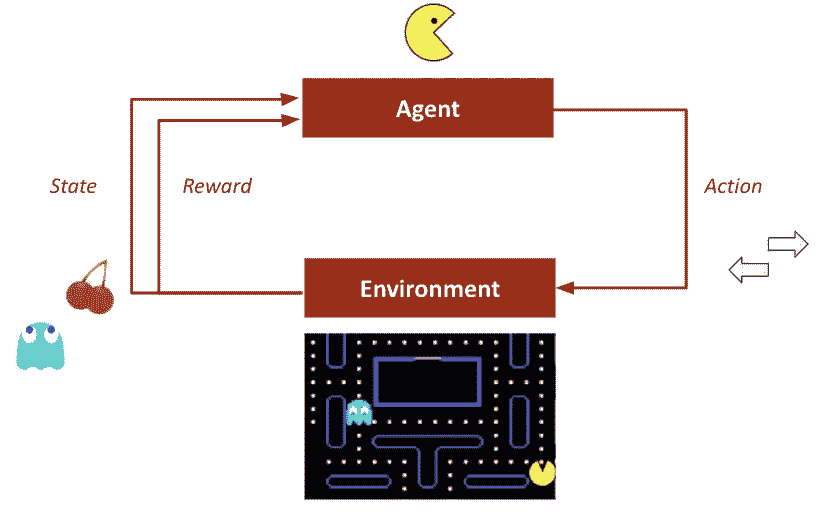
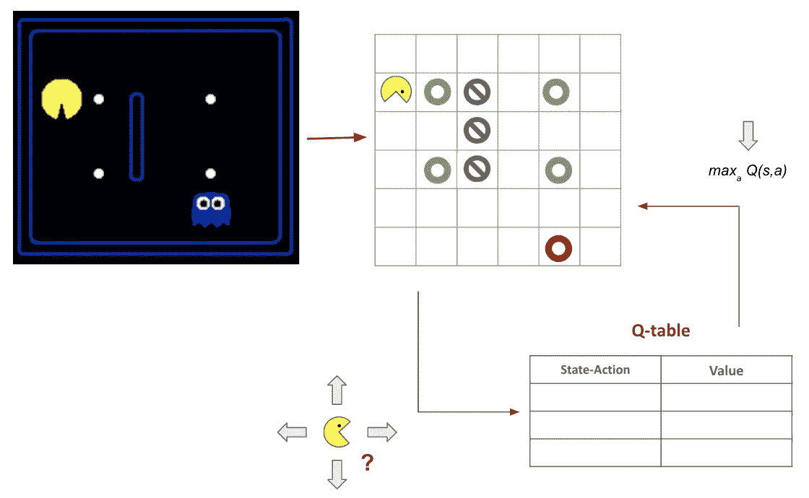
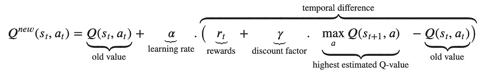
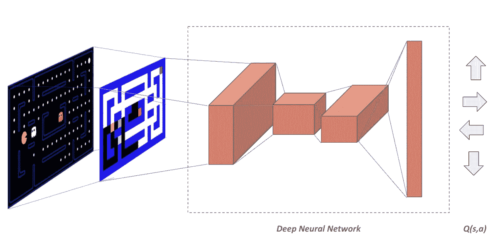
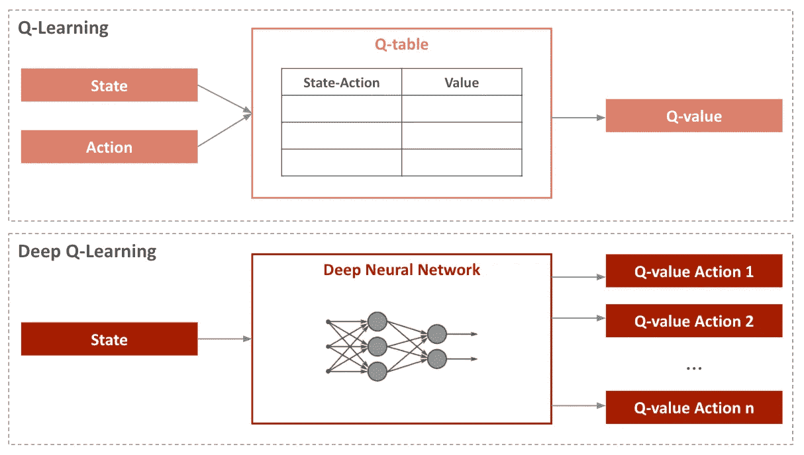

# 深度 Q 网络:结合深度和强化学习

> 原文：<https://towardsdatascience.com/deep-q-network-combining-deep-reinforcement-learning-a5616bcfc207?source=collection_archive---------9----------------------->

## [实践教程](https://towardsdatascience.com/tagged/hands-on-tutorials)

## 揭示深度强化学习的力量

R 强化学习(RL)是数据科学中最令人兴奋的研究领域之一。长期以来，它一直是许多数学家工作的中心。

而今天，随着深度学习的改善和计算资源的可用性，RL 引起了更大的兴趣:随着大量数据不再代表障碍，新的建模方法出现了。

在这种背景下，**强化学习方法和深度学习模型的结合，通常被称为深度 RL，已经被证明是强大的。**

它是最近人工智能领域令人印象深刻的进步的基础。它甚至使算法在雅达利、围棋或扑克等领域超过了人类的表现。

**本文的目的是阐明深度学习在 RL 领域的贡献。**为此，它重点介绍了 Q-Learning(一种常见的 RL 模型)的示例，并解释了包含神经网络的附加价值。

阅读本文后，您将了解到:

*   什么是[强化学习](https://datascientest.com/quest-ce-que-le-reinforcement-learning)，它基于什么原则和技术？
*   什么是深度 Q 学习，它与“通常的”Q 学习有什么不同？
*   强化学习的潜在贡献是什么，还有哪些挑战？

# **1。什么是强化学习？**

让我们首先快速概述一下 RL 原则。

从一般的角度来看，RL 可以用非常简单的话来解释。这就像教你的狗一个新把戏。当你的狗表演魔术时，你给它一点狗粮作为奖励，如果它不表演，你就惩罚它，不给它任何东西。

同样，RL 包括训练机器学习模型来做出决策。代理通过与他的环境交互以自主的方式学习采取什么行动，即通过**根据它采取的行动接收奖励或惩罚。**通过其经验，代理人寻求找到**最优决策策略**，这将使他能够**最大化随着时间积累的回报**。

## 术语

在这种情况下，有一个特定的术语用于描述 RL 环境的组件:

*   **代理人**:要培训的决策者。
*   **环境**:代理学习和决定采取什么行动的一般环境。
*   **动作** 𝑎:代理可以执行的一组可能动作中的一个
*   **状态**代理所处的𝑠:状态
*   **奖励** 𝑟:代理人因其自身行为而从环境中获得的收益或损失
*   策略 𝜋:代理人选择采取的策略。它表示一组情况和一组可能的动作之间的映射。

> 为了了解每个元素具体对应什么，让我们以**吃豆人游戏**为例。如下图所示，代理人是 Pacman。他的目标是避开鬼魂，尽可能多地吃掉食物和受惊的鬼魂。

强化学习环境组件，图片由作者提供

## 韵律学

在这种情况下，有两个指标:

*   **价值函数** 𝑉𝜋(𝑠):期望贴现回报从𝑠开始，接着是𝜋政策

其中𝑅代表回归。

*   **Q 值**在给定的状态 s 和给定的动作 a 下，𝑄𝜋(𝑠,𝑎):期望贴现收益，同时遵循此后的政策𝜋∗。

# **2。深度学习给强化学习带来了什么？**

为了了解深度学习对 RL 的附加值，我将重点讨论 **Q-Learning** 的例子，并将‘通常的’Q-Learning 与**深度 Q-Learning** (也称为深度 Q 网络)进行比较。

## **Q-Learning**

直观地说，Q 学习算法包括学习一个 **Q 表**(‘Q’代表质量)，它包含每个状态和行为的预期未来回报。

由于有了这个**‘备忘单’**，代理人能够通过选择使预期未来回报最大化的行动来为每个状态做出最佳选择。

> 该图说明了 PacMan 案例中的过程:

q-学习管道，图片由作者提供

代理如何学习 Q 表？

1.  首先， **Q 表被任意初始化**。列数是可能动作的数量，行数是状态的数量。
2.  那么，只要这一集还没有结束:

*   2.1.**处于状态 *s* 的代理人根据 Q 表选择 *a*** *，*使**的期望未来报酬**最大化的行动。
*   偶尔，****代理被允许随机选择一个动作**。这就是所谓的**ε贪婪策略**。它使代理能够探索他的环境(并不总是以狭隘的方式遵循他的“备忘单”)。更多信息，可以阅读这篇[文章](https://en.wikipedia.org/wiki/Multi-armed_bandit)。**
*   **2.2.代理观察结果状态 s’和奖励 r，并且**更新函数 Q(s，a)** 如下:**

****

****深度 Q 学习****

**正如您所料，当处理具有各种可能性和结果的复杂环境时，以前的 Q 学习算法很快变得低效。**

****幸运的是，通过将 Q-Learning 方法与深度学习模型相结合，Deep RL 克服了这个问题。**它主要包括建立和训练一个神经网络，能够估计给定状态下每个动作的不同 Q 值。**

****

**深度 Q-学习管道，受这篇[文章](http://cs229.stanford.edu/proj2017/final-reports/5241109.pdf)的启发**

**下图比较了 Q 学习和深度 Q 学习方法:**

****

**Q-Learning vs . Deep Q-Learning，受这篇[文章](https://www.analyticsvidhya.com/blog/2019/04/introduction-deep-q-learning-python/)的启发**

**注意，网络的损失函数是损失函数:**

****

**这还不是全部:深度 Q 学习引入了两个额外的机制，可以实现更好的性能。**

****1。记忆回放:****

*   **神经网络不是在每一步后立即更新。取而代之的是，它将每次经历(通常作为一个元组<动作、状态、奖励、下一个状态>)存储在**存储器**中。**
*   **然后对从重放存储器中随机选择的称为**小批量**的一组元组进行更新。**
*   **这种机制使算法能够记住并跟踪他过去的经历。**

****2。单独目标网络:****

*   **使用相同的网络计算预测值和目标值(在损失函数中使用)会导致严重的**不稳定性**。**
*   **为了克服这个问题，通常适合于**训练两个具有相同架构的独立网络:预测网络和目标网络。****
*   **预测网络作为**“在线”网络**工作，而目标网络是预测网络的**副本，具有定期更新的冻结参数。****

# ****3。深度强化学习能带来什么？****

## **应用**

**如果说 RL 机型主要以在雅达利或围棋等高精尖游戏中的骄人表现著称，那么适用范围就要广得多。它们可以应用于各种商业案例。**

**从金融交易、推荐系统到机器人，RL 能够通过其独特的**试错学习方法**捕捉复杂的现实生活问题。**

**这当然是这种学习范例的关键优势: **RL 模型在没有任何关于环境的先验知识的情况下被训练。**它们不需要对金融市场风险、客户行为或系统的物理特征进行任何建模。因此，它们可以避免一些非常重要的步骤。**

## **挑战**

**尽管如此，使用 RL 来解决特定的问题带来了 **3 个主要挑战** s:**

1.  ****模拟环境:**构建环境是一个关键点，因为 RL 模型从与环境的交互中学习。如果模拟一个游戏看起来相对容易，那么当涉及到自动驾驶汽车、能源优化等其他应用领域时，它就会变得很快变得更加复杂。**
2.  ****达到全局最优:**如果一个 RL 代理没有充分探索他的环境，他可能会陷入局部最优。这就是所谓的**勘探开发困境**。当代理了解他的环境时，他在探索更多的环境以获得更好的可能性视野和利用他的经验来追求他认为最有利可图的策略之间左右为难。**
3.  ****选择合适的算法并调整其参数:**RL 模型种类繁多。他们依赖于完全不同的方法，并使用几个超参数。因此，有必要仔细选择算法和正确的度量来评估其性能。**