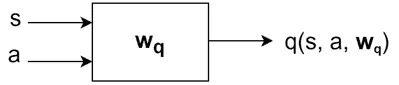
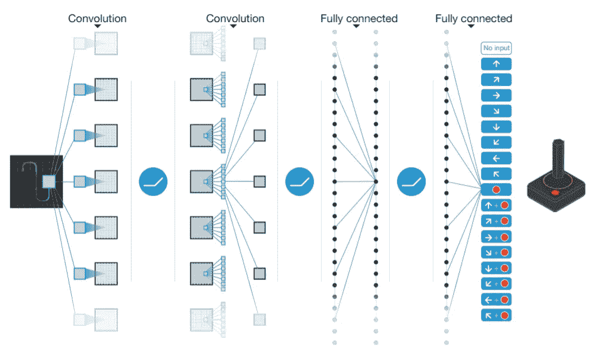
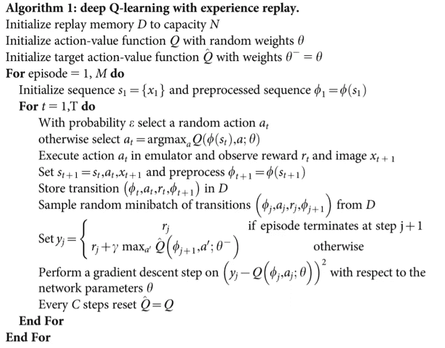
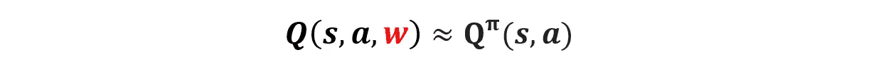
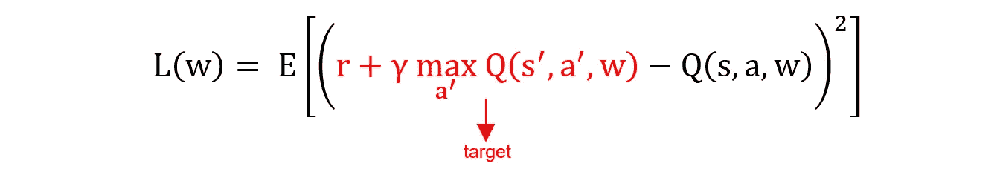

# 深度 Q 网，带 PyTorch

> 原文：<https://towardsdatascience.com/deep-q-network-with-pytorch-146bfa939dfe?source=collection_archive---------9----------------------->

## 解释无模型 RL 算法的基础:深度 Q-网络模型(带代码！)

Mathias P.R. Reding 在 [Unsplash](https://unsplash.com/?utm_source=medium&utm_medium=referral) 上拍摄的照片

在 Q 学习中，我们将 Q 值表示为一个表格。然而，在许多现实世界的问题中，存在巨大的状态和/或动作空间，并且表格表示是不够的。例如，电脑围棋有 10 个⁷⁰状态，像马里奥兄弟这样的游戏有连续的状态空间。当不可能在二维数组或 Q 表中存储状态和动作对值的所有可能组合时，我们需要使用深度 Q 网络(DQN)来代替 Q 学习算法。[1]

DQN 也是一种无模型的 RL 算法，其中使用了现代深度学习技术。DQN 算法使用 Q 学习来学习在给定状态下采取的最佳动作，并使用深度神经网络或卷积神经网络来估计 Q 值函数。

# DQN 建筑的插图

> 神经网络的输入包括一个 84 x 84 x 4 的图像，随后是 3 个卷积层和 2 个完全连接的层，它们为每个有效动作输出一个输出。[1]

DQN 建筑的插图[1]

# DQN 算法

DQN 算法[1]

## DQN 的主要成分— 1。q 值函数

在 DQN，我们用权重 w 来表示价值函数，

q 值函数。作者图片来源于[1]。

*   在选择行动时，Q 网络的工作方式类似于 Q 学习中的 Q 表。Q-learning 中的状态是可数的和有限的，而 DQN 中的状态可以是有限的或无限的/连续的或离散的。
*   Q 网络中的更新是通过更新权重来完成的。

## DQN 的主要成分— 2。损失函数

让我们用 Q 值的均方误差来定义目标函数。

损失函数。作者图片来源于[1]。

这是一个损失函数，用于最小化在 Q 网络中更新权重的误差。

## DQN 的主要成分— 3。优化算法

让我们用随机梯度来优化上面的目标函数，用 **δL(w)/δw** 。Tensorflow 或 PyTorch 中有许多可用的优化算法。比如亚当，RMSProp，阿达格拉德等。

## DQN 的主要成分— 4。体验回放

> **朴素 Q 学习用神经网络振荡或发散。**
> 
> 数据是连续的，这意味着连续的样本是相关的，而不是独立的和同分布的。
> 
> 政策会随着 Q 值的轻微变化而快速变化或振荡，因此，数据的分布会从一个极端转移到另一个极端。
> 
> 奖励和 Q 值的比例是未知的。当反向传播时，朴素 Q 学习的梯度可能很不稳定。[2]

为了解决上述问题，我们可以将转换存储在重放缓冲器中，并从重放缓冲器中采样一小批经验来更新 Q 网络。从中。通过使用经验重放，它将打破样本之间的连续相关性，并且还允许网络更好地利用经验。[1]

下面的教程将使用 DQN 来解决来自[健身房](https://gym.openai.com/)环境的雅达利游戏。对于所有 Atari 游戏，它接受 84x84x4 图像帧作为输入。因此，首先，我们需要进行数据预处理，即跳过连续样本之间的一些帧，因为这些连续样本几乎是相同的，重新缩放图像，灰度化图像，归一化图像等。

DQN 解算器将使用 3 层卷积神经网络来构建 **Q 网络**。然后，它将使用**优化器**(下面代码中的 Adam)和**经验重放**来**最小化误差**以更新 Q 网络中的权重。

最后，我们可以用`run(training_mode=True, pretrained=False)`进行训练，用`run(training_mode=False, pretrained=True, num_episodes=1, exploration_max=0.05)`进行测试。

*   第一次训练网络时，可以使用`pretrained=False`，否则可以使用`pretrained=True`从上次停止的地方继续训练。
*   然而，对于测试，你只能使用`pretrained=True`，这意味着你使用训练好的 Q-网络来测试代理的性能。
*   `exploration_max=1`在训练过程中，因为我们希望 agent 以ε概率随机进行探索，这样就不会陷入局部极小值。然而，在测试过程中，我们希望代理从经过训练的 Q 网络中采取优化的行动，因此，我们应该使用 0 或非常少的探索`exploration_max=0.05.`

# 推荐阅读

</q-learning-and-sasar-with-python-3775f86bd178>  

# 参考

[1] V. Mnih *et al.* ，[通过深度强化学习的人级控制。](https://web.stanford.edu/class/psych209/Readings/MnihEtAlHassibis15NatureControlDeepRL.pdf)

[2]华盛顿大学 CSE571 讲座—“[概述深度学习强化学习深度价值功能深度政策深度模型。](https://courses.cs.washington.edu/courses/cse571/16au/slides/20-rl-silver.pdf)”