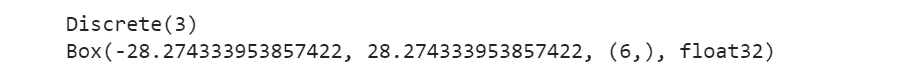

# 深度 Q 网配合 Pytorch 和 Gym 解决 Acrobot 游戏

> 原文：<https://towardsdatascience.com/deep-q-network-with-pytorch-and-gym-to-solve-acrobot-game-d677836bda9b?source=collection_archive---------5----------------------->

## 一种深度强化学习算法的介绍与实现


作者插图

**强化学习**是机器学习的一个分支，受人类和动物行为主义心理学的启发。在**监督学习** (SL)中，学习受到限制，因为它总是需要外部教学信号来帮助解决任务，如分类和回归。

与第二语言不同，强化学习基于不同的原则。主要目标之一是生产一个自主代理，它与环境交互，学习和选择**最优行动**，有助于实现其目标，如最大化回报。代理观察环境中的状态，并在给定状态的情况下执行动作。每次代理通过采取行动进行交互，他可能会收到一个**正**或**负奖励**。

通过**反复试验**，最佳行为会随着时间的推移而改进。这种学习方式让我想起了我们从经验中学习的方式。我们讨厌犯错，但当我们从中吸取教训并在未来做得更好时，错误会变得很有价值。同样，强化学习探索不同的动作和状态，以找到最优的动作。此外，当在学习过程的早期出现错误时，对代理的训练更加健壮。

由于这些特点，强化学习经常被应用于玩游戏、机器人和许多其他决策问题。强化学习与深度学习技术的结合，使得在高维状态空间的问题上取得巨大进步成为可能。例如，当代理需要从屏幕像素中学习时，它就很有用。这些方法被称为**深度强化学习**。

在本教程中，我将训练一个执行 Acrobot 任务的代理。Pytorch 将用于实现 Deep Q 网络，而 Google Colab 笔记本将被使用，因为它提供免费的 GPU 来加速训练。

## 目录:

1.  [OpenAI 健身房](#ef3f)
2.  [安装并导入库](#ec9f)
3.  [行动和观察空间](#babf)
4.  [随机代理](#06b7)
5.  [实现深度 Q 网](#80c1)
6.  [经验回放](#4949)
7.  [ε-贪婪政策](#214e)
8.  [Softmax 策略](#9bf2)
9.  [勘探剖面图](#22c2)
10.  [训练](#2c00)

# 1.奥鹏健身馆

**Gym** 是一个开源库，提供强化学习算法的实现【1】。有许多教学代理可供培训，如 Cart-Pole 和 Pong。在本教程中，我将重点介绍 Acrobot 环境。在[之前的教程](https://www.analyticsvidhya.com/blog/2021/06/acrobot-with-deep-q-learning/)中，我很好地解释了这个游戏如何如果你想更深入地理解它。

# 2.安装和导入库

我们需要安装和导入 python 包。最重要的套餐是健身房，它提供强化学习环境。还有其他有用的库，如:

*   `torch.nn`实现深度 Q 网络
*   需要`IPython.display`和`pyvirtualdisplay.display`来创建一个虚拟显示器，在上面绘制游戏图像
*   `collections`是 Python 基本对象的替代品，如列表、元组、字典和集合。它用来存储代理的经验。

# 3.行动和观察空间

我们可以使用 make 函数实例化体育馆环境。我们也可以设置一个随机的环境种子，每次都产生相同的结果。你大概可以想象，每个环境都有不同数量的动作和观察。通过打印，我们可以很容易地看到操作和观察空间:



动作空间是离散的，因此动作可以是以下非负数之一:[0，1，2]。与动作空间不同的是，观察空间是盒子，代表一个 n 维的盒子。然后，每个观察值将是一个范围在-28 和 28 之间的 6 个数字的数组。

# 4.随机代理

这是一个运行代理的例子，它只是随机选择一个动作。Acrobot 环境将运行 10 集，显示游戏每一步的视频。在运行代理之前，我们定义了可视化环境视频的函数。在 Google Colab 中启用健身房环境渲染需要这些函数。

最后，我们运行随机代理 10 个时间步:

这段代码总结了有限马尔可夫决策过程(MDP)的形式问题，这是一个强化学习问题的一般设置。我们知道有五个组件协同工作:

*   **代理**是由两个关节和两个连杆组成的机械臂，两个连杆之间的关节被驱动
*   **环境**对应于 Acrobot 环境
*   **状态**由一组 6 个数字组成
*   **动作**:有 3 种可能的动作
*   每一步奖励 : -1


作者插图

根据萨顿和巴尔托在*的《强化学习:导论*一书中对 MDP 的主体-环境交互的定义，我们知道:

> 主体和环境在一系列离散的时间步长 t=0，1，2，3，…中的每一步都相互作用。在每个时间步骤 t，代理接收环境的**状态**的一些表示，并在此基础上选择**动作**。一个时间步骤之后，部分地作为其动作的结果，代理收到一个数字**奖励**，并发现自己处于一个**新状态**【3】。

因此，实现了代理-环境循环:在每一集里，我们得到:

*   **初始状态**调用`env.reset`
*   代理选择一个**随机动作**，它取值[0，1，2]中的一个
*   通过 step 函数，应用随机动作并返回四个值:新状态**、上一步获得的奖励**、游戏结束时为真的标志**完成**以及用于调试的诊断信息**。******
*   **为下一次迭代设置当前状态**

**现在，我们调用函数 show_videos 来显示视频，每集一个:**

```
show_videos()
```

****

# **5.实施深度 Q 网络**

**在这一节中，我将展示如何在 Acrobot 游戏上用 Pytorch 实现深度 Q 网络。该模型是一个神经网络，它将状态空间的维度作为输入，并返回对应于每个可能动作的最佳 q 值。因为有三种可能的动作来移动机械臂，所以返回的输出数是 3。**

# **6.体验回放**

**一旦我们定义了网络，我们就可以创建一个名为 ReplayMemory 的类。当观察序列中存在相关性时，神经网络可能不稳定或发散。出于这个原因，我们还需要体验回放，它使代理能够记住过去的体验并从中学习。此外，它使数据随机化，从而提供不相关的数据。**

> **为了执行体验重放，我们将代理在每个时间步长 t 的体验 e_t=(状态，动作，下一个状态，奖励)存储在数据集 D_t={e_1，…，e_t}中。在学习过程中，我们应用 Q 学习更新，对经验(s，a，r，s')~U(D)的样本(或小批量)进行更新，这些样本是从存储的样本池中均匀随机抽取的[4]。**

**在实践中，我们需要一个具有预定义容量的队列。当我们达到最大容量时，队列中最旧的元素将被新的元素替换。使用 python 集合库中的 deque 对象可以实现这种行为。**

**最大容量是`ReplayMemory`对象请求的唯一输入。这样，我们用 maxlen capacity 定义了一个等同于 deque 对象的内存属性。**

**我们还定义了 push 函数，将新的体验添加到重放存储器中。**

**`sample`方法被定义为从记忆中采样经验。体验次数等于 batch_size。如果请求的批量大于内存中当前的样本数，我们将获取所有样本。**

# **7.ε贪婪策略**

**在执行体验重放之后，下一步是根据ε-greedy 策略选择并执行一个动作。该策略选择一个概率为ε的**随机行动**，否则，选择对应于最高 Q 值的**最佳行动**。主要思想是代理在开始时探索环境而不是利用它。代理从环境中学习得越多，它就越会选择基于开发的最优行动。**

# **8.Softmax 策略**

**在给定温度参数的情况下，Softmax 策略用于基于通过将 softmax 应用于估计的 Q 值而获得的分布来选择最佳动作。有两种可能的情况:**

*   **温度越高，分布就越趋于随机均匀分布。**
*   **在零度时，策略将总是选择具有最高 Q 值的动作。**

# **9.勘探剖面**

**我们使用 softmax 策略定义了一个指数递减的勘探配置文件:**

***soft max _ temperature = initial _ temperature * exponential_decay^(i)***

****

# **10.培养**

**我们可以初始化超参数，如 SGD 优化器和 Huber 损失函数、ReplayMemory 对象、策略网络和目标网络。**

**函数 update_step 被定义为执行单个优化步骤。首先，它从重放存储器中抽取一批样本。之后，它为批中的每个元素创建张量。它还计算非最终状态的掩码，并连接批处理元素。**

**随后，它计算给定实际状态的策略网络的所有 Q 值。与策略网络不同，价值函数是基于使用目标网络的下一个状态来计算的。**

**最后，我们可以基于策略网络的 Q 值和使用目标网络计算的 Q 值的最大值来获得预期的 Q 值。**

**现在，是时候训练深度 Q 学习代理了，运行 800 集。在 for 循环中，我们只需要调用前面定义的所有函数。我们还会每 100 集放一次视频。**

****

**最后几集的结果**

****

**第 100 集视频**

****

**最后一集的视频**

**从上一集的视频中，我们可以注意到代理学会了解决任务。很明显，如果你也看了 100 集之后的视频，代理人还在探索最佳行动。训练结束后，我们还可以显示每集获得的累积分值:**

****

**开始时，累积奖励保持在-500。在 200 集之后，分数呈指数增长，保持在-100 左右。最后一步是测试代理是否真的学会了解决它的任务。类似于之前实现的随机代理。我们选择温度参数设置为 0 的最佳操作，而不是采取随机操作。这样，softmax 策略将总是选择具有最高 Q 值的动作。**

****

**我们可以观察到，在最终的测试结果中，累积奖励分数仍然很小。**

# **最终想法:**

**在本教程中，我提供了使用 Pytorch 构建深度 Q 网络的概述。为了更好地理解它，更好的方法是将代码分成构建块，每次只关注一个块。起初，如果你以前只尝试过监督和非监督技术，这似乎很难。但经过一些努力，你将能够理解它，甚至将深度 q 网络应用到其他环境中。这里的 GitHub 代码是。**

# **参考资料:**

**[1]https://gym.openai.com/docs/**

**[2][py torch 的强化学习(DQN)教程](https://pytorch.org/tutorials/intermediate/reinforcement_q_learning.html)**

**[3] [萨顿&巴尔托著，《强化学习:导论》(2018)。](https://web.stanford.edu/class/psych209/Readings/SuttonBartoIPRLBook2ndEd.pdf)**

**[https://www.nature.com/articles/nature14236](https://www.nature.com/articles/nature14236)**

**你喜欢我的文章吗？ [*成为会员*](https://eugenia-anello.medium.com/membership) *每天无限获取数据科学新帖！这是一种间接的支持我的方式，不会给你带来任何额外的费用。如果您已经是会员，* [*订阅*](https://eugenia-anello.medium.com/subscribe) *每当我发布新的数据科学和 python 指南时，您都会收到电子邮件！***