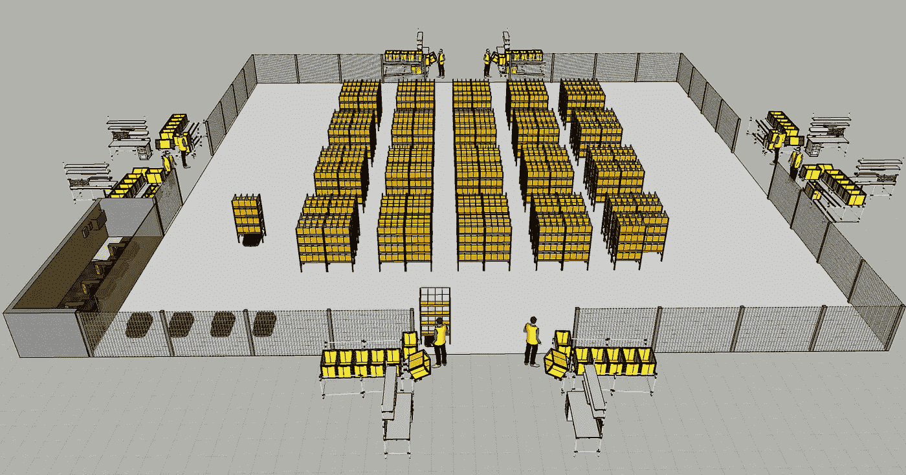
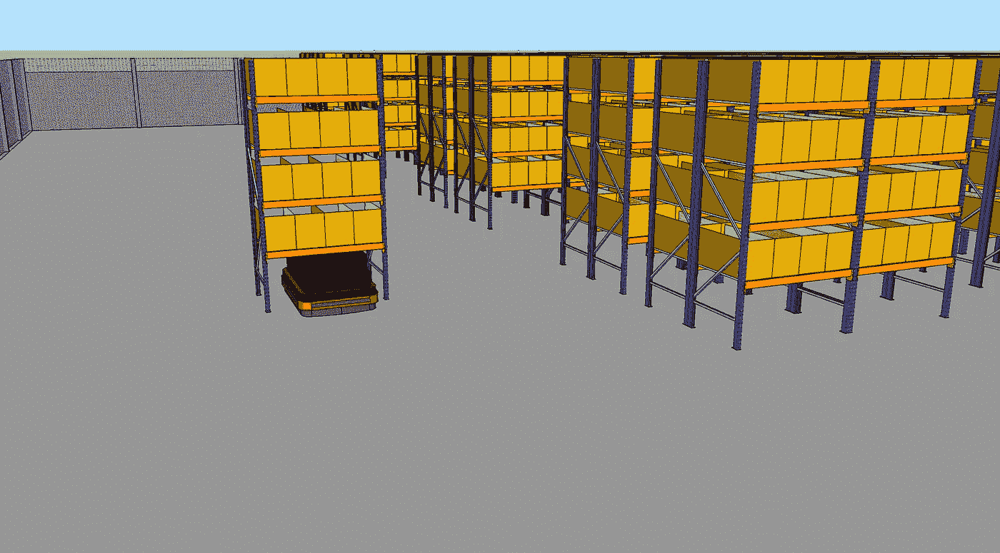
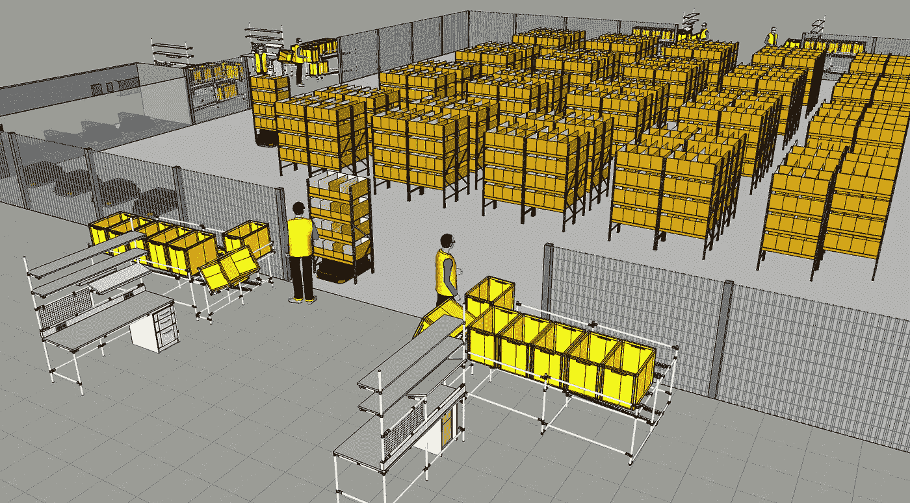
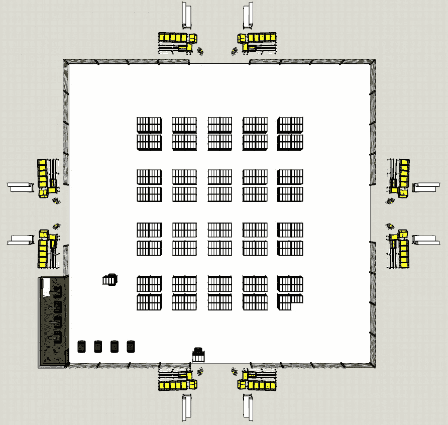
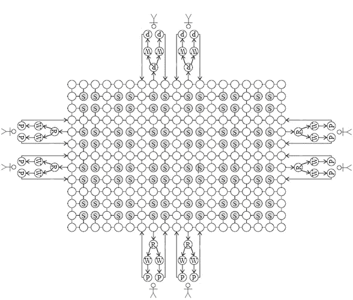
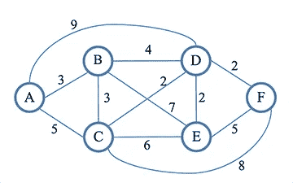
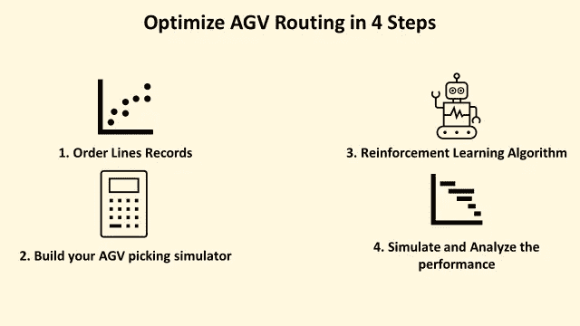
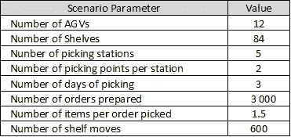
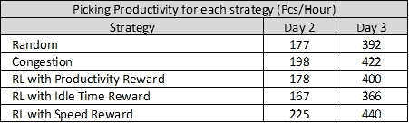

# AGV 路径的深度强化学习

> 原文：<https://towardsdatascience.com/deep-reinforcement-learning-for-agv-routing-a9b9fe055304?source=collection_archive---------26----------------------->

## 通过对**自动导引车**路线安排使用强化学习来提高仓库生产率

带有 8 个工作站的 AGV 设置示例—(图片由作者提供)

在一个**配送中心(DC)，**在拣货路线上从一个地点走到另一个地点可以占*操作员工作时间的 60%到 70%* 。减少步行时间是提高整体生产力的最有效方法。

在以前的一系列文章中，我已经分享了几种使用优化策略来减少仓库中操作员行走距离的方法。( [**链接**](/optimizing-warehouse-operations-with-python-part-1-83d02d001845) )

当你有一个大的提货区时，这些方法有局限性。因此，使用**自动导向车**将货架直接送到操作人员手中的自动化解决方案现在非常流行。

本文将解释如何使用**强化学习**来组织这些机器人的路线，以确保最佳生产率。

💌新文章直接免费放入你的收件箱:[时事通讯](https://www.samirsaci.com/#/portal/signup)

# 一.从人对货物到货物对人

电子商务公司最早采用了这种从人工操作——人对商品——到商品对人的转变。

因为他们的业务量波动很大(促销、节日)，参考范围很广，而且劳动力资源短缺:自动化对他们来说是必须的。

## 使用自动引导车进行货物到人的拣选

“货物到人”提货解决方案可在提货站将货物直接交付给您的操作员。您消除了操作员搜索商品所需的所有非增值时间。

车辆上的货架示例—(图片由作者提供)

货物储存在货架上，可以由这些车辆直接移动到提货站，在那里操作员将获得所需的数量来准备订单。

Pickstation 示例—(图片由作者提供)

## AGV 安装布局

AGV 设置示例—(图片由作者提供)

在这个布局中，你有

*   **8 个拾取站**两个一组，每个站 1 名操作员
*   **16(8×2)条货架大巷**
*   **1 个车辆充电站**

# 二。构建您的优化模型

## 创建 AGV 布局的拓扑图

Djisktra 图表示例—(图片由作者提供)

我们的布局由图 G(N；e)

*   n 是节点的集合(上面的圆圈)
*   e 是边的集合(实线和箭头)
*   s 代表货架(实心灰色节点表示存放货架的位置)
*   r 代表 AGV 旋转货架的点
*   w 代表等待点，带货架的 AGV 在此等待之前到达提货站的 AGV 完成提货活动
*   p 代表提货点，提货人将在此提货

这种映射将包含在一个 **AGV 拣选模拟模型**中，该模型将用于测试我们的路径选择策略。

## 使用 Djisktra 算法的路径查找

Dijkstra 算法是一种优化算法，解决带权边(非负权)的有向图的单源最短路径问题。

Djisktra 图表示例—(图片由作者提供)

该长度可以是路径的绝对长度，也可以考虑位于边或节点上的其他约束来计算。

我们可以使用三种类型的权重，从节点 *u* 到节点 *v* 标注为 *w(u，v)*

*   **最短距离路线权重:** w(u，v) = d(u，v) (1)
    *用 d(u，v)表示 u 和 v 之间的距离
    -* **目标:**取距离最短的路线
*   **最短行驶时间:** w(u，v) = d(u，v)/s(u，v) + r(u，v) (2)
    *用 s(u，v)表示 AGV 平移速度和 r(u，v)表示所有旋转所需的时间* - **目标:**选择行驶时间最短的路线
*   **拥塞避免:** w(u，v) = d(u，v)/s(u，v) + r(u，v) + Co(u，v) (3)
    *with* o(u，v)*AGV 计划通过边缘的数量，C 为调整权重的定值
    - **目标:**选择与其他 AGV 避免拥塞的路线*

## *强化学习方法*

*在时间 t，我们通过下式定义仓库的状态:*

*   *所有活动车辆的空间位置*(分配了路线的 AGV)**
*   *所有活动货架的空间位置*(有待拣选商品的货架)**
*   *工作站订单行分配(需要转移物料的工作站)*

*这些参数会随时间变化，因此让我们使用强化学习方法根据这种状态从这些候选中选择最佳路线。*

## *代理回报策略*

*使用三种不同的奖励值方法来奖励您的学习代理到达目的节点*

*   ***生产率:**从 AGV 从起点出发到到达目的地这段时间内，每个工时拣选的物品数量。*
*   ***空闲时间:**在用 AGV 从货架上拣货后，拣货员等待下一辆 AGV 的时间。*
*   ***速度:**AGV 从起点到终点的平均速度*

**

*流程—(图片由作者提供)*

# *三。模拟*

**关注我的 medium，了解更多与供应链数据科学相关的见解。**

## ***场景***

*第一次模拟是基于三天的挑选:第一天用于训练；测试的第 2 天和第 3 天。*

**

*模拟的第一个场景—(图片由作者提供)*

*RL 模型的结果将与两种简单的路线规划
策略进行比较*

*   ***随机:**在最短距离路线、最短行驶时间路线和拥堵避免路线中随机选择一条路线*
*   ***拥塞:**始终选择拥塞避免路线*

## *结果*

**

*每种策略的结果—(图片由作者提供)*

*令人惊讶的是，生产率奖励的效果不如速度奖励。试图最大化每个 AGV 的生产率可能不是车辆之间协作工作以确保高全球生产率的最佳方法。*

*当拥塞是主要瓶颈时(即，当您有高密度的车辆同时运行时)，拥塞策略表现良好，同时与 RL 方法相比需要较少的计算资源。*

## *后续步骤*

*这些结果基于只有两天提货活动的特定布局。为了更好地理解这种方法，我将在下一篇文章中解释如何构建 AGV 拣选模拟器并实现路由策略。*

*应该在各种订单配置文件上测试该模型，以测试通过调整对生产率的影响*

*   *每份订单的行数(每份订单的移动次数)*
*   *每行领料的单位数量*
*   *活动 SKU 的范围*

*如果你在 SKU 的某个特定群体、购物节(黑色星期五，11.11)或淡季有促销活动，策略的选择可能会有所不同。*

## *超出*

*对于更传统的拣货流程，您可以找到使用高级分析工具和流程分析概念进行流程优化的示例。*

* [## 基于排队论的供应链流程设计

### 物流持续改进应用 Python 中排队论的几个原理设计一个包裹包装…

www.samirsaci.com](https://www.samirsaci.com/supply-chain-process-design-using-the-queueing-theory/)  [## 使用 Python 的订单批处理提高仓库生产率

### 物流持续改进设计一个模拟模型来估计几个单拣货员路线的影响…

www.samirsaci.com](https://www.samirsaci.com/improve-warehouse-productivity-using-order-batching-with-python/)  [## 使用 Python 线性编程优化劳动力规划

### 物流持续改进你需要雇佣多少临时工来消化你每周的…

www.samirsaci.com](https://www.samirsaci.com/optimize-workforce-planning-using-linear-programming-with-python/) 

# 关于我

让我们连接上 [Linkedin](https://www.linkedin.com/in/samir-saci/) 和 [Twitter](https://twitter.com/Samir_Saci_) ，我是一名供应链工程师，正在使用数据分析来改善物流运营和降低成本。

如果你对数据分析和供应链感兴趣，可以看看我的网站

 [## Samir Saci |数据科学与生产力

### 专注于数据科学、个人生产力、自动化、运筹学和可持续发展的技术博客

samirsaci.com](https://samirsaci.com) 

# 参考

[1]使用深度强化学习的自动导引车辆路线规划策略的获取，IEEE 高级物流与运输国际会议(ICALT 2017)

[2]一种面向制造业多 AGV 调度的强化学习方法，，薛，彭增，
实验室。沈阳自动化研究所网络控制系统

[3]使用深度强化学习在线优化 AGV 运输系统，网络、计算、系统和软件通报，Kei Takahashi，Sogabe Tomah*