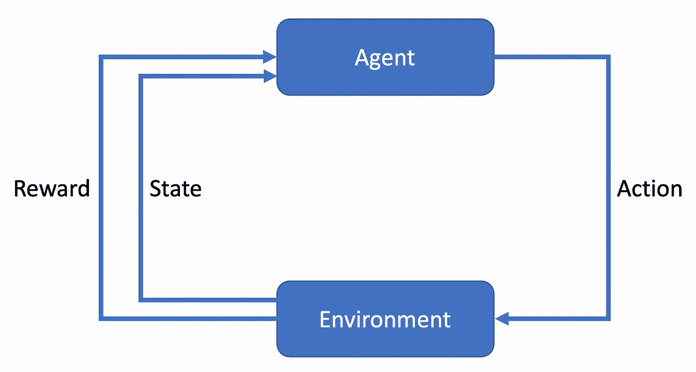
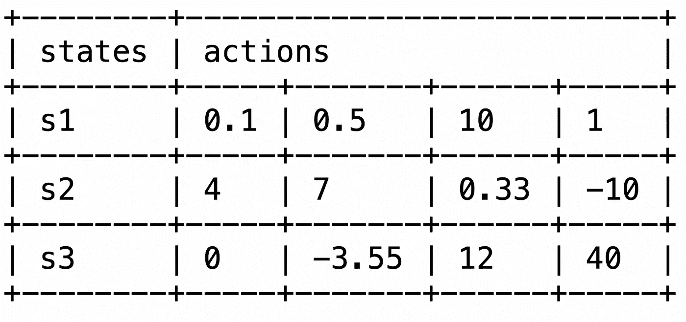

# 深度强化学习:从萨莎到 DDPG 及其他

> 原文：<https://towardsdatascience.com/deep-reinforcement-learning-from-sarsa-to-ddpg-and-beyond-458100c2fda8?source=collection_archive---------12----------------------->

## [思想和理论](https://towardsdatascience.com/tagged/thoughts-and-theory)

## 抓住使 RL 成功的基本要素

让机器学习的能力是过去几十年的一项令人着迷的成就。许多新的商业机会已经开放，公司每天都在使用机器学习。

就在几年前，DeepMind 的 AlphaGo 算法打败了围棋世界冠军 Lee Sedol。这一惊人的壮举是在强化学习的帮助下实现的，但无疑不是一夜之间实现的。这个雄心勃勃的项目的研究始于 21 世纪初。从那以后，这个领域本身已经有了很大的发展。本文旨在涵盖向现代方法转变的一部分。

# 基础

在我们开始之前，我们必须缩小强化学习的含义:强化学习的目标是尽可能好地行动。这个定义是的简化版本

目标是找到一个使预期收益最大化的政策。

为了实现这一点，我们有几个组件协同工作，如图所示:

强化学习的循环。图片由作者提供，来自一个封闭的大学讲座的例子。

代理与环境交互，环境改变它的状态，并为动作产生奖励。然后，又一轮开始了。在数学上，这个周期是基于马尔可夫决策过程(MDP)。这种市场发展计划包括五个组成部分:南非、阿尔及利亚、菲律宾和 p₀.

s 是状态空间，它包含环境可能处于的所有可能状态 *s* 。例如，如果我们要为一辆汽车建模，它可能有以下状态:前进、后退、转弯、刹车等等。

第二个组件 A 是动作空间，它定义了代理可以执行的所有动作 *a* 。对于汽车设定，这可能是转动方向盘，加速，刹车。这样的行动导致了新的国家。

第三个分量 R 是奖励函数。该功能负责根据代理的动作和结果状态对其进行奖励。例如，如果汽车成功地在交通灯前停下来，代理人会得到一个积极的奖励。然而，如果它没有停止，代理人会得到一个负的奖励。

第四个分量 P 是转移概率函数。通常情况下，一个动作并不能保证会达到期望的状态。因此，该属性被建模为概率函数。例如，它可能会说:“有 90%的可能性，我们会到达理想的状态，但有 10%，可能会发生不同的事情。”

最后，我们有 p₀，它是一组初始状态。每当一个代理被训练，它开始在这些状态之一。

现在我们已经介绍了 RL 设置的要素，我们如何教代理学习期望的行为呢？这是在π策略的帮助下完成的，我之前简单地提到过。形式上，策略从状态空间 S 映射到所有可能动作的概率。听起来很复杂？考虑一下:你站在路边，想要过马路。这种情况就是你的起始状态。一个策略现在将列出所有可能的动作:向左看、向右看、直线向前跑、等待等等。所有这些选择都有被选中的概率。例如，你可能有 20%的机会选择向左看，有 50%的机会，你可能选择跑。

随着代理被训练，它优化策略。一开始，π可能会经常选择跑过街道。然而，由于代理人多次被车撞，他获得了许多负面奖励，这是他不想要的。随着时间的推移，代理人学会做得更好，导致越来越多的积极回报。最终，这将导致找到一个最大化总回报的政策。

但是，我们怎么知道我们现在的状态是好的呢？对于我们可以采取的行动，我们可能会问:我们如何知道它们是好的？这种评估借助于价值函数来实现。我们有两个，一个是国家的，一个是行动的。

第一个函数称为状态值函数，缩写为 v。对于每个状态，它“知道”这个状态有多好。状态的好与坏是由我们在这种状态下开始时期望得到的回报决定的。比如赛车中的杆位更容易赢得比赛；这位司机获得了积极的奖励。这一事实影响了杆位的价值:随着越来越多的人从这里开始并赢得比赛，从这种状态中获得的积极奖励的数量也在增加。反过来，极点位置的值增加。

第二个函数是动作值函数，缩写为 q。对于我们在给定状态下可以做的所有动作，它“知道”它们有多好。这个知识的获得与上面类似:导致好的回报的行为比导致负面回报的行为有更高的价值。

# 萨尔萨

现在我们已经讨论了基础知识，我们可以检查一个经典的 RL 算法，称为 SARSA [1]。这个名字是州行动奖励州行动的缩写，它巧妙地抓住了功能。

首先，我们从一个状态(S)开始，采取行动(A)，得到回报(R)。现在我们处于后继状态，并选择另一个动作(A)。我们这样做是为了更新我们的 Q 函数。如前所述，行动的价值是当我们从一个状态开始并选择这个行动时，我们期望的总回报。同样的属性适用于下一个状态、下一个状态和下一个下一个状态。我们可以用动作值函数的更新规则来表达这一点:

Q(s，a) ← Q(s，a) + α(r + γ Q(s '，a') — Q(s，a))

上面写了什么？我们的状态-动作对的新值是旧值加上，这是括号中的部分，与我们从这里得到的不同:r + γ Q(s '，a ')。所以随着时间的推移，我们的 Q 函数越来越接近我们得到的回报，这是由这个更新规则模拟的。

现在我们有了 Q 函数(或者有时称为 Q 值)，我们能用它做什么呢？首先，这些值存储在一个表中。每当我们的策略必须选择一个操作时，它会检查它处于哪个状态，然后查看所有可能的操作:

从所有这些动作中，选择具有最高值的动作。这个动作导致了一个新的状态，在这个状态中，再次选择了最有价值的动作。在训练期间，Q 值按照先前引入的更新规则进行更新。一旦完成，我们就找到了一个合适的好策略，并准备在我们的环境中使用代理。

但是至少有一点我们可以改进算法。这就是 Q-Learning 发挥作用的地方。

# q 学习

Q 学习算法[2，3]可以概括为非策略 SARSA。为了解释这一点，让我们再来看看 SARSA 的更新规则:

Q(s，a) ← Q(s，a) + α(r + γ Q(s '，a') — Q(s，a))

我们的策略π选择一个初始动作，这是 Q(s，a)部分。然后，我们使用相同的策略来选择后续动作，也就是说 Q(s '，a ')的部分。使用相同策略来确定两个动作的过程由关键字 *on-policy* 表示。代理基于当前使用的策略所选择的动作来学习 Q 值。

相比之下，在*非策略*算法中，我们有不止一个策略。这可以从 Q-learning 的更新规则中看出:

Q(s，a) ← Q(s，a) + α(r + γ maxₐ' (s '，a') — Q(s，a))

关键的区别是选择*最佳*后续行动，这是*而不是*遵循政策完成的。相反，我们总是选择具有最高 Q 值的动作。这个选择过程可以理解为另一个用于确定后续行动的策略。好处是我们可以遵循不同的策略来选择后续操作。这看起来没什么大不了的，但是在 Q-learning 中，我们总是利用这个事实来选择一个最优的后续行动。

此外，它允许我们很容易地加入额外的影响。例如，考虑我们可能拥有的第二个代理。这个代理有一个独特的功能，我们希望我们的主要代理也能学习它。我们采用二级代理的策略，并在我们选择新的后续动作时使用它。

到目前为止，我们不需要任何神经网络。但是表格方法不适合大的状态和动作空间:首先，它们的内存消耗很大。其次，我们甚至可能不会在训练过程中访问所有的状态或动作，所以有些条目可能没有初始化。第三，查找时间过长。然而，作为第一个措施，我们可以使用神经网络来代替 Q 表。

# 深度 Q 学习

神经网络已经被证明具有良好的泛化能力。我们也可以利用它们从数据中学习特征的能力来进行强化学习。在深度强化学习中，我们用神经网络来逼近我们的函数，比如 Q[4]。为了突出这种修改，Q 或 V 函数通常标有θ: Q_θ和 V_θ。除了神经网络之外，还有其他方法，但这些不是本文的范围。

在默认的 Q 学习中，更新规则帮助我们找到最优的 Q 值。最优意味着它们会带来最高的回报；我们可以用它们来选择最佳行动(在给定状态下具有最高 Q 值的行动)。并且，通过使用神经网络，我们直接逼近这个最佳 Q 或 V 函数。我们从少量的训练数据中学习，然后可以推广到新的情况。

在深度 Q 学习算法中，我们使用两种技术，称为*经验重放*和*目标网络*。

第一个修改将旧的转换(通过选择一个动作从一个状态转移到下一个状态)存储在重放缓冲区中。在训练期间，我们从这个缓冲区取样。这项技术提高了效率，并使数据分布更加稳定。这是怎么回事？现在，想想如果我们有几个动作，并且在每个训练步骤中，我们选择不同的一个，会发生什么。我们总是在各种可能性之间跳跃。有了重放缓冲区，我们可以检测分布中的趋势，使动作的选择更加稳定。

第二个修改，*目标网络*，用于计算我们的目标。一般来说，我们的目标是最大化预期报酬。问题是，我们如何知道我们的奖励是否已经是最好的了？目标网络帮助我们解决这个问题。我们使用旧更新步骤中的网络，并将其 Q 值作为目标。这听起来可能很难，因此我们来看看目标网络的更新规则:

Q_θ(s，a) ← Q_θ(s，a) + α((r + γ maxₐ' Qₜₐᵣ(s'，a′))—q _θ(s，a))

不同之处在于更新目标的计算。通过最小化我们的当前值 Q_θ(s，a)和 Qₜₐᵣ(s'，a’)之间的差，我们接近目标，这里缩写为“tar”。而这个目标就是目标网络的价值。

现在，如果我们不使用这样的目标网络，而只使用当前网络 Q_θ，我们的目标将不断变化:随着网络参数的每次更新，我们将得到不同的 Q 值。这就是为什么我们使用旧网络(意味着在我们当前网络之前的一些更新步骤)作为固定目标。它的参数更新得更慢，使目标更稳定。最终，我们降低了我们的主网络可能会被自己的尾巴所困扰的风险。

换句话说，想想跑步比赛。每当你接近终点线时，它就会后退。这样，你永远不知道你离目标有多近。

这两个提出的修改，使用一个重放缓冲器和目标网络，被用来帮助 RL 代理玩 Atari 游戏，有时甚至在超人的水平[5]。

# 深度确定性政策梯度

到目前为止，我们只考虑了离散动作空间。在离散的动作空间中，我们有固定数量的动作，只有一个单一的粒度级别。相比之下，想想门和墙之间的角度。如果我们只有，比方说，两个位置，我们有一个离散的空间。但是我们可以把门放在任意的位置:全开、全关、45 度、30 度、30.1 度、30.01 度等等。这个空间是连续的，用表格方法和深度 Q 学习方法都难以覆盖。

连续动作的问题是到目前为止我们对 Q 函数的更新步骤:

Q_θ(s，a) ← Q_θ(s，a) + α((r + γ maxₐ' Qₜₐᵣ(s'，a′))—q _θ(s，a))

上面写着 maxₐ' Qₜₐᵣ(s'的那一部分才是问题所在。在离散的行动空间中，很容易找到导致最高回报的行动。然而，在具有任意细粒度动作的连续动作空间中，这是非常昂贵的，如果不是不可能的话。

一个简单的解决方案是将空间离散化。但是，挑战在于如何离散化。然而，我们可以完全跳过这个问题，修改深度 Q 学习算法以支持连续动作。这导致了深度确定性策略梯度(DDPG)算法[6，7]，它本质上是针对连续动作的深度 Q 学习。它也使用重放缓冲区和目标网络，但采用最大运算。

我们引入另一个神经网络，而不是“手动”执行对最佳状态-动作对(最佳 Q 值)的搜索。这个神经网络学习逼近最大化器。然后，每次我们用一个状态查询它，它都返回最佳的对应动作——这正是我们需要的。

取代最大化器的新网络然后被用于目标的计算。因此，前面的等式可以改写为

Q_θ(s，a) ← Q_θ(s，a) + α((r + γ Qₜₐᵣ(s'，μₜₐᵣ(s'))—q _θ(s，a))

正如我提到的，我们使用网络，μₜₐᵣ，来决定最佳行动。和以前一样，我们使用稍微旧一点的网络版本，因此有“tar”部分。即使μₜₐᵣ和 Qₜₐᵣ每一步都被更新，它们也永远不会被更新到最新的参数。相反，他们通常保留 90%的参数值，剩下的 10%来自当前网络。这样，目标网络既不会太旧，也不会太新。

双延迟 DDPG 算法[8]引入了三种改进，以提高默认版本的性能。首先，TD3，也是缩写，学习两个 Q 函数并使用较小的值来构建目标。此外，策略(负责选择初始动作)更新不太频繁，并且添加噪声以平滑 Q 函数。

# 熵正则化强化学习

所有算法面临的挑战是过早收敛。这种不受欢迎的行为是探索不足的结果。例如，如果代理已经确定了一个好的动作序列，他可能会关注这些特定的动作。在这个过程中，他没有探索其他州，而这些州可能会给他带来更好的回报。这种现象也被称为探索与开发的权衡:探索旨在探索动作和状态空间，而开发则寻求开发已经探索过的区域。

熵正则化强化学习方法是应对这一挑战的一种方式:我们训练策略来最大化如上所述的权衡。为了做到这一点，我们使用一个叫做熵的概念。简而言之，熵给出了关于分布“混沌”的信息。混沌程度越高(“分布越不均匀”)，熵值越低。因此，所有值都有相同的机会被抽取的均匀概率产生最大熵值。

我们利用这个事实，在我们的价值函数中加入一个熵项。详细解释它们超出了本文的范围，但要点如下:附加术语强制执行策略，以在高回报(探索)和从各种行动中选择(探索)之间保持平衡。

在软演员-评论家算法[9，10]中，这个概念尤其用于训练机器人行走。虽然机器人只在平坦的地形上训练，但由此产生的策略足以应对训练期间看不到的环境。

# 强化学习库

上面所有的算法都已经在各种 python 包中实现了。OpenAI [Gym](https://gym.openai.com) 和 [Safety Gym](https://github.com/openai/safety-gym) 框架提供了构建代理培训环境的代码。来自 DeepMind 的研究人员提供了[控制套件](https://github.com/deepmind/dm_control)包，用于基于物理的 RL 模拟。

要构建算法，可以从各种选项中进行选择。稳定基线 3 库是在 PyTorch 中实现的，它提供了比较算法和创建新算法的工具。类似地，ACME 库提供了 RL 代理和构建块，并且足够灵活，可以进行自己的研究。作为第三种选择，你可以考虑[谷歌的多巴胺框架](https://google.github.io/dopamine/)，它专注于投机性研究的快速原型制作。它支持 JAX 和张量流。

# 摘要

在过去的几十年里，强化学习领域经历了许多批判性的观点。该基金会是基于学习功能的理念建立的，这种学习功能可以量化处于特定情况下的优势。研究人员随后提议使用不同的政策来有效地探索环境。当在神经网络的帮助下学习函数时，向前迈出了重要的一步，这引入了算法设计的许多新的可能性。随着时间的推移，其他想法被纳入其中，如逐步更新作为训练目标的其他网络。然而，开发并没有完成。仍然有许多挑战需要克服，例如处理约束，弥合训练和现实生活环境之间的差距，或者可解释性。

# 文学

[1] Gavin Rummery 和 Mahesan Niranjan，[使用连接主义系统的在线 Q-learning](https://citeseerx.ist.psu.edu/viewdoc/download?doi=10.1.1.17.2539&rep=rep1&type=pdf)，1994 年，Citeseer

[2] C.J.C.H .沃特金斯，[从延迟回报中学习](https://d1wqtxts1xzle7.cloudfront.net/50360235/Learning_from_delayed_rewards_20161116-28282-v2pwvq-with-cover-page-v2.pdf?Expires=1628665119&Signature=ebJKaUbnN54qOUvLFCwoDoTLGfTA6GuCDLttjqa5QEwoIT7zeUhoYsM3WM59MIznGKFkTrTw18uYnUw2cwQGG85Us-5~gPohm4usSSrjhKWMTWxgnsEWtGv4ZrhQckBJt~6Ticmx3JpRWZSrD3ewcUHU8CpRyiI4P4RsONv6KuJUqvfEFq1dK1juQqibx0AaXhUIuWxNg9hidTan3aeijoxB1AeZta2oCD7s8ALMq3~m4ih5Rn~XYF16Gq2fY4i-FQSsBgv9zz6OXnkkpyp7CZasb-WGFQwQmGRdbJdcw~1vozPqVv3yuG~0d2Owm1nbm06qJbnVG7VOjHyodiYrxg__&Key-Pair-Id=APKAJLOHF5GGSLRBV4ZA)，博士论文，1989 年，剑桥大学国王学院

[3] C.J.C.H .沃特金斯和彼得·达扬， [Q-learning](https://link.springer.com/content/pdf/10.1007/BF00992698.pdf) ，1992，机器学习 8

[4] Kurt Hornik，[多层前馈网络的逼近能力](http://www.vision.jhu.edu/teaching/learning/deeplearning18/assets/Hornik-91.pdf)，1991，神经网络 4

[5] Mnih 等人，[用深度强化学习玩雅达利](https://arxiv.org/pdf/1312.5602.pdf)，2013，arXiv

[6] Silver 等人，[确定性策略梯度算法](http://proceedings.mlr.press/v32/silver14.pdf)，2014，机器学习国际会议

[7] Lillicrap 等，[深度强化学习的连续控制](https://arxiv.org/pdf/1509.02971.pdf)，2015，arXiv

[8] Stephen Dankwa 和 Wenfeng Zheng，[双延迟:一种深度强化学习技术，用于模拟智能机器人智能体的连续运动](https://dl.acm.org/doi/pdf/10.1145/3387168.3387199?casa_token=pHHjm6A89ckAAAAA:jOlVaEVQgU8g2tZ79UwdKGxdZCEpTUE5OGNcIgn_86LsDhCCFkxlzkCKX-dPVmfETvem_cVgeg)，2019，ACM

[9]哈尔诺贾等，[软行动者-批评家:带随机行动者的离策最大熵深度强化学习](http://proceedings.mlr.press/v80/haarnoja18b/haarnoja18b.pdf)，2018，ICML

[10]哈尔诺贾等，软演员-评论家算法与应用，2018，arXiv

[11]哈尔诺贾等，[通过深度强化学习学习走路](https://arxiv.org/pdf/1812.11103)，2018，arXiv