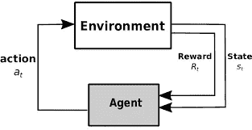
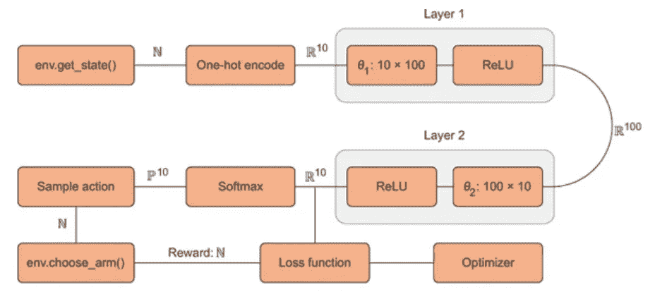
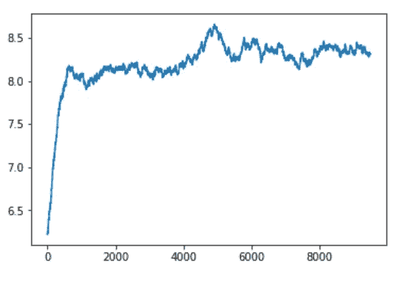

# 优化广告投放的深度强化学习实践

> 原文：<https://towardsdatascience.com/deep-reinforcement-learning-hands-on-for-optimized-ad-placement-b402ffa47245?source=collection_archive---------18----------------------->

> 本文使用深度强化技术来优化网站上的广告投放，以最大化用户点击概率并增加数字营销收入。提供了一个详细的案例研究和代码，以帮助用户在任何现实世界的例子中实现该解决方案。


联盟营销和点击付费是数字营销的两个重要方面。这些技术的优化实施可以极大地增加公司的产品/服务销售额，也可以为营销人员带来巨大的收入。随着深度强化学习的进展，数字营销是受益最大的领域之一。

传统的微调数字营销活动的方法需要大量的历史数据。这既耗费时间又耗费资源。通过强化学习，可以节省时间和资源，因为它们不需要任何历史数据或活动的先验信息。在这篇文章中，我们可以看到一个简单的深度 RL 技术如何优化一个相当复杂的数字营销活动，并取得几乎完美的结果。

在本文中，通过一个接近真实的案例研究，让我们看看强化学习如何帮助我们管理广告投放，以获得最大的利益。

**问题陈述**

我们管理着 10 个电子商务网站，每个网站都专注于销售不同类别的商品，如电脑、珠宝、巧克力等。我们的目标是通过将在我们的一个网站购物的顾客推荐到他们可能感兴趣的另一个网站来增加产品的销售。当客户查看我们的一个网站时，我们会显示另一个网站的广告，希望他们也会购买其他产品。我们的问题是，我们不知道客户应该被推荐到哪个网站，或者我们没有客户偏好的任何信息。

## *让我们用强化学习来解决问题吧！！*



图 1:RL 背后的基本概念示意图

一般来说，强化学习是一种技术，在这种技术中，我们训练一个代理在一个环境中操作。代理人在状态“s”采取行动“a ”,并从环境收到行动的奖励“r”。所以(s，a，r)成为一个状态-动作-回报元组。我们培训的目标是使代理获得的总回报最大化。因此，我们找到了(s，a，r)元组，它对于给定的状态和动作具有最大的回报。为了找到优化的元组，我们运行了许多集，每次都重新计算奖励。

在这个广告投放问题中，我们需要测试不同的行为，并自动学习给定情况、状态或背景下最有益的结果。所以我们称之为*语境强盗*框架，其中状态成为语境信息，代理为当前语境找到最佳行动。

比方说，我们有 10 个网站要管理，它们构成了 10 个不同的州，客户在其中一个网站上。因为我们有 10 种不同的产品类别，所以我们可以向客户展示这 10 种产品中的任何一种。所以每个州有 10 个不同的动作。这将导致 100 个不同的状态-动作-回报元组。我们需要存储 100 个不同的数据点，并在每次有新的奖励时重新计算。在这个例子中，这似乎是合理的。但是，如果我们有 1000 个网站要管理，这将产生 1000000 个数据点。存储和重新计算这将花费大量的时间和资源。

这意味着当状态和动作空间很大时(状态和动作的总数很大)，强化学习会失败？？？

这就是深度强化学习的由来。我们使用神经网络来提取每个状态和动作的奖励值，而不是存储每个状态、动作和奖励元组。神经网络非常擅长学习抽象概念。他们学习数据中的模式和规律，并可以将大量信息作为权重压缩到他们的内存中。因此，神经网络可以学习状态——行动和奖励之间的复杂关系。

神经网络充当从环境中学习以最大化回报的代理。在本文中，我们将使用 PyTorch 构建一个神经网络，并训练它来优化广告投放，以获得最大回报。

## *让我们从编码开始吧！！*

让我们首先为上下文强盗创建一个模拟环境。这个环境应该包括代表 10 个网站(0 到 9)的 10 个状态和产生广告点击奖励的方法，以及选择一个动作(显示 10 个广告中的哪一个)的方法

```
class ContextBandit:
    def __init__(self, arms=10):
        self.arms = arms
        self.init_distribution(arms)
        self.update_state()

    def init_distribution(self, arms):                  #**1**
        self.bandit_matrix = np.random.rand(arms,arms)

    def reward(self, prob):                             
        reward = 0
        for i in range(self.arms):
            if random.random() < prob:
                reward += 1
        return reward

    def get_state(self):                                
        return self.state

    def update_state(self):                             
        self.state = np.random.randint(0,self.arms)

    def get_reward(self,arm):
        return self.reward(self.bandit_matrix[self.get_state()][arm])

    def choose_arm(self, arm):                          #**2**
        reward = self.get_reward(arm)
        self.update_state()
        return reward
```

这是一个代表每个州的矩阵。行代表状态，列代表臂(动作)

选择一只手臂(动作)会返回奖励并更新状态

下面的代码显示了如何使用环境

```
env = ContextBandit(arms=10)
state = env.get_state()
reward = env.choose_arm(1)
print(state)
>>> 1
print(reward)
>>> 7
```

该环境由一个名为 *ContextBandit* 的类组成，该类可以通过 arm(动作)的数量进行初始化。在这个例子中，我们采取的状态数等于动作数。但这在现实生活中可能会有所不同。该类有一个函数 get_state()，调用它时会从均匀分布中返回一个随机状态。在现实生活的例子中，状态可以来自更复杂的或与业务相关的分布。用任何动作(arm)作为输入调用 choose_arm()将模拟投放广告。该方法返回对该动作的奖励，并使用新状态更新当前状态。我们需要一直调用 get_state()然后选择 _arm()不断获取新数据。

ContextualBandit 也有一些辅助功能，如*一键编码器*和 *softmax。*一键编码器函数返回一个 1 和全 0 的向量，其中 1 代表当前状态。Softmax 函数用于设置每个状态下各种动作的奖励分配。对于 n 个状态中的每一个，我们将有 n 个不同的 softmax 奖励分配。因此，我们需要了解状态和它们的动作分布之间的关系，并为给定的状态选择概率最高的动作。下面提到了这两个函数的代码

```
def one_hot(N, pos, val=1):  #N- number of actions , pos-state
    one_hot_vec = np.zeros(N)
    one_hot_vec[pos] = val
    return one_hot_vecdef softmax(av, tau=1.12):
    softm = np.exp(av / tau) / np.sum( np.exp(av / tau) ) 
    return softm
```

现在让我们创建一个具有 ReLU 激活的两层前馈神经网络作为代理。第一层将接受 10 个元素的一次性编码向量(状态向量),最后一层将输出 10 个元素向量，表示每个动作的奖励。



图 2:计算图表

从图 2 中，我们可以看到 get_state()函数返回一个随机状态值，该值使用一位热码编码器转换为 10 个元素的向量。该向量作为输入被馈送到神经网络。神经网络的输出是 10 个元素的向量，表示给定输入状态下每个动作的预测回报。输出是一个密集向量，使用 softmax 函数进一步转换为概率。基于概率，选择样本动作。一旦选择了动作，choose_arm()就会获得奖励，并使用环境中的新状态进行更新。

最初，对于状态 0，神经网络将产生类似于[1.4，50，4.3，0.31，0.43，11，121，90，8.9，1.1]的输出向量。在运行 softmax 并对动作进行采样后，最有可能的动作 6 将被选中(最高预测奖励)。选择动作 6 运行 choose_arm()后会产生奖励比如说 8。我们训练神经网络用[1.4，50，4.3，0.31，0.43，11，8，90，8.9，1.1]更新向量，因为 8 是实际的奖励。现在，下一次神经网络将预测，每当看到状态 0 时，行动 6 的奖励接近 8。当我们在许多状态和动作上不断训练我们模型时，神经网络将学习为各种状态-动作对预测更准确的回报

下面是创建神经网络和初始化环境的代码

```
arms = 10
N, D_in, H, D_out = 1, arms, 100, armsmodel = torch.nn.Sequential(
    torch.nn.Linear(D_in, H),
    torch.nn.ReLU(),
    torch.nn.Linear(H, D_out),
    torch.nn.ReLU(),
)
loss_fn = torch.nn.MSELoss()
env = ContextBandit(arms)
```

现在，让我们看看如何训练代理，并按照图 2 中说明的所有步骤进行操作

```
def train(env, epochs=5000, learning_rate=1e-2):
    cur_state = torch.Tensor(one_hot(arms,env.get_state()))      #1
    optimizer = torch.optim.Adam(model.parameters(), lr=learning_rate)
    rewards = []
    for i in range(epochs):
        y_pred = model(cur_state)                                #2
        av_softmax = softmax(y_pred.data.numpy(), tau=2.0)       #3
        av_softmax /= av_softmax.sum()                           #4
        choice = np.random.choice(arms, p=av_softmax)            #5
        cur_reward = env.choose_arm(choice)                      #6
        one_hot_reward = y_pred.data.numpy().copy()              #7
        one_hot_reward[choice] = cur_reward                      #8
        reward = torch.Tensor(one_hot_reward)
        rewards.append(cur_reward)
        loss = loss_fn(y_pred, reward)
        optimizer.zero_grad()
        loss.backward()
        optimizer.step()
        cur_state = torch.Tensor(one_hot(arms,env.get_state()))  #9
    return np.array(rewards)
```

*   ***1*** 获取环境的当前状态；转换为 PyTorch 变量
*   ***2*** 向前运行神经网络以获得奖励预测
*   ***3*** 用 softmax 将奖励预测转换成概率分布
*   ***4*** 对分布进行规范化，以确保其总和为 1
*   ***5*** 概率性地选择新动作
*   ***6*** 采取行动，获得奖励
*   ***7*** 将 PyTorch 张量数据转换为 Numpy 数组
*   ***8*** 更新 one_hot_reward 数组作为标注的训练数据
*   **9更新当前环境状态**

在对网络进行了大约 5000 个纪元的训练后，我们可以看到平均回报有所提高，如下所示



图 3:培训后的平均回报

我们可以看到平均奖励达到 8 或以上。

整个项目可以在[这个](https://github.com/NandaKishoreJoshi/Reinforcement_Lerning/blob/main/RL_course/1_Ad_placement.ipynb) GIT 链接中找到。

本文基于布兰登·布朗和亚历山大·扎伊的《深度强化学习行动》一书。这本书的链接是[这里](https://learning.oreilly.com/library/view/deep-reinforcement-learning/9781617295430/kindle_split_011.html)

请在下面找到我关于各种数据科学主题的其他文章的链接

<https://nandakishorej8.medium.com/multivariate-timeseries-forecast-with-lead-and-lag-timesteps-using-lstm-1a34915f08a>  <https://nandakishorej8.medium.com/realtime-2d-yoga-pose-estimation-with-code-walk-through-cfd69262d356>  <https://nandakishorej8.medium.com/auto-tuning-multiple-timeseries-sarimax-model-with-a-case-study-and-detailed-code-explanation-c136293b8457>  <https://nandakishorej8.medium.com/introduction-to-pytorch-lightning-framework-for-enlightning-research-fe953bbea03b>  

非常欢迎反馈。你可以在 [LinkedIn](https://www.linkedin.com/in/nanda-kishore-joshi/) 上联系我