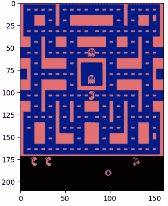
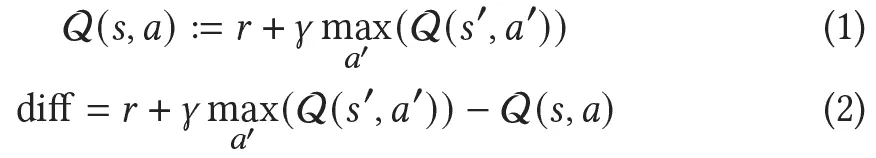
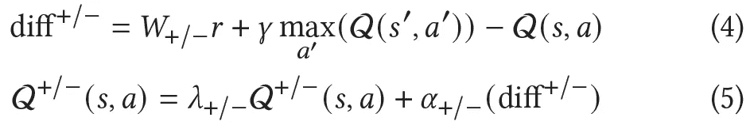
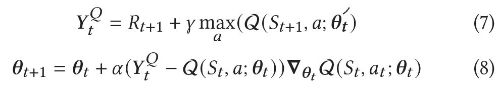
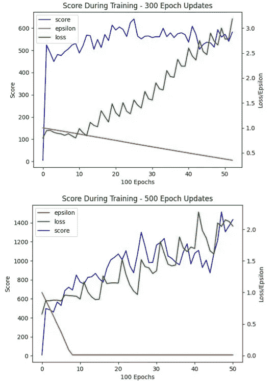
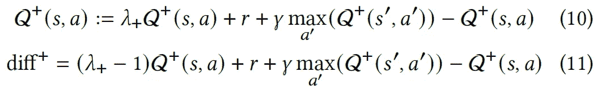
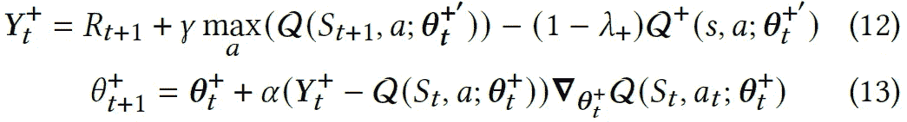
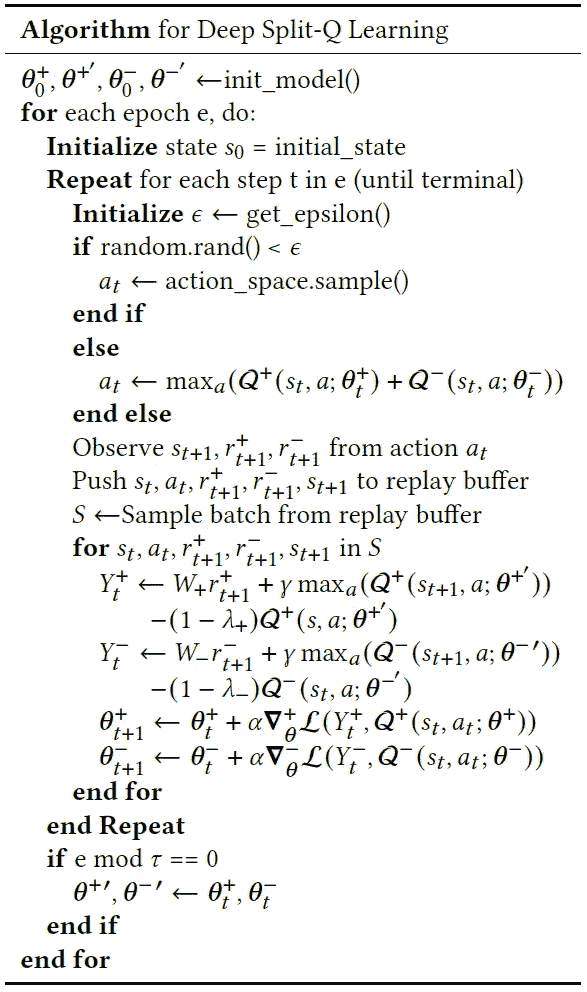
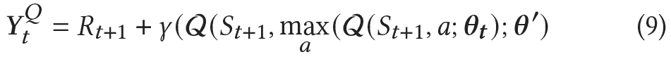

# 深度分裂 Q-learning 和 Pacman 女士

> 原文：<https://towardsdatascience.com/deep-split-q-learning-and-ms-pacman-5749791d55c8?source=collection_archive---------21----------------------->

## [思想和理论](https://towardsdatascience.com/tagged/thoughts-and-theory)

## 通过修改更新规则在深度 RL 环境中重新创建分裂 Q 学习的尝试

2013 年，谷歌 [DeepMind](https://deepmind.com/research/publications/playing-atari-deep-reinforcement-learning) 的一篇论文引发了深度强化学习(RL)，特别是深度 Q 学习网络(DQN)的爆炸。2015 年，这是在基础上改进的[，具有双重深度 Q 学习网络。这个网站和其他网站上有许多帖子详细介绍了如何构建一个在那篇论文中非常成功的网络版本；这篇文章是关于扩展这个框架到最近的一个想法:分裂 Q 学习。分裂 Q 学习已经在一些不同的环境中被提出，但是林等人的论文。2020 年自治主体和多主体系统国际会议(AAMAS)接受的人工智能是本文的重点。](https://arxiv.org/abs/1509.06461)

在这里，我们将看看这种范式是什么，并尝试在《吃豆人 MDP》上实现它的深度 Q 学习网络，这是范·哈瑟尔特等人在 2015 年的论文中唯一表现不佳的游戏之一。艾尔。代码可以在[这个链接](https://github.com/Kickflip89/DQN_project)上公开获得，它源于我在研究生院做的一个项目。

OpenAI Gym 的 MsPacman 环境的开始状态

## 背景

DeepMind 架构已经在很多地方解释过了，在[健身房](https://gym.openai.com/envs/#atari)的突破环境的模型和教程可以在[成为人类](https://becominghuman.ai/lets-build-an-atari-ai-part-1-dqn-df57e8ff3b26)找到。我们的版本将使用 PyTorch vice TensorFlow，所以如果你没有看过他们的基本深度 Q-learning 教程[你可能也想看看，我假设读者至少对 Q-learning 有点熟悉。](https://pytorch.org/tutorials/intermediate/reinforcement_q_learning.html)

作为概述，2015 年的论文以 RGB Atari 图像作为游戏状态，以分数作为主要的奖励系统。最高分范·哈塞尔特等人。al 调优的双深度 Q-Learning 网络在 50M 训练迭代后，在特定的评测实验中能够达到 was 3210。

林等人提出的分裂 Q 学习。人工智能是一种将奖励分为积极和消极两种的想法。在正常的 Q 学习中，对模型或表的更新是基于预期奖励(Q 值)和实际奖励(奖励加上下一个状态中的最大 Q 值)之间的差异。如何应用这种差异可以有所不同，我们可以使用 L1，L2 类型的更新，但我们通常也会将学习率α应用于我们决定使用的任何更新。数学上，对于 Q 表、状态 s、行动 a、奖励 r 和新状态 s’，这看起来像:

这里，γ是预计未来回报的折现率。等式 1 是来自贝尔曼等式的 Q 值的定义，而等式 2 来自时间差分(TD)型训练。然后基于学习率α: Q(s，a) ← Q(s，a) + α*diff 更新 Q 表。在林等人提出的分裂 Q 学习中。al，有一个单独的奖励和惩罚表(或模型),它遵循的思想是，生物制剂倾向于用单独的而不一定是排他的机制来处理奖励和惩罚。除了分流，林等人。al 还建议改变如何通过两个超参数来更新 Q 值。其中一个，W，在每个状态转换时缩放奖励。另一个λ缩放更新前的旧 Q 值:

注意:方程式编号可能有问题

这两个表是奖励(+)和惩罚(-)的。深度 Q-learning 的这次更新特别困难的是，目标不仅仅是基于贝尔曼方程(方程 1)，它是λ的目标的折扣版本，好像深度 Q-learning 在移动目标和收敛方面没有足够的问题！值得注意的是，αt(学习率)和γ(折扣)在正向和负向流之间共享。对于 Q 表的更新规则，林等。所有人都能够在代理人身上表现出与某些奖赏处理障碍的临床行为相匹配的紧急行为。最值得注意的是，他们的“慢性疼痛”模型将两个奖励超参数都设置为 0.5，显示出与实际慢性疼痛患者的临床行为相似的紧急行为。我最初的目标是用深度分裂 Q-learning 框架复制这种行为，并可能尝试改进 Hasselt et。al 基线，虽然这两个都还在工作。

## 预备:预处理、重放缓冲、深度 Q 学习

让深度 Q 学习网络(DQN)和双重深度 Q 学习网络(DDQN)收敛有几个重要的技巧，因此我们将详细介绍它们，以及它们是如何在这个项目的 PyTorch 代码库中实现的。第一个是我们的状态表示和重放缓冲区。MsPacmanDeterministic-v4(我们将使用的健身房环境)中的状态表示为大小为(3x210x160)的 RGB 图像，并且是 0–255 范围内的整数元素。

为了节省内存，我们将这些帧存储为向下采样的灰度图像，并将它们转换为 uint8 (8 位与 64 位相比，存储的 100000 多个帧有很大的不同)。根据 DeepMind 的论文，我们还希望包含最后几帧，以给当前图像一些上下文，并防止代理在每次帧更新时计算动作。这个预处理步骤被封装在下面的代码片段中:

`.unsqueeze(0)`是因为我们将把 4 个帧连接成一个状态供网络处理，所以一个图像的输出大小是(1x105x80)，但是一个状态最终将是(1x4x105x80)。暂时忽略 self 参数，它最终将成为 DQN 包装类的一部分。

重放缓冲区只是一个存储大量 MDP 转换的对象。您可能还记得，MDP 转换采用一个状态-动作对，并返回新状态 s’和采取该动作的即时回报 r。在我们的实现中，我们将在更高的级别收集这些不同的元素，并将我们需要的所有内容的元组传递到缓冲区。这个缓冲区被实现为一个环形缓冲区，这意味着一旦我们超过了允许的最大元素数，它就开始覆盖它的元素。重放缓冲区的目的是能够从缓冲区中对成批的随机元素进行采样:这打破了状态之间的相关性，并允许我们使用深度神经网络来估计 Q 值。

实际的代理类需要用超参数(现在是 gamma，和某种探索/开发方案)初始化，初始化游戏状态，初始化模型，并运行下面的训练循环:

1.  决定一项行动(勘探/开发)
2.  采取行动，记录到重放缓冲区的转换
3.  从重放缓冲区取样并训练策略网络

在本文中，我将抽象出 DQN 类(实际的火炬网络)的细节，因为它对于本次讨论并不重要。只要说它有三个卷积层、一个展平层和所有动作的估计 Q 值的输出就足够了。正如以上教程中所解释的，输出完整的 Q 值集并使用一键编码来处理反向传播和单动作选择会更快。

我将简要提及，由于 DeepMind 论文等论文中的一些结果，我们正在使用 Huber Loss(smoothl Loss)和 RMSprop 优化器进行训练，但当然还有其他选项(例如 MSE)。下面是我们的初始化和内务功能(环境、epsilon 缩放、超参数):

如果你对这个循环还不太熟悉，我建议你去读一读更深入的 Q-learning 或者深度 Q-learning 教程，比如上面提到的那些。第二项是大多数环境争论发生的地方。因为我们的状态代表四帧，所以我们需要聚集奖励，并在环境中的一些时间步长上连接处理过的图像。这是由下面的代码块完成的:

一个“动作”时间步由多个帧组成。生命['ale.lives']在下面进一步解释

然后，我们将一组 `old_state, action, reward, new_state, is_done`传递给重放缓冲区，并使用重放缓冲区的`sample()`方法拟合来自样本的模型。

我们需要讨论的最后一个初步主题是深度 Q 学习的训练方法。您可能已经注意到，在`__init__()`方法中，我们创建了两个 DQN 模型:一个策略模型和一个目标模型。您可能还记得，在 Q 表中，我们通过 Q(s，a)←Q(s，a) + α*L(diff)来更新表。在一个模型中，我们不能更新*值*；我们必须通过某种形式的梯度下降来更新模型的*参数*。但是更新规则应该是什么，它转移到 split-Q 学习吗？一种方法是根据对 Q 表的[时间差异](/temporal-difference-learning-47b4a7205ca8)更新来查看更新规则，并将其推广到深度 Q 学习框架。TD 本质上是上面的等式 2，其中 r+γmax(Q(s’，a’))项是损失函数的目标，而策略网络对 Q(s，a)的输出被调整:

范.哈瑟尔特等人的形式主义。阿尔，2015

这里θ’是目标网络，θ是策略网络。对于完整的训练循环，我们需要做的最后一件事是确定ϵ缩放和目标网络更新规则。这些最好从文献和做一些实验开始。MsPacman 上的典型 DQN 示例如下所示，其中τ(目标网络更新周期)和ϵ(勘探/开采政策)具有不同的超参数。

上图:慢速ϵ斜坡和 300 个时期的目标网络更新。Bot:快速ϵ斜坡与 500 个时代的目标网络更新。

完整训练循环的最后一个修改是增加了对失去一条生命(影响一个幽灵)的惩罚的能力，这不是内置在 MsPacman 健身房环境中的，但在 Lin et 中有很大的特点。艾尔关于分裂 Q 学习的论文。为了做到这一点，我们可以利用 gym 在 python 字典中输出剩余生命数的事实(`lives = lives['ale.lives']`)。我们现在可以建立一个完整的 Q 迭代:

深度 Q 学习网络的 Q 迭代。第 26 行允许我们修改撞击幽灵的惩罚

拥有一个`total_reward`和一个`total_score`变量的原因是，尽管它们在这个实现中做同样的事情，但是在分离 Q-learning 实现中它们是不同的。基本的训练循环是在指定数量的迭代或时期内保持运行这个 Q-学习函数，在达到终端状态的任何时候重置环境。`fit_buffer()`函数本质上实现了等式 7 和 8，但是我们将把它留给分裂 Q 学习实现。

## 深度分裂 Q 学习网络和双重深度 Q 学习

为了尝试将分裂 Q 学习方法移动到深度学习框架中，我们必须改变更新规则，以尝试匹配等式 4 和 5。从方程 5 开始，如果我们去掉学习率，我们得到一个有趣的方程，它成为贝尔曼对 Q(s，a)的定义，如果λ=1。暂且不考虑奖励权重，这看起来像是:

等式 10 本质上只是从等式 5 中移除α，但它对于 Lin 等人的 Q(s，a)的不同定义也有一定意义。艾尔的分裂 Q 学习范式。因为他们对历史进行贴现，所以新的 Q 值有两个目标:λQ(s，a)和 r + γmax(Q(s '，a ')。通过*从通常的更新中减去* (1-λ)Q(s，a ),这些方程本质上是制定一个新的更新规则，该规则逐渐将 Q 值向两个目标移动。我们现在可以将 TD 逻辑应用于上述内容，并将其转移到深度 Q 学习范式，其中(λ-1)Q(s，a)项由目标网络计算，并添加到正常的 r + γ(π(s))项。右手边的 Q(s，a)项由策略网络计算，现在我们有损失函数的两个项:

换句话说，7–8 和 12–13 的唯一区别是等式 12 中的新项:(1-λ)Q(s，a；θ),它将目标移向贴现 Q 值。如果λ=1，这就简化为正常的 Q 更新规则。当我们加入即时奖励的权重时，完全分割 Q 学习算法是:

深度分裂 Q 学习算法，基于等式 10-13，L 代表损失函数

我们还可以实现一个版本的深度分裂 Q 学习，它遵循双重深度 Q 学习方法。双重深度 Q 学习和深度 Q 学习之间的区别在于，在计算未来折扣奖励时，策略网络用于*选择*行动，而目标网络用于*评估*这些行动。数学上，Y 的定义变成:

这是在等式 12 中用于分裂 Q 学习更新规则的一个相当容易的替代，我们将把这个想法用于`fit_buffer()`实现。这种两个流方法的“最佳动作”是两个流的 Q 值之和的最大可能动作。但是，在培训期间，我们仍然使用每个流来计算基于该流的最佳行为的未来折扣奖励。我们只对 Q 值求和，以实际选择给定状态下的最佳行动。下面是代码中初始化和最佳操作选择的样子:

最后要实现的是`fit_buffer()`函数，它处理模型的训练更新。该功能必须完成以下步骤:

1.  将批处理解包为状态、动作、奖励、惩罚、下一个状态、完成
2.  使用策略网络来选择下一个状态中的最佳行为，以进行奖励和惩罚
3.  使用目标网络评估未来的贴现报酬，以及目标中(1-λ)Q(s，a)项的 Q(s，a)
4.  计算策略网络对每个流的 Q 值的估计
5.  计算每个流的损失和反向传播

下面是我对奖励流(惩罚流实现完全一样)的这个函数的实现。

如果不知道 DQN 是如何工作的，这个函数的一些细节可能很难理解，但它需要一个动作和状态输入的掩码，这就是为什么有很多一个热向量和一个向量飞来飞去。随意浏览[项目](https://github.com/Kickflip89/DQN_project)，看看 DQN 类是如何工作的，以及 Q-learning 和双 Q-learning 的实现。

## 结果和结论

延伸林等人。al 从 Q 表到深度 Q 学习网络的分割 Q 学习不是一个简单的任务，但是我相信这代表了这样做的逻辑框架。目前，我必须提供的唯一评估是代理在用类似于 Lin et 的参数初始化时的行为。艾尔的作品。在这个实验中，我修改了流，在每个时间步长提供-1 的惩罚，在每次失去一个生命时提供-500 的惩罚。然后，我用. 5 初始化了一个代理，奖励权重 W 和过去的折扣λ(他们的慢性疼痛模型)。在林等人看来。艾尔的论文，这导致了一个代理人，不参与奖励寻求行为，但有能力避免鬼，如果他们太接近。避免 MsPacman 中的幽灵似乎是这些 CNN 风格的 Q 值估计网络的一个主要挑战(可能是因为幽灵倾向于在存在中闪现和消失)，所以我们将比较双重深度 Q 学习网络和慢性疼痛(CP)代理。每个代理被训练 10，000 集，在 500，000 次迭代中 epsilon 从 1 到 0.1 渐变。

DQN 的代理人在下面，但还没有真正学会避开幽灵。相反，它的策略是吃下强力药丸，以防止鬼魂在游戏的开始阶段成为一个因素。

慢性疼痛剂训练了相同的时间，并开始表现出一些行为。艾尔观察到了，但仍偶尔从事寻求奖励的行为。可能 10，000 个训练集不足以使 Q 值收敛到 Lin et 的行为。艾尔在他们的模型中看到了，但令人鼓舞的是看到了冷漠和回避风险的开端！

## 参考

[1]柏寒·林、吉列尔莫·切奇、贾雷尔·布内夫、詹娜·赖宁和伊琳娜·里什。2020.*两股潮流的故事:来自人类行为和神经精神病学的强化学习模型*。arXiv:1906.11286 [cs。LG]

[2] Hado van Hasselt、Arthur Guez 和 David Silver。2015.*采用双 Q 学习的深度强化学习*。arXiv:1509.06461 [cs。LG]

[3] V. Mnih、K. Kavukcuoglu、D. Silver、A. A .鲁苏、J. Veness、M. G .贝勒马尔、A. Graves、M. Riedmiller、A. K. Fidjeland、G. Ostrovski、S. Petersen、C. Beattie、A. Sadik、I. Antonoglou、H. King、D. Kumaran、D. Wierstra、S. Legg 和 D. Hassabis。*通过深度强化学习的人类水平控制*。自然，518(7540):529–533，2015。