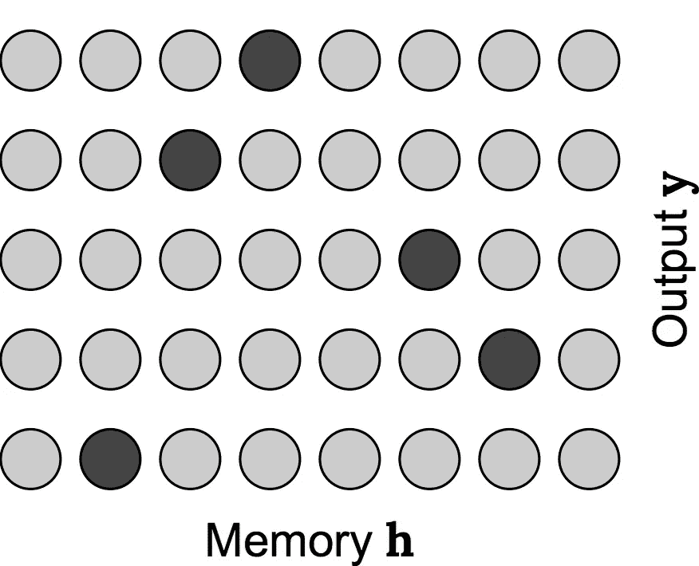
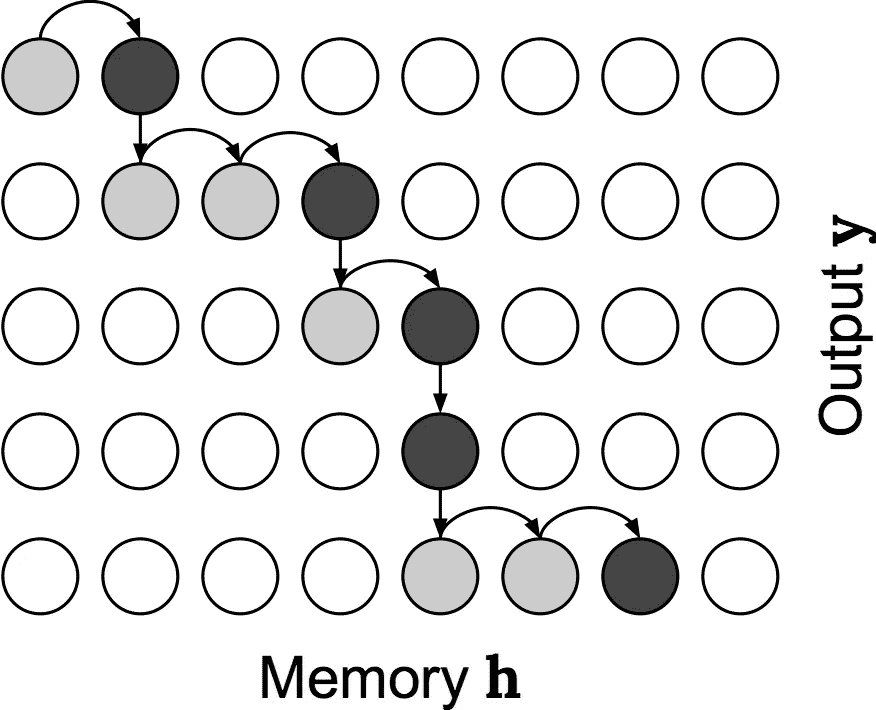
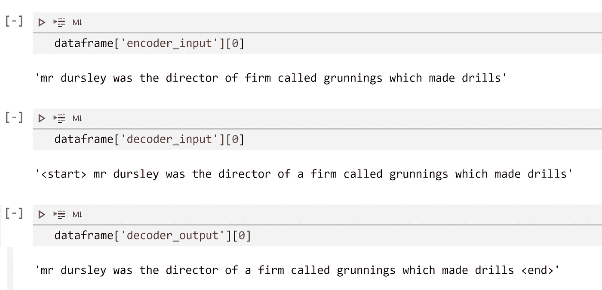
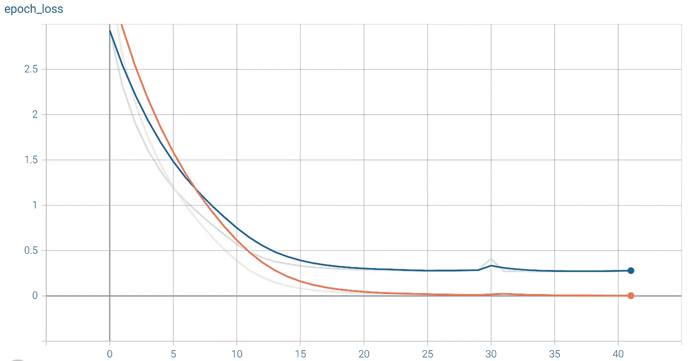
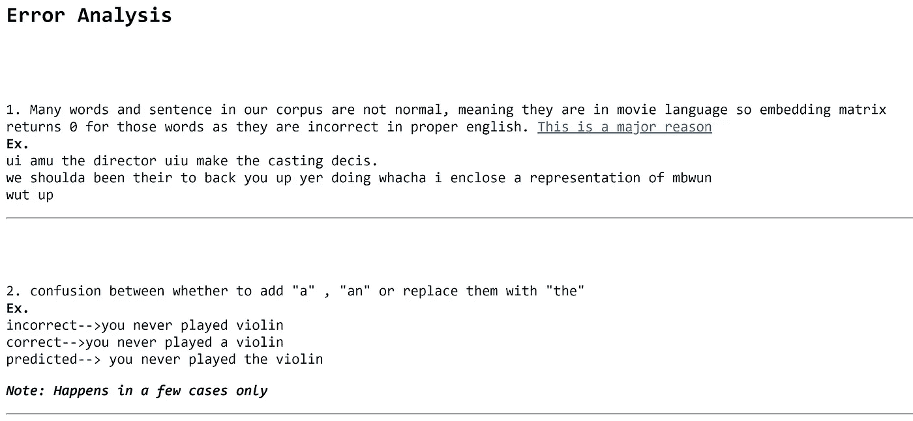
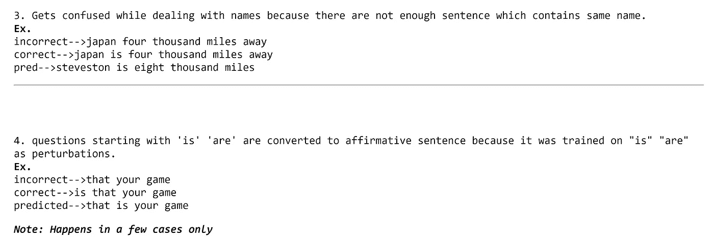
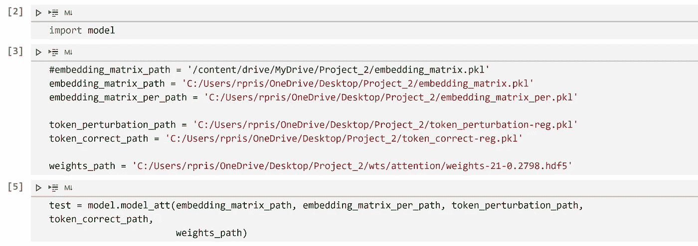
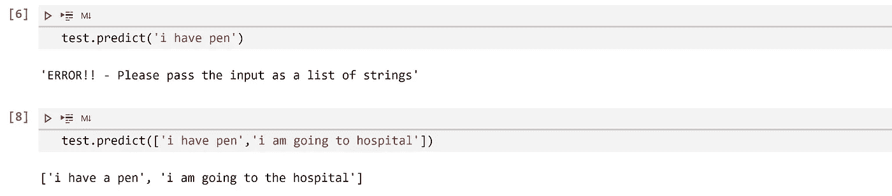

# 使用单调注意力的深度学习文本校正器(带有数据集创建)

> 原文：<https://towardsdatascience.com/deep-text-corrector-using-monotonic-attention-with-dataset-creation-1e1a3f5a1b9e?source=collection_archive---------14----------------------->

## 深度学习模型从语法上纠正句子。使用单调注意的 Seq2Seq 模型。


图片[演职员表](https://www.123rf.com/photo_84772415_english-sentences-with-red-pen-for-proofreading.html)

# 目录

1.  **简介**
2.  **数据集创建**
3.  **注意机制**
4.  **单调注意**
5.  **实现和代码演练**
6.  **推理→波束搜索 v/s 贪婪搜索**
7.  **结果和误差分析**
8.  **端到端管道**

# 介绍

序列对序列模型被证明是人工智能在自然语言处理领域的最佳应用之一。注意力机制通过模仿人类理解句子的方式这一简单概念，大大改进了 seq2seq 模型。

> 在这篇博客中，我建立了一个机器学习模型，它使用单音注意力纠正句子中的基本语法错误。

**我的模型解决的一些扰动是——**

1.  纠正使用限定词(a，an，the)的错误。
2.  删除从句——“that”。
3.  替换单词 modal(“可能”→“将”)
4.  删除动词形式(“is”、“are”、“was”、“was”)
5.  将“than”替换为“then”，反之亦然。
6.  用“他们”代替“他/她”。

# 为此案例研究创建数据集

为了这个项目，连同电影语料库数据集([康奈尔电影对话语料库](https://www.cs.cornell.edu/~cristian/Cornell_Movie-Dialogs_Corpus.html))，我从头开始创建了一个数据集。我用哈利波特小说作为我的原始资料。使用正则表达式完成了文本预处理。查看完数据中的差异后，这些是我进行的预处理步骤。其中一些是-

1.  从 Mr 和 Mrs 中删除点号- 这一步是确保段落被正确分割成句子所必需的。(第 4 点)

```
xx_v2 = re.sub(r'Mr\.', 'Mr', str(xx), flags=re.IGNORECASE)xx_v2 = re.sub(r'Mrs\.', 'Mrs', xx_v2, flags=re.IGNORECASE)
```

**2。删除一些特殊字符-** 当这本书从 pdf 转换成 txt 时，一些特殊符号变成了文本代码，如—

\ xe2 \ X80 \ x94 →""
\ xe2 \ X80 \ x99→" ' "
\ xe2 \ X80 \ xa6→"…"

因此，使用正则表达式检测并删除了这些内容。

```
xx_v3 = re.sub(r"\\xe2\\x80\\x94|\\xe2\\x80\\xa6|\\xe2\\x80\\x98|\\n|\\t",  " ", xx_v2, flags=re.IGNORECASE)
```

**3。** **修复资料-** 一部小说包含了大量不同人物所说的引用文字。在将 pdf 转换为文本时，它们也被转换为一些文本代码。然后这些被检测到并被替换为其原始形式，即
\ \ xe2 \ X80 \ x9c→"
\ \ xe2 \ X80 \ x9d→"

```
xx_v4 = re.sub(r"\\xe2\\x80\\x9c", '"', xx_v3, flags=re.IGNORECASE)xx_v4 = re.sub(r"\\xe2\\x80\\x9d", '"', xx_v4, flags=re.IGNORECASE)
```

**4。在句号上拆分数据-** 将数据转换成句子。

```
dat_v4 = xx_v4.split(".")
```

**5。最后一步——提取句子**

→在一部小说中，有很多这样的例子，当一个角色说了一些写在引用的文本中的话，然后是这句话“这个角色说的”。
**例如→“我要走了”哈利说。这种类型的句子需要删除，因为它们是半句。**

因此，我们通过识别诸如“说”、“小声说”、“问”等词来删除这些半句***

→最后，同样在这之后，有些**句子是疑问句**。所以，我们再次用**分割。拆分("？)**但是保留问号，以确保**我们的模型理解肯定句和疑问句之间的区别。**

*** * *注意-同样，如果报价中有完整的句子，它们在步骤 4 中已经被正确拆分。**

不

> **我们也对电影语料库数据集进行类似的预处理。**

# 注意机制概述

注意:假设读者精通注意力，我将只给出注意力机制的概述。如果你是新关注者，请阅读 [**这篇**](/intuitive-understanding-of-attention-mechanism-in-deep-learning-6c9482aecf4f) 的博客。

## 概观

“注意力”这个名字本身给了我们这个算法做什么的想法。在普通的编码器-解码器模型中，编码器的所有中间状态都被丢弃，最终状态被用作解码器的初始状态。背后的想法很简单-最终状态包含输入句子的所有信息，解码器可以使用这些信息来预测输出。但是，当序列很长时，这个模型很难将所有信息编码到一个向量中。

而在注意机制中，我们试图模仿人类处理顺序信息的方式。我们通过给每个单词(编码器中间状态)加权来做到这一点，从而给予**注意**特定预测的特定单词。这是通过前馈神经网络实现的，该网络将编码器的所有中间状态以及先前的解码器状态作为输入，并给出该**时间戳**的每个字的权重。

# 单调注意

注意，在每个时间戳，我们计算所有单词的权重，以确保我们不排除 say- **第一个单词影响第三个单词的预测或者 say 最后一个单词影响第一个预测的可能性。**换句话说，注意力**独立地**考虑所有的中间状态，因此，时间戳的输出可以依赖于任何输入单词(意味着任何单词可以具有更大的权重)

该图描述了注意力模型



注意机制权重图

> ***输出可以根据任何字对其进行预测***

****

也就是说，一旦输入序列元素在给定的输出时间步被关注，在它之前出现的元素就不能在随后的输出时间步被关注。



单调注意力权重图

从图中我们可以清楚地看到，第一个输出依赖于第一个字，因此第二个输出不能使用第一个字，而是使用第二和第三个字进行预测。它严格地从左向右进行。

> 在单调注意中，只有以前的输出没有使用过的词才能对现在的输出产生影响，并且严格地从左到右

> **这使得模型变得不那么复杂，并且在这个案例研究中对我特别有帮助，它的表现远远好于注意力。**

# 实现和代码演练

让我们在数据集上实现单调注意，并创建一个文本校正器模型。

## **我们将从数据集的基本预处理开始**

文本预处理

**现在是时候添加一些扰动了**

## **使用教师强制*为编码器-解码器创建输入-输出对。**

教师强制是一种方法，其中我们显式地将**输入**给解码器，而不是将解码器的**输出传递给下一个时间戳。这显然只在训练时使用，有助于减少训练时间和提高准确性。**

```
dataframe['decoder_input'] = '<start> ' + dataframe['output'].astype(str)dataframe['decoder_output'] = dataframe['output'].astype(str) + ' <end>'dataframe = dataframe.drop(['output'], axis=1)
```

**举例-**



编码器输入缺少“a”

→ **之后，我们将数据集分为训练、验证和测试。**

→ **然后我们对数据进行标记化，将单词转换成整数标记来训练模型。**

## **预训练向量的嵌入矩阵-**

在对数据进行标记化之后，我们使用 GLOVE-300 预训练向量为我们的正确 _ 标记和扰动 _ 标记创建包含我们的单词的预训练嵌入向量的嵌入 _ 矩阵。

正确标记的嵌入矩阵

## **实现我们的深度文本校正器模型**

在所有的预处理和创建嵌入矩阵之后，我们准备好创建我们的**单调关注编码器-解码器模型。**

**我们将使用模型子类化的方法从 Keras 的模型和层类中导出我们的模型。**

**编码器模型实现如下-**

> **之后，我们创建→单调注意层、单步解码器层、解码器模型和包含编码器和解码器的最终模型。**

## 关于我的实现的全部细节，请查看我的 Github 简介

## 数据管道

现在我们需要一些东西，可以把我们的数据，转换成所需维度的批量数据。为此，我们通过从 Keras 的序列层派生来创建数据管道

## 培养

终于到了我们训练模型的时候了！

我们正在对“ADAM”优化器和自定义损失函数进行培训，以确保我们不会计算填充值的损失，因为我们已经大量填充了数据。

```
train_steps=train.shape[0]//512valid_steps=validation.shape[0]//512attention__.fit(train_dataloader, steps_per_epoch=train_steps, epochs=120, validation_data=validation_dataloader, callbacks=[es,chkpt,tfboard], validation_steps=valid_steps, )
```



训练图(蓝色->验证)

# 推理

训练完模型后，我们该检查它的效率了。**我们将使用 BLEU 分数作为我们的衡量标准。**

## **贪婪搜索 v/s 光束搜索**

我们使用两种类型的搜索来预测我们的产出。

**剧透预警！！！→** 它们的表现相似，因此我最终使用了贪婪搜索。

**贪婪搜索→**

该模型的输出是一个巨大的概率表，包含我们的单词在词汇表中的概率。在贪婪搜索中，我们只是简单地选择概率最高的单词。

贪婪搜索的推理

## 波束搜索

在 beam 搜索算法中，我们不是选择一个概率最高的词，而是选择前 3 个词(beam_index=3)。基于这前 3 个单词，我们预测下一个单词，并用我们之前的单词计算这些单词的条件概率。这个过程一直持续到我们到达终点。

> ***要想恰当地理解梁寻欢，观看本*** [***视频***](https://www.youtube.com/watch?v=RLWuzLLSIgw) ***作者吴恩达，阅读本*** [***文章***](https://medium.com/@dhartidhami/beam-search-in-seq2seq-model-7606d55b21a5) ***作者*** [***达蒂达米***](https://medium.com/u/adb57bd98a88?source=post_page-----1e1a3f5a1b9e--------------------------------)

**波束索引= 3 的波束搜索的实现**

波束搜索推理

# **结果和误差分析**

正常情况下，我在训练数据集上的 BLEU 分数约为 **0.90** ，而验证和测试数据集的 BLEU 分数约为 **0.75** 。

但是随着单调的关注，我得到了训练数据集的 **0.98** BLEU 分数，而测试和验证数据集的**0.90**BLEU 分数。**这是一个显著的改进！**

## 误差分析

我分析了错误，发现我们的模型存在以下问题，这些问题可能是导致**在我们的分数中遗漏 0.10** 的原因。



1



2

# 端到端管道

在这个项目的最后阶段，我创建了一个端到端的部署管道，它接收输入并预测输出，可以直接用于任何应用程序。

首先，我创建了一个模块(。py 文件)，名为 monotonic_attention，包含我们的编码器-解码器模型。

然后，我创建了另一个名为 model.py 的模块，它导入上述模块并预测输出。它包含一个 predict()方法，该方法使用贪婪搜索执行推理



导入后，我们用所有文件和一个 model_weight 初始化我们的模型



预测

如果你已经走到这一步。哇！谢谢你！看了我的文章。我希望你没有直接跳到这里！；)

# 参考

1.  **单调关注论文—**[https://Colin raffel . com/blog/online-and-linear-time-Attention-by-enforcing-Monotonic-alignments . html](https://colinraffel.com/blog/online-and-linear-time-attention-by-enforcing-monotonic-alignments.html)
2.  [https://github . com/UdiBhaskar/tfk eras-Custom-Layers/blob/master/seq 2 seq/clayers . py](https://github.com/UdiBhaskar/TfKeras-Custom-Layers/blob/master/Seq2Seq/clayers.py)
3.  [https://applied ai course-1 . medium . com/FAQs-about-attention-assignment-3033 ac9 f 05 AC](https://appliedaicourse-1.medium.com/faqs-about-attention-assignment-3033ac9f05ac)
4.  在乌代·派拉的指导下在 AppliedAI 球场完成的项目。[https://www.appliedaicourse.com/](https://www.appliedaicourse.com/)