# 对 ARIMA 模式的深刻理解

> 原文：<https://towardsdatascience.com/deep-understanding-of-the-arima-model-d3f0751fc709?source=collection_archive---------3----------------------->

## [实践教程](https://towardsdatascience.com/tagged/hands-on-tutorials)

## 探索时间序列的特征——平稳性、稳定性、自相关性


图片来自 [Unsplash](https://unsplash.com/photos/rmM8V7L1BhM)

# 时间序列快速介绍

通常，时间序列预测模型可以写成

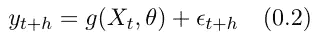

Eq 0.2 时间序列预测模型的定义

其中，yₜ是要预测的变量([因变量](https://en.wikipedia.org/wiki/Dependent_and_independent_variables)，或响应变量)，t 是进行预测的时间，h 是预测范围，Xₜ是在时间 t 用于进行预测的变量([自变量](https://en.wikipedia.org/wiki/Dependent_and_independent_variables))，θ是函数 *g* 中参数的向量，εₜ₊ₕ表示误差。值得注意的是，观察到的数据根据观察时间是唯一有序的*，但它不必依赖于时间，即时间(观察值的指数)不必是独立变量之一。*

## 时间序列的一些可能性质

**平稳性**:平稳过程*是随机过程，其均值、方差和自相关结构不随时间变化。*它也可以用数学术语正式定义，但在本文中，这不是必需的。直观地说，如果一个时间序列是平稳的，我们看它们的一些部分，它们应该非常相似——时间序列看起来是平坦的，形状不取决于时间的变化。(快速查知识:f(t) = sin(t)是平稳过程吗？肯定不是，因为它不是随机的，平稳性不是它的属性之一)

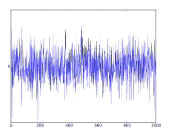

图 1.1 平稳性示例。图片来自[维基百科(白噪音)](https://www.wikiwand.com/en/White_noise)

图 1.1 显示了平稳过程的最简单的例子——白噪声。

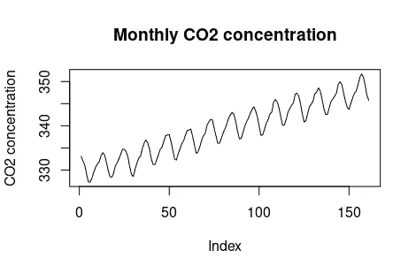

图 1.2 非平稳时间序列示例。作者制作的图表。

上图 1.2 显示了一个非平稳的时间序列。为什么会这样呢？我们可以看到明显的趋势，这意味着方差随着时间而变化。但是，如果我们使用线性回归拟合一条线(以捕捉趋势)并移除趋势，数据现在具有恒定的位置和方差，但由于周期行为，它仍然不是静止的，这不是随机的。

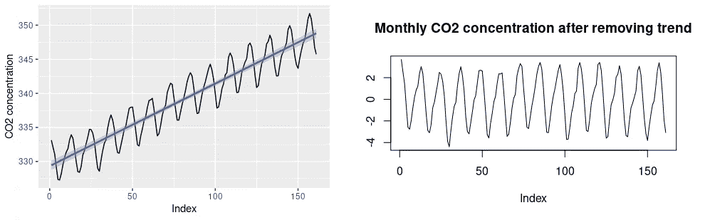

图 1.3(左)为原始数据拟合一条线，图 1.4(右)为去除趋势后的结果。作者制作的图表

使用 ARMA 对时间序列建模时，其中一个假设是数据是平稳的。

**季节性**:季节性是*在短于一年的特定时间间隔内表现出某些变化的特性*(当然也可以是不同的时期。如果我们在一天中观察每小时的温度，并在几天内收集数据，那么这个周期就是一天，它也可能具有季节性-峰值可能出现在下午 2 点或 3 点。这意味着我们不必用常识在季节性的背景下解释*季节*)、月度、季度等。季节性时间序列的一个非常典型的例子是用电量，在夏季，用电量通常较高，例如，因为有空调。

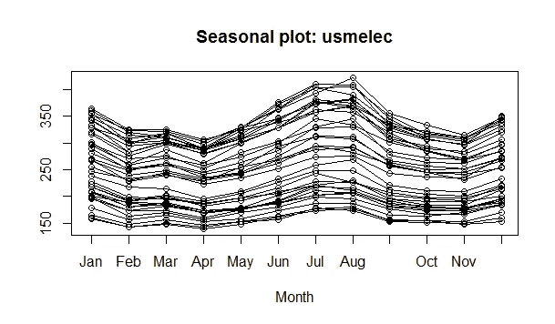

图 1.5 美国用电量的季节性曲线图。图片来自[维基百科(季节性)](https://en.wikipedia.org/wiki/Seasonality?oldformat=true)

图 1.5 显示了具有季节性的数据，我们可以很容易地看到，在 7 月和 8 月有一个用电高峰，在 1 月和 12 月有一个较小的高峰。图 1.5 中绘制的数据是美国从 1973 年到 2010 年的用电量。`usmelec`是 r 中内置的数据集。整个期间的用电量如下所示

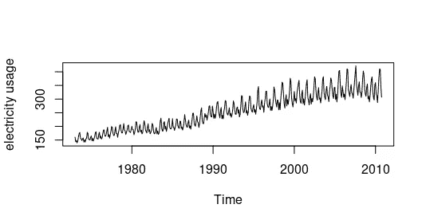

图 1.6 美国 1973 年至 2010 年的用电量。作者制作的图表

季节性的存在要求我们调整预测的方式。比如我们要卖空调，就需要用历年同季的销量来预测未来的月销量，而不是最接近的月份。

# 逐步定义 ARIMA

## 技术说明:后移运算符

*这是什么？*它是一个将变量 xₜ后移的算子，有时表示为 b(后移),有时表示为 l(滞后),在本文中，我们将采用符号 b。它定义为

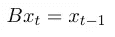

等式 2.1 后移算子的定义

以及满足 B⁻ B = 1 的向前移位算子 B⁻。

*我们为什么需要这个？*这是因为它使我们能够以简洁的方式明确地回移——就多项式而言，这也有助于我们定义更复杂的模型。当我们用一个东西来表示数学中的某个东西时，看看它支持哪些运算总是很重要的。在这种情况下，我们很容易看到，后移运算符允许对它进行所有的算术运算:加、减、乘、除、取幂等。

这意味着，例如，在 xₜ上使用*运算符* (1-B)得到 xₜ-xₜ₋₁的差，如果我们想再次得到 xₜ和 xₜ₋₁的差，我们在 xₜ上使用*运算符* (1-B)，得到(1–2 b+b)xₜ= xₜ-2xₜ₋₁+ xₜ₋₂.这和(xₜ-xₜ₋₁)-(xₜ₋₁-xₜ₋₂).)是一样的在这个例子中，我们遇到了一阶和二阶差分(方程 2.12，2.13)，这将在后面解释。

## 自回归模型

阶为 p 的自回归模型，缩写为 **AP(p)，将当前值建模为先前 p 值**的线性组合。这个模型就是这样得名的，它本身就是一个线性回归。我们在定义中看到了很多术语，但该模型仍然被认为是*单变量*，因为当前值取决于其过去值。这些值是同一变量在不同时间点的值，所以毕竟只涉及一个变量。更一般化的模型是 *VAR* (向量自回归)，允许多元时间序列。形式上,(单变量)自回归模型被定义为

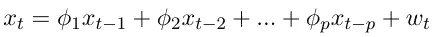

情商。2.2 自回归模型的正式定义

其中 wₜ ~ wn(0，σᵥᵥ)，ϕ₁，ϕ₂,…，ϕp (ϕp ≠ 0)为参数。wn 表示“白噪声”，它具有均值为 0 且方差为σᵥᵥ的正态分布。有时方程 2.2 的右边也有一个常数，用 c 表示( [*预测:原理与实践第 8.3 章*](https://otexts.com/fpp2/AR.html) )。常量所起的作用将在 **ARIMA** 小节中解释。

根据后移算子，自回归模型被定义为

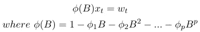

等式 2.3 使用后移运算符定义 AR 模型

## 移动平均模型

q 阶移动平均模型，缩写为 **MA(q)，将当前值建模为前面 q 个误差项**的线性组合(与自回归模型不同，在移动平均中，关注的是*误差项*)。形式上，它被定义为

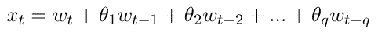

情商。2.4 移动平均线模型的正式定义

其中 wₜ ~ wn(0，σᵥᵥ)，θ₁，θ₂,…，θq (θq ≠ 0)为参数。wn 表示“白噪声”，它具有均值为 0 且方差为σᵥᵥ的正态分布，类似于自回归模型的定义。这也是一个单变量模型。也可以在定义中添加一个常数( [*预测:原理与实践第 8.4 章*](https://otexts.com/fpp2/MA.html) )。

根据后移运算符，移动平均模型可以定义为

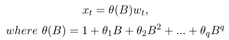

等式 2.5 使用后移运算符定义 MA 模型

与自回归模型不同，这种移动平均模型的名字并不那么明显。根据第 48 页的脚注*单变量 Box-Jenkins 模型预测(2009)*:Pankratz 的概念和案例:*“标签‘移动平均’在技术上是不正确的，因为 MA 系数可能为负，且总和可能不为 1。这个标签是约定俗成的。”*

另一个令人困惑的事情是一个看起来像移动平均模型的概念，*移动平均*，又名滚动平均或移动平均，用于*平滑时间序列*。事实上，它是一个完全不同的工具——它不是用来预测的。我们用简单移动平均线的例子来说明这一点

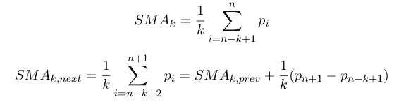

等式 2.6，2.7 简单移动平均线

观察公式后，我们可以看到，我们需要第 k 个值来计算第 k 个移动平均线。

## 自回归移动平均模型

ARMA 模型是**AR 和 MA** 的组合，相当自明。ARMA 考虑了过去的值和过去的误差项，并用两个多项式描述了(弱)平稳随机过程。形式上，如果时间序列是平稳的并且

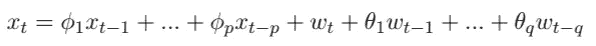

方程 2.8 ARMA 的正式定义

其中ϕp ≠ 0，θq ≠ 0，wₜ ~ wn(0，σᵥᵥ)，σᵥᵥ > 0。如前所述，参数 p 和 q 分别是自回归阶和移动平均阶。就后移算子而言，ARIMA 模型可以写成

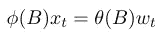

等式 2.9 根据后移算子定义的 ARIMA 模型

这种重写并不简单。它揭示了模型中可能出现的一个严重问题— *参数的冗余*。如果多项式ϕ(b = 0 和θ(B) = 0 有公共因子，那么模型将包含冗余参数。这将使模型变得非常复杂。什么时候会出现这种情况？当我们试图用 ARMA(1，1)模型拟合一个白噪声序列(xₜ = wₜ)时，程序会这样做，但我们得到的模型会有多余的参数。因此，我们需要去除冗余以简化模型，并且可以使用协方差分析来去除冗余。

等式 2.8 所示的定义是*非季节性* ARMA。但经常发生的是，数据是季节性的。如果我们想消除季节性，我们应该怎么做？答案是引入一个滞后 *h(季节周期的长度)*，这就引出了季节 ARMA (SARMA)，记为 ARMA(P，Q)ₕ)，其形式为

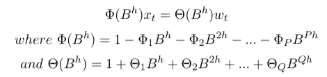

方程 2.10 季节性 ARMA 的定义

这种去除季节效应的方法对应于我们之前描述过的:*利用八月份的数据预测八月份的销售额*。h 应该等于什么？这取决于季节性的频率，例如，如果季节性变化在一年中的某些特定月份出现一次，则 h = 12，如果它在一年的每个季度出现一次，则 h = 4。如果我们将季节性 ARMA 和非季节性 ARMA 结合起来(将季节性和非季节性算子相乘)，我们将得到一层概括——混合季节 ARMA。

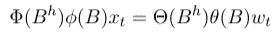

混合季节 ARMA 模型

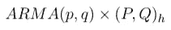

混合季节 ARMA 的符号

## 自回归综合移动平均(ARIMA)模型

ARIMA 模型是基于差分序列的 ARMA 模型，**差分**有时也称为**。那么什么是差异呢？它是一种去除序列非平稳性的技术(这种技术去除了非恒定趋势，这意味着它只产生均值平稳性，而不是方差)。它取两次观察的差值。**

**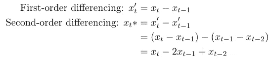**

**等式 2.12 和等式 2.13 的区别**

**当然，我们可以多次改变观测值。等式 2.12 和等式 2.13 给出了一阶差分和二阶差分的例子。显而易见，差分不同于微分——差分只是*取差*，同时，微分*计算变化率*。ARIMA 模型通常用 ARIMA(p，d，q)来表示，参数的含义总结如下表**

**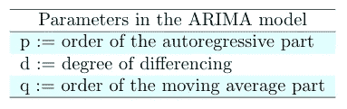**

**标签。2.1 模型中的参数。(作者自制)**

**现在是时候介绍 ARIMA 模型的正式定义了，**

**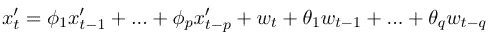**

**方程 2.14 ARIMA 模型的定义**

**在 yₜ'表示差分序列的地方，其他参数的定义方式与 ARMA 模型中的相同。如前所述，可以将一个常数添加到模型中，该常数表示*漂移*。通过涉及 ARIMA(0，1，0)模型(没有自回归或移动平均项，使用一阶差分建模)的示例，可以很容易理解:**

**无参数:模型是 xₜ = xₜ₋₁ + εₜ，是随机游走。**

**带参数:模型为 xₜ = c+ xₜ₋₁ + εₜ.这是一个有漂移的随机游走。**

***常量为过程增加了非常量趋势。*(这句话看起来很诡异，但是我们需要注意的是，公式 xₜ = c+ xₜ₋₁+ εₜ是递归的，在每次解出一个常数的时候用 stack up)这个常数有多大的影响力？很多。我们可以从两个随机行走的模拟中看到这一点，一个有漂移，一个没有漂移**

**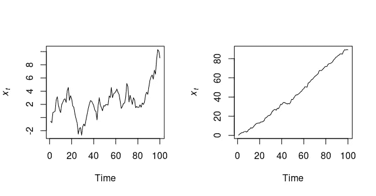**

**图 2.1 无漂移(左)和有漂移(右)的随机游走模拟。作者制作的图表。**

**然而，这种差异并没有考虑到季节性。为了消除季节性，我们需要考虑季节性差异(xₜ和 xₜ₋ₕ之间的差异)，这就带来了季节性自回归综合移动平均(SARIMA)模型。萨里玛和 SARMA 之间的关系非常类似于 ARIMA 和 ARMA 之间的关系——萨里玛是有差异的 SARMA，但现在我们不仅需要考虑非季节性差异，还需要考虑季节性差异。我们用 **▽** ᴰ和 **▽** ᵈ分别表示季节性差异和非季节性差异。 *D* 是季节差异的程度。**

**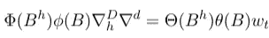**

**情商。2.15 季节性 ARIMA 模型**

**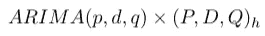**

**季节性 ARIMA 的符号**

# **实践中的 ARIMA**

**如圣经*预测:原则和实践*中所述，有一种[拟合 ARIMA 模型的一般方法](https://otexts.com/fpp2/arima-r.html#modelling-procedure):预处理，直到数据变得稳定；提供给计算 ARIMA 模型的函数；比较模型；检查结果(残差)；如果不够好，迭代，否则使用结果模型做预测。**

**在 R 中，使用*最大似然估计* (MLE)来估计参数，最大化似然函数。在给定我们的模型的参数(ϕ，θ，…)的情况下，可能性等于产生观察值 x 的概率。为了比较这些模型，使用了 *Akaike 信息标准* (AIC)，该标准评估了信息的损失，也惩罚了模型的复杂性(估计参数的数量)。我们选择具有最小 AIC 值的模型。**

## **自动化的**

**如果我们想要使用一个自动化的过程来构建模型，函数`auto.arima`就在我们的支配之下。它使用分步过程(Hyndman-Khandakar 算法)来有效地遍历模型空间。函数`auto.arima`负责对数据进行差分以使数据稳定(是否 d = 0)，选择超参数，并根据 AIC 选择最佳模型。**

**我们用去年 8 月 16 日到今年 8 月 26 日的油价来展示自动化的 ARIMA 过程。我们想要实现的是使用 2020 年 8 月 16 日至 2021 年 8 月 16 日的数据来预测未来 10 天的油价，然后将结果与真实值进行比较。(在本文中，目的主要是向读者介绍 ARIMA 模型的原理，所以这实际上是一个粗略的股票预测，像回溯测试之类的东西不包括在内)**

```
# read data
# Datasource: [https://finance.yahoo.com/quote/OIL/history?p=OIL](https://finance.yahoo.com/quote/OIL/history?p=OIL)
dataOil <- read.csv2(file = "data/OIL.csv", sep=",")
head(dataOil)# split into training and test data
lenOil <- nrow(dataOil)
trainSize <- ceiling(lenOil-10)# take the first 12 month 
train.oil <- dataOil[1:trainSize, ]
test.oil <- slice_tail(dataOil, n=lenOil-trainSize)# convert to time series
train.close <- train.oil$Close
train.close <- as.numeric(train.close)# frequency is set to be one because we have only one year of data
train.close.ts <- ts(data=train.close, frequency=1)# plot the training data 
plot(train.close, type='l', ylab='Close price', main="One year oil price")
```

**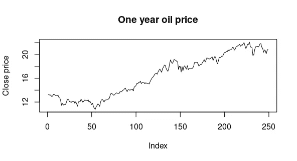**

**图 3.1 2020 年 8 月 26 日至 2021 年 8 月 26 日油价**

**显然，我们可以看到一个趋势，时间序列不是平稳的，但没有变化方差的证据，所以我们不准备做任何转换。模型构建的其余部分由`auto.arima.`负责，但我们需要做的是检查残差，以确保它们看起来像随机噪声，这部分由`checkresiduals`完成，它应用了永盒测试。如果 Ljung-Box 检验*的 p 值*大于 0.05，我们**不能拒绝**残差独立分布*的零假设*。因此，这个模型是可接受的，否则，我们将需要选择一个新的。**

```
start <- length(train.close.ts)
test.index <- seq(start, start+9)
test.close <- as.numeric(test.oil$Close)aa.train <- auto.arima(train.close.ts) 
# --> AIC = 157.11
checkresiduals(aa.train)
# --> p-value = 0.07454plot(forecast(aa.train, h=10))
lines(test.index, test.close)
```

**与 8 月 17 日至 8 月 26 日(过去 10 天)的油价实际值相比，结果如下。**

****

**图 3.2 预测结果**

## **客户模型**

**自动化过程可能无法找到适合我们的模型。如果它没有通过永盒测试，我们需要自己选择超参数。因此，有时我们可能需要选择自己的模型(使用`Arima`)。与自动化流程相比，为了使用我们自己的模型，除了之外*我们还需要做什么？首先，在观察数据之后，我们需要考察数据的偏相关。(要了解更多关于偏相关的信息[点击这里](/partial-correlation-508353cd8b5))。***

```
# plot the partial difference 
dif.train <- difference(train.close.ts)
ggtsdisplay(dif.train, plot.type='partial')
```

**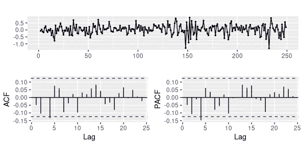**

**图 3.3 一阶差分、自相关和偏自相关**

**图中所示的差看起来相当稳定，因此我们将只使用一阶差。但是我们仍然可以执行单位根测试来检查平稳性。对此，我们有几个备选方案，这里我们使用扩展的迪基-富勒测试(ADF，在 R 中它是`adf.test`，如果我们设置`k=0`，那么它就变成简单的迪基-富勒测试)。**

```
# ADF test
dif.train <- na.remove(dif.train)
adf.test(dif.train)
# --> p-value smaller than 0.01
```

**根据结果，我们可以**拒绝**一阶差分为 ***非平稳*** 的零假设。因此我们设置 **d=1** 。根据偏自协方差，显示*平稳时间序列与其自身的滞后值之间的相关性，消除了更短滞后的影响*，变量 xₜ与 xₜ₊₄相关，那么我们可以尝试设置 **p = 4** 。剩下的就是 **q** 了，我们可以从 0 开始尝试，逐渐增加。至于季节性，它并没有真正显示在图表中，因此我们可以将**季节性** (P，D，Q)的参数保留为缺省值 0。应该加漂移吗？从图 3.2 中的增加趋势来看，似乎是的，我们可以将`include.drift`设为真。**

```
# manually try the different parameters
fit.m1 <- Arima(train.close.ts, order=c(4,1,0), include.drift=TRUE)
fit.m1
# --> AIC = 156.15fit.m2 <- Arima(train.close.ts, order=c(4,1,1), include.drift=TRUE)
fit.m2
# --> AIC = 157.61 
# after trying some more other values of q, we will find out
# that increasing q doesn't really decrease the AICcheckresiduals(fit.m1)
# --> p-value = 0.4187plot(forecast(fit.m1, h=10))
lines(test.index, test.close)
```

**我们的定制模型具有稍低的 AIC 值，然而该图看起来几乎与图 3.2 所示的相同。**

**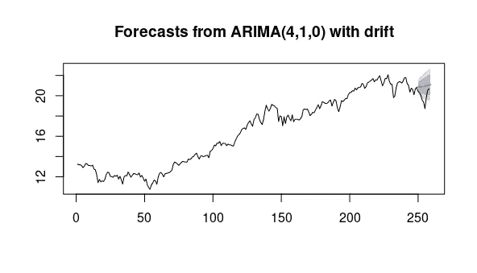**

**图 3.4 预测-定制模型的结果**

***总结***

**在这篇文章中，首先，我们快速地介绍了时间序列的形式定义和时间序列中可能出现的一些典型性质。之后，随着 ARMA 和 ARIMA 的扩展——季节性 ARMA (SARMA)和季节性 ARIMA(萨里玛)，我们逐渐熟悉了 ARIMA 的定义。最后，我们建立了一个模型，对油价进行了自动和人工的短期预测。**

## **参考**

**[1]*NIST/sema tech*[*电子版统计方法手册*](http://www.itl.nist.gov/div898/handbook/) (2012)。**

**[2]沃森，M. W. [时间序列:经济预测](https://citeseerx.ist.psu.edu/viewdoc/download?doi=10.1.1.86.4466&rep=rep1&type=pdf) (2001)。*国际社会百科全书&行为科学*，15721–15724。**

**[3] Hyndman，R. J .，& Athanasopoulos，G. [*预测:原理与实践*](https://books.google.cz/books?hl=cs&lr=&id=_bBhDwAAQBAJ&oi=fnd&pg=PA7&dq=Forecasting:+principles+and+practice&ots=TihVtkUMHK&sig=74BT_4wjk6Q81fVs9mX0RQgiVeE&redir_esc=y#v=onepage&q=Forecasting%3A%20principles%20and%20practice&f=false) (2018)。OTexts。**

**[4] Pankratz，A. (2009 年)。 [*单变量 Box-Jenkins 模型预测:概念与案例*](https://books.google.cz/books?hl=cs&lr=&id=4wlg2wtgEHYC&oi=fnd&pg=PP2&dq=Forecasting+with+univariate+Box-Jenkins+models:+Concepts+and+cases&ots=8RLy7Wrb3E&sig=U0iEQ3_AItJ3zcCB4MpPhcu0vgs&redir_esc=y#v=onepage&q=Forecasting%20with%20univariate%20Box-Jenkins%20models%3A%20Concepts%20and%20cases&f=false) (第 224 卷)。约翰·威利的儿子们。**

**[5] Hyndman，R. J .，& Khandakar，Y. (2008 年)。[自动时间序列预测:R](https://www.jstatsoft.org/article/view/v027i03) 的预测包。*统计软件杂志*， *27* (1)，1–22。**

**[6]埃尼，D. (2015 年)。[尼日利亚瓦里镇降雨量的季节性 ARIMA 建模和预测](http://scirp.org/html/59043_59043.htm)。*地球科学与环境保护杂志*， *3* (06)，91。**

**【7】[自回归综合移动平均线](https://en.wikipedia.org/wiki/Autoregressive_integrated_moving_average?oldformat=true)。(2021 年 4 月 29 日)。在*维基百科*里。**

**[我对建模和预测哲学的一些看法](https://medium.com/science-and-philosophy/subjectivism-in-decision-science-926c29feb7bb):)**