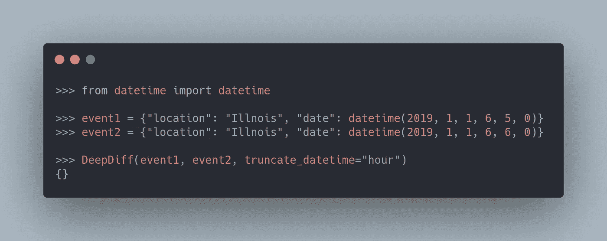

# DeepDiff——使用 Python 递归查找并忽略细微差异

> 原文：<https://towardsdatascience.com/deepdiff-recursively-find-and-ignore-trivial-differences-using-python-231a5524f41d?source=collection_archive---------12----------------------->

## 比较两个 Python 对象时出现有意义的断言错误

# 动机

在比较两个 Python 对象时，您可能不希望测试集中在一些细微的差异上，比如列表中值的顺序。

例如，您可能希望测试认为`[3, 2]`与`[2, 3]`相同。

但是，如果顺序不同，就会出现错误。


作者图片

在比较两个 Python 对象时，有没有一种方法可以忽略顺序？


作者图片


作者图片

这时 DeepDiff 就派上用场了。在本文中，您将学习如何使用 DeepDiff 来防止比较 Python 对象的某些部分。

# 什么是 DeepDiff？

DeepDiff 是一个 Python 库，它递归地查找字典、可重复项、字符串和其他对象中的所有变化。

要安装 DeepDiff，请键入:

```
pip install deepdiff
```

# 描述错误

当使用`assert`比较两个不同的 Python 对象时，您可能会得到类似下面的错误:

```
AssertionError: assert {'apple': 2, 'banana': [3, 2, 2], 'orange': 3} == {'apple': 2, 'banana': [3, 2], 'orange': 3}
```

这个断言错误信息不多，因为我们不知道使这两个字典不同的确切元素。

使用 DeepDiff，我们可以看到一个更具描述性的错误，它显示了差异是什么以及差异发生在哪里。


图片由作者提供—将上述[的代码复制到此处](https://gist.github.com/khuyentran1401/c1ca031994df0d3e0794259795980238)

从上面的错误中，我们知道了三件事:

*   `price1`中的一项在`price2`中被删除。
*   移除的项目在`price1['banana'][2]`。
*   移除项目的值为`2`。

## 树形视图

`DeepDiff`的默认视图是`"text"`。要将视图更改为树形视图，使用`view="tree"`。在树视图中，您可以遍历树并查看哪些项目相互比较。


图片由作者提供—将上述[的代码复制到此处](https://gist.github.com/khuyentran1401/ee17e6b8b5a4be1625c74b6cda78f2fa)

# 忽略订单

如文章开头所示，可以使用`ignore_order=True`忽略顺序:


图片由作者提供—将上面的代码[复制到这里](https://gist.github.com/khuyentran1401/8d33c963437f824af500d76d7500c524)

输出`{}`显示两个 Python 对象之间没有区别。

您也可以使用`ignore_order=True`来忽略重复项:


图片由作者提供—将上述[的代码复制到此处](https://gist.github.com/khuyentran1401/9755cf665bccfcc5f1e5c77e7d018522)

# 忽略两个数字之间的微小差异

## 忽略某个数字

当两个数字非常接近时，看到断言错误可能会很烦人。如果您想忽略特定数字后两个数字之间的差异，请使用`significant_digits`。

在下面的代码中，我们只比较这两个数字的第二位数。


图片由作者提供—将上述[的代码复制到此处](https://gist.github.com/khuyentran1401/e8704e9ccd7fb479cf55e030b307604f)

## 忽略ε以下的差异

有时候，两个数字非常接近，但是它们没有相似的数字。要忽略两个数字之间的微小差异，请使用`math_epsilon`。

在下面的代码中，我使用`math_epsilon=0.001`告诉`DeepDiff`忽略小于 0.001 的差异。因为 1 和 0.9999 之间的差是 0.0001，所以该差被忽略。


图片由作者提供—将上面的代码[复制到这里](https://gist.github.com/khuyentran1401/29d48239eb9ee94c401e3c8f22d8066b)

# 忽略字符串大小写

如果想忽略字符串大小写(即“红色”和“红色”)，使用`ignore_string_case=True`。


图片由作者提供—将上述[的代码复制到此处](https://gist.github.com/khuyentran1401/1c59b416b99af810d62d1fd2b373c265)

# 忽略 NaN 不等式

如果你和一些 nan 一起工作过，你可能知道在 Python 中不是每个 nan 都是平等的:


作者图片

因此，比较包含不同类型的 nan 的对象可能会令人困惑。(难道`[nan, 1, 2]`不等于`[nan, 1, 2]`？)


图片由作者提供—将上述[的代码复制到此处](https://gist.github.com/khuyentran1401/47d89c466b79a78152d0b549510ceee3)

要忽略不同类型的 nan，请使用`ignore_nan_inequality=True`:


图片由作者提供—将上面的代码[复制到这里](https://gist.github.com/khuyentran1401/f1879d980b826069c7c45008641d6c0f)

# 排除类型

有时，您可能不关心某些类型是否会改变。要包含某些数据类型，请使用`exclude_types`:


图片由作者提供—将上面[的代码复制到这里](https://gist.github.com/khuyentran1401/1cd9f89a47d4ede56f5a56064843584b)

## 忽略数字类型

`2 != 2.0`因为`2`是整数而`2.0`是浮点数。您可以使用`ignore_numeric_type_changes=True`忽略数值类型的变化。


图片由作者提供—将上述[的代码复制到此处](https://gist.github.com/khuyentran1401/94ee63b0b059a3fe17f0aac45f3f45a6)

# 截断日期时间

在比较两个 datetime 对象时，您可能只想确保它们在一定程度上是相似的(具有相同的小时，而不是相同的小时和分钟)。


作者图片

您可以使用`truncate_datetime`指定`DeepDiff`在两个日期时间对象之间进行比较的精确程度。



图片由作者提供—将上述[的代码复制到此处](https://gist.github.com/khuyentran1401/54fe5ceb83da59c69b952641abf2bb3b)

# 忽略路径

如果您想从报告中排除某些路径，您可以`exclude_paths`:


图片由作者提供—将上面的代码[复制到这里](https://gist.github.com/khuyentran1401/c4e06b22042d6472aa43fcfd83c9f5f6)

# 排除返回路径

如果想忽略某个模式的多条路径，使用`exclude_regrex_paths`。

例如，为了避免比较`aldi[0]['color']`和`walmart[0]['color']`以及`aldi[1]['color']`和`walmart[1]['color']`，我们简单地忽略了正则表达式`root[\d+\]\['color'\]`指定的路径，其中`\d+`代表一个或多个数字。


图片由作者提供—将上面[的代码复制到这里](https://gist.github.com/khuyentran1401/a54300eb7412212da5cc11015352bb5d)

如果您不熟悉正则表达式，请查看此备忘单。

# 将 DeepDiff 与 pytest 一起使用

要将 DeepDiff 与 pytest 一起使用，请编写`assert not DeepDiff(...)`。这意味着我们想要断言两个 Python 对象之间没有区别。


作者图片

# 结论

恭喜你！您刚刚学习了如何在使用 DeepDiff 比较两个 Python 对象时忽略某些元素。我希望这个工具能让你更容易地编写测试和调试代码。

随意发挥，并在这里叉这篇文章的源代码:

[](https://github.com/khuyentran1401/Data-science/blob/master/productive_tools/deepdiff_example.ipynb) [## 数据科学/deepdiff _ example . ipynb at master khuyentran 1401/数据科学

### 收集有用的数据科学主题以及代码和文章-Data-science/deepdiff _ example . ipynb at master…

github.com](https://github.com/khuyentran1401/Data-science/blob/master/productive_tools/deepdiff_example.ipynb) 

我喜欢写一些基本的数据科学概念，并尝试不同的数据科学工具。你可以在 LinkedIn 和 T2 Twitter 上与我联系。

星[这个回购](https://github.com/khuyentran1401/Data-science)如果你想检查我写的所有文章的代码。在 Medium 上关注我，了解我的最新数据科学文章，例如:

[](/4-pre-commit-plugins-to-automate-code-reviewing-and-formatting-in-python-c80c6d2e9f5) [## 4 个预提交插件，用于在 Python 中自动检查和格式化代码

### 使用 black、flake8、isort 和 interrogate 编写高质量的代码

towardsdatascience.com](/4-pre-commit-plugins-to-automate-code-reviewing-and-formatting-in-python-c80c6d2e9f5) [](/pydash-a-bucket-of-missing-python-utilities-5d10365be4fc) [## Pydash:缺少 Python 实用程序的厨房水槽

### 以函数的方式使用 Python

towardsdatascience.com](/pydash-a-bucket-of-missing-python-utilities-5d10365be4fc) [](/3-tools-to-track-and-visualize-the-execution-of-your-python-code-666a153e435e) [## 3 个跟踪和可视化 Python 代码执行的工具

towardsdatascience.com](/3-tools-to-track-and-visualize-the-execution-of-your-python-code-666a153e435e) [](/how-to-create-mathematical-animations-like-3blue1brown-using-python-f571fb9da3d1) [## 如何使用 Python 创建类似 3Blue1Brown 的数学动画

### 利用您的 Python 技能创建美丽的数学动画

towardsdatascience.com](/how-to-create-mathematical-animations-like-3blue1brown-using-python-f571fb9da3d1)