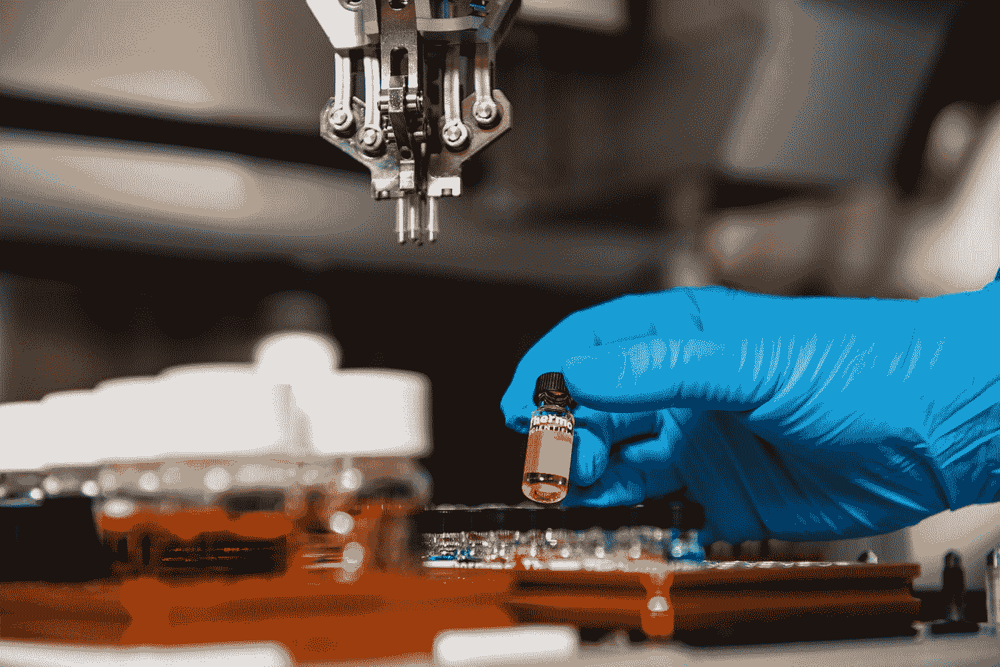

# 深度思维、阿尔法折叠和蛋白质折叠问题

> 原文：<https://towardsdatascience.com/deepmind-alphafold-the-protein-folding-problem-a331d9ced746?source=collection_archive---------46----------------------->

## 通过 AlphaFold，谷歌的 DeepMind 通过解决由来已久的蛋白质折叠问题，正在推动医学科学领域的边界。

在 [Unsplash](https://unsplash.com?utm_source=medium&utm_medium=referral) 上[科学高清](https://unsplash.com/@scienceinhd?utm_source=medium&utm_medium=referral)拍摄的照片

蛋白质是所有生物的基本组成部分。它们负责身体的生长、发育和营养。因此，了解蛋白质是如何由身体合成和形成的，将有助于了解每个生物体内各种重要的生物过程。

# 蛋白质合成

真核生物利用基因通过 **DNA** (脱氧核糖核酸)提供的信息，在核糖体中合成蛋白质。基因携带着父母传给后代的特征或特性的信息。它们在 DNA 中以不同核苷酸序列的形式携带这些信息(*腺嘌呤、鸟嘌呤、胸腺嘧啶和胞嘧啶*)。蛋白质合成发生在两个过程中— **转录和翻译。**

转录阶段。来源:[施维雅医疗艺术](https://smart.servier.com/)

在转录过程中，DNA 被用作模板来创建信使 RNA *(mRNA)* 的分子，其方式是将 DNA 的一条链中携带的遗传信息转录到 mRNA 的一条链中。在翻译阶段，这种 mRNA 然后移动到位于细胞质中的核糖体中，在那里根据 mRNA 提供的信息合成蛋白质。在核糖体中，tRNA 带入氨基酸，根据 mRNA 提供的信息，tRNA 带入的氨基酸连接形成多肽。

翻译阶段。来源:[施维雅医疗艺术](https://smart.servier.com/)

这形成了蛋白质的初始结构，随后是由于形成链骨架的原子之间的相互作用而导致的局部折叠。这是二级结构。为了形成三级结构，组成蛋白质的氨基酸相互作用，形成三维形状。因此，最初的多肽通过一系列**折叠**步骤转化成蛋白质。

*更详细的蛋白质合成描述可以在* [*这里找到*](https://flexbooks.ck12.org/cbook/ck-12-college-human-biology-flexbook-2.0/section/5.6/primary/lesson/protein-synthesis-chumbio)

# **蛋白质折叠问题**

> **蛋白质折叠**是多肽(由肽键连接的氨基酸链)折叠成其特征性三维结构的物理过程。这种结构完全由链中的氨基酸序列决定，被称为**安芬森法则**(分子生物学中的热力学假设)[1]。

每个蛋白质的功能都与这种结构密切相关，能够非常接近这种结构将为科学解决世界上的各种问题打开新的大门，从寻找快速治愈疾病的方法，合成可以分解化学物质的蛋白质到理解生命的基本组成部分。然而，确定这种三维结构是一个复杂的过程。

> 1969 年，Cyrus Levinthal 指出，如果每个氨基酸残基在折叠过程中可以采用 3 种构象，那么 100 个残基的蛋白质可以采用 3 种⁰⁰ (=5.15 * 10⁴⁷)possible 构象)。如果以 0.1 *皮秒的速率对每个构象进行计算采样，*将需要 1.6 * 10 ⁷年，而宇宙的年龄只有 13.82 * 10⁹年。这意味着这将需要比已知宇宙年龄更长的时间，而这仅仅是对一种蛋白质而言。然而，每种蛋白质都可靠而快速地折叠到其天然状态(3D 结构)。这就是所谓的**莱文塔尔悖论**【2】。

# 输入 AlphaFold

AlphaFold 是 DeepMind 团队的最新成果，该团队开发了能够通过强化学习在围棋比赛中击败人类冠军的 AlphaGo。AlphaFold 是 DeepMind 对蛋白质折叠问题的解决方案。在 CASP13 期间，AlphaFold 能够以很高的精确度近似蛋白质结构的物理特性，并在实验中排名第一。

[蛋白质结构预测的关键评估](https://predictioncenter.org/) (CASP)实验旨在为最先进模型在解决蛋白质折叠问题、确定已取得的进展以及突出未来努力方向方面的性能设定基准。CASP 广泛使用 Adam Zemla 开发的全球距离测试(GDT)[3]。GDT 是具有相同氨基酸序列的两个蛋白质结构之间相似性的度量，取值范围为 0-100。CASP 广泛使用这一指标来衡量几个竞争模型预测的优劣。近似蛋白质的物理结构主要涉及预测氨基酸对之间的距离以及它们之间化学键的角度。

在 CASP13 实验期间，DeepMind 使用神经网络架构来预测蛋白质中每对残基之间的距离分布，并将这些概率结合起来，形成预测的蛋白质结构有多接近的度量。该度量被用作算法优化的损失函数。还使用生成神经网络来创建新片段，这些新片段用于提高所提出的蛋白质结构的分数。这种方法实现了高度的准确性，在所有其他参与者中名列第一。

对于最新的 CASP14 实验，DeepMind 提出了 AlphaFold2。在这种方法中，折叠的蛋白质被认为是一种空间图形结构(3D 结构)，其中残基形成节点，边缘连接非常接近的残基。一个基于注意力的神经网络系统被端到端地训练，以使用大约 170，000 个蛋白质结构来解释该图的结构。详细解释可以在[这里](https://deepmind.com/blog/article/alphafold-a-solution-to-a-50-year-old-grand-challenge-in-biology)找到。使用这种方法，AlphaFold 系统在 CASP14 评估中的所有目标上获得了 92.4 GDT 的中值分数。

图 2:在过去的几年中，预测中值准确度的提高。来源: [AlphaFold](https://deepmind.com/blog/article/alphafold-a-solution-to-a-50-year-old-grand-challenge-in-biology)

# 现实世界的影响

了解蛋白质的结构对确定其性质和功能大有帮助。使用这个系统，研究小组能够预测 SARS-Cov-2 病毒的几种蛋白质结构，这些结构以前是未知的，这只是皮毛。该系统可以在许多领域找到应用，如药物设计，从不同化合物中剔除不需要的元素，创造环境可持续的材料，等等。

未来令人激动。

# 参考

[1]安芬森，剑桥大学，1973 年。支配蛋白质链折叠的原理。*科学*， *181* (4096)，第 223–230 页。

[2]莱文塔尔，1969 年。如何优雅地折叠？*生物系统中的穆斯堡尔谱学*， *67* ，第 22–24 页。

[3]泽姆拉，2003 年。LGA:一种寻找蛋白质结构三维相似性的方法。*核酸研究*， *31* (13)，第 3370–3374 页。

[4][https://deep mind . com/blog/article/alpha fold-a-solution-to-a-50 岁生物大挑战](https://deepmind.com/blog/article/alphafold-a-solution-to-a-50-year-old-grand-challenge-in-biology)

[5][https://deep mind . com/blog/article/alpha fold-Using-AI-for-scientific-discovery](https://deepmind.com/blog/article/AlphaFold-Using-AI-for-scientific-discovery)

[6]图片:[https://smart.servier.com/](https://smart.servier.com/)