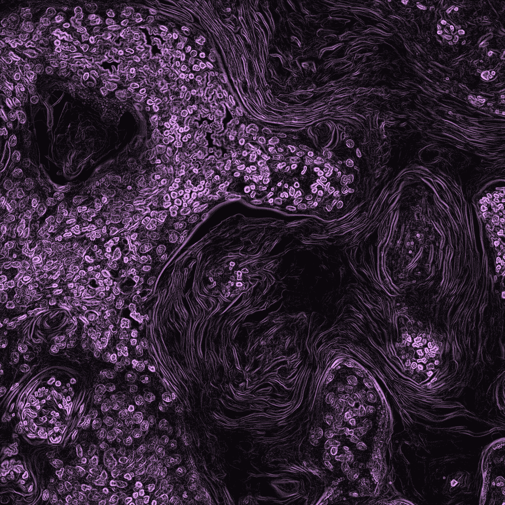

# Deepmind AlphaFold2:高度精确的蛋白质结构预测

> 原文：<https://towardsdatascience.com/deepmind-alphafold2-highly-accurate-protein-structure-prediction-7ef0946f60c0?source=collection_archive---------9----------------------->

## 深入研究 AlphaFold2 的文章，它是如何工作的，为什么，以及一切

[国家癌症研究所](https://unsplash.com/@nci?utm_source=medium&utm_medium=referral)在 [Unsplash](https://unsplash.com?utm_source=medium&utm_medium=referral) 上拍摄的照片

2 天前，发布了一篇关于 AlphaFold2 的文章，其中包含了关于该模型及其工作原理的预览。这是一个非常令人兴奋的消息，我想很多人都在等待这个消息。如果你不熟悉 AlphaFold2，它是 deepmind 为解决蛋白质折叠问题而构建的高级模型。蛋白质折叠问题是生物信息学领域最大的问题之一，如果你想了解更多，请点击这里查看我的文章。

> 臭名昭著的“刺突蛋白”，研究冠状病毒，使病毒进入我们的细胞。与此同时，像 Moderna 和辉瑞公司的 mRNA 疫苗复制了这些刺突蛋白的形状，导致身体产生免疫反应。但从历史上看，确定蛋白质结构(通过 X 射线晶体学、核磁共振和冷冻电子显微镜等实验技术)是困难、缓慢和昂贵的。另外，对于某些类型的蛋白质，这些技术根本不起作用。

来源: [DaleonAI](https://daleonai.com/how-alphafold-works)

在我们开始研究该模型之前，让我们快速回顾一下:

## 什么是 [AlphaFold2](https://www.nature.com/articles/s41586-021-03819-2_reference.pdf) ？

确定蛋白质的结构是一个非常困难的问题。我们需要这些结构来加深对蛋白质的了解，从而能够更好地发现药物和进行治疗。蛋白质折叠问题本质上是仅从其氨基酸序列确定蛋白质结构的问题。自 1994 年以来，一项名为蛋白质结构预测的关键评估(CASP)的正在进行的研究项目/竞赛每年都在进行，以评估确定蛋白质结构的计算方法的质量。到 2016 年为止，最好的成绩是 40 分(我不会深入解释这个分数)，然后在 2018 年 Alphafold 达到了 58 分左右，现在 AlphaFold2 达到了 **87 分**，这是对以前型号**的一个重大飞跃。**

来源: [deepmind](https://deepmind.com/blog/article/alphafold-a-solution-to-a-50-year-old-grand-challenge-in-biology)

# 模型如何工作

从这篇文章中，我们可以从一个高层次的概述中收集整体模型是如何工作的。这就是事情变得有趣的地方，也是我写这些论文评论的原因。我最感兴趣的部分是模型实际上是如何工作的，问题是如何被框定的，以及模型是如何解决问题的。蛋白质折叠问题最好形成一个[图推理问题](https://proceedings.neurips.cc/paper/2004/file/a4613e8d72a61b3b69b32d040f89ad81-Paper.pdf)。这并不令人惊讶，因为该模型需要预测三维空间的坐标，鉴于蛋白质结构的复杂性，最好将其建模为图表。

现在我们有了一个包含节点的图结构，我们需要定义一个比节点更大的构建块(很像节点的集合)。从一个角度来看，这就是一个**多序列比对**是**的原因。**

更科学地说:

> **多重序列比对** (MSA)一般是三个或三个以上长度相近的生物**序列**(蛋白质或核酸)的**比对**。

来源: [EBI](https://www.ebi.ac.uk/Tools/msa/)

总的来说，AlphaFold 2 将 MSA 和成对特征共同嵌入到一个新的输出表示中。它使用整体关联损失函数、中间损失和新的等变注意力架构来实现预测的迭代改进。

AlphaFold 网络分为两部分，第一部分通过多层 Evoformer(如下所述)处理输入，以产生序列 x 残基矩阵(经处理的 MSA)。第二部分通过蛋白质的每个残基的旋转和平移来负责蛋白质的 3-D 结构操作。它还负责使用允许进一步精炼的等变变压器来破坏蛋白质的链原子结构。

在整个网络中，他们采用迭代设计方法，将多个相似的层放在一起做同样的事情。这重复地应用相同的损失函数并将输出递归地馈送到相同的模块。他们声称，这提高了准确性，只增加了很少的训练时间。

## 进化者

来源:A [lphaFold2](https://www.nature.com/articles/s41586-021-03819-2_reference.pdf)

> 名为 Evoformer 的网络构建模块的关键原理是将蛋白质结构预测视为三维空间中的图形推理问题，其中图形的边由邻近的残基定义。

来源: [Alphafold2 文章](https://www.nature.com/articles/s41586-021-03819-2_reference.pdf)

进化者负责对三维蛋白质图谱进行编码和推理。对于上面的生产 MSA 矩阵，列编码输入蛋白质序列的单个残基，而行编码这些残基出现的部分序列。在 AlphaFold1 上完成的升级之一是 MSA 矩阵更新操作应用于网络中的每个块，而不是一次。这允许构建块之间的连续通信，并包含它们的迭代设计。

为了正确处理三维蛋白质结构，整个网络必须满足许多约束，其中之一是距离上的三角形不等式(这意味着从点 *A* 经由点 *C* 到点 *B* 的距离至少与从点 A 直接到点*B*的距离一样大)。为了满足这一条件，他们向注意力机制添加了额外的 logit 偏差，以补偿三角形的“缺失边”，并且他们定义了“三角形乘法更新”操作，该操作使用两条边来更新缺失的第三条边。

他们还在进化者中使用了一种注意力的变体，称为轴向注意力，它在编码和解码方面与张量的几个维度更加平滑地对齐(来源: [PapersWithCode](https://paperswithcode.com/paper/axial-attention-in-multidimensional-1) )。

## 模特培训

对于他们的训练数据，他们使用了标记和未标记数据的混合，我猜这是一个半监督模型(如果它是完全无监督的，会令人印象深刻)。他们用类似的方法让吵闹的学生自我升华来做到这一点。这实质上意味着他们首先预测数据集的一部分的结构，然后通过将其过滤为高置信度子集来制作新的标记数据集。然后，他们使用最初标记的数据集和这个新子集的混合，从头开始再次训练相同的架构。这有效地利用了未标注的数据，并提高了生成的网络的精度。

## 结构预测

他们的预测模块依赖于上面定义的使用 MSA 对表示的 3-D 主干结构，其也使用未标记的序列数据来提高预测准确性。他们还随机屏蔽 MSA 中的残基，并使用 BERT 型变换器来预测 MSA 序列的屏蔽元素。这促使网络对蛋白质序列中发现的进化关系进行推理。

在生物信息学 ML 论文中变得越来越重要的部分之一是模型可解释性。他们在这一部分没有包括很多细节，但我的主要收获是，为模型可解释性训练一个单独的网络的惯例开始变得有点流行(在他们的例子中，他们训练了一个单独的结构模块，它只是网络的一部分)。我相信对于医疗项目来说，这是非常值得的。

## 模型限制

他们观察到该模型的一些表现不太好的地方。第一个是当蛋白质序列的平均比对深度小于约 30 个序列时，准确率大大下降。他们声称，在网络的早期阶段，正确定义正确的结构需要 MSA 信息。他们还发现，超过 100 个序列的深度不会带来很大的改善，所以看起来理想的范围是 30-100。他们还发现，该网络对一些链内接触较少的蛋白质起作用

## 结论

当然，我发现这一切都令人印象深刻和着迷，但事实是这仍处于研究/实验阶段，所以我不能完全肯定蛋白质折叠问题实际上已经解决了。许多模型在实验室和比赛中表现出色，但在现实世界中却失败了，希望 Alphafold2 不是其中之一。但是，至少现在他们已经在这里发布了代码，社区可以进行各种测试和基准测试。

如果你想定期收到关于人工智能和机器学习的最新论文的评论，请在这里添加你的电子邮件并订阅！

https://artisanal-motivator-8249.ck.page/5524b8f934