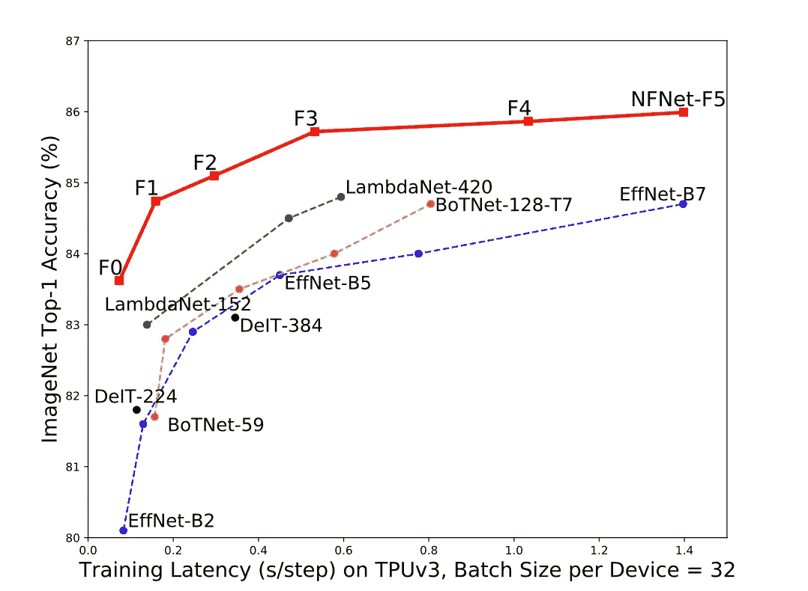

# Deepmind 发布了一个新的最先进的图像分类模型——NFNets

> 原文：<https://towardsdatascience.com/deepmind-releases-a-new-state-of-the-art-image-classification-model-nfnets-75c0b3f37312?source=collection_archive---------5----------------------->

## NFNets 比 EfficientNets 快，而且它们不使用规范化

在 [Unsplash](https://unsplash.com?utm_source=medium&utm_medium=referral) 上由 [Boitumelo Phetla](https://unsplash.com/@writecodenow?utm_source=medium&utm_medium=referral) 拍摄的照片

> 我们的小型模型与 ImageNet 上的 EfficientNet-B7 的测试精度相当，同时训练速度提高了 8.7 倍，我们的大型模型达到了 86.5%的最新顶级精度。

来源: [arxiv](https://arxiv.org/abs/2102.06171)

训练一个模型最烦人的事情之一是训练它所花费的时间以及适应数据和模型所需的内存量。由于图像分类是最常见的机器学习任务之一，Deepmind 发布了一个新模型，该模型与最先进的(SOTA)性能相匹配，具有明显更小的尺寸，更高的训练速度，以及更少的简化优化技术。

在他们的工作中，他们检查了当前的 SOTA 模型，如效率网和结果网。在他们的分析中，他们确定了一些优化技术，这些技术利用了大量内存，却没有产生显著的性能价值。他们证明，这些网络可以在没有那些优化技术的情况下实现相同的性能。

虽然提出的模型可能是最有趣的部分，但我仍然觉得对以前工作的分析非常有趣。仅仅因为这是大部分学习发生的地方，我们开始理解哪些地方可以做得更好，以及为什么新提出的方法/技术比旧的方法/技术有所改进。

## 先决条件:批量标准化

本文从分析[批量标准化](/batch-normalization-in-3-levels-of-understanding-14c2da90a338)开始。为什么？因为尽管它已经显示出很好的效果，并且已经在大量的 SOTA 模型中大量使用，但是它有几个缺点，如论文[1]中所概述的:

1.  非常昂贵的计算成本
2.  引入了许多需要进一步微调的额外超参数
3.  在分布式培训中导致许多实施错误
4.  在小批量上表现不佳，小批量通常用于训练较大的模型

但是首先，在移除批处理规范化之前，我们必须了解它给模型带来了什么好处。因为我们想找到一种更聪明的方法，既有这些好处，又有更少的缺点。这些好处是[1]:

1.  它缩小了深网中剩余分支的规模。ResNets 是应用最广泛的图像分类网络之一。它们通常扩展到数千层，批量标准化减少了“隐藏激活”的规模，隐藏激活通常会导致渐变以一种有趣的方式运行([渐变爆炸问题](https://machinelearningmastery.com/exploding-gradients-in-neural-networks/)
2.  消除了 ReLU 和 GeLU 等常用激活函数的均值漂移。在大型网络中，这些激活函数的输出通常平均向非常大的值移动。这导致网络在某些情况下(例如初始化)为所有样本预测相同的标签，从而降低其性能。批量标准化解决了这个均值漂移问题。

还有一些其他的好处，但是我想你已经明白了主要是关于训练过程的规范化和平滑化。

## NFNets —标准化自由网络:

来源: [arxiv](https://arxiv.org/abs/2102.06171)

尽管以前在各种论文中尝试过删除批量标准化(BN ),但结果与 SOTA 性能或训练延迟不匹配，并且似乎在大批量上失败，这是本文的主要卖点。他们在不影响性能的情况下成功地消除了(BN ),并大幅改善了训练延迟。

为此，他们提出了一种称为**自适应梯度裁剪(AGC)的梯度裁剪技术[1]。**本质上，梯度削波通过不允许梯度超过某个阈值来稳定模型训练[1]。这允许使用更大的训练速率，从而更快地收敛，而没有爆炸梯度问题。

然而，主要问题是设置阈值超参数，这是一项非常困难的手动任务。AGC 的主要好处是消除了这个超参数。为此，我们必须检查梯度范数和参数范数。

虽然我对每个机器学习模型背后的数学非常感兴趣，但我理解很多 ML 爱好者不喜欢阅读一堆冗长的微分方程，这就是为什么我将从理论/直观的角度而不是数学严谨的角度来解释 AGC。

范数只是向量大小的一种度量。AGC 建立在以下前提之上:

> 梯度的范数与层的权重的范数的单位比提供了单个梯度下降步骤将改变原始权重多少的简单度量。

来源: [arxiv](https://arxiv.org/abs/2102.06171)

但是为什么这个前提有效呢？让我们后退一点。非常高的梯度会使我们的学习不稳定，如果是这样的话，那么权重矩阵的梯度与权重矩阵的比率会非常高。

该重量比相当于:

学习率 x 梯度和权重矩阵的比值(这是我们的前提)。

因此，从本质上讲，这个前提提出的比率是一个有效的指标，表明我们是否应该削减梯度。还有另一个小调整。他们通过多次实验发现，使用梯度规范的**单位比例**比使用**层比例**要好得多(因为每层可以有不止一个梯度)。

除了 AGC 之外，他们还使用 dropout 来替代批处理规范化提供的正则化效果。

他们还使用了一种叫做**清晰度感知最小化(SAM)**【1】的优化技术。

> 受损失景观的几何和概化之间的联系(包括我们在此证明的概化界限)的激励，我们引入了一种新颖、有效的方法来同时最小化损失值和损失锐度。特别地，我们的过程，清晰度感知最小化(SAM)，寻找位于具有一致低损失的邻域中的参数；这个公式导致最小-最大优化问题，在这个问题上可以有效地执行梯度下降。我们提供的实证结果表明，SAM 提高了各种基准数据集(例如，CIFAR-{10，100}、ImageNet、微调任务)和模型的模型泛化能力，为几个数据集和模型带来了新的最先进的性能。

来源:[山姆 arxiv 论文](https://arxiv.org/abs/2010.01412)

损失锐度的想法似乎很有趣，为了简洁起见，我可能会在另一篇文章中探讨它。最后要注意的一点是，他们对 SAM [1]做了一个小小的修改，将计算成本降低了 20–40%！他们只在两个最大的型号变体上使用它。看到这些技术被添加进来，而不仅仅是开箱即用，这总是很棒的。我认为这表明他们在使用它之前已经进行了大量的分析(因此能够对它进行一些优化)。

**最后的想法和带走的东西**

谁会想到，取代批量标准化这样的小优化技术会导致训练延迟提高 9 倍。我认为这传达了一个信息，那就是对到处都在使用的流行优化技术多一点怀疑。平心而论，我以前也是这种犯罪的受害者，我曾经只是将每一种流行的优化技术放入我的机器学习项目中，而没有充分检查其利弊。我估计这就是看 ML 论文的主要好处之一，往期 SOTAs 的分析！

如果你想定期收到关于人工智能和机器学习的最新论文的评论，请在这里添加你的电子邮件并订阅！

[https://artisanal-motivator-8249.ck.page/5524b8f934](https://artisanal-motivator-8249.ck.page/5524b8f934)

**参考文献:**

[1]无需归一化的高性能大规模图像识别。安德鲁·布洛克、索哈姆·德、塞谬尔·史密斯和卡伦·西蒙扬。2021

如果你有兴趣阅读更多关于其他小说的文章，请点击这里查看我的文章:

</microsoft-zero-offload-democratizing-billion-scale-model-training-2a44f142d931>  </nvidias-pay-attention-when-required-a-transformer-optimization-approach-694d1472da14>  </facebook-nyu-reduce-covid-hospital-strain-covid-prognosis-via-self-supervised-learning-a30581b5e235>  </facebook-detr-transformers-dive-into-the-object-detection-world-39d8422b53fa>  </unsupervised-pathology-whole-slide-image-slides-segmentation-34cd7a50ba6c> 