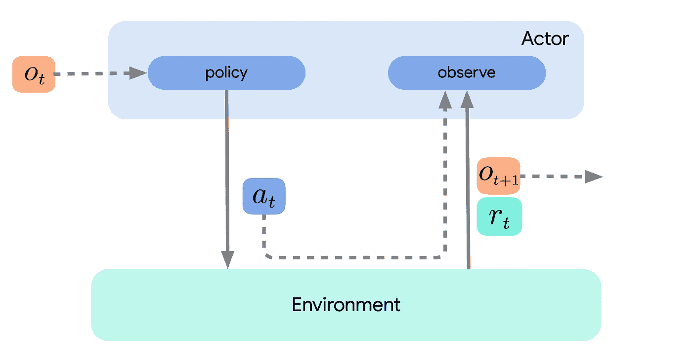
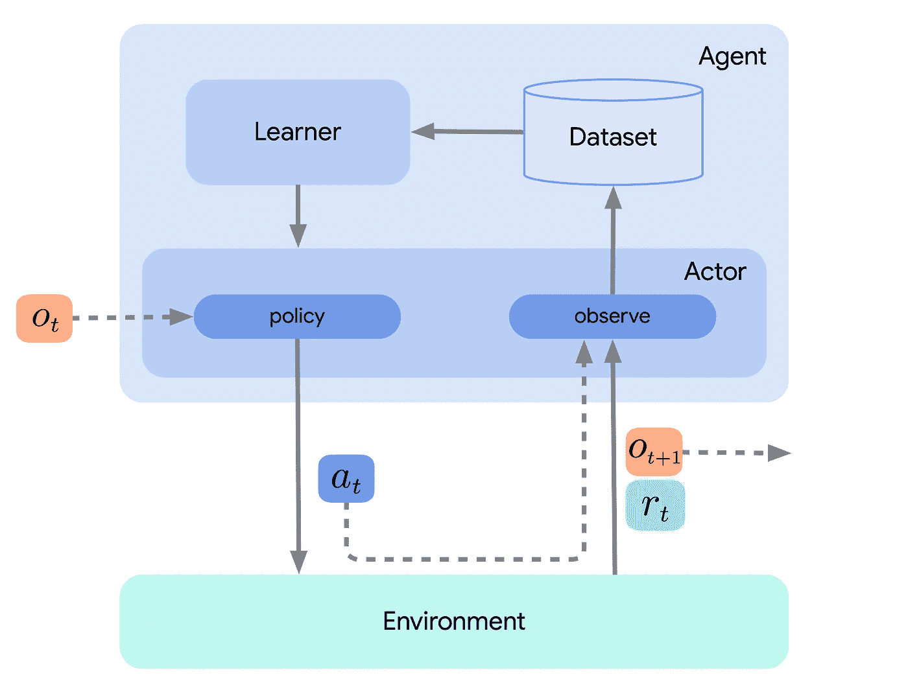

# DeepMind 的强化学习框架“Acme”简介

> 原文：<https://towardsdatascience.com/deepminds-reinforcement-learning-framework-acme-87934fa223bf?source=collection_archive---------9----------------------->


paweczerwi ski 在 [Unsplash](https://unsplash.com?utm_source=medium&utm_medium=referral) 上的照片

## 如何用 Acme 实现 RL 代理

A cme 是基于 Python 的强化学习研究框架，由谷歌的 DeepMind 于 2020 年开源。它旨在简化新型 RL 试剂的开发并加速 RL 研究。根据他们自己的声明，Acme 在 DeepMind 每天都被使用，deep mind 是强化学习和人工智能研究的先锋。

为了最近的一个大学项目，我决定学习 Acme 并使用它来实现不同的 RL 算法。我发现它很棒，我真的很喜欢和它一起工作。

开始使用 Acme 也相对容易。这是因为有几个不同复杂程度的入口点。换句话说，该框架不仅适用于高级研究人员，也允许初学者实现甚至简单的算法——有点类似于初学者和专家使用 TensorFlow 和 PyTorch 的方式。

然而，不利的一面是，由于该框架仍然很新，所以没有真正全面的文档可用，也没有任何优秀的教程。

这篇博文有望成为朝着正确方向迈出的一步。它并不意味着是或取代一个完整的文档，而是一个简明、实用的 Acme 介绍。最重要的是，它应该给你一个框架下的设计选择的概念，以及这对 RL 算法的实现意味着什么。

特别是，我将讨论我的两个简单算法的实现， **SARSA** 和 **Q learning** ，目标是玩 21 点游戏。一旦你理解了什么是 *actors* 和 *agents* 以及它们在 Acme 中是如何设计的，我毫不怀疑你会很快明白如何实现(可能)任何你能想到的强化学习算法。

# Acme 的基本构建模块

让我们深入一个实际的例子。正如已经提到的，我们希望我们的代理人玩 21 点。

## 环境

Acme 代理不是为与健身房环境交互而设计的。相反，DeepMind 有自己的 [RL 环境 API](https://github.com/deepmind/dm_env) 。区别主要在于如何表示时间步长。

然而，幸运的是，您仍然可以利用体育馆环境，因为 Acme 的开发人员已经为此提供了包装器函数。

```
env = acme.wrappers.GymWrapper(gym.make('Blackjack-v0'))
```

二十一点有 32 x 11 x 2 种状态，尽管并非所有这些状态都会在游戏中出现，并且有两个动作，“打”和“棒”。关于这些维度的描述以及为什么不是所有的状态都会发生，你可以在 GitHub [上查看环境。我知道这一开始并不明显。](https://github.com/openai/gym/blob/master/gym/envs/toy_text/blackjack.py)

## 演员、学习者和代理

理解*行动者、学习者*和*代理*之间的区别至关重要。演员与环境互动。也就是说，它们观察状态并根据一些动作选择策略采取动作。下图说明了这一点。



**图 1** :只有演员的简单环境循环。霍夫曼等人(2020 年)

学习者使用参与者收集的数据来学习或改进策略，通常以迭代的在线方式进行。例如，学习可能包括对神经网络参数的更新。新的参数被传递给执行元，然后执行元根据更新后的策略进行操作。

代理简单地结合了表演和学习组件，但通常不需要实现额外的强化学习逻辑。下图包括所有三个组件。



**图 2** :包括演员和学习者的环境循环。霍夫曼等人(2020 年)

这种分解成行动者、学习者和代理的主要原因之一是为了促进分布式强化学习。但是，如果我们不关心这个问题，并且算法足够简单，那么只实现 actor 并简单地将学习步骤集成到 actor 的`update`方法中就足够了。为了简单起见，这也是我在这里采用的方法。

例如，下面的随机代理继承自`acme.Actor`类。开发者(你)必须实现的方法有`select_action`、`observe_first`、`observe`、`update`。正如刚才提到的，后者是在没有额外的学习者组件的情况下进行学习的地方。注意，这个代理在没有子类化`acme.Actor`的情况下也会以同样的方式工作。基类只是决定了必须重写的方法。这也确保了代理按照预期与其他 Acme 组件集成，比如我将在下面介绍的环境循环。

这个代理使用一个简单地随机选择点击或粘贴的策略，但是一般来说，这个框架允许你在如何实现策略方面有很大的灵活性。稍后，您将看到一个ε-贪婪策略。在其他情况下，该策略可能包括一个可以用 TensorFlow、PyTorch 或 JAX 实现的神经网络。从这个意义上说，Acme 是框架不可知的，因此您可以将它与您喜欢的任何机器学习库相结合。

在`update`方法中，参与者通常只从学习者那里获取最近的参数。然而，如果你不使用单独的学习器，RL 逻辑会进入到`update`方法中(稍后你会看到)。

## 环境环路

如果你已经知道一些关于强化学习的知识，并且已经实现了一个 RL 算法，那么下面的循环对你来说将是非常熟悉的。每一集由四个步骤组成，这些步骤一直重复，直到达到终点状态。

1.  观察一个国家
2.  根据行为策略采取行动
3.  遵守奖励
4.  更新策略

在代码中…

有时候你可能需要实现一个这样的循环，特别是当你想要定制它的时候。但大多数情况下，这个循环总是完全一样的。

方便的是，Acme 中有一个快捷方式:`EnvironmentLoop`，它执行的步骤与上面看到的几乎完全一样。您只需传递您的环境和代理实例，然后您就可以用一行代码运行单个或多个剧集。也有一些记录器可以跟踪重要的指标，如每集的步数和收集的奖励。

```
# init Acme's environment loop
loop = EnvironmentLoop(env, agent, logger=InMemoryLogger())# run a single episode
loop.run_episode()# or run multiple episodes
loop.run(10)
```

你也可以查看第三方日志程序，比如这个[。](https://neptune.ai/blog/logging-in-reinforcement-learning-frameworks)

# 实现 SARSA 和 Q 学习代理

当然，一个随机的代理不是很有用。我的承诺是展示如何实现一些实际的强化学习算法。所以我们开始吧。

顺便说一下，如果你对 RL 一点都不熟悉，可以看看萨顿和巴尔托(2018)的书*强化学习:简介*。你通常首先学习的两个算法是 SARSA 和 Q 学习，无论是在书中还是在大学里学习 RL 课程。

## 萨尔萨特工

到目前为止，您已经知道 Acme 代理(或参与者)是如何设计的。让我们看看如何在 Acme 中实现 SARSA 算法。

SARSA 是一种基于策略的算法，其更新取决于状态、动作、奖励、下一个状态和下一个动作(因此得名)。因为这不是一个理论上的 RL 教程，所以我在这里不深入算法本身的细节。

首先，在代理的`__init__`方法中，我们初始化 Q、状态-动作值矩阵和行为策略，这里是一个ε贪婪策略。还要注意，这个代理必须总是存储它的上一个时间步长、动作和下一个时间步长，因为在`update`步骤中需要它们。所以我们也初始化它们。

在`observe`，你通常不用做太多事情。在这种情况下，我们只需存储观察到的时间步长和采取的操作。然而，这并不总是必要的。例如，有时您可能希望将时间步长(和整个轨迹)存储在数据集或重放缓冲区中。为此，Acme 还提供了数据集和加法器组件。事实上，还有一个由 DeepMind 开发的库。它叫做**混响**(见 GitHub [此处](https://github.com/deepmind/reverb))。

上面的`transform_state`方法只是一个帮助函数，用于将状态转换成正确的格式，以便正确地索引 Q 矩阵。

最后，要在 500，000 集的环境中训练 SARSA，只需运行

```
agent = SarsaAgent()loop = EnvironmentLoop(env, agent, logger=InMemoryLogger())
loop.run(500000)
```

## q 学习代理

下面的 Q 学习代理与 SARSA 代理非常相似。它们的区别仅在于如何更新 Q 矩阵。这是因为 Q 学习是一种偏离策略的算法。

要在 500，000 集的环境中训练 Q learning agent，请运行

```
agent = QLearningAgent()loop = EnvironmentLoop(env, agent, logger=InMemoryLogger())
loop.run(500000)
```

# 结论

我认为 Acme 是一个非常棒的强化学习框架，因为你不必从头开始开发你的算法。因此，你可以依靠 DeepMind 中无疑非常聪明的研究人员和开发人员，他们已经为你完成了这些工作，而不是自己去弄清楚如何编写可读和可复制的 RL 代码。

Acme 允许你实现任何强化学习算法，你可以将它与任何其他机器学习框架结合，包括 TensorFlow、PyTorch 和 JAX。

如果你想了解更多关于 Acme 的知识，你可以阅读 DeepMind 的[研究论文](https://arxiv.org/abs/2006.00979)，查看他们的 [GitHub 资源库](https://github.com/deepmind/acme)。

在这里，您还可以找到一些常见算法的实现，如深度 Q 网络(DQN)、深度确定性策略梯度(DDPG)、蒙特卡罗树搜索(MCTS)、行为克隆(BC)、IMPALA 等等。

不管你是高级研究员还是对强化学习感兴趣的初学者，我都鼓励你尝试一下。

感谢您的阅读。如果你有任何问题，让我知道。

## 链接

我的 Jupyter 笔记本包含的代码可以在这里找到。

如果你有兴趣，也可以看看我的[强化学习课程项目](https://github.com/astoeffelbauer/MSc-Data-Science/blob/main/ST449%20Deep%20Learning%20and%20Artificial%20Intelligence/Course%20Project/ST449%20Project%20Notebook.ipynb)。除了 SARSA 和 Q-learning，我还实现了 dyna-Q、优先扫描和 Mote Carlo 树搜索代理。

## **参考文献**

霍夫曼等人(2020): *Acme:分布式强化学习的研究框架*。 [ArXiv](https://arxiv.org/abs/2006.00979) 。

萨顿和巴尔托(2018): *强化学习:导论。*

<https://github.com/astoeffelbauer> 