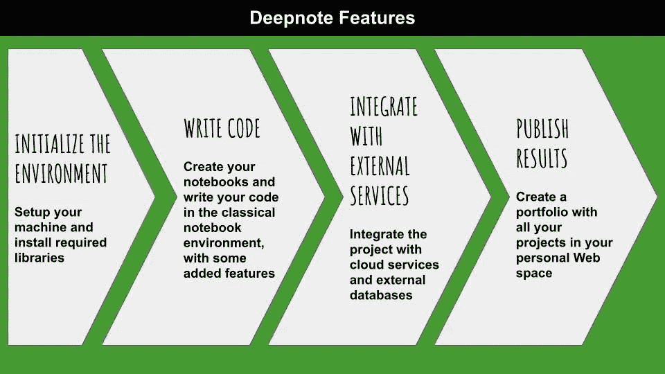
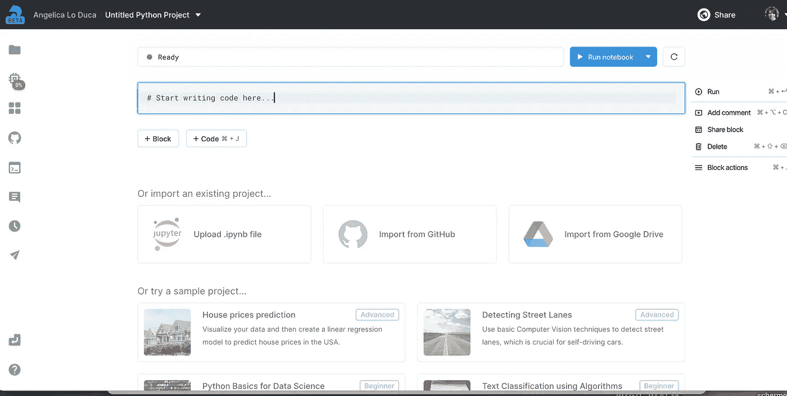
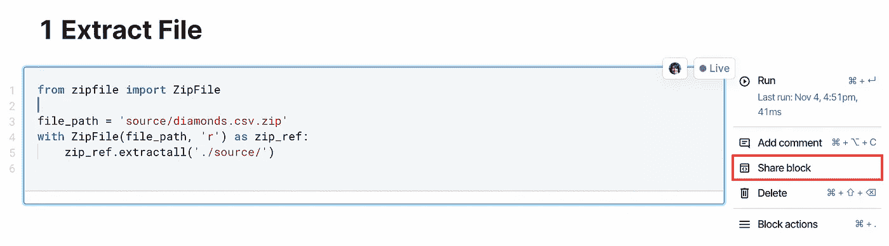
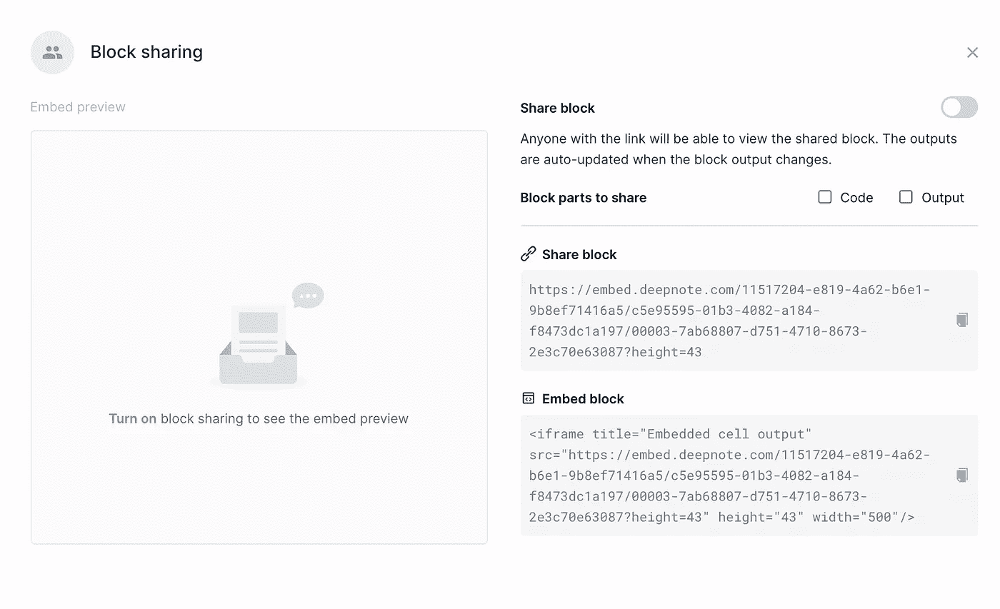
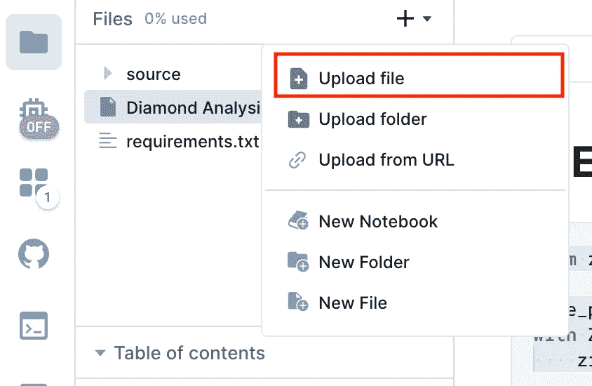
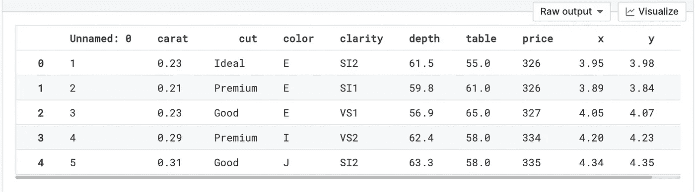
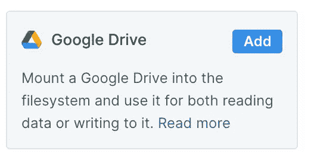
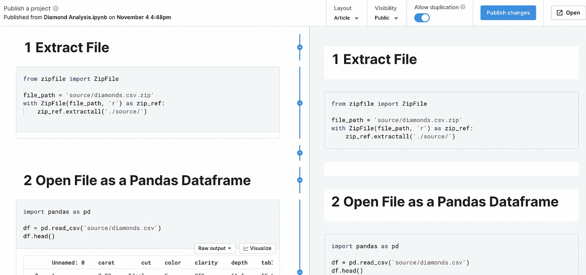
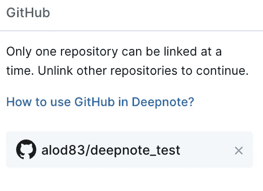

# deep note:Python 笔记本的协作框架

> 原文：<https://towardsdatascience.com/deepnote-a-collaborative-framework-for-your-python-notebooks-99390a6766e9?source=collection_archive---------14----------------------->

## 数据科学框架

## Deepnote 入门



作者图片

在我漫游各种数据科学工具和框架的过程中，我发现了 [Deepnote](https://deepnote.com/) ，一个允许你用 Python 创建和运行笔记本的在线框架。

与更著名的 Jupyterlab 和 Colab 框架相比， **Deepnote 允许你实时协作地编写 Python 笔记本。**你的合作者甚至可以评论你的代码！

**Deepnote 可以很容易地与最流行的云服务集成，比如 Google Drive 和亚马逊 S3，以及最流行的数据库，比如 PostgresSQL 和 MongoDB。**

此外，项目可以与 Github 集成，并通过网络发布，因为 Deepnote 为每个用户提供了一个专用的网页，可以用作作品集。最后，围绕 Deepnote 建立了一个伟大的社区，目前有 2000 多名成员。

Deepnote 的免费版本可以在[这个链接](https://deepnote.com/)获得。

在这篇文章中，我将给出 Deepnote 特性的概述和一个实际的用例，它展示了这个框架的一些潜力。

# **1 deep note 概述**

当你登陆 Deepnote 主页时，你可以注册一个新账户，要么使用你的 Github 账户，要么通过你的 Google 账户。注册后，您可以**启动一个新项目**，只需点击新项目按钮:


作者图片

一个新的唯一虚拟机与您的项目相关联，它对于所有协作者都是唯一的。这意味着，如果您邀请某人与您合作您的项目，他们将看到与您相同的环境。

项目的主页是一个仪表板，主页类似于其他流行的笔记本，它提供了经典的单元环境，您可以在其中编写和运行代码块或文本块:



作者图片

与其他笔记本相比，Deepnote 的新颖之处在于它提供了一些工具，这些工具有助于项目的初始化以及与其他系统的集成。


作者图片

提供的工具包括:

*   **笔记本&文件**s——文件系统目录，允许轻松浏览项目文件，创建新文件或从本地文件系统和 URL 上传文件。
*   **环境** —与项目虚拟机相关的参数。在此部分中，您可以为环境配置硬件参数、Python 版本和初始化脚本。
*   **集成** —您可以轻松配置项目与外部服务(如 Google Drive、Snoflake、SQL server 等)的集成的空间。
*   **Github** —配置到 Github 存储库的链接，以便使用它的代码并提交更改。
*   **终端** —你的虚拟机的终端。
*   **注释** —您的项目的注释列表。
*   **历史** —项目行动的日志。这个相位在和其他人一起工作时非常有用，因为它让你看到谁做了什么。
*   **发布编辑器** —编辑器，允许选择发布项目的布局并在 Web 上发布项目。目前，支持两种布局:文章和仪表板。

现在我们已经看到了 Deepnote 的概况，我们只需要用一个实际的例子来尝试一下！:)

## 1.2 块嵌入

Deepnote 允许在任何你想要的地方嵌入块单元格，只要宿主网站允许嵌入选项。这可以通过选择位于每个块单元右侧的*共享块*选项来实现。



作者图片

将打开一个新窗口，如下所示:



作者图片

您可以打开块共享，然后复制嵌入的 url。因此，您将看到您的集成块，如下所示:

您甚至可以共享块的输出，例如，您可以直接从 Deepnote 绘制结果！

# 2 用法示例

作为用例，我利用 Deepnote 为 Kaggle 上的 [diamond.csv](https://www.kaggle.com/soumenksarker/regression-types-and-stats-in-depth/data) 数据集构建了一个线性回归模型。原始数据集是以压缩文件的形式提供的，因此，为了展示 Deepnote 的潜力，我没有提前解压缩它。一旦训练好了模型，我就计算一些指标，并把它们作为 json 保存在 Google Drive 中。最后，我在我的 Web 个人资料中发布项目。

## 2.1 环境设置

首先，我将压缩的数据集上传到 Deepnote。在*笔记本&文件*菜单项中，我创建一个名为 *source* 的新目录，并在其中上传数据集。



作者图片

在创建一个新的笔记本之前，我创建了一个名为`requirements.txt,`的新文件，它将包含我的项目所需的所有 Python 库，每行一个。在我的例子中，只有一个必需的库，名为`zipfile36`，它将用于从压缩文件中提取 CSV。我发现了这个有趣的 Python 库，这要感谢 [Swathi Arun](https://medium.com/u/d98483189776?source=post_page-----99390a6766e9--------------------------------) 写的一篇有趣的文章，题为 [10 个奇妙的 Python 包](https://levelup.gitconnected.com/10-fantastic-python-packages-af2a16a1183a)。你可以在我的 [Python 库列表](https://alod83.medium.com/list/python-libraries-c8e526c4c8d2)中找到其他有趣的 Python 库。

为了安装所需的库，我转到环境菜单项，并选择 Python 3.8 作为我的 Python 版本。此外，我点击`init.ipynb`笔记本并运行它。该笔记本安装了包含在`requirements.txt`文件中的所有库。

现在准备写回归分析的笔记本了。

## 2.2 加载数据集

在我工作空间的主目录中，我创建了一个新的笔记本，并将其命名为线性回归示例。

首先，我通过`zipfile36`库提取数据集，并将其存储在源目录中:

注意，我使用了 Deepnote 的嵌入选项:)

我运行这个单元，在源目录中创建了`diamond.csv`文件。现在我可以把它作为一个熊猫数据框来加载。Pandas 已经安装在 Deepnote 中，因此我不必将它包含在我的`requirements.txt`文件中。

datafame 预览的格式非常好。通过点击位于数据框预览右上角的*可视化*按钮，甚至可以进行一些初步的数据探索:



作者图片

单击 Visualize 按钮会在笔记本中打开一个小仪表板，允许选择两列并以图表形式显示它们(条形图、折线图、面积图、点图)。下图显示了一个图形示例:

## 2.3 模型培训和评估

现在，我可以编写经典代码来构建线性回归模型。我利用了 Deepnote 中已经有的`scikit-learn`库。

本节的目标不是编写有史以来最好的模型，而是展示 Deepnote 的潜力。有关如何在`scikit-learn`中构建完整模型的更多信息，您可以阅读我以前的文章，标题为[Python 和 scikit 中的完整数据分析工作流——学习](/a-complete-data-analysis-workflow-in-python-and-scikit-learn-9a77f7c283d3)。

首先，我**将数据集分成训练集和测试集**:

然后，我建立并训练一个线性回归模型:

最后，我通过计算一些指标来评估它:

我将这些指标存储在一个名为`metrics`的字典中。

## 2.4 保存结果

最后，我将结果保存在 Google Drive 中。为了做到这一点，首先，我必须将项目连接到我的 Google Drive 文件夹。我选择*集成*菜单项，然后选择 Google Drive。



作者图片

我点击*添加*按钮，然后*授权 Google Drive* 。我还选择了一个集成名称。在我的例子中，我将输出写成集成名称。

传统的 Google Drive 授权选项卡打开，我选择我的 Google 帐户，然后继续。

最后，我点击*创建*按钮。Google Drive 现在连接到我的项目了！

Google Drive 文件系统已经挂载在`/datasets/output`目录下，可以直接在我的笔记本上使用。

我回到笔记本，将`metrics`变量保存为 Google Drive 中的 json 文件。我利用`json`库来执行这样的操作。请注意，`json`库已经安装在 Deepnote 中，因此不需要将它包含在`requirements.txt`中。

文件保存在 Google Drive 中。查看 Google Drive 文件夹，我的文件放在哪里？事实上，由于我没有指定任何特定的目录，它位于我的 Google Drive 根目录中。

## 2.4 发布笔记本

最终我可以在我的公开个人资料中发布我的项目。第一次尝试发布项目时，我必须通过设置我的用户名来设置我的公共配置文件。然后，我可以在两种布局之间进行选择:文章或仪表板:



作者图片

我点击*发布*按钮，我的项目就在我的个人资料下了。本文中展示的完整用例可以在[我的公开 Deepnote 简介](https://deepnote.com/@alod83)中获得。

我甚至可以通过点击以下按钮直接在 Deepnote 中运行整个笔记本:

[](https://deepnote.com/launch?name=LinearRegressionExample&url=https://github.com/alod83/deepnote_test/blob/master/Linear%20Regression%20Example.ipynb)

如果我在 markdown 单元格中包含了某张图片，Deepnote 会检测到它，并在我的公开个人资料中将其制作成缩略图。

# 摘要

在这篇文章中，我描述了 Deepnote，一个 Python 笔记本的协作框架。除了经典笔记本框架(如 Google Colab 和 Jupyterlab)提供的经典功能之外，Deepnote 还提供了:

*   一个**实时协作环境**，它允许你在一个运行时实例中与你的合作者一起工作
*   集成外部服务的简单方法，比如 Google Drive
*   使用所需的库和硬件功能**设置您的环境**的可能性。

如果你读到这里，对我来说，今天已经很多了。谢谢！你可以在[这篇文章](https://alod83.medium.com/which-topics-would-you-like-to-read-c68314dc6813)里读到更多关于我的内容。

# 你愿意支持我的研究吗？

你可以每月订阅几美元，并解锁无限的文章。

# 相关文章

[](/how-to-run-r-scripts-in-jupyter-15527148d2a) [## 如何在 Jupyter 中运行 R 脚本

### 关于如何在 Jupyter 中安装并运行 R 内核的简短教程

towardsdatascience.com](/how-to-run-r-scripts-in-jupyter-15527148d2a) [](/how-to-install-python-and-jupyter-notebook-onto-an-android-device-900009df743f) [## 如何在 Android 设备上安装 Python 和 Jupyter Notebook

towardsdatascience.com](/how-to-install-python-and-jupyter-notebook-onto-an-android-device-900009df743f) [](https://pub.towardsai.net/building-a-fast-interactive-dashboard-in-jupyter-through-gradio-95a1981772aa) [## 通过 Gradio 在 Jupyter 中构建快速交互式仪表板

### 关于 Gradio 的现成教程，这是一个非常强大的 Python 包，用于机器学习演示。

pub.towardsai.net](https://pub.towardsai.net/building-a-fast-interactive-dashboard-in-jupyter-through-gradio-95a1981772aa) 

# 额外奖金

Deepnote 允许将一个项目链接到公共或私有的 Github 库。如果您想包含一个公共存储库，而不是推送到它，您可以创建一个新的终端，只需在当前目录中克隆该存储库:

```
git clone <url>
```

在您的 Github 配置文件中，您可以创建一个名为`deepnote_test`的新私有存储库，并且您可以复制它的 url:

```
https://github.com/<my_user_name>/deepnote_test.git
```

如果你想推送到 Github 仓库，你必须链接它。因此，您可以打开 *Github* 菜单项并键入存储库 url。然后，你可以点击*链接到 Github 库*按钮。第一次运行这个命令时，Deepnote 会建议你安装 Github 应用。

在安装 Github 应用时，你可以选择是让 Deepnote 访问你所有的 Github 库还是只访问一个。

安装完成后，您可以再次点击*链接到 Github 库*按钮。这将打开授权选项卡。你可以点击授权。



作者图片

当这个过程完成时，Deeponote 显示存储库已经被链接。

然后，您可以打开一个新的终端并移动到 Github 存储库目录:

```
cd deepnote_test
```

从这个目录中，您可以运行传统的 git 命令，包括`push`、`pull`和`commit`。

***免责声明*** *:这不是赞助文章。我与 Deepnote 或其作者没有任何关系。这篇文章展示了该框架的一个公正的概述，旨在使数据科学工具能够为更多的人所使用。*