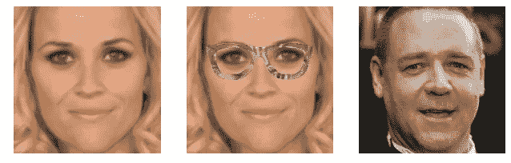

# 打败戴眼镜的老大哥:对面部识别神经网络的对抗性攻击

> 原文：<https://towardsdatascience.com/defeating-big-brother-with-glasses-an-attack-on-facial-recognition-neural-networks-1b0ccbd94fa2?source=collection_archive---------22----------------------->

## 继续阅读，了解一种打击基于深度学习的面部识别的创新方法。

斯科特·韦伯在 [Unsplash](https://unsplash.com?utm_source=medium&utm_medium=referral) 上拍摄的照片

随着深度学习技术的不断进步，图像识别系统变得越来越强大。这种能力带来了巨大的回报——帮助从 x 光诊断疾病和无人驾驶汽车只是两个例子。但是也有潜在的危害，特别是在面部识别方面。在未来，拥有最先进的面部识别技术的监控摄像头可能会出现在每个街角，有效地消除我们仍然拥有的任何隐私。幸运的是，一些研究人员已经想出了对抗基于深度学习的面部识别的方法。我想强调一种有趣的方法——使用特殊有色眼镜形式的敌对攻击来迷惑面部识别算法。

# 方法

这种方法背后的想法源于神经网络的一个已知弱点，即它们可能对输入的小扰动很弱。这意味着我可以接受一个输入(在我们的例子中，一张某人的脸的照片)，稍微修改一下，然后神经网络就不再识别这张脸了。为了成功使用这种攻击，研究人员首先必须决定一种既实用又不显眼的修改方法。为什么不显眼？避免面部识别的一个明显方法是戴上一个遮住整张脸的面具。不幸的是，街上的大多数人都不会这样做，所以戴上完整的面具会让你像一个疼痛的拇指一样突出，完全错过了不引人注意的点。这就是研究人员决定使用眼镜的原因——眼镜在公众中非常普遍，更不用说容易佩戴和制造成本低廉了。

在决定将眼镜作为对抗神经网络的对抗性攻击机制后，研究人员找到了问题的实质:弄清楚眼镜的每个像素是什么颜色。但在他们这样做之前，首先他们必须创建一个基于神经网络的面部识别系统来测试他们的攻击。他们通过使用迁移学习来做到这一点——采用一个尖端的，众所周知的开源面部识别网络(称之为网络 A ),并以此为基础训练他们自己的两个网络(称之为网络 B 和 C)。网络 B 和 C 被训练来识别一些名人，以及研究人员本身。一旦网络 B 和 C 被训练，研究人员继续开发他们的眼镜算法。

让我们在这一点上重述一下这个问题。我们有一个眼镜框，我们想以这样一种方式着色，当佩戴时，网络 B 和 C 会错误地识别人脸。从表面上看，这似乎是不可能的——眼镜框中的每个像素可以有(使用 RGB 配色方案)255 种可能的颜色。对于 224x224 的面部图像，眼镜覆盖面部的 6.5%，有 3261 个像素需要优化。换句话说，有太多的组合((255 ) ⁶)试图蛮力。幸运的是，梯度下降很好地解决了这个问题。研究人员提出的算法很简单。首先，将眼镜中的像素初始化为相同的颜色。然后，计算损失——训练集中的人脸被网络 B 和 C 正确分类的概率的归一化总和(记住，正确的分类是我们在攻击中不想要的)。接下来，获取该损失相对于眼镜中每个像素的梯度，并对每个像素进行梯度下降更新。重复这些步骤，直到误差低于某个特定数值。

瑞茜·威瑟斯彭+眼镜被误划为拉塞尔·克罗。照片来自原[纸](https://www.cs.cmu.edu/~sbhagava/papers/face-rec-ccs16.pdf)。

# 修改

这种基本算法是可行的，但研究人员做了一些修改，以使生产的眼镜更加鲁棒和实用。首先，他们意识到眼镜在现实生活中会轻微移动(例如走路时)，而不是一直停留在脸上完全相同的位置。为了解释这一点，研究人员修改了成本函数，以解释每张人脸输入图像的一系列扰动，而不仅仅是基础图像本身。

其次，他们意识到由他们的算法生产的最佳眼镜可能看起来非常奇怪。例如，一个像素可以是浅黄色，该像素右边的像素可以是深棕色，右边的像素可以是氖绿色，等等。像这样奇怪的颜色可能会引起佩戴者不必要的注意。研究人员通过在成本函数中引入平滑度标准来缓解这一问题，本质上是奖励颜色在许多像素上平滑变化而不是突然变化的眼镜。

最后，研究人员考虑了眼镜的印刷适性。典型的打印机只能打印完整 RGB 色彩空间的子集，因此奖励由可打印颜色制成的眼镜是有意义的。为此，研究人员在惩罚不可打印像素的成本函数中包含了一个“可打印性得分”。在对原始成本函数进行这三项修改(对轻微移动的鲁棒性、平滑度和可印刷性)后，研究人员得出了他们最终的实用算法。

# 结果

研究人员测试了基本算法和修改后的实用版本。对于基本算法，他们从网络 B 和 C 中随机选择 20 个人，这些网络已经被训练识别，计算每个人的最佳眼镜，并再次运行网络，看看他们是否仍然被识别。他们为测试组中的 20 个人分别拍摄了三张不同的照片。令人惊讶的是，他们达到了 100%的错误分类率，这意味着每一种眼镜都有效地愚弄了神经网络。对于实用算法，研究人员只在他们自己的照片上进行测试。在这里，结果并不完美，但仍然很好，总的错误分类率超过 95%。

然而，在我们兴奋之前，我们应该讨论几个主要问题。首先，因为测试数据极其有限，所以很难说这在实践中是否有效。此外，这些结果假设我们可以访问我们试图击败的神经网络的内部工作方式，这在现实世界中可能是不现实的，具体取决于具体情况。最后，尽管研究人员采取措施让算法生成的眼镜看起来不那么奇怪，但它们看起来仍然不像正常人会戴的东西。由于这些问题，在这种方法投入生产之前，肯定还有工作要做。

然而，我们应该为研究人员提出一种创造性的方法来对抗面部识别而鼓掌。这项研究是一个概念证明，廉价的对抗性攻击实际上是针对监控技术的。在接下来的几年里，我希望更多这样的研究能够让我们在一个不断拍照的世界里维护我们的隐私。

感谢阅读！请随时留下任何问题/评论。你可以在这里阅读原文[。](https://www.cs.cmu.edu/~sbhagava/papers/face-rec-ccs16.pdf)