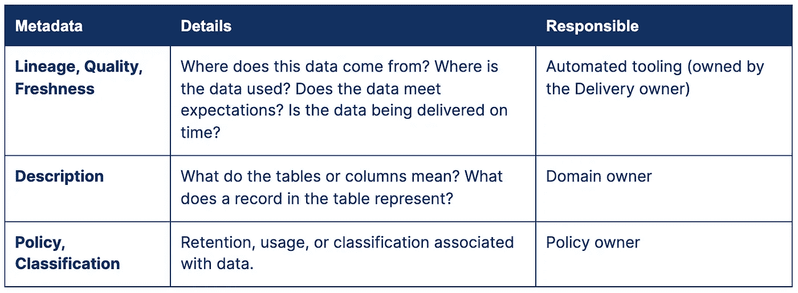

# 定义数据所有权

> 原文：<https://towardsdatascience.com/defining-data-ownership-3fbe95fd0125?source=collection_archive---------19----------------------->

## “谁是数据所有者？”了解如何定义数据所有权，以及数据目录如何帮助您记录这些信息。

[杰克·卡特](https://unsplash.com/@carterjack?utm_source=unsplash&utm_medium=referral&utm_content=creditCopyText)在 [Unsplash](https://unsplash.com/?utm_source=unsplash&utm_medium=referral&utm_content=creditCopyText) 上拍照

在本月早些时候我在[写的帖子](https://www.stemma.ai/blog/top-2-reasons-why-data-catalogs-fail)的第一段，我把数据工程师称为数据的生产者。马上就有人回复了某种程度的，“*你第一句话就把我搞糊涂了。数据工程师不可能是数据所有者。”*

显然，我惹恼了一些人，过去每当我谈到数据所有权时，我也做了同样多的事情。

假设您的公司使用 Segment 将事件从其网站发送到其数据仓库。默认情况下，每个段事件都会在仓库中创建一个表。作为数据工程师，您已经创建了一个派生视图，将所有这些事件聚合到一个表中，使其更易于访问和使用。几天后，一位分析师找到您，对您说，“这个视图不再有任何事件的最新数据。”然后问了一个可怕的问题:*“谁是老板？”*

在这种情况下，答案是显而易见的——创建这个派生视图的人，也就是您——数据工程师。

但是如果被问的问题略有不同呢:

*   网站上的什么操作触发了此事件的发生？或者，
*   *place_order* 事件有效载荷中的特定项目意味着什么？

很明显，数据工程师不能负责回答这样的问题。

**原来*谁是*数据所有者，取决于被问的*问题*。**

以下是一些常见的情况，有人可能会问所有权问题:

*   数据过时了。谁应该进行分类和修复？
*   数据是“错误的”。某些字段为空或格式不正确。
*   这个特殊的字段是什么意思？
*   这个数据可以用于一个新的 ML 模型，在网站上向不同的人显示不同的价格吗？

**最终，数据的所有权可以分为 3 类:**

1.  交付所有者 —确保特定数据按照承诺的交付 SLA 按时交付。通常，这是一个数据工程师或分析工程师，负责开发和维护产生这些数据的管道。
2.  **域所有者** —字段(或列)中的这个特定值是什么意思？这个特殊事件是什么时候触发的？通常，这是创建事件的产品工程师，或者是最频繁使用这些数据并了解数据所代表的物理现实的分析师和数据科学家。
3.  **策略所有者** —确保根据相关的分类和术语使用这些数据。有时，您从一个不应该用于某一类用例的来源获取数据。例如，YouTube 被允许向孩子们展示广告，但不允许对他们进行个性化设置。因此，如果主体是儿童，则不能使用个性化数据。打这些电话的人通常不是工程师或数据科学家，而是公司政策或隐私团队的某个人。

旁白— **质量负责人**:这可能取决于组织，但我发现人们普遍抵制对数据集的端到端质量负责。为什么？因为数据工程师不认为自己是上游应用程序产生的数据的所有者，也没有责任去寻找影响仓库中数据的网站漏洞。产品工程师没有足够的关于数据如何连接和转换到下游的上下文来拥有最终的派生数据工件作为他们的输出。随着分散数据管理(又名数据网格)被更广泛地部署，这种情况可能会改变。

有些组织倾向于建立“共享所有权”这在实践中并不奏效。我唯一一次看到它很好地工作是当在这个共享所有者组中对所有权的不同方面有一个共同的理解，并且这个组能够根据每个问题重新定向到组内的正确的人。

在实践中，数据工程师扮演的角色相当于急诊室中的分诊护士。一个问题(病人)出现了，他们就进行分类，看看发生了什么。有时这是一个他们可以解决的问题，所以他们解决了这个问题(受伤)。在其他情况下，他们重定向到适当的所有者(不同的健康从业者)。如您所见，问题(或被问及的问题)告知了谁将是所有者。

最后，不需要在这个粒度级别上为您的所有数据阐明所有权。数据和组织在不断变化，任何关于所有权的信息都必然会过时。重要的是对最重要的 20%的数据拥有高质量的细粒度所有权，并对剩余的 80%拥有良好的默认值。

组织通常使用数据目录来记录所有权信息。对于您组织中最重要的 20%数据:

# 元数据和相关所有者

作者图片:元数据和相关所有者

对于您组织中剩余的 80%的数据—自动化。频繁用户是域名所有者的一个很好的代理。此外，最后更改 ETL 代码或在 ETL 作业失败时收到警报的人是交付所有者的一个很好的代理。

所以，下一次有人问你所有权的时候，问问你自己:*你是在找交付、域还是策略所有者？*

**要阅读更多类似的帖子并保持联系，请在** [**Twitter**](http://twitter.com/mark_grover) **上关注我，或者通过订阅** [**此处**](http://stemma.ai/blog) **获得类似内容的每月简讯。**

*感谢 Chris Riccomini 审阅本文草稿。*