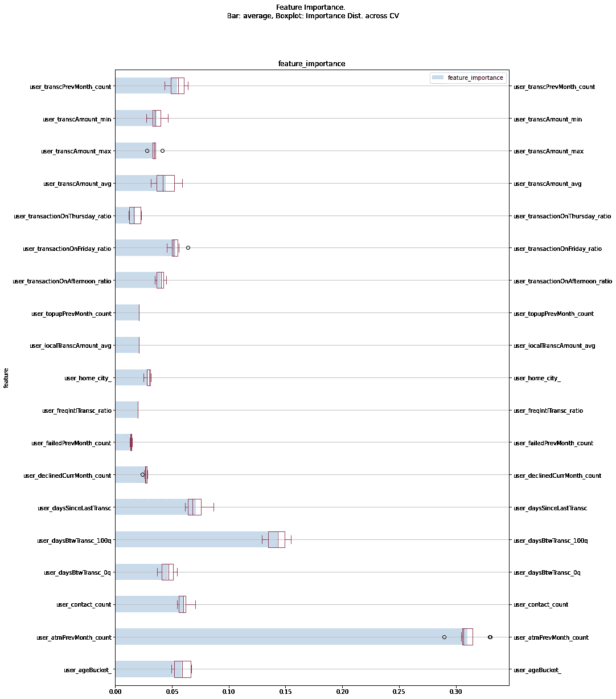

# 定义、预测和防止金融科技领域的自由用户

> 原文：<https://towardsdatascience.com/defining-predicting-and-preventing-disengaged-users-in-fintech-30dcb3bc0460?source=collection_archive---------25----------------------->

## *设计和开发机器学习模型和 AB 测试实验，以减少 FinTech 中的空闲用户*

FinTech 代表了金融业数字化转型的颠覆。像 Wise(以前称为 Transferwise)、Monzo 和其他许多初创公司都是从汇款和转账服务开始的，并发展成为无国界的数字银行。随着三星、沃尔玛和谷歌等知名企业建立了自己的电子钱包服务，金融科技领域的竞争越来越激烈。

为了在竞争中生存，金融科技机构采取了不同的策略。一些公司扩展了服务并采用加密货币，另一些公司以共生关系合作。一个例子是整合 Wise 和 Google Pay，使其用户群能够向海外汇款。就像几乎所有的 B2C 商业模式一样，一个常见的策略是通过让当前用户满意来保留用户群。

这个练习的目的是展示一个实用的机器学习方法来解决这个问题，从它的定义开始到干预。

[第一部:](#93c1)
1。[定义啮合](#74e9)
2。[预测参与度(使用 pySpark 和 Scikit-Learn 的数据管道、特征提取和模型训练)](#3fb7)
3 .[模型评估](#9218)

[第二部分](#dd5c) :
4。[设计干预(使用 ALS 的上下文推荐系统)](#82e0)
5 .[设计 A/B 测试](#12a1)T21 6。[评估和解释结果](#12a1)

# 数据和代码库

该数据是非规范化表的结构化和合成化数据集，表示金融交易中的基本信息。该数据包含每个客户在 19 个月时间范围内的详细交易日志(入站、出站、费用等)，包括交易金额、时间戳、状态以及基本人口统计和位置。这项工作的主要目标是展示解决问题的方法和途径，而不是数据本身。


原始数据:用户历史事务的非规范化表

数据、笔记本和完整的代码库可在:[https://github.com/kristiyanto/fintech-user-engagement](https://github.com/kristiyanto/fintech-user-engagement)获得。

# 第一部分:定义和预测敬业度

## 定义参与度

参与可以解释为许多不同的含义。在这种情况下，定义参与度的最常见方法之一是检查用户是否在一定时间内进行了交易。例如，参与用户是指在过去 14 天内至少使用过一次该服务的用户。

虽然更直接，但一个对所有的方法可能会错过一个特定的用户群。自然，FinTech 用户以不同的方式使用这项服务。有些人会偶尔或每月汇款给国外的家人。其他一些人可能每天用借记卡使用这项服务，或者作为商户接收汇款。


2019 年 3 月脱离的不同模式用户。每日用户比每周用户具有更低阈值

较好的方法之一是从历史数据中学习用户行为模式。计算一段时间内的总交易量，而不是交易间隔天数，可以提供更好的信号。每个人都有不同的阈值，一旦阈值被突破，用户就被标记为脱离。

在这种情况下，空闲用户是指没有进行任何超过其正常交易时间的交易的用户。例如，每月用户如果距上次交易已超过一个月，则被视为退出用户；而对于周用户，如果他们已经超过一周没有交易了。由于模式会随着时间的推移而改变，这个解决方案的另一个变体是设置截止日期(例如，只考虑最近 6 个月的数据)。

## 机器学习解释

早期检测对于确保有足够的时间进行干预至关重要。一旦用户退出，通常为时已晚。使用历史数据，我们可以训练一个机器学习模型来进行预测。有各种机器学习解释适用于这个问题，例如:

1.时间序列预测或回归:预测一个用户或一组用户在一段时间内的活动数量。生存模型或回归:在个体层面预测下一步行动何时发生
3。分类:预测用户在个人层面是否会成为辍学用户

然而，它们也有局限性:如果仅仅是为了识别异常值，那么在个体层面进行预测可能是一项艰巨的任务。同样，准确预测下一笔交易可能需要精心设计的机器学习解决方案，如深度学习(RNN/LSTM)。

在这种特殊情况下，解决方案 3 简单到足以执行和迭代。目标是预测用户下个月是否会被归类为空闲用户。该模型设计为每月运行一次，提供一个月的窗口来进行干预和评估。

```
y = end_of_month(days_between_transaction > 90_percentile_of_ days_between_transaction)y^ = next_month(y)
```

*限制*
学习用户的行为模式需要足够的信息。少于 10 个活动的用户被排除在培训和测试之外，可以设计不同的方法来解决这些用户。10 是一个任意数字，可以根据业务需求或数据(例如，人口平均值)进行调整。

## 机器学习管道


用于预测空闲用户的机器学习管道，由 Spark 和 Scikit-Learn 管道组成。

该解决方案使用两条数据管道:
a) [Spark 管道](https://spark.apache.org/docs/latest/ml-pipeline.html)用于数据摄取、清理、特征提取和数据探索。该管道的输入是原始数据文件，输出是结构化特征数据集，可用于各种下游，包括仪表板和模型训练，以及干预和 A/B 测试(手稿的第二部分)。

b) [Scikit-Learn](https://scikit-learn.org/stable/modules/compose.html) 管道，用于模型特定的数据任务。输入是特征数据(火花管道的输出)，输出是训练好的模型/预测。该管道输入特征并执行额外的数据预处理、插补、特征选择(单变量和多变量)和模型训练。

## 特征提取

虽然训练数据足够小，可以放在计算机中，但特征计算使用 pyspark 来确保管道可以在更大的规模上运行。特性在 pyspark 定制转换器中组装，并在 spark 管道中执行。

扩展 spark 自定义转换器计算特征模块。此处提供完整列表。

特征被提取到逻辑桶中(历史活动、时间和新近性、人口统计等。)，可以轻松扩展或用于其他目的，如业务洞察(BI)报告。

下面是如何组装特征提取管线的示例。这个管道的输出可以保存为一个工件，以便于部署或版本控制。

## 预处理

每个要素的预处理任务由其功能和数据类型决定。分类特征被转换成一个热编码，没有数据插补是必要的。无损数据预处理在 pyspark 中完成，以提高下游可用性(BI 或 ML)。这意味着数据以最少的插补或过滤保留了原始数据。

无损数据预处理在 pyspark 中完成，以提高下游可用性(BI 或 ML)。这意味着数据可以像原始数据一样保留，只需最少的操作，如数据插补或过滤。

仅在 ML 中使用的额外数据处理，如对数转换或标准化，是在 scikit-learn 管道中完成的(下面将详细介绍)。


特征间的相关图

这些要素中的相关矩阵提供了诊断信息，以防止可能损害模型的多重共线性。通过浏览此图表，`user_transcCurrMonth_count`似乎与许多其他特征具有中等或强相关性。这些强烈的相关性是由于诸如多少转移或总额最终反映到`user_transcCurrMonth_count`中的特征。一切都说得通。

相比之下，只有一个变量/特征`user_isDropOutCurrentMonth`与`is_dropOut_nextMonthwith` 0.97 的相关性高度相关。这种相关性表明，本月空闲的用户很可能在下个月继续空闲。因此，`user_isDropoutCurrentMonth`从功能列表中删除。这一信息还表明，早期预防至关重要；这个月的用户可能会结转到下个月的用户。

## 模型训练和基线

由于该模型计划每月以批处理模式运行，因此正向链接交叉验证是合适的，模拟了现实世界的场景。考虑到数据的大小、形状和分布，随机森林是一个很好的起点(数据探索是单独进行的，不包括在本文中)。

虽然 pyspark 内置了随机森林，但为了方便起见，模型训练使用了 scikit-learn。需要时，可以使用内置和定制的转换器将管道轻松编写为 pyspark 管道。

流水线包括额外的预处理，例如:
-对一些选择的特征执行标准化
-将一些特征转换成对数
-通过移除同质特征进行单变量特征选择
-通过使用随机森林特征选择进行多变量特征选择

随后，grid-search-cv 调整超参数，为流水线的每一步找到最佳配置。

作为基线，分层虚拟模型，基于训练标签分布随机分配预测的策略。

## 模型评估和诊断


跨交叉验证的模型性能与基线的比较。AUC 是测试集。

随机森林对训练数据的 AUC 为 0.9，对测试数据的 AUC 为 0.94。在每一次迭代中，训练和测试的差异始终很低，这表明模型没有过度拟合。随着更多数据的可用，几乎所有指标都有所改善。该模型在所有迭代中也优于基线模型。

**特征重要性**
在每次训练迭代中提取特征重要性，以了解模型如何做出决策。



上图显示`user_atmPrevMonth_count`一直被评为用户参与度的最佳预测指标之一，这表明 ATM 是这项服务的重要组成部分。

**部署策略**
py spark 和 scikit-learn 管道都可以轻松地保存为泡菜或工件。存储、版本控制和部署这些工件完全由 [MLFlow](https://www.mlflow.org) 或其他 ML 部署框架支持。

# 第二部分:设计干预和 AB 测试实验

不可能让每个人都开心。找出用户对服务满意(或不满意)的共同原因是一个巨大的探索空间。但是，我们可以改进服务的某些部分，并鼓励当前用户群充分利用提供的所有服务和产品。首先，我们将使用上一个练习中的一个见解。预测脱离的模型将上个月的 ATM 使用率列为最关键的因素。

进一步的调查显示，只有 54%的用户至少使用过一次 ATM 服务。确保用户了解并充分利用所有的服务是一件轻而易举的事。假设是增加自动取款机的使用会降低辍学率。

可能有许多不同的方法来增加 ATM 的使用率。审查、评估与 ATM 网络提供商的合作关系；旨在战略性地扩展服务
2。降低 ATM 交易手续费
3。提高对现有 ATM 服务的认识
4。为那些没有充分使用服务来过渡的人提供促销或激励

上述解决方案的任何组合都适用。然而，考虑到复杂的业务合同、成本和其他因素，解决方案 1 和 2 成本高昂，而且在投资回报方面存在风险。使用现有平台(应用程序或网络)，解决方案 3 和 4 更可行，风险很小或没有风险。

提高知名度的策略之一是*说服*用户这项服务是可用的。这可以通过广告来实现，比如电子邮件活动或应用内通知。

## 推荐系统

推荐系统在几乎所有数据驱动的公司中无处不在。推荐系统的主要目标是利用数据产生有效的推荐。有效可以转化为更个性化的建议、说明性的、有用的或这些的任意组合。

作为最活跃的研究领域之一，有许多不同的技术可用；从一行代码到复杂的火箭科学。对于这种特殊情况，该问题可以分为不同的场景:

- [基于规则/专家系统](https://en.wikipedia.org/wiki/Expert_system):比如推荐(或给予激励)每一个没有使用过 ATM 服务的人使用该服务。

- [协同过滤](https://en.wikipedia.org/wiki/Collaborative_filtering):比如经常使用纽约 ATM 机的用户，平时经常使用坎昆的 ATM 机。因此，在坎昆向纽约人推广 ATM 的使用。常见的技术有[矩阵分解](http://dl.acm.org/citation.cfm?id=1608614) (ALS，SVD，NMF)及其变体。

- [邻域/相似度](https://en.wikipedia.org/wiki/Nearest_neighbor_search):比如一个用户经常使用纽约的 ATM，那么很可能也会使用伦敦的 ATM(因为纽约和伦敦*相似*)。因此，如果他们在伦敦为这些用户做交易，就给予促销(折扣/激励)。常见的技术包括 [kmeans](https://en.wikipedia.org/wiki/K-means_clustering) 、 [LSH](https://en.wikipedia.org/wiki/Locality-sensitive_hashing) 或其他基于相似性的模型、排名或信息检索技术。

-深度学习/其他复杂模型:例如，如果用户今天在纽约使用 ATM，下一个城市很可能是华盛顿 DC。因此，如果他们在华盛顿 DC 为这些用户做交易，给予促销(折扣/激励)。常见的技术有 [LSTM](https://medium.com/decathlondevelopers/building-a-rnn-recommendation-engine-with-tensorflow-505644aa9ff3) 、 [RNN](https://dl.acm.org/doi/10.1145/3292500.3330668) 或其变体。

混合推荐系统:上述系统的任意组合。

构建推荐系统的一个挑战性方面是缩小细微差别和上下文。像这样的问题:如果有以前的数据可供学习，应该做什么(冷启动问题)，什么指标是必要的，以及我们应该如何测量它们；此指标与关键绩效指标(KPI)有何关联？如果它给出一个*不正确的*推荐怎么办？—都很难回答，因为答案没有对错之分。解决这些问题是一个独立的领域，值得单独讨论，并且需要对领域和业务模型有很好的理解。

给定可用的数据，协同过滤(选项 2)结合基于规则的推荐器(选项 1)。这种配置对于试点研究来说是合理的，执行起来也足够简单。结果可以作为未来模型或改进的基准。

## 上下文推荐系统

上下文在推荐系统中至关重要。给定一周中的某一天作为背景，我们在周一晚上消费的饮料、电影和物品可能与周五晚上不一样。添加最近、天气、地理位置、偏好或其他信息作为上下文可能会产生更个性化的推荐，唉，设计起来也更复杂。找到哪种语境是实际的需要大量的实验。

首先，我们将使用一年中的月份作为上下文。由于数据有限(没有地理数据或商家信息)，我们可以重新构建问题并缩小范围。例如:对于每个用户，排列可能使用 ATM 服务的前五个城市，并提供这些城市的促销价格。作为上下文，我们将使用一年中的月份。例如，通常在纽约使用 ATM 的用户更可能在 2 月份使用佛罗里达州的 ATM，而在 8 月份使用芝加哥的 ATM。

## 使用 ALS 设计上下文推荐

交替最小二乘(ALS)是用于协同过滤的常用技术之一。与其他协同过滤技术一样，ALS 将原始矩阵(用户和交互)分解为矩阵 U 和 V，例如两个矩阵相乘产生原始矩阵的近似。ALS 与其他 ALS 的不同之处在于 ALS 如何学习和逼近 U 和 v。

虽然其他一些算法使用梯度下降或其他方法，但 ALS 在回归问题中使用类似于普通最小二乘法(OLS)的方法。ALS 通常对有噪声的数据表现更好，比如推断排名时(隐式排名)。ALS 学习方式的简单解释:

1.  它从伪随机初始化 U 和 V 开始。
2.  通过对矩阵 V 中的每一行执行 OLS 变换来学习矩阵 V，其中每一行作为特征，并且来自原始矩阵的其对应的列向量作为标签。
3.  类似于步骤 2；除了我们用矩阵 V 中的列向量作为特征，用原始矩阵中的相应行作为标签。
4.  迭代直到收敛或达到最大迭代次数。

Spark ML 提供了 ALS，所以我们不必从头开始实现算法。此外，协同过滤会产生大而稀疏的矩阵，spark ML 可以轻松扩展。


使用 ALS 的上下文推荐器的特征

与其他协同过滤技术类似，ALS 将用户和交互作为输入。添加上下文的一种可能方法是简单地将交互分成不同的上下文。对于大范围的上下文，不建议使用这种方法，因为它会进一步增加大小和稀疏性。

通过比较原始矩阵和重建矩阵来评估 ALS。可以通过测量平均绝对差(MAE)或误差的均方根(RMSE)来计算比较，以惩罚大的误差。这个练习的 ALS 模型产生 RMSE: 2.4，MAE: 1.8。

pyspark 管道上使用 ALS 的上下文推荐器

## 设计 A/B 测试

在科学研究(通常称为随机对照试验，RCT)和工业中，A/B 测试是研究因果关系的黄金标准方法。一般来说，A/B 测试包括:
1。随机分割一群人
2。在一段时间内对其中一组进行治疗
3。评估各组之间的结果是否有差异
4。决定下一步


A/B 测试设计-包含和群组分裂

对于上面的每一步，都有许多不同的技术和场景需要考虑:

## 步骤 1:群组选择

**问:谁是合格用户？**
答:在这种背景下，只有防止处于退学边缘的用户才有意义。向所有人返还现金可能会损害收入，而且向不再使用这项服务的用户提供奖励也没有意义。在这种情况下，我们只考虑被预测为退出用户的用户和在过去 60 天内仍在使用该服务至少一次的用户。

**问:这项研究需要多少用户？**
答:在进行研究之前，可以使用[功效分析](https://en.wikipedia.org/wiki/Power_of_a_test)计算样本数。计算需要:
a)两个群组的度量(例如，退出用户的总数)
b)组 B 的预期差异百分比，以及错误率
c)α(1 型错误/假阳性率，通常为 5%或更低)，以及
d)功效(2 型错误/假阴性率，理想情况下为 80%或更高)。
参数 b、c 和 d 可以调整，结果越明确，通常需要的样本量就越大。

关于功耗分析的更多详细信息可在[这里](https://emj.bmj.com/content/20/5/453)获得。

**问:如何确保 A 组和 B 组具有可比性？**
答:技术之一是进行分层随机抽样。可以基于用户的人口统计、地理或其他数据点，尤其是可疑的混淆因素来决定阶层。
还需要对样本大小、阶层分布和 KPIs 测量指标进行测试(参数或非参数),以确保两组相似。

出生年份和设备的分层随机抽样

关于如何设计队列规模和选择的更深入的文章可在[此处](https://www.ncbi.nlm.nih.gov/pmc/articles/PMC2267325/)获得。

## 第二步:实验

**问:不同的团队需要做哪些不同的事情？**
答:对照组(A 组)不需要做任何事情，除了记录指标。


八月份对治疗组参与者的个性化建议。每个参与者都被分配了个性化的促销城市，他们在该月最有可能使用 ATM 服务。

对于治疗组(B 组)，在特定的时间间隔给出宣传消息(电子邮件或推送通知)。推荐系统根据历史数据和一年中的月份为每个人生成个性化的城市列表。用户被给予促销费率，这是研究期间在这些城市进行的 ATM 交易的免费(以返现的形式)。

值得注意的是，这种返现可能会在结果中产生混淆因素，即当用户仅仅因为奖励而渴望使用 ATM 时。可能需要进行后续研究(返现与不返现)来评估这一因素。一个实际的例子是对这个群体进行 A/A 测试，以比较推广期之前(有返现)和之后(没有奖励)，看是否有任何显著差异。

**问:研究需要进行多长时间？答:对此没有灵丹妙药。合理的期限应该足够长，以评估行为的转变。在这种情况下，由于模型和 KPI 是按月计算的，因此研究可以进行一个季度。**

## 步骤 3:结果和评估

**问:我们如何知道研究是否成功？**
答:需要在研究之前预先定义一个指标。在这种情况下，每个群组的辍学用户数量。步骤 A 确保在调查之前指标是可比较的。在研究期间，定期记录或计算指标(例如，每天或每周)。在研究结束时，使用统计方法对这些指标进行评估(例如，如果指标呈正态分布，则使用[配对 t 检验](https://www.ncbi.nlm.nih.gov/pmc/articles/PMC4667138/)或 [Wilcoxon 秩和检验](https://www.ncbi.nlm.nih.gov/pmc/articles/PMC4125590/)，否则使用回归分析来研究每个变量的相互作用)。这些统计分析总结了研究结果。

## 步骤 4:后续行动

问:如果研究失败了怎么办？
答:失败的研究——即对照组和治疗组之间没有不同的变化——是正常的，即使每个步骤都完美地执行了。由此产生的数据可以提供更好的线索，提出更好的假设可能提供有价值的指针，例如，是否需要更长的研究周期。

**问:如果研究成功，该怎么办？** 答:从分析中获得的洞察力可以作为促进组织变革的输入。分解成组、地理位置或其他逻辑类别可能揭示有价值的洞察力，这提供了使产品更好的声音证据。还可以进行额外的和后续的研究，以进一步改进产品。

数据、笔记本和完整的代码库可在:[https://github.com/kristiyanto/fintech-user-engagement](https://github.com/kristiyanto/fintech-user-engagement)获得。