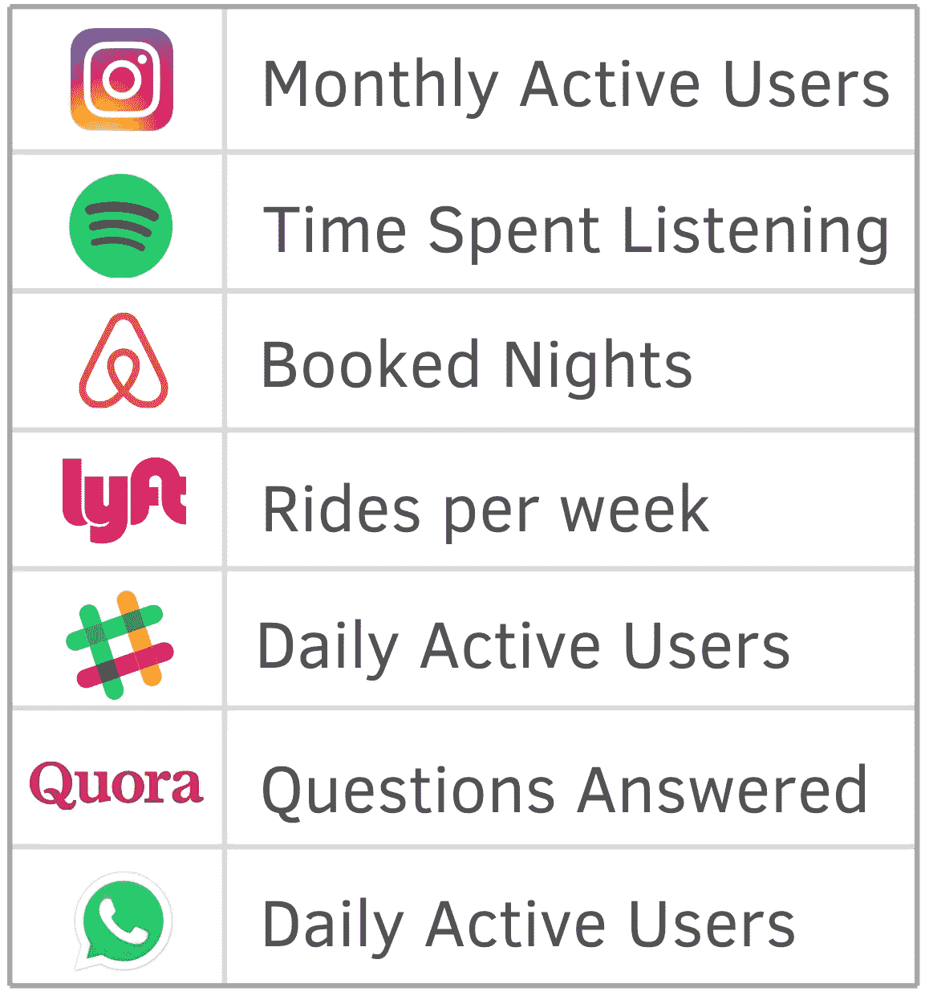

# 定义产品指标—终极指南[第 1 部分，共 2 部分]

> 原文：<https://towardsdatascience.com/defining-product-metrics-the-ultimate-guide-part-1-of-2-585b8c63fcef?source=collection_archive---------1----------------------->

## 闯入 FAANG 的数据科学访谈系列

# 动机

作为一名数据科学家，您既是公司指标的策划者，也是把关者。你的公司所做的每一个决定都是为这些标准服务的。

这就是为什么制定正确的*指标至关重要。*

这也是为什么在数据科学面试中指标定义问题出现得如此频繁。这些问题测试你理解产品目标的能力，追踪用户使用该产品的过程，并将目标和过程映射到一组可量化的措施，通常称为指标。

这是帮助您回答度量定义问题的两篇文章中的第一篇。在本文中，我们将了解:

1.  **什么是公制**
2.  **三类指标**
3.  **什么是好的指标**
4.  **如何提出衡量标准**

# **什么是度量标准？**

授权 Hani Azam 使用 Adobe Stock 提供的图片

产品指标是公司用来决定做什么、如何做以及跟踪他们做得如何的量化数据点。

1.  **做什么:**2004 年 Lyft 推出 Lyft 系列。是什么促使他们决定扩展拼车服务？也许 Lyft 有一个类似于*每天运送的总人数*的指标。如果 Lyft 正在为此指标进行优化，那么扩展到 Lyft Line 将是一个不错的选择——拼车增加了每次*乘车*运送的总人数(更不用说每天*运送的总人数*)。关注这一指标还可以让 Lyfts 的设计师、工程师和数据科学家团队团结在一个共同的目标周围。指标有助于公司明确、协调和优先考虑要建立的东西。
2.  **怎么做:**为什么我们要在 Youtube 上花上几个小时看令人麻木的视频？也许 Youtube 有一个衡量每个用户在平台上花费时间的指标。如果 Youtube 的推荐算法针对这一指标进行了优化，那么它自然会显示人们可能会花更多时间观看的无意识和令人上瘾的内容。相反，如果 Youtube 有一个衡量每个用户观看历史视频的时间的指标，YouTube 的用户体验将会与今天大不相同。一旦公司确定了构建产品的优先级，度量标准就可以帮助他们决定如何构建产品。
3.  他们做得有多好:2016 年，Snapchat 收购了 Bitmoji，押注它将帮助用户在平台上更好地表达自己。Snapchat 如何确定他们的赌注是否正确？Snapchat 可能有一个关于*的指标，即用户一天内创建的故事数量*。他们可能假设，如果用户能够更好地用 bitmojis 表达自己，这将激励他们每天创造更多的故事。整合 bitmojis 后，用户创建的故事数量增加，这可能表明 Snapchats 赌博证明是多么有益。**指标帮助公司确定他们有多成功*和*让他们对结果负责。**

# **三种类型的指标**

*亚马逊是一个由买家和卖家组成的在线跨国市场。他们很可能有大规模的营销活动，致力于鼓励新企业加入他们的平台。下面是一个假想的例子，展示了这种活动的漏斗可能是什么样子。*

由作者在[异想天开](https://whimsical.com/)中制作

## **1。北极星**

这是衡量一家公司成功的最重要的标准。北极星的公制(NSM)应为:

*   公司使命的直接反映
*   衡量一家公司如何为客户带来价值的指标。
*   独一无二的。避免拥有多个 nsm，因为这往往会造成复杂性和混乱
*   以下问题的答案:****哪一个*** *指标最能代表贵公司的* ***期望*** ***结果*** *？**

*在上图中，亚马逊漏斗的每一步都有自己的衡量标准。有这么多指标要跟踪，我们如何选择一个单一的 NSM？答案就在亚马逊的使命中:通过网上和实体店服务消费者，关注选择、价格和便利因此，亚马逊的使命是通过满足消费者的需求来服务顾客。完成的一个代表是购买的完成。考虑到这一点，亚马逊 NSM 的一个很好的候选者可能是每个用户的购买数量(T42)。
以下是其他几家公司的潜在 NSMs 浏览一下列表，看看您能否合理解释与每家公司相关的指标:*

**

*由作者在 [Canva](https://www.canva.com/) 中制作*

> ***提示** : [这里的](https://amplitude.com/blog/product-north-star-metric)是从声名狼藉的莱尼·拉奇斯基那里深入探究北极星度量的绝佳资源。*

## ***2。主要/目标指标***

***主要指标描述了特定*产品*、*团队*或*计划*的预期结果。**这与 NSM 不同，后者代表了*公司*整体的预期结果。考虑上面例子中的亚马逊营销团队。他们的目标是通过增加平台上优质卖家的供给来满足消费者需求。鉴于这一目标，营销团队主要指标的一个很好的候选指标可能是通过电子邮件联系加入平台的高质量卖家的数量*。**

**从短期来看，主要指标可能比 NSM 更有价值，因为它的关注点更窄，反馈回路更紧密，与特定产品、团队或相关计划的关联更直接。此外，主要指标最终会进入 NSM。**

## ****3。支持/跟踪/输入指标****

**支持指标是表明 NSM(或主要指标)正朝着正确方向发展的*指标。在亚马逊电子邮件营销示例中，发送的电子邮件数量、打开电子邮件的人数以及在平台上注册销售的商家数量都是支持指标。支持性指标作为 NSM 的*输入*，并与其值直接相关。***

*作为 NSM 的先行指标，它们特别有用，也就是说，在你的 NSM 实际变化之前，让你知道你的 NSM 将如何变化。在亚马逊的例子中，高邮件打开率将与大量高质量的卖家加入平台相关联(并且先于他们)。*

*它们还会告诉你，你移动 NSM 的努力可能会在哪些方面有所欠缺。以亚马逊为例，如果你每天发送 1000 封邮件，但只有 10 封被打开，那么你的邮件质量可能需要改进。相反，如果你一天发 10 封邮件，而这 10 封邮件都被打开了，显然你发的邮件不够多。*

## ***4。计数器规格/护栏***

***计数器指标代表企业关心的其他结果，这些结果可能会受到主指标(或 NSM)** 正面变化的*负面*。它们充当*护栏*。它们的存在是为了确保在追求你的主要指标时，你不会对业务的其他方面造成损害。例如，如果您的主要指标侧重于产品数量，您的护栏指标可能围绕产品质量。在亚马逊电子邮件营销示例中，响应主要指标的护栏可能是用户一天的平均购买次数。这个护栏确保了主要指标优化的卖家的涌入不会导致消费者被选择淹没，以至于他们最终什么都不买。*

# *什么是好的衡量标准？*

****好的度量标准应该是有意义的、可测量的和可移动的。****

## ***1。有意义:***

***如果指标反映了产品的*预期* *结果*，则该指标是有意义的。**和*预期结果*应反映公司打算为其客户创造价值的方式(基于公司的*使命*)。*

> ***提示:**这是北极星和初级指标特有的。*

*通过确保你的衡量标准集中在结果上，你可以避免以虚荣的衡量标准告终。*

*Quora 使用推送通知来提醒用户什么时候最适合回答问题。然而，用户点击通知并打开应用程序的次数是一个**虚荣指标**。看到开放率上升可能会让 Quora 感觉良好。但是 Quora 并没有发布推送通知来推动打开率。他们想要的 ***结果*** 是在他们的平台上获得高质量的问题答案。因此，面向 ***结果*的指标**将关注回答率，而不是打开率。*

*通过确保你的指标集中在一个期望的结果上，你可以避免以一个不相关的指标结束。*

*考虑前面的亚马逊例子。为什么我们决定将*高质量*卖家的数量作为我们的主要衡量标准？毕竟，T2 在亚马逊上注册的新卖家总数也将是一个结果。但是这是 T4 想要的结果吗？记住，亚马逊的使命是“服务消费者……”。专注于增加卖家的整体数量有在这个过程中获得低质量卖家的风险。这将损害消费者的体验。然而，一个关于增加高质量卖家数量的指标是一个更相关的指标。它专注于创造更好的消费者体验，从而支持服务消费者的*预期*结果。*

## ***2。可测量:***

***为了确保你的指标是可衡量的，把它转换成一个公式，并在公式中尽可能精确。**公式的每个组成部分都应该是一个数据点，您可以以很高的可信度和精确度收集这些数据。**记得给你的指标添加一个时间框架。***

*Snapchats 的使命是让人们能够表达自己……'。但是“用户表达自己的能力”并不是一个很好的衡量标准。很难衡量。你可以试着测量一下。例如，您可以创建一个调查。但是你会遇到两个问题:*

1.  *你不能强迫用户完成调查*
2.  *用户感觉他们能够表达自己的程度是主观的。这导致收集的数据不一致。*

*一个更好的指标是:每个用户每天创建的平均故事数=一天创建的故事数/一天的活跃用户总数*

> ***提示:**即使你的时间框架是一天，就像每个用户每天创建的故事的平均数量一样，最好将这个平均值跨越 30 天，而不是一天，以消除波动性。*

## ***3。可移动:***

*当企业采取措施改变指标时，指标的值应该能够改变。跟踪不受您控制的指标是没有价值的。例如，人们等待网页加载的时间已经被证明对用户的体验有很大的影响。如果谷歌的搜索结果需要整整一分钟才能加载，那么“谷歌 it”将不再是一个动词。因此，努力提高网页的性能符合公司的最大利益(如 [Pinterest](https://medium.com/pinterest-engineering/driving-user-growth-with-performance-improvements-cfc50dafadd7) )。捕捉这些改进的一个指标可能是页面加载时间。这是用户单击链接或在浏览器中键入 URL 与页面呈现给用户之间的时间差。然而，根据用户自己的互联网速度和带宽，页面加载时间会有很大的不同。这是公司无法控制的两个因素。一个更好的衡量标准不是衡量端到端的页面加载时间，而是只关注页面加载时间的*部分*——公司实际上可以采取措施改善的部分。*

## *指标还应该包括其他一些内容:*

1.  ***有一个紧密的反馈回路**:除了可*移动*之外，指标应该快速*移动*——影响指标的行动应该(几乎)*立即*可观察到。例如，Coursera 是一个在线教育平台，提供包月服务。如果他们发布一个新功能的最终目标是提高用户保留率，他们将不得不等待整整一个月，等待下一个订阅周期，看看有多少用户被保留。一个更好的选择是找到一个与保留相关的更直接的代理。例如，Coursera 可能会关注每日活跃用户——如果每日活跃用户增加，这将表明更多的人正在从平台上发现价值，并且在月底不太可能流失。最棒的是，你不必等到月底才能看到你的努力对每日活跃用户的影响。*
2.  ***可解释:**指标应该简单易懂。度量标准的作用是围绕一个特定的目标来调整团队，以便他们可以采取正确的步骤来实现该目标。如果人们不能理解这个指标，他们就不能采取正确的步骤来优化它。例如，Youtube 可能想要衡量其用户如何参与 YouTube 的视频。一个度量可以是每个用户的观看时间、评论、喜欢、分享的加权组合的中值(每个动作基于其重要性具有不同的权重)。虽然这可能更准确，但也过于复杂。一个更简单的选项可能只是每个用户的平均观看时间。*
3.  ***不可博弈:**当一家公司可以采取行动改变指标而不产生(或以牺牲)实际价值时，指标就是可博弈的。2016 年，富国银行的盈利报告称，他们的目标是建立长期的零售银行业务关系。同年，他们支付了 1 . 85 亿美元来解决洛杉矶监管机构提起的诉讼。为什么？富国银行打赌说，客户在他们银行开立的账户越多，客户和富国银行的关系就越牢固、越深入。很合理。除了这样一个事实，员工们变得如此专注于这个指标，以至于他们代表*(并且在不知情和未经同意的情况下)*客户开立了 350 万个账户。衡量标准是公司目标价值的代表。将指标与价值分离会导致不良激励和不必要的游戏化。*

# *提出衡量标准*

*到目前为止，我们已经讨论了为什么指标很重要，现有的不同类型的指标，以及什么是好的指标。但是你实际上是如何提出度量标准的呢？*

***定义您的主要指标非常简单。确定所讨论的产品、功能或项目的预期结果(牢记公司的使命)。将这个期望的结果映射到一个有意义的*、*可测量的*和*可移动的*的指标上。****

****支持和计数器指标稍微复杂一些。有如此多的选择，你会很快发现自己迷失在一个充满可能性的虫洞中。但是您可能已经注意到了，到目前为止我们讨论的所有指标都有一个共同点。打开的电子邮件数量、完成的注册数量、回答的问题数量、在平台上花费的时间。**它们都是用户可以采取**的*动作*的表示。因此，得出这些指标的最好方法是追踪用户使用你的产品的过程。集体讨论用户可能采取的每一步行动，并将每个行动转化为指标。****

**分解用户旅程的一种常见方法是由 Dave McClure 引入的 AARRR(或盗版度量)框架。它通过获取、激活、保留、推荐和收入来细分用户旅程。我稍微调整了一下框架，从 AARRR 改为 AAAERRR:**

1.  ****认知度:**有多少人知道你的品牌存在？**
2.  ****收购:**有多少人在和你的产品互动？**
3.  ****激活:**有多少人在意识到你产品的价值？**
4.  ****参与度:**用户参与度的广度和频率如何？**
5.  ****收入:**有多少人在为你的产品付费？**
6.  ****保留/更新:**你的员工多久回来一次？**
7.  ****推荐:**有多少客户正在成为拥护者？**

> ****提示:**漏斗的某些阶段可能不适用于您感兴趣的特定产品。没关系。如果不适合，就不要勉强。**

****

**由作者在[异想天开](https://whimsical.com/)中制作**

**AAERRR 可能看起来要记很多东西。但是当我们深入研究时，你会发现它非常直观——事实上，它很像坠入爱河！**

## ****1。意识:****

**有多少人知道你的品牌存在？**

> ****约会类比:**在有人能爱上你之前，需要知道你的存在。**

**如果人们不知道你的产品的存在，他们就不能使用它。一个公司通过营销所做的一切都是为了提高他们产品的知名度。**

**如果你的目标受众路过一个印有你的标志的标牌，并且他们能够将这个标志与你的公司联系起来，那么他们就会意识到。虽然这种相互作用很难测量，但有一些事情*可以*测量，包括:**

*****认知度指标:*** *网站访问量、社交媒体指标(点赞数、分享数、浏览量、到达数)、网站停留时间、电子邮件打开率***

## ****2。采集:****

**有多少人在与你的产品互动？**

> **D **打个比方:**一旦你渴望的对象知道你的存在，他们似乎有兴趣了解你更多吗？他们给你电话号码了吗？在 Insta 上关注你？**

**一旦你的目标受众知道你的存在，他们会采取措施与你的产品互动吗？他们创建账户了吗？注册一个邮件列表？报名参加试验？**

**在市场营销中，获取的圣杯是捕捉 ***线索*** 。线索是任何潜在的*用户，他们的信息是你能够以某种形式捕捉到的。例如，在注册您的邮件列表时向您提供电子邮件地址的人被视为潜在客户。当他们除了向你提供他们的信息之外，还对你的产品表现出额外的兴趣时，一个销售线索就变成了一个合格的销售线索。例如，除了注册您的邮件列表，他们还会观看网络研讨会或注册演示 ***。******

****获取指标:*** *潜在客户数量、合格潜在客户数量、注册、下载、安装、聊天机器人互动**

## *3.激活:*

*有多少人意识到了你产品的价值？*

> *D **阿廷比喻:**难以捉摸的火花。不管是第一次约会还是第五次约会。这是你意识到你见到的那个人有多特别的时刻。当你意识到你想要的不仅仅是一时的放纵。当你意识到你已经准备好成为唯一的时候。*

*这也被称为“啊哈”时刻。根据 Mode Analytics 的 Benn Stancil 的说法，这是将发现你的产品有价值的客户与没有发现你的产品有价值的客户区分开来的一系列行动。*

**

*作者在 [Canva](https://www.canva.com/) 中制作——灵感来自[振幅](https://apptimize.com/blog/2016/02/this-is-how-you-find-your-apps-aha-moment/)*

*拿 Dropbox 来说。他们的激活指标是在一个设备的一个 dropbox 文件夹中存储了*至少一个文件的用户数量。这是有道理的。如果用户从未在 Dropbox 文件夹中存储过文件，他们会认识到产品的真正价值吗？即使他们已经创建了一个帐户，打开了应用程序，通读了教程。**如果他们从不费心去迈出最重要的一步，他们怎么会理解 Dropbox 所能提供的价值。他们为什么会成为*用户*？****

*当激活障碍被跨越时，个人就从未知实体变成了实际用户。*

****激活指标:*** *建立的连接数、执行操作的次数、完成的步骤数**

> ****提示*** :激活指标比其他指标稍微复杂一些。他们很大程度上依赖于所讨论的产品。它们通常以在 y 天内采取 x 次动作的形式出现。*

## *4.订婚:*

**用户参与的广度和频率如何？**

> *打个比方:现在你们只是单独见面，你们的关系会是怎样的？你们每天都在一起吗？(可能有点不健康，但是很好)。你们在一起的时候都做些什么？你在看网飞吗？做饭吗？去度假吗？*

*现在你有了一个用户，你需要了解他们的使用情况。这包括两个部分，它们使用的深度和它们使用的广度。*

***深度是指使用频率。他们使用你的产品的频率如何？它是高于还是低于平均用户频率？***

***广度是指它们使用的多样性。**如果在您的产品中可以采取多种行动，他们是否执行了所有可能的行动？他们是否偏爱某些人？如果你有多种产品呢？他们正在使用所有的吗？*

****参与度指标:*** *日活跃用户、周活跃用户和月活跃用户、会话时长、会话频率、对产品采取的操作**

## *5.收入:*

*有多少人在为你的产品付费？*

> *D **阿廷比喻:**的承诺。神奇的话语。“你愿意..”和“我愿意”。*

*用户很好，但付费用户更好。对于一些公司来说，不先付费就不能成为用户。但也有许多公司致力于从免费增值或试用到付费的转换模式。SaaS 的企业从订阅中获得收入，而市场则是按交易收取佣金。用户向你付费的方式会因你的业务类型而异。了解公司的收入模式很重要，因为这将影响他们跟踪的收入指标。*

*但是请记住，一个企业应该优化他们给客户带来的价值，而不是他们创造的收入。而且，如果他们的客户从业务中获得了很多价值，支付意愿将是一个自然的副产品。*

****收入指标:*** *%的付费客户；每个客户的平均收入；试用到付费客户的转化率；完成的交易数量；购物车废弃率；广告指标，如点击率和转换率(对基于广告的业务至关重要)**

## *6.保留:*

**有多少用户会再次使用你的产品？**

> *与传统观念相反，婚姻并不是牢不可破的纽带。离婚永远是一种选择。一个你想不惜一切代价避免的选择。*

*有多少用户会回到你的产品上？他们多久回来一次？对于电子商务平台，这可能是用户回来购物的频率。对于社交媒体产品，它指的是用户回到应用程序的频率。*

*用户回到平台的频率取决于产品。涡轮税一年用一次，Spotify 一天用一次。理解你的产品应该使用的节奏是至关重要的。这将允许你跟踪正确的度量标准，并确定你的产品是*粘性*还是你的用户是*搅动*。*

*保持不仅是一个很好的衡量你的产品给你的用户带来了多少价值，也是你在营销中可以节省多少钱。获得新客户的成本可能是留住现有客户的五倍。*

****留存指标:*** *【每天、每月、每年回到您平台的用户百分比；流失率；客户终身价值**

## *7.推荐:*

**有多少客户正在成为拥护者？**

> *打个比方:我并不精彩的爱情生活使我没有资格谈论这个。*

*你的用户对你的产品如此着迷，以至于他们想让全世界都知道它吗？类似于保留，转介不仅可以表明你的产品是多么取悦你的客户，也反映了你在营销上节省了多少钱。口碑是一个强大的工具。这就是朋友推荐一家餐馆和你在 Yelp 上看到它的广告之间的区别。来自你信任的人的推荐信的力量胜过了(通常是不受欢迎的)广告的侵扰。*

****推荐指标:*** [*净推荐人得分*](https://www.netpromoter.com/know/) ，[病毒系数](https://www.questionpro.com/blog/viral-coefficient/)即你的用户推荐你的平均人数*

# *接下来呢？*

*数据科学指标定义问题有两种形式:*

1.  *您如何定义该产品/功能的指标*
2.  *您如何衡量该产品/功能的成功*

*通过这篇文章，你应该很好地掌握了回答这些问题所需的理论。在下一篇文章中，我们将介绍执行。我将概述一个你可以用来组织你的答案的框架，以及一个帮助你实现这个框架的例子。*

*这是更大的 [**数据科学面试备考系列**](https://azamhani95.medium.com/) 的一部分。在每篇文章中，我都会围绕机器学习、产品商业意识、统计概率和 SQL，深入*和*面试问题。*

*我还将分享我的个人经历，包括**我是如何进入数据科学的，我的工资**和**我是如何管理我的财务的，以及我最喜欢的学习和灵感资源。您可以通过在[媒体](https://medium.com/@azamhani95)上关注**我来了解最新消息。*

*如果你想联系我，你可以[在 LinkedIn](https://www.linkedin.com/in/hani-azam-6b5642187/) 或 [Twitter](https://twitter.com/iamhaniazam) 或[直接给我发邮件](mailto:datasciencehani@gmail.com)找到我。*