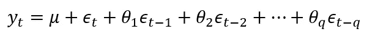
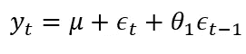
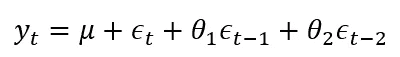
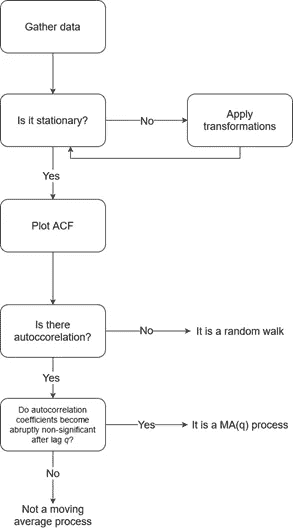
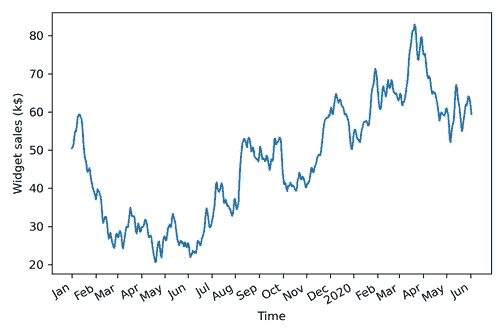
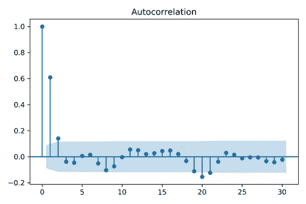

# 用 Python 定义时间序列预测的移动平均模型

> 原文：<https://towardsdatascience.com/defining-the-moving-average-model-for-time-series-forecasting-in-python-626781db2502?source=collection_archive---------5----------------------->

## 探索移动平均模型，并了解我们如何使用 ACF 图为我们的时间序列确定正确的 MA(q)模型


Pawel Czerwinski 在 [Unsplash](https://unsplash.com?utm_source=medium&utm_medium=referral) 上的照片

时间序列预测的基本模型之一是移动平均模型，表示为 MA(q)。这是一个基本的统计模型，是更复杂的模型，如 ARMA，ARIMA，SARIMA 和 SARIMAX 模型的基础。因此，在使用更复杂的模型预测复杂的时间序列之前，对 MA(q)的深入理解是关键的一步。

在本文中，我们首先定义移动平均线过程，并探讨其内部工作原理。然后，我们使用数据集来应用我们的知识，并使用 ACF 图来确定 MA(q)模型的阶数。

> 这篇文章是我即将出版的新书《Python 中的时间序列预测[的节选。如果您有兴趣了解更多关于时间序列预测的信息，通过应用场景使用统计和深度学习模型，您可以在这里了解更多](https://www.manning.com/books/time-series-forecasting-in-python-book?utm_source=marcopeix&utm_medium=affiliate&utm_campaign=book_peixeiro_time_10_21_21&a_aid=marcopeix&a_bid=8db7704f)。

# 先决条件

你可以在这里抓取数据集[。请注意，数据是合成的，因为我们很少观察到可以用纯移动平均过程建模的真实时间序列。因此，该数据集用于学习目的。](https://github.com/marcopeix/TimeSeriesForecastingInPython/tree/master/CH04/data)

完整的源代码可在[这里](https://github.com/marcopeix/TimeSeriesForecastingInPython/tree/master/CH04)获得。

# 定义移动平均过程

移动平均过程或移动平均模型表明，当前值线性依赖于当前和过去的误差项。同样，假设误差项相互独立且呈正态分布，就像白噪声一样。

移动平均模型被表示为 MA(q ),其中 *q* 是阶数。该模型将现值表示为序列的平均值(*μ*)、当前误差项(*ε*)和过去误差项(*ε*)的线性组合。使用用*θ*表示的系数来量化过去误差对当前值的影响程度。在数学上，我们将一般的移动平均过程表示如下:



MA(q)模型的一般方程

移动平均模型的顺序 *q* 决定了影响现值的过去误差项的数量。例如，如果它是一阶的，意味着我们有一个 MA(1)过程，那么该模型表示如下:



MA(1)模型的方程

如果我们有一个二阶移动平均过程，即 MA(2)，那么我们可以这样表达方程:



MA(2)模型的方程

因此，我们可以看到 MA(q)过程的顺序 *q* 如何影响必须包含在模型中的过去误差项的数量。 *q* 越大，过去的误差项对当前值的影响越大。因此，为了拟合合适的模型，确定移动平均过程的阶是很重要的，这意味着如果我们有二阶移动平均过程，那么二阶移动平均模型将用于预测。

# 确定移动平均过程的顺序

为了确定移动平均过程的顺序，我们遵循下面概述的步骤:



识别 MA(q)模型及其阶数的步骤。图片由作者提供。

像往常一样，第一步是收集数据。然后，我们测试平稳性。如果我们的序列不是稳定的，我们应用变换，比如差分，直到序列是稳定的。然后，我们绘制 ACF 并寻找显著的自相关系数。在随机游走的情况下，我们不会在滞后 0 之后看到显著的系数。另一方面，如果我们看到重要的系数，那么我们必须检查它们是否在一段时间后突然变得不重要。如果是这样，那么我们知道我们有一个顺序为 *q* 的移动平均过程。否则，我们必须遵循一套不同的步骤来发现我们的时间序列的潜在过程。

让我们使用 XYZ 小部件公司的小部件销售量数据来实现这一点。该数据集包含从 2019 年 1 月 1 日开始的 500 天的销量数据。我们将遵循图 4.3 中列出的一系列步骤，并确定移动平均线过程的顺序。

第一步是收集数据。虽然已经为您完成了这一步，但是现在是使用 *pandas* 将数据加载到数据框架中并显示前五行数据的最佳时机:

```
import pandas as pdf = pd.read_csv('data/widget_sales.csv')df.head() 
```

你可以看到我们的销售量在列 *widget_sales* 中。请注意，销售额以千美元为单位。

然后，我们可以使用以下代码绘制数据:

```
import matplotlib.pyplot as plt fig, ax = plt.subplots()ax.plot(df.widget_sales) ax.set_xlabel('Time') ax.set_ylabel('Widget sales (k$)') plt.xticks([0, 30, 57, 87, 116, 145, 175, 204, 234, 264, 293, 323, 352, 382, 409, 439, 468, 498],['Jan', 'Feb', 'Mar', 'Apr', 'May', 'Jun', 'Jul', 'Aug', 'Sep', 'Oct', 'Nov', 'Dec', '2020', 'Feb', 'Mar', 'Apr', 'May', 'Jun'])      #Dfig.autofmt_xdate()plt.tight_layout() 
```



从 2019 年 1 月 1 日开始，XYZ widget 公司 500 多天的 Widget 销量。图片由作者提供。

下一步是测试平稳性。我们直观地知道这个序列不是稳定的，因为有一个可以观察到的趋势，如上图所示。尽管如此，我们将使用 ADF 测试来确保。同样，我们使用 statsmodels 库中的 adfuller 函数，并提取 ADF 统计数据和 p 值。如果 ADF 统计量是一个很大的负数，并且 p 值小于 0.05，那么我们的序列是平稳的。否则，我们必须应用转换。

```
from statsmodels.tsa.stattools import adfullerADF_result = adfuller(df.widget_sales) print(f'ADF Statistic: {ADF_result[0]}') print(f'p-value: {ADF_result[1]}')
```

这导致 ADF 统计值为-1.51，p 值为 0.53。这里，ADF 统计不是一个大的负数，p 值大于 0.05。因此，我们的时间序列不是平稳的，我们必须应用变换使其平稳。

为了使我们的序列平稳，我们将通过应用一阶差分来稳定趋势。我们可以通过使用来自 *numpy* 库中的 *diff* 方法来实现。记住这个方法接受一个参数 *n* 来指定差分的顺序。在这种情况下，因为是一阶差分， *n* 将等于 1。

```
import numpy as npwidget_sales_diff = np.diff(df.widget_sales, n=1)
```

通过对我们的系列进行变换，我们可以使用 ADF 测试再次测试平稳性。这一次，确保对存储在 *widget_sales_diff* 变量中的差异数据运行测试。

```
ADF_result = adfuller(widget_sales_diff)print(f'ADF Statistic: {ADF_result[0]}')print(f'p-value: {ADF_result[1]}')
```

这给出了-10.6 的 ADF 统计值和几乎为 0 的 p 值。因此，当 ADF 统计量为负且 p 值远小于 0.05 时，我们可以说我们的序列是平稳的。

我们的下一步是绘制自相关函数。 *statsmodels* 库为我们方便地包含了 *plot_acf* 函数。我们只需传入差分序列，并在 lags 参数中指定滞后的数量。记住滞后的数量决定了 x 轴上数值的范围。

```
from statsmodels.graphics.tsaplots import plot_acfplot_acf(widget_sales_diff, lags=30);plt.tight_layout()
```

生成的 ACF 图如下所示。我们注意到在滞后 0 之后有显著的系数。事实上，它们在滞后 2 之前是显著的。然后，它们突然变得不重要，因为它们仍然在图的阴影区域。我们可以在滞后 20 左右看到一些显著性，但这可能是由于偶然，因为下面的系数不显著。



差分序列的 ACF 图。注意系数在滞后 2 之前是如何显著的，然后突然下降到图中的非显著区域(阴影区域)。我们在滞后 20 附近看到一些显著的系数，但这可能是由于偶然，因为它们在滞后 3 和 20 之间以及滞后 20 之后是不显著的。图片由作者提供。

由于我们在滞后 2 之前具有显著的自相关系数，这意味着我们有一个 2 阶的平稳移动平均过程。因此，我们可以使用二阶移动平均模型或 MA(2)模型来预测我们的平稳时间序列。

因此，我们可以看到 ACF 图如何帮助我们确定移动平均过程的顺序。ACF 图将显示显著的自相关系数，直到滞后 *q* ，之后所有系数将变得不显著。然后，我们可以得出结论，我们有一个阶为 *q* 的移动平均过程或 MA(q)过程。在我们的案例中，通过研究小部件的销售量，我们发现平稳过程是一个二阶移动平均过程，因为 ACF 图显示了直到滞后 2 的显著系数。

# 结论

在本文中，我们定义了移动平均过程，并体验了如何使用 ACF 图找到 MA(q)模型的正确阶数。该模型可用于时间序列的预测。

我希望你喜欢这本书！

干杯🍺！

来源:[Python 中的时间序列预测](https://www.manning.com/books/time-series-forecasting-in-python-book?utm_source=marcopeix&utm_medium=affiliate&utm_campaign=book_peixeiro_time_10_21_21&a_aid=marcopeix&a_bid=8db7704f)