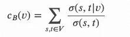
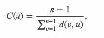

# 足球运动员之间的分离程度

> 原文：<https://towardsdatascience.com/degrees-of-separation-amongst-footballers-4163b86f88d?source=collection_archive---------22----------------------->

## 构建足球图并分析足球运动员之间的各种中心性度量和平均路径距离

[Md Mahdi](https://unsplash.com/@mahdi17?utm_source=medium&utm_medium=referral) 在 [Unsplash](https://unsplash.com?utm_source=medium&utm_medium=referral) 上的照片

# 为什么要考虑分离度？

> 我们都是由六个或更少的熟人联系在一起的——弗里吉斯·卡林西

图论之所以美丽，是因为它可以应用于几乎任何领域。根据多年来对任何社交网络的研究，任何两个节点之间的连接都少于六跳。分离度是社交网络背后的症结所在，例如，LinkedIn 会根据另一个用户离你有多远来推荐输入搜索框的名字。一个连接的连接点离你 2 度，而那个人的连接点离你 3 度，以此类推。这极大地提高了搜索质量，因为许多同名用户可以根据接近度进行过滤。此外，出于研究目的，分离度总是被分析以收集关于社交网络的信息。多年来，用户之间的分离程度一直在缩小，这表明越来越多的用户在脸书和 Instagram 等社交网站上找到了联系。

# 将这种思想应用到足球运动员身上！

足球社区也是一个网络。为了构建这个图，我想到了用节点来表示足球运动员，并在两个足球运动员之间建立一条边，如果他们为同一个俱乐部或同一个国家队效力的话。

## Python 中的数据集及其实现

对于那些只想看完整代码的人来说，它在我的 [**Github**](https://github.com/rajlm10/Degrees-of-Separation-amongst-footballers/blob/main/Six_Degrees_Medium.ipynb) 上。

这个问题我已经用了 Kaggle 的 [*Fifa 21*](https://www.kaggle.com/stefanoleone992/fifa-21-complete-player-dataset) 数据集。下面是我们如何通过检查常见的俱乐部和国籍来构建图表。我使用了集合运算，因为执行相交非常快。

数据集

下面是我们如何将俱乐部和国籍合并到一个集合中，然后构建一个图表。请注意，该图是一个**邻接表表示**，这意味着每个节点都有一个它们所连接的边的列表。我还创建了两个字典来将名字映射到 id，反之亦然。

接下来，让我们创建一个函数来查找任意两个节点之间的距离。我使用了 BFS 算法，并对其进行了修改。对于那些想了解更多的人，这里有[链接](https://www.geeksforgeeks.org/breadth-first-search-or-bfs-for-a-graph/)。我将简要描述我所做的事情。

*   创建一个布尔数组来检查大小为 number_of_nodes 的已访问节点，并创建一个相同大小的距离列表(存储源节点到所有其他节点的距离)
*   创建一个队列并添加源节点，然后将其标记为已访问。现在，当队列不为空时，为每个未被访问的节点提取邻居
*   对于每个邻居，从距离数组中获取其与源的当前距离(最初都是 0 ),并在邻居索引处将距离数组加 1。将此邻居添加到队列中，并将其标记为已访问。对所有邻居都这样做。
*   现在检查队列，获取一个添加的节点(让我们称之为 temp ),并获取它的邻居。现在，对于这些新邻居中的每一个，获取 temp 位置处的距离(在第一次迭代后将为 1 ),并对其加 1，然后将其存储在新邻居索引处的距离数组中。
*   继续这样做，直到队列为空，并返回距离[destination],即从源到目的地的距离。

这是它的代码

## **让我们尽情欢乐，看看两位著名球员梅西和厄灵哈兰德之间的距离！**

如我们所见，距离是三跳。想知道这些是什么吗？该代码还包含一个助手函数来打印我从这个[站点](https://www.geeksforgeeks.org/print-paths-given-source-destination-using-bfs/)找到的路径。我做了一点修改，只打印了 3 条路径，因为我们的图有 **~35，000 条边。**

现在你明白了吧！梅西和特尔·斯特根是巴萨的队友&许梅尔斯是特尔·斯特根在德国国家队的队友，最后哈兰德是许梅尔斯在多特蒙德的队友。这就是为什么我们把它们之间的最短距离定为 3。

# 高潮了！找出所有足球运动员之间的平均最短距离！

虽然我可以扩展改进的 BFS 方法，但我在这里将使用 networkx，因为它们非常接近这个距离，并且计算结果非常快。然而，我们需要构建一个邻接图来使用 networkx，我已经在完整的代码中展示了这一点。为了简洁起见，我只向您展示所有的最终结果。

结果呢

正如我们可以看到的，距离达到了 **2.5** ，这表明足球网络实际上有多近，并且与六度分离假说相吻合。另外，我们用 **4.4** 秒计算了距离，这对于一个有**35000 条边的图来说是令人印象深刻的。** **使用 GPU 加速器可以进一步将这个时间缩短到 3 秒，而每个足球运动员的 BFS 平均下来通常需要 9 秒。**

# 奖金！—图形中心性测量！

对社交信息网络感兴趣的人会喜欢这一部分，其他人可以跳到 Outro。

## 1.程度中心性

**度中心性**

节点 v 的度中心性是它所连接的节点的分数，最容易计算，度越高，节点通常越中心。

**注意事项** -我们很容易被某个远离核心、影响力不大但具有高度中心性的集群误导

我们可以看到利物浦的 Thiago 具有最高的中心度。

程度中心性

## **2。中间中心性**

其中 v 是节点的集合，𝜎(𝑠,𝑡)是最短(𝑠,𝑡)路径的数量，𝜎(𝑠,𝑡|𝑣)是通过除𝑠,𝑡之外的某个节点𝑣的那些路径的数量。

**中间中心性**在网络理论中有广泛的应用；它表示节点之间的距离。例如，在一个网络中，一个具有更高**中间中心性**的节点将对网络有更多的控制，因为在我们的例子中，更多的信息将通过该节点或玩家传递。

一个有趣的结果是，**帕拉西奥斯**出现了。

中间中心性

## 3.接近中心性

其中 n 是节点数，d(v，u)是两个节点之间的最短距离。

亲密度可以被看作是衡量信息传播到所有其他节点的速度。如果一个节点有很强的**接近中心性**，那么它就有能力利用它的关系**快速传播信息。这些人可能是网络的重要影响者。**

**曼城的罗德里&西班牙似乎是一个重要的影响者！**

 [## rajbsangani/六度中等木星

### 与 rajbsangani 合作开发六度介质笔记本电脑。

jovian.ml](https://jovian.ml/rajbsangani/six-degrees-medium/v/1&cellId=12) 

# 结尾部分

这个快速实验展示了我们如何在任何可以建立逻辑关系的地方形成图表，并使用流行的图表技术分析它们。一般来说，网络中的分离度正在缩小，而且还会继续缩小！

请让我知道你对这篇文章的看法，并愿意讨论与它相关的任何事情。如果你喜欢，请留下一些掌声！查看我的 [**github**](https://github.com/rajlm10) 其他一些项目。可以联系我 [***这里***](https://rajsangani.me/) ***。*** 感谢您的配合！