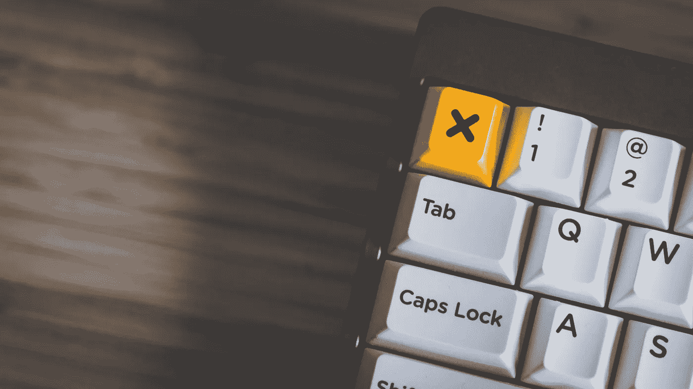

# 如何根据列值从 Pandas 数据帧中删除行

> 原文：<https://towardsdatascience.com/delete-row-from-pandas-dataframes-based-on-column-value-4b18bb1eb602?source=collection_archive---------8----------------------->

## 讨论如何根据列值从 pandas 数据帧中删除特定的行



照片由 [Sam Pak](https://unsplash.com/@melocokr?utm_source=unsplash&utm_medium=referral&utm_content=creditCopyText) 在 [Unsplash](https://unsplash.com/s/photos/delete?utm_source=unsplash&utm_medium=referral&utm_content=creditCopyText) 上拍摄

## 介绍

根据与列值相关的特定条件从 pandas 数据帧中删除行是最常执行的任务之一。在今天的简短指南中，我们将探讨如何在以下情况下执行行删除

*   一行包含(即等于)特定的列值
*   行的特定列值不等于另一个值
*   行的特定列中有空值
*   行具有非空的列值
*   需要满足多个条件(以上条件的组合)

首先，让我们创建一个示例数据帧，我们将在本文中引用它，以演示一些概念，帮助我们理解如何从 pandas 数据帧中删除行。

```
import pandas as pddf = pd.DataFrame({
    'colA': [1, 2, 3, 4, None],
    'colB': [True, True, False, False, True],
    'colC': ['a', None, 'c', None, 'e'],
    'colD': [0.1, None, None, None, 0.5],
})print(df)
 *colA   colB  colC  colD
0   1.0   True     a   0.1
1   2.0   True  None   NaN
2   3.0  False     c   NaN
3   4.0  False  None   NaN
4   NaN   True     e   0.5*
```

## 删除包含特定列值的行

如果希望删除基于特定列的值的行，可以通过对原始数据帧进行切片来实现。例如，为了删除所有`colA`等于`1.0`的行，可以如下所示:

```
**df = df.drop(df.index[df['colA'] == 1.0])**print(df)
 *colA   colB  colC  colD
1   2.0   True  None   NaN
2   3.0  False     c   NaN
3   4.0  False  None   NaN
4   NaN   True     e   0.5*
```

另一种方法是颠倒条件，这样就可以保留所有`colA`不等于`1.0`的行。举个例子，

```
**df = df[df.colA != 1.0]**
```

或者，如果您想删除某列值与数字列表中出现的任何其他值相等的行，那么您可以使用`**isin()**`方法。例如，为了删除列值为`1.0`、`2.0`或`3.0`的所有行，下面的方法可以实现:

```
**df = df.drop(df.index[df['colA'].isin([1.0, 2.0, 3.0])])**print(df)
 *colA   colB  colC  colD
3   4.0  False  None   NaN
4   NaN   True     e   0.5*
```

同样，您可以恢复条件，以便只保留不满足条件的记录。举个例子，

```
**df = df[~df.colA.isin([1.0, 2.0, 3.0])]**
```

这相当于前面的表达式。

## 删除列值不等于另一个值的行

同样，您可以简单地删除列值不等于特定值的行。例如，下面的表达式将删除所有不等于`1.0`的记录:

```
**df = df.drop(df.index[df['colA']!=1.0])**print(df)
 *colA  colB colC  colD
0   1.0  True    a   0.1*
```

## 删除特定列中具有空值的行

现在，如果您想删除特定列中具有空值的行，您可以使用`isnull()`方法。例如，为了删除列`colC`中所有空值的行，您可以执行以下操作:

```
**df = df.drop(df.index[df['colC'].isnull()])**print(df)
 *colA   colB colC  colD
0   1.0   True    a   0.1
2   3.0  False    c   NaN
4   NaN   True    e   0.5*
```

或者，您可以反转条件并保留所有非空值:

```
**df = df[df.colC.notnull()]**print(df) *colA   colB colC  colD
0   1.0   True    a   0.1
2   3.0  False    c   NaN
4   NaN   True    e   0.5*
```

## 删除特定列中具有非空值的行

另一方面，如果希望删除特定列中具有非空值的行，可以使用`notnull()`方法。例如，要删除列`colC`中所有非空值的行，您需要运行

```
**df = df.drop(df.index[df['colC'].notnull()])**print(df)
 *colA   colB  colC  colD
1   2.0   True  None   NaN
3   4.0  False  None   NaN*
```

同样，您可以通过使用如下所示的`isnull`方法反转条件，只保留空值:

```
**df = df[df.colC.isnull()]**
```

## 通过组合多个条件删除行

现在让我们假设您想要通过组合多个条件来删除行。例如，假设您想要删除所有`colC`和`colD`都为空的行。您可以使用如下所示的`&`操作符组合多个表达式。

```
**df = df.drop(df[df['colC'].isnull() & df['colD'].isnull()].index)**print(df)
 *colA   colB colC  colD
0   1.0   True    a   0.1
2   3.0  False    c   NaN
4   NaN   True    e   0.5*
```

如果您希望满足其中一个条件，那么您可以使用`|`操作符。在这种情况下，所有在`colC`或`colD`中具有空值的行将从返回的数据帧中删除。

```
**df = df.drop(df[df['colC'].isnull() | df['colD'].isnull()].index)**print(df)
 *colA  colB colC  colD
0   1.0  True    a   0.1
4   NaN  True    e   0.5*
```

## 最后的想法

在今天的指南中，我们探讨了如何根据特定条件从 pandas 数据帧中删除行。具体来说，我们讨论了当行的特定列值等于(或不等于)其他值时，如何执行行删除。此外，我们讨论了如何删除特定列中包含空值或非空值的行。最后，我们探讨了从数据帧中删除行时如何组合多个条件。

[**成为会员**](https://gmyrianthous.medium.com/membership) **阅读介质上的每一个故事。你的会员费直接支持我和你看的其他作家。**

**你可能也会喜欢**

</how-to-select-rows-from-pandas-dataframe-based-on-column-values-d3f5da421e93>  <https://medium.com/geekculture/how-to-refine-your-google-search-and-get-better-results-c774cde9901c>  </dynamic-typing-in-python-307f7c22b24e> 