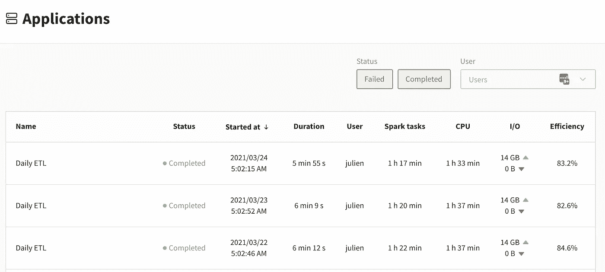
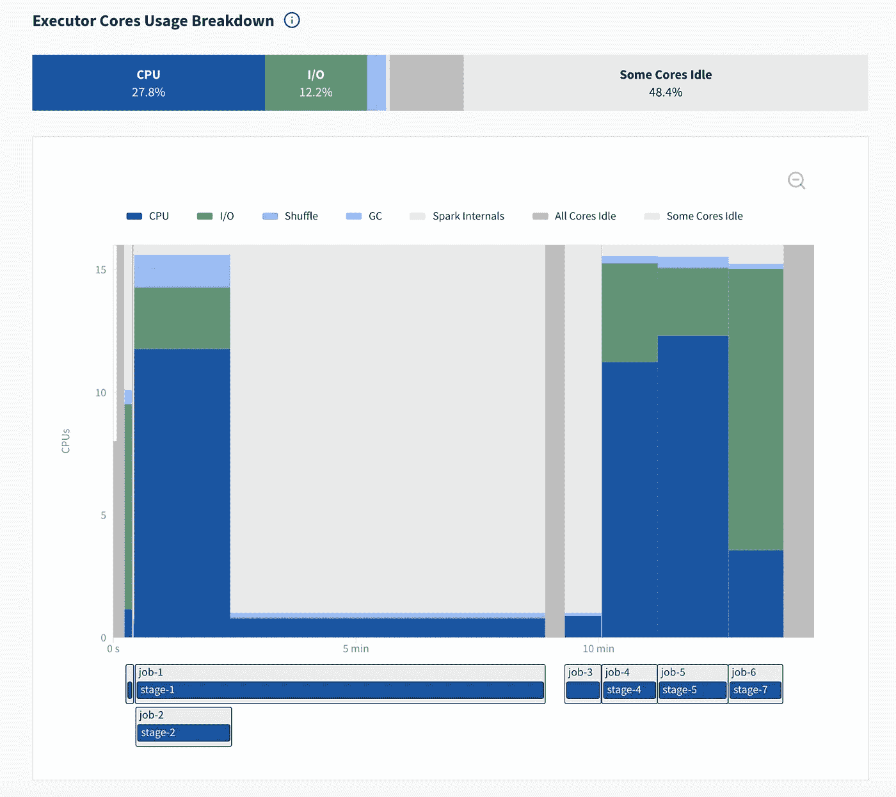
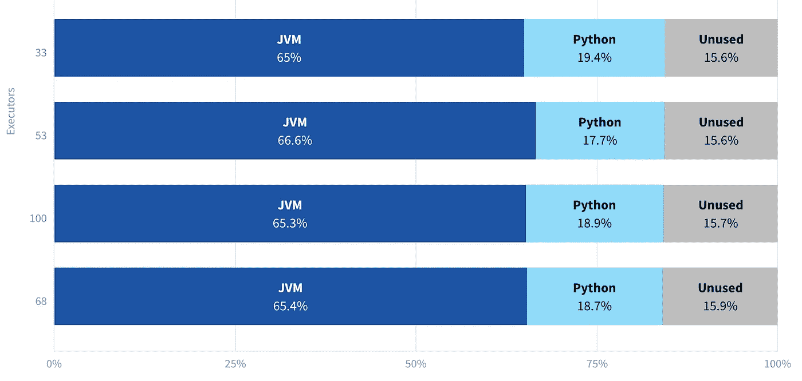

# 令人高兴的是:新的和改进的 Spark 用户界面和 Spark 历史服务器现在已经上市

> 原文：<https://towardsdatascience.com/delight-the-new-improved-spark-ui-spark-history-server-is-now-generally-available-79e72adc3d65?source=collection_archive---------35----------------------->

## Delight 是一个免费的、托管的、跨平台的 Apache Spark 监控仪表板，带有内存和 CPU 指标，希望能让您满意！

一年前，我们在 TowardsDataScience 上发布了一篇被广泛分享的博文:[我们正在构建一个更好的 Spark UI](/spark-delight-were-building-a-better-spark-ui-1b463840e243) ！

今天，经过大量的工程工作，我们很自豪地最终发布了 [Delight](https://www.datamechanics.co/delight) ，这是我们为 [Apache Spark](https://www.datamechanics.co/apache-spark) 提供的免费托管跨平台监控仪表板。

它也可以在 Databricks、EMR、Dataproc、HDInsight、HDP/CDP 和开源平台上工作(任何 spark-submit，或者使用 spark-on-kubernetes 操作符，或者使用 Apache Livy)。

Delight 帮助您理解和提高 Spark 应用程序的性能。它提供:

*   以 Spark 为中心的 CPU 和内存指标，我们希望会让你高兴！
*   Spark UI——因此您不需要自己运行 Spark 历史服务器。

我们将在本文中讨论的内容:

1.  项目的动机和时间表
2.  它的高层架构
3.  浏览主屏幕以及它们如何帮助您的日常工作

# 我们对快乐的愿景和动机

很难对 Spark UI 的应用程序的性能进行故障诊断。UI 中有一些有用的信息，但是它们被淹没在大量的噪音中，理解这些信息需要大量的部落知识。此外，Spark UI 不会显示关键的系统指标，如 CPU 使用率、内存使用率和 I/O。

为此，您必须使用一个通用的可观察性工具(如 Ganglia)。这些工具的问题是，它们不是为 Spark 设计的。您需要在每个节点的指标之间跳转，尝试在头脑中得到一个粗略的估计，然后查看时间戳，在它们和 Spark UI 之间来回跳转。

我们在 [Data Mechanics](https://www.datamechanics.co) 的任务是让 Apache Spark 对开发人员更友好，更具成本效益。这就是为什么我们建立了我们的托管 [Spark-on-Kubernetes](https://www.datamechanics.co/apache-spark-on-kubernetes) 平台(在 AWS、GCP 和 Azure 上可用)，该平台自动化基础设施参数和 Spark 配置，以使我们的客户管道稳定和高性能。

我们还希望简化数据科学家和工程师的开发体验，而可观察层是这个难题的关键部分。我们想让任何人都容易理解他们的 Spark 代码的性能。

这就是我们着手为 Spark 构建一个开源监控仪表板 Delight 的原因。2020 年 6 月，我们在一篇被广泛分享的博文中分享了[我们对快乐的愿景，该博文以下面的 GIF 为特色:](https://www.datamechanics.co/blog-post/building-a-better-spark-ui-data-mechanics-delight)

我们的喜悦设计原型，2020 年 6 月出版。图片作者。

受到数百名注册者和我们公告上的评论的鼓励，我们开始构建 Delight，这是一项大规模的工程工作。

*   2020 年 11 月，我们发布了一个 MVP，其中包含一个托管仪表板，让您可以访问已终止应用程序的 Spark UI(避免您运行和维护自己的 Spark 历史服务器的麻烦)。
*   在 Q1 2021 中，我们在内部向客户发布了 Delight，并重复了他们给出的反馈，修复了我们发现的许多漏洞和稳定性问题。
*   今天，要实现我们的最终愿景，还有很多工作要做。但是，快乐已经被证明对许多人有价值，所以我们很高兴向 Spark 社区开放它！

# 架构:开源代理+托管后端

Delight 可以在任何 Spark 平台上免费工作，包括 Databricks、Amazon EMR、Google Dataproc 或开源的 Spark-on-Kubernetes 或 Spark-on-YARN 设置。它与使用 spark-submit、Apache Livy 或 Spark-on-Kubernetes 操作符运行 Spark 应用程序兼容。

愉悦包括:

*   一个[开源代理](https://github.com/datamechanics/delight)运行在您的 Spark 应用程序中，将 Spark 事件度量流式传输到 Delight 后端。
*   一个托管的后端负责收集这些指标，解析它们，并在 https://delight.datamechanics.co 的[托管仪表板](https://delight.datamechanics.co/)

高层架构:一个开源代理&一个托管后端。图片作者。

Delight 收集的指标包含关于 Spark 应用程序执行的底层元数据，比如每个任务读取/写入了多少数据，使用了多少内存和 cpu。这些指标被称为 Spark 事件日志([查看示例](https://github.com/datamechanics/delight/blob/main/documentation/resources/example_spark_event_log.txt))，它们是让 Spark 历史服务器回放已完成应用程序的 Spark UI 的相同信息。

这些指标使用您可以在我们的控制面板中生成的秘密访问令牌进行保护，该令牌可以唯一地标识您。它们不会与任何第三方共享，并且会在 30 天后自动从我们的服务器中删除。每个组织最多可存储 1，000 个应用程序(如果您在 30 天内运行超过 1，000 个应用程序，我们将开始删除最旧的应用程序)。

# 浏览主屏幕

# 1.主仪表板

Delight 的主仪表板列出了您最近完成的所有 Spark 应用程序。图片作者。

‍When:你登录到 Delight，你会看到这个表格，是你最近运行的 Spark 应用程序。请注意，实时应用程序还不可见，它们只在完成几分钟后才会出现。该屏幕中的大部分信息应该是不言自明的，除了 3 列:Spark 任务、CPU 和效率。在解释它们之前，先快速回顾一下 Spark 分布式执行是如何工作的。

> *在一个火花* ***应用*** *中，你有一个单独的* ***驱动*** *进程(你的应用的“大脑”)，和许多* ***执行*** *进程。驱动负责理解你的代码，把它拆分成* ***作业*******阶段*** *和* ***任务*** *。阶段是一组可以在执行器上并行执行的任务。一个执行器内核一次可以运行(最多)一个 Spark 任务；换句话说，具有 4 个 CPU 的 Spark 执行器可以并行运行多达 4 个任务。**

*现在让我们定义三列:*

*   ***星火任务**。这是应用程序中所有任务持续时间的总和。*旁注:这是数据力学平台* [*定价*](https://www.datamechanics.co/pricing) *所依据的度量。**
*   ***CPU** 。这是你的 Spark 执行器生命周期的总和，乘以分配给每个执行器的核心数。换句话说，这是您的“执行者核心正常运行时间”。这一指标通常与您的基础设施成本成比例。*
*   ***效率**。这是 Spark 任务除以 CPU 的比率，用百分比表示。这表示 CPU 资源有效用于运行 Spark 任务的时间比例。100%是理想的(完美的并行)，0%意味着您的计算资源被浪费了(您有运行的容器，但它们是空闲的)。*

*这是我们关注数据机制的关键指标之一，因为我们的平台具有自动化功能(自动扩展、自动调整等)来提高我们客户的效率，从而降低他们的云成本(查看这个从 EMR 迁移过来的客户的[故事以了解更多信息)。](https://www.datamechanics.co/blog-post/migrating-from-emr-to-spark-on-kubernetes-with-data-mechanics)*

# *2.执行器核心使用情况*

***‍** 一旦你点击一个特定的应用程序，你就会进入一个应用程序概述页面，上面有高级统计数据和一个指向顶部 Spark UI 的链接。下一个信息是 executor 核心使用图。*

**

*executor 核心使用情况图提供了应用程序性能的高级视图。图片作者。*

*executor cores usage graph 将 Spark 在应用程序执行期间测量的低级 CPU 指标汇总到一个简单的可视化概览中。首先，您会看到一份 executor 内核使用情况的摘要，按主要类别进行了分类(单击ℹ️图标阅读它们的定义):*

*   ***CPU** —实际计算 Spark 任务所花费的时间。*
*   ***I/O** —等待读取或写入数据(通常来自网络)所花费的时间。*注意:Spark 目前将 python 进程中完成的工作视为 I/O(从 JVM 的角度来看，这是等待 Python 提供数据的 I/O)。例如，当您执行 python 用户定义的函数时，就会发生这种情况。查看这篇* [*StackOverflow 帖子*](https://stackoverflow.com/questions/61816236/does-pyspark-code-run-in-jvm-or-python-subprocess) *可以更好地理解 JVM 和 Python 如何在 PySpark 中协同工作。* **‍***
*   ***Shuffle** —在 Shuffle(Spark 执行器之间的数据交换阶段)期间等待数据块被写入或提取所花费的时间。 **‍***
*   ***垃圾收集**—JVM 进行垃圾收集所花费的时间。对于大多数(健康的)应用程序，这不应该超过几个百分点。 **‍***
*   ***Spark Internals**—Spark 花费在调度程序延迟、任务序列化和反序列化等开销操作上的时间。同样，这对于大多数应用程序来说应该很小。 **‍***
*   ***一些内核空闲** —任务被执行的时间，但是只在一部分执行程序内核上。高值是不完全平行的标志。*
*   ***所有内核空闲** —无火花任务运行的时间。这可能是完全闲置，这种情况经常发生，例如当你以交互方式使用 Spark 时，然后休息一下。或者这可能意味着一些非 Spark 工作正在发生，例如你可能在驱动上执行纯 Python 或 Scala 代码，所以所有的执行器都是空闲的。*

*这些信息会显示在一个图表上，其中 X 轴是应用程序的时间轴，Y 轴是您拥有的执行器核心数(如果您启用了动态分配，它可能会随时间而变化)。在这个图表下，你可以看到你的 Spark 工作和阶段的时间表。*

*此图的主要好处是，您可以非常快速地将注意力集中在应用程序的主要性能瓶颈上。在本例中，很明显 **job-1/stage-1** 占用了大部分应用时间。大的灰色区域表示大多数内核在此期间处于空闲状态。如果您单击“stage-1”，您将被带到 Spark UI，因此您可以进一步对此进行故障诊断(在本例中，问题是该阶段只有 2 个任务)。*

# *3.执行者峰值内存使用*

*此图仅在您使用 Spark 3.0 或更高版本时可见，因为它依赖于 Spark 3.0 中引入的新功能( [SPARK-23429](https://issues.apache.org/jira/browse/SPARK-23429) 和 [SPARK-27189](https://issues.apache.org/jira/browse/SPARK-27189) )。*

**

*executors 峰值内存使用图表显示了 Spark executors 达到最大内存使用量时的内存使用量明细。图片作者。*

*‍While 你的应用程序正在运行，火花测量每个执行者的内存使用。此图报告了针对前 5 名执行者观察到的内存使用峰值，按不同类别细分:*

*   *JVM 使用的内存(这是你的最大堆大小)*
*   *由 **Python** 进程使用的内存(如果您使用 PySpark)*
*   ***其他**进程使用的内存(如果您正在使用 R，那么 R 当前被列为“其他”)*

*这个图表对 PySpark 用户应该特别有用，他们目前没有简单的方法知道他们的 python 进程消耗了多少内存。这个图表可以帮助你决定使用不同类型的容器是否安全。它还可能警告您，您正在与允许的最大内存使用量调情。提醒一下，如果您的 Python 进程使用了太多的内存，那么您的资源管理器将会终止您的 Spark 执行器(例如在 Kubernetes 上，您将会得到 docker 退出代码 137)。*

# *结论:尝试一下，并让我们知道您的反馈！*

*我们希望 Delight 能够实现它的承诺，并帮助您获得愉快的 Spark 开发体验。*

*我们鼓励您尝试一下！[注册](https://www.datamechanics.co/delight)，按照我们的 github 页面上的安装说明[，并通过电子邮件(回复欢迎邮件)或使用产品中的实时聊天窗口让我们知道您的反馈。](https://github.com/datamechanics/delight)*

*我们对快乐有雄心勃勃的计划。我们的未来路线图包括:*

*   *每个执行器和驱动程序都有一个页面，用于跟踪它们的内存使用情况，并提供更详细的细分(堆外内存使用情况)*
*   *自动化性能调整建议(例如，关于数据不对称/低效数据分区的警报等)*
*   *在应用程序运行的同时，让快乐实时可及*
*   *更多基于您的反馈:让我们知道您的优先事项！*

*我们将很快发布后续文章，介绍具体的故障排除步骤，并使用 Delight 启动性能调优会议。我们还将举办关于它的聚会和会议，包括即将举行的[数据+人工智能峰会](https://databricks.com/session_na21/delight-a-free-and-cross-platform-apache-spark-ui-complement)。敬请关注，感谢您的支持！*

**最初发表于*[T5【https://www.datamechanics.co】](https://www.datamechanics.co/blog-post/delight-the-new-improved-spark-ui-spark-history-server-is-now-ga)*。**