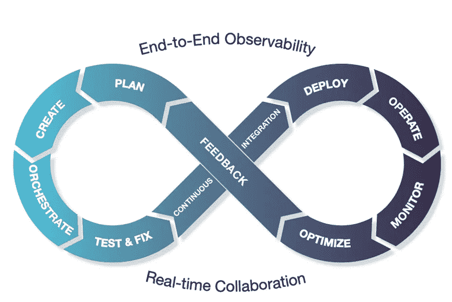
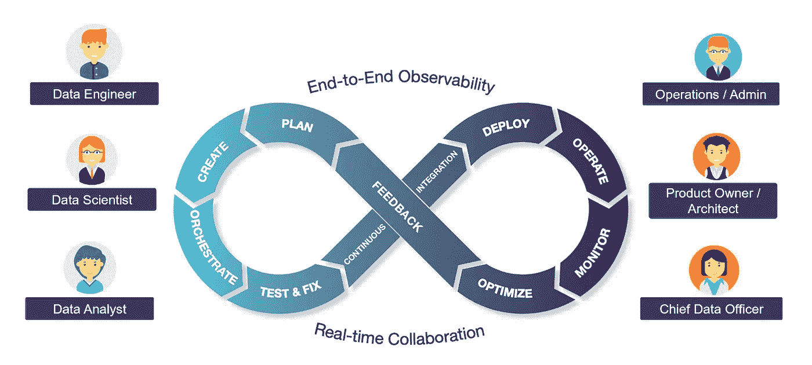

# 没有 DataOps 的 AI/ML 只是白日梦！

> 原文：<https://towardsdatascience.com/delivering-ai-ml-without-proper-dataops-is-just-wishful-thinking-2f1663d6b97f?source=collection_archive---------34----------------------->

## 关于有效 AI/ML 的数据运营的博客系列

GIF by [giphy](https://giphy.com/gifs/gifnews-artist-on-tumblr-parker-jackson-jpUYlCNePdv0Y)

让我们从我过去的 ML 项目中的一个真实世界的例子开始:我们正在建立一个客户流失模型。"我们迫切需要一个与客户支持电话的情绪分析相关的附加功能."创建提取该数据集的数据管道花费了大约 4 个月的时间！准备、构建和扩展 Spark MLlib 代码花费了大约 1.5-2 个月的时间！后来，我们意识到“与客户在我们的应用程序中完成某些任务所花费的时间相关的附加功能将进一步提高模型的准确性”——数据管道又过去了 5 个月！实际上，部署 ML 模型花了 2 年多的时间！

在推动了几十个 ML 计划(以及就此主题为多家初创公司提供建议)之后，我得出了以下结论:鉴于 AI/ML 项目的迭代性质，拥有一个构建快速可靠的数据管道的敏捷流程(称为**数据操作**)一直是成功的 ML 项目的关键区别(除非有非常详尽的[功能库](https://www.featurestore.org/)可用，但通常情况下不会有)。

> 在每一个成功的 AI/ML 产品背后，都有一个使用明确定义的数据操作流程开发的快速可靠的数据管道！

说白了，什么是数据操作？*摘自* [*维基百科*](https://en.wikipedia.org/wiki/DataOps) *:“数据运营整合了敏捷方法，以缩短与业务目标一致的分析开发周期。”*

我将 DataOps 定义为流程和技术的组合，以敏捷的方式迭代地交付可靠的数据管道。根据数据平台的成熟度，您可能处于以下数据操作阶段之一:

*   ***临时*** :数据操作没有明确的流程
*   ***开发*** :定义了清晰的流程，但由数据团队手工完成
*   ***最优*** :为数据科学家、分析师和用户提供*自助式自动化*的清晰流程。

与软件开发类似，数据操作可以被视为一个无限循环

DataOps 生命周期(显示为无限循环)代表了将原始数据转化为见解的过程。在讨论每个生命周期阶段的关键过程之前，下面列出了我在每个阶段遇到的首要问题:

*   **计划:**“我们无法启动新项目，因为我们没有资源，需要额外的预算”
*   **创建:**该查询连接数据样本中的表。我没有意识到实际数据有十亿行！”
*   **编排:**“管道完成了，但是输出表是空的——在输入表被填充之前，调度程序触发了 ETL”
*   **测试&修复:**“使用玩具数据集在开发中测试—生产中处理失败，出现 OOM(内存不足)错误”
*   **持续集成；**“写得很差的数据管道被提升为生产管道—团队现在正在救火”
*   **部署:**“没有预料到与其他管道的规模和资源争夺”
*   **操作&监视器:**“不知道为什么今天管道运行缓慢”
*   **优化&反馈:**“我对查询进行了一次性调优，但没有意识到需要持续进行调优来解决数据倾斜、规模等问题。”

为了避免这些创伤和更多的创伤，从临时到开发再到自助服务的成熟数据操作至关重要。

> 本博客系列将帮助您从即席到定义良好的数据操作流程，并分享如何实现自助服务的想法，以便数据科学家/用户不会受到数据工程师的限制。

对于 DataOps 生命周期阶段的每个阶段，请遵循要定义的关键流程的链接以及使其成为自助服务的体验(下面的一些链接正在填充—添加书签并返回):

**计划阶段**

1.  [如何简化寻找数据集](https://medium.com/wrong-ml/challenges-in-finding-relevant-data-attributes-for-building-ml-models-97ae420a079f?sk=352c947d6559574e3697468a9012e20a)
2.  [制定人工智能/人工智能问题的范围和成功标准](/51-things-that-can-go-wrong-in-a-real-world-ml-project-c36678065a75#6988)
3.  如何根据业务需求选择正确的数据处理技术(批处理、交互式、流式)

**创建阶段**

1.  [如何简化数据集元数据属性的访问](/why-reliable-metadata-is-becoming-important-f29e01b01d4d?sk=b8671f29f7cdc872e5a0fe8042c15e5d)
2.  [如何简化数据准备流程](https://medium.com/wrong-ml/why-data-wrangling-is-difficult-to-estimate-f6a54ec3f73c?sk=ad348030415fcc8d884bb4c35e1b1d0c)
3.  [如何进行行为数据自助](https://medium.com/wrong-ml/challenges-with-clickstream-datasets-in-the-real-world-4b0798572215?sk=bc98b511f12607873c91bf19632346dc)

**编排阶段**

1.  [管理数据治理](https://medium.com/wrong-ml/why-data-rights-governance-is-non-trivial-to-implement-in-the-real-world-a075cb06883a?sk=fef2a65a48c62458f7a8c364d49a17f8)
2.  [重用 ML 模型特性](https://medium.com/wrong-ml/why-creating-ml-model-features-is-challenging-in-the-real-world-79c8e6cd91d9?sk=2d4eb7a9961e021c8e2564044209ab87)
3.  调度数据管道

**测试&修复阶段**

1.  简化测试的沙盒环境
2.  识别并消除数据管道瓶颈
3.  验证数据管道结果的正确性、质量、性能和效率。

**持续集成&部署阶段**

1.  数据管道代码集成的冒烟测试
2.  数据流水线的调度窗口选择
3.  更改回滚

**操作阶段**

1.  检测异常以主动避免违反 SLA
2.  [管理生产中的数据事件](https://quickbooks-engineering.intuit.com/managing-data-issues-as-incidents-226f5f1c9e72?source=friends_link&sk=7eca658f035039a9db05473ca21c25b6)
3.  对流氓(占用资源)作业发出警报

**监控阶段**

1.  构建数据管道的端到端可观测性
2.  [跟踪数据流数据的谱系](https://quickbooks-engineering.intuit.com/demystifying-complex-data-pipeline-lineage-with-superglue-d5b4014b1482?source=friends_link&sk=1dcfc862ac13acfdfa49881f3afeeaa4)
3.  [用断路器加强数据质量](https://medium.com/wrong-ml/taming-data-quality-with-circuit-breakers-dbe550d3ca78)

**优化&反馈阶段**

1.  持续优化现有数据管道
2.  预算预警

总之，DataOps 是交付快速可靠的 AI/ML 的关键！这是一项团队运动。本博客系列旨在揭开所需流程的神秘面纱，并在数据科学家、工程师、运营人员等之间建立共识。

作为团队运动的数据操作(图片由作者提供)

> 要了解更多信息，请查看最近的[DataOps Unleashed Conference](https://www.unraveldata.com/resources/dataops-has-unleashed-part-1/)以及在[unleave](https://www.unraveldata.com/)上的 data ops 可观测性创新。当上面的链接被填充时，请跟随[通知](https://modern-cdo.medium.com/)。