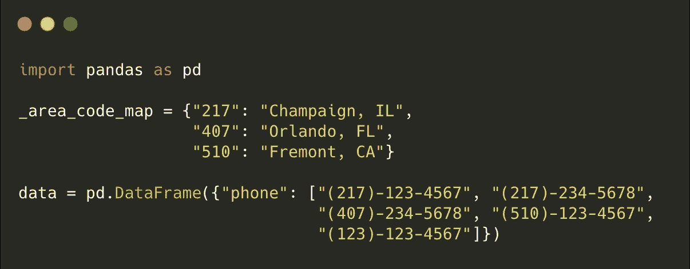
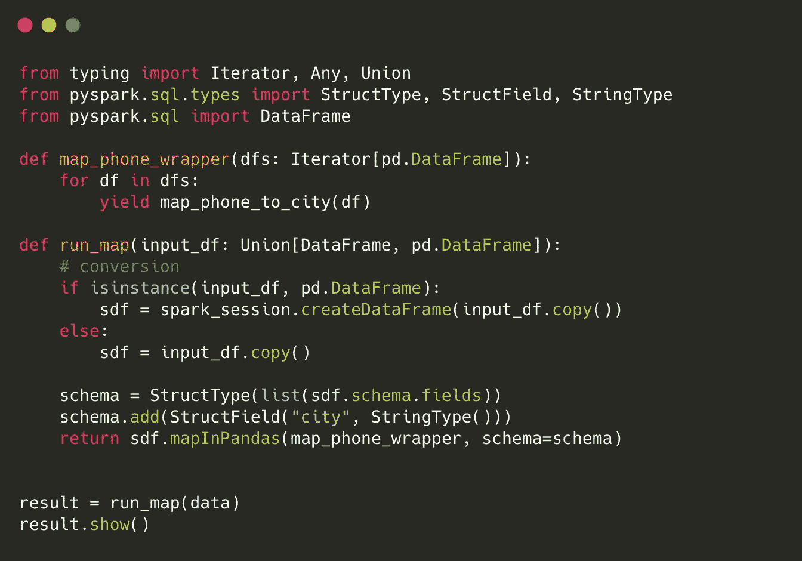

# 使用 Fugue 更快、更便宜地交付 Spark 大数据项目

> 原文：<https://towardsdatascience.com/delivering-spark-big-data-projects-faster-and-cheaper-with-fugue-dd9d7b190653?source=collection_archive---------32----------------------->

## 提高开发人员的工作效率，减少大数据项目的计算使用


[海洋 Ng](https://unsplash.com/@oceanng?utm_source=medium&utm_medium=referral) 在 [Unsplash](https://unsplash.com?utm_source=medium&utm_medium=referral) 上拍照

[Fugue](https://github.com/fugue-project/fugue) 是一个开源库，为 Pandas、Spark 和 Dask DataFrames 提供了统一的接口。在本文中，我们将展示 Fugue 如何通过**降低计算成本和提高开发人员的工作效率来加速大数据项目的开发。**

首先，我们将查看一个简单的代码示例，它将突出显示使用 Spark 时引入的一些复杂性，然后展示如何通过使用 Fugue 来抽象这些复杂性。

# 激励的例子

**问题设置**

首先，我们来看一个令人兴奋的例子，我们有一个熊猫数据帧，其中有一列包含电话号码。对于每个电话号码，我们希望获得区号(在电话号码的括号中)，然后将其作为新列映射到一个城市。



设置数据框架

**熊猫实现**

熊猫对此有一个非常优雅的解决方案。我们可以使用`phone`列的`map()`方法。


使用熊猫地图方法

这会产生以下数据帧:

```
|   |          phone |          city |
|--:|---------------:|--------------:|
| 0 | (217)-123-4567 | Champaign, IL |
| 1 | (217)-234-5678 | Champaign, IL |
| 2 | (407)-234-5678 |   Orlando, FL |
| 3 | (510)-123-4567 |   Fremont, CA |
| 4 | (123)-123-4567 |           NaN |
```

**火花实现**

但是，当数据框架太大，我们需要激发这个逻辑时，会发生什么呢？它看起来会像下面这样(在 Spark 3.0 和更高版本中)。没必要去消化这里发生的事情。**这只是为了说明语法会有所不同。**


**详细问题**

这里我们已经看到了一个问题。对于同一个逻辑，我们有一个非常不同的语法来实现它。这是一个非常常见的场景，用户不得不编写大量新代码来激活熊猫功能。

这意味着两件事:

1.  在 Pandas 和 Spark 上重复实现相同的业务逻辑
2.  **数据科学框架将逻辑和执行结合在一起。熊猫代码可以被带到 Spark 上(稍后我们会看到大量的修改)，但是 Spark 代码只能在 Spark 引擎上执行。**

# 赋格变换

Fugue 旨在通过使相同的代码在 Pandas、Spark 和 Dask 上可执行来解决这个问题。**使用赋格最简单的方法是** `**transform**` **函数，它取一个 Python 或者熊猫函数，带到 Spark 和 Dask 中。**

对于上面的例子，我们可以将熊猫代码包装成一个函数。没有什么新奇的事情发生。


在函数中包装熊猫代码

但只要这样做，我们现在就可以使用赋格的`transform`函数将它带到 Spark 和 Dask。下面的例子就是把它带到 Spark。


使用赋格变换

这将返回一个 Spark 数据帧(可以接收 Pandas 和 Spark 输入数据帧)。要在熊猫上使用`map_phone_to_city`功能，用户只需使用默认的`engine`。`schema`参数是操作的输出模式，这是分布式计算框架的一个要求。同样，Dask 执行也有 DaskExecutionEngine。

# 逻辑和执行的分离

现在有了这个`transform`函数，我们可以在 Pandas、Spark 和 Dask 上使用`map_phone_to_city`函数。逻辑与执行引擎分离。一些读者可能想知道`map_phone_to_city`功能是否仍然与熊猫有关，他们可能是对的。如果我们想用纯本地 Python 实现它，我们可以使用列表和字典，如下面的代码所示。


纯本地 Python 实现

这个可以被神游跨熊猫，Spark，Dask 用同一个`transform`调用。Fugue 将处理数据帧到指定类型注释的转换。这里，我们使用`_area_code_map`字典的`get()`方法，并指定一个默认值“Unknown”。同样，这也可以通过以下方式来激发:


这导致了

```
|         phone |          city |
|--------------:|--------------:|
|(217)-123-4567 | Champaign, IL |
|(217)-234-5678 | Champaign, IL |
|(407)-234-5678 |   Orlando, FL |
|(510)-123-4567 |   Fremont, CA |
|(123)-123-4567 |       Unknown |
```

**通过使用** `**transform**` **函数，我们可以将逻辑与执行分开，然后在运行时指定执行引擎。**逻辑是以一种纯规模不可知的方式定义的。

**关于执行速度的说明**

很多用户问赋格`transform`和`pandas_udf` Spark 相比如何。简单的回答是神游可以被配置成在引擎盖下使用`pandas_udf`。有关更多信息，请参见[和](https://fugue-project.github.io/tutorials/tutorials/advanced/useful_config.html#use-pandas-udf-on-sparkexecutionengine)。在这种情况下，Fugue 将代码映射到一个`pandas_udf`，但仍然提供优雅的跨框架兼容功能。

# 降低计算成本

现在我们有了一种快速的方法，通过在调用`transform`时改变`engine`来在 Pandas 和 Spark 执行之间切换，我们可以在扩展到 Spark 集群之前在本地机器上构建原型并在本地测试代码。这之所以成为可能，是因为我们没有依赖 PySpark API 来定义我们的逻辑。这从两个方面降低了计算成本:

1.  单元测试可以在本地完成，然后在准备好的时候移植到 Spark
2.  集群上发生的错误会更少，因为在移植到 Spark 之前，我们可以在本地进行更多的开发。**这些代价高昂的错误会减少。**

许多 Spark 用户使用`databricks-connect`库在 Databricks 集群上运行代码。这将在本地编译执行图，然后将其发送到 Databricks 集群进行执行。**这样做的缺点是，对于任何使用 Spark 代码的简单测试，Databricks 集群都会加速运行并产生成本。**通过使用 Fugue，开发人员可以通过改变执行来轻松地在本地和集群执行之间切换`engine`。

# 改进的可测试性

**使用 Fugue 的** `**transform**` **减少了将基于 Pandas 的函数引入 Spark 时需要编写的样板代码的数量。**下面的代码是将我们之前的`map_phone_to_city`函数引入 Spark 的一个例子。

注意，这段代码只适用于基于 Panda 的实现，不适用于使用`List`和`Dict`的原生 Python 实现。同样，不需要完全理解代码，重点只是显示引入的样板代码的数量。



您会注意到这段代码与 Spark 耦合在一起，您需要运行 Spark 硬件进行测试。从单元测试的角度来看，你需要测试两个额外的函数来激发你的功能。对于神游的`transform`，因为`transform`被神游测试的很重，所以只需要对原函数进行单元测试即可。

如果你想进一步测试的话,`transform`函数也很容易测试。只需调用`assert`并测试输入和输出。

# 提高开发人员的工作效率

使用 Fugue，开发人员可以以一种与规模无关的方式轻松构建原型，并更快地捕捉错误，从而显著加快开发速度。但是使用赋格也有好处:

1.  单元测试减少了(如上所示),样板代码也更少了
2.  开发人员可以用他们觉得舒服的方式表达他们的逻辑(Python 或 Pandas)
3.  Spark 应用程序的维护更加容易
4.  功能可以在 Pandas 和 Spark 项目之间重用

**应用程序的维护**

大数据项目最困难的事情之一是维护。不可避免的是，将来必须重新访问代码，以更改一些业务逻辑或修复一个 bug。如果代码库与 Spark API 耦合，这意味着只有了解 Spark 的人才能维护它。

通过将逻辑转移到 Python 或 Pandas，Fugue 减少了专门维护的需要，数据专业人员更容易访问这些工具。代码变得更加模块化和可读，这意味着维护大数据应用程序变得更加容易。

**逻辑的可重用性**

通常，数据科学团队会同时拥有一些不需要 Spark 的项目和其他需要 Spark 的项目。在这种情况下，业务逻辑必须实现两次，每个框架一次，以便在两组项目中使用。这使得维护变得复杂，因为当需要修改时，有更多的地方可以编辑代码。Fugue 的`transform`通过使代码对执行引擎不可知来解决这个问题。

如果数据团队通过使用 Spark 或 Pandas 来解决这个问题，那么就存在使用错误工具的问题。**在大数据上使用 Pandas 需要昂贵的垂直扩展，在较小的数据上使用 Spark 会引入不必要的开销。Fugue 让用户先定义逻辑，然后在运行时选择执行引擎。**这减少了移植定制业务逻辑所花费的工程时间。

# 结论

在本文中，我们展示了如何使用 Fugue `transform`函数为 Pandas、Spark 或 Dask 带来一个单独的函数。这种无缝转换允许在本地执行和集群执行之间快速切换。**通过最大化可以在本地完成的原型制作数量，我们可以通过提高开发人员的工作效率和降低硬件成本来降低大数据项目的成本。**

`transform`功能只是神游的开始。有关更多信息，请查看下面的参考资料。

# 资源

关于神游，火花，或分布式计算的任何问题，请随时加入下面的神游松弛频道。

[赋格回购](https://github.com/fugue-project/fugue)

[赋格文档](https://fugue-tutorials.readthedocs.io/)

[赋格懈怠](https://join.slack.com/t/fugue-project/shared_invite/zt-jl0pcahu-KdlSOgi~fP50TZWmNxdWYQ)

[kube con 2021 的赋格](https://www.youtube.com/watch?v=fDIRMiwc0aA)